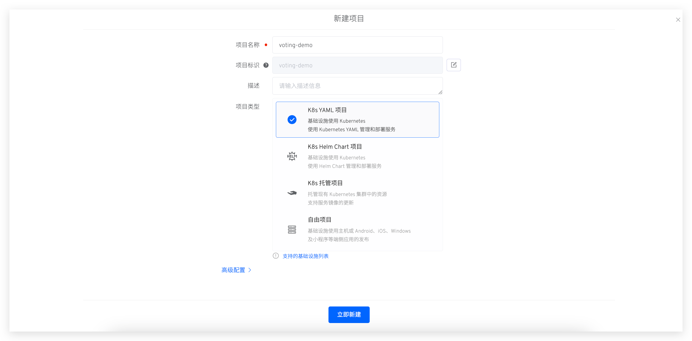
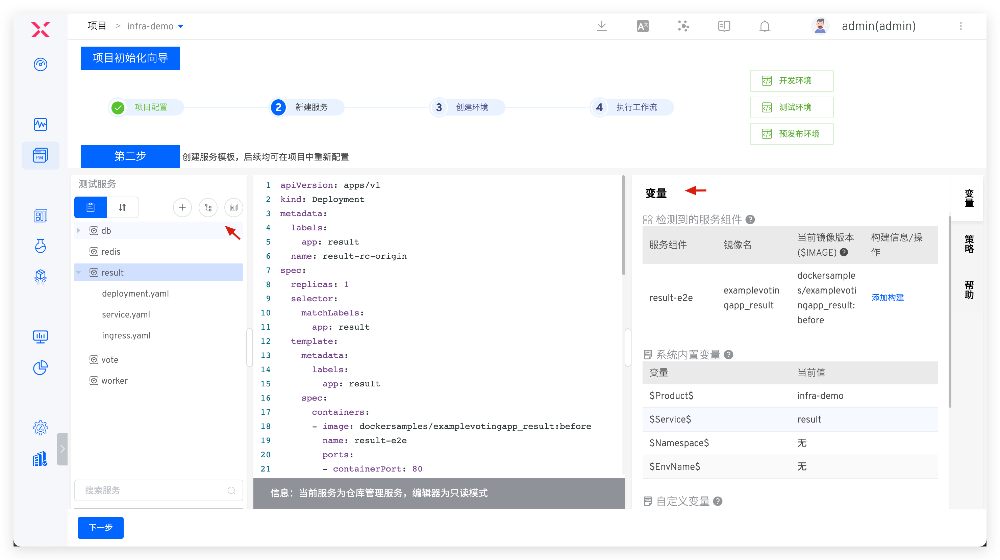
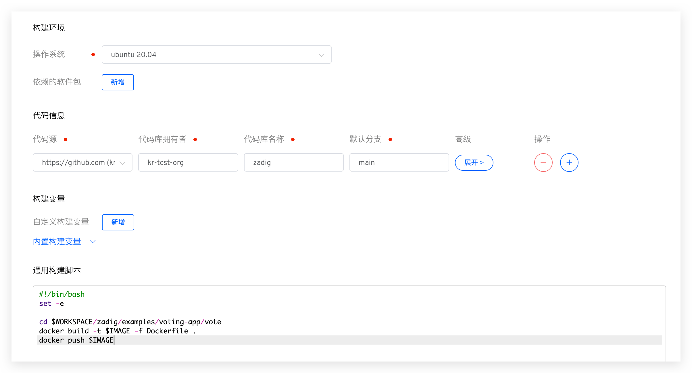
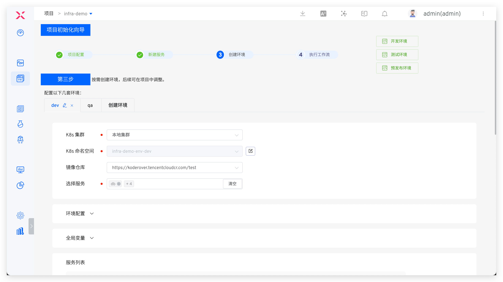
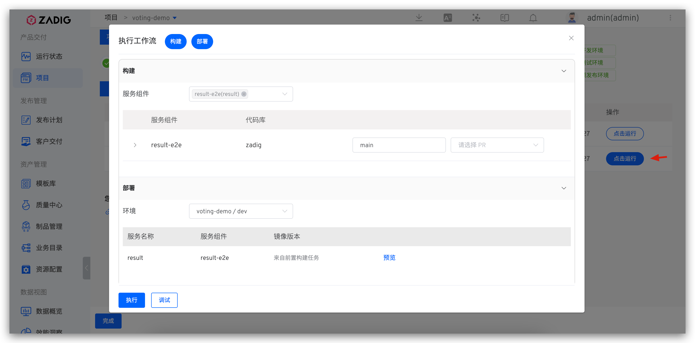
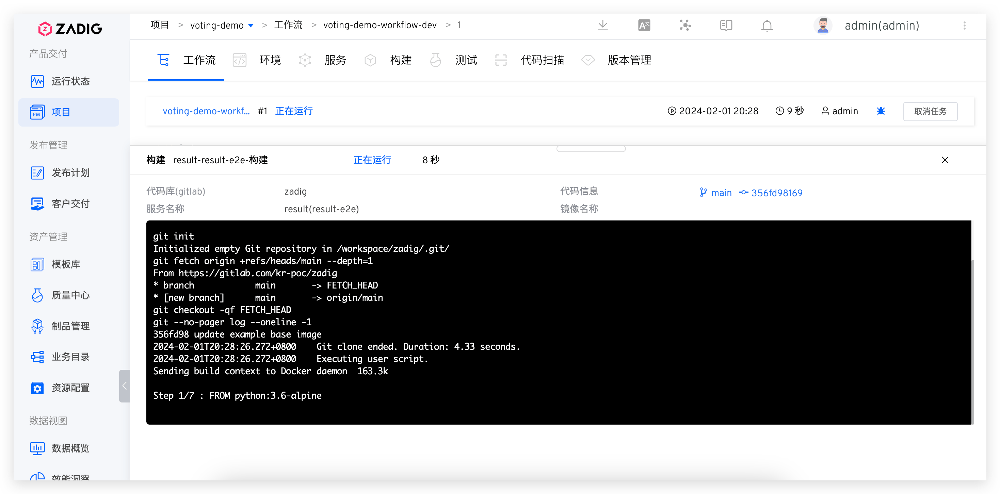
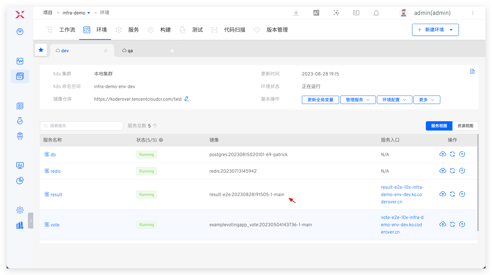

## Quick Setup

This guide provides the essential steps to create a K8s YAML project. For detailed examples, see: [Tutorial](https://www.koderover.com/tutorials-detail/codelabs/GitHub/index.html?index=..%2F..index#0).

### Create Project

Go to "Project" → "New Project", enter the project name, and select `K8s YAML Project`.

Click `Next` to configure services.

### Configure Services
Create and configure services. See [New K8s YAML Service](/en/Zadig%20v3.4/project/service/k8s/#create-a-new-service) for details. The system automatically parses K8s resources and service components.

> For service component concepts, see [Service component](/en/Zadig%20v3.4/env/overview/#what-is-a-service-component).

Click `Add Build` to configure build settings. See [Build Configuration](/en/Zadig%20v3.4/project/build/).

### Configure Environment

Click `Next` to create an environment. Configure business environment parameters as needed.

> For parameter details, see [Create a new environment](/en/Zadig%20v3.4/project/env/k8s/#create-a-new-environment).

Click `Create Environment`, then `Next` to proceed to workflow delivery.

::: tip
Environment creation time depends on service count and resource requirements.
:::

### Deploy via Workflow

- Execute the `dev` workflow to deploy services to the `dev` environment.

- Monitor build logs in real-time on the execution details page.

- Services are automatically updated upon successful workflow completion.

