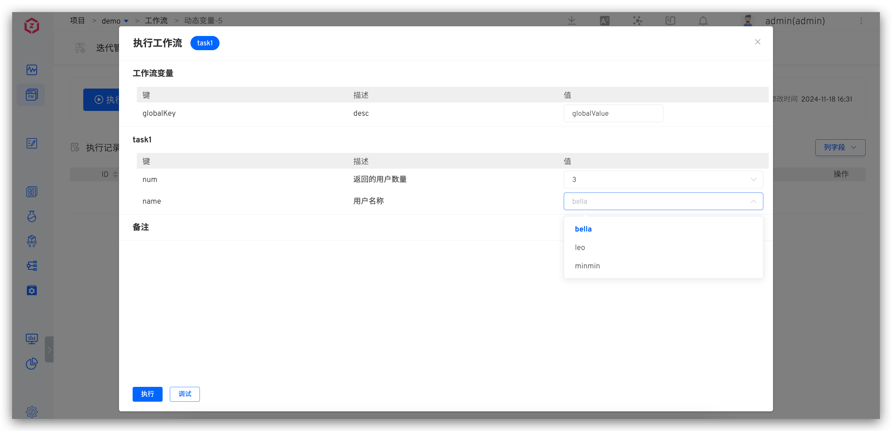

This article introduces the configuration and usage of dynamic variables in workflows.

Applicable scenarios: Variable values in workflows need to be obtained from external systems or generated through coding.

## How to Configure

Configure workflow tasks, add variables, select the variable type as `Dynamic Variable`, and fill in the corresponding configuration.

**Configuration Instructions:**
- Variable Name: Can be used in scripts
- Code block: Support Golang code block, requiring return []string
- Calling Functions: Declare the functions to be called in the code block. Input parameters can come from other tasks in the workflow, in the format `{{.key}}`
- Description: Description information for the variable

**Variable Configuration Description in the Figure Above:**

The figure above illustrates a cascading relationship between variables, where the number of values in the `name` variable is controlled by the `num` variable.
- `num`: Control the number of user names returned by name
- `name`: List of user names
   1. Code Block: Retrieves user names from an external system
   2. Calling Function: Calls the external system API to return a name string array, with the input parameter being `{{.job.task1.num}}`

## Use Effect

When executing the workflow, the number of values contained in the `name` variable will be adjusted according to the selected `num` variable value.

