This article uses practical examples to explore how to address the complexity and consistency of Nacos configuration management using Zadig.

## Administrator Configuration

Administrators can integrate the Nacos configuration management system in Zadig and configure the "Nacos Configuration Change" task in the workflow to achieve automated configuration changes and help engineers maintain configuration consistency.

### Step 1: Integrate Nacos

Access Zadig System Settings > Integration Management > Configuration Management > Add Nacos Configuration Management System

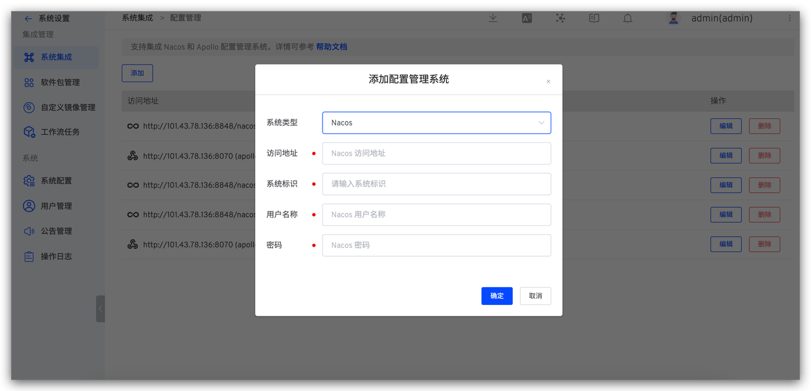

### Step 2: Configure Workflow Tasks

Orchestrate the Nacos configuration change task into the workflow to achieve one-click automated configuration changes using Zadig workflows. Specific operations: Edit workflow > Add configuration change task > Select Nacos Configuration Change > Fill in the relevant parameters and save.

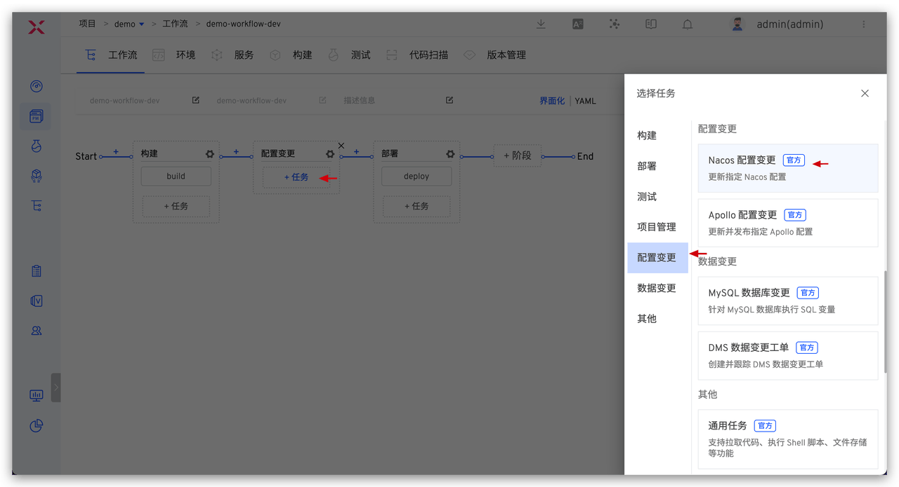
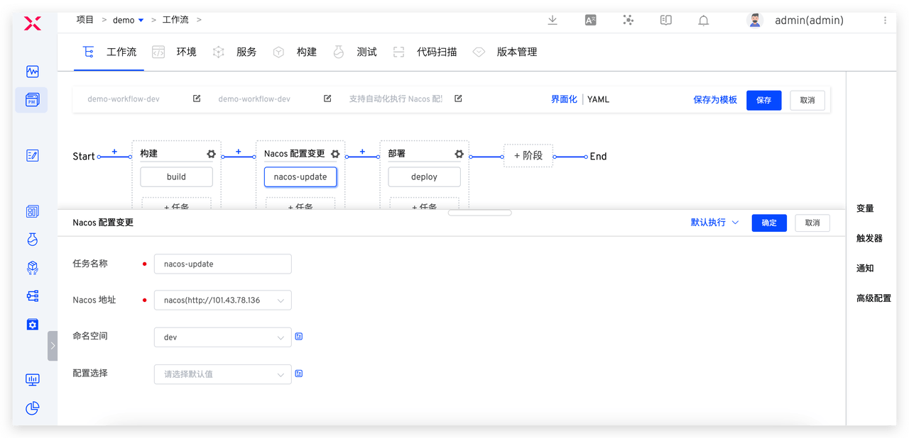

To control the use and change permissions for multiple environments, for example, allowing only developers to change the configuration of the development environment and preventing changes to other environments, you can set the namespace field of the Nacos configuration change task to a specific value and select the configuration scope that developers are allowed to update. This ensures orderly control over developers' configuration modification permissions, thereby maintaining the stability of the system environment.

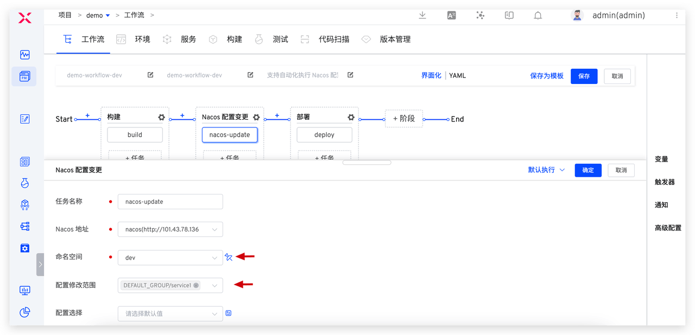

Configure three workflows, with specific settings as follows:

| Workflow Example         | Purpose             | Step Configuration                                                               |
|--------------------|------------------|---------------------------------------------------------------------|
| demo-workflow-dev  | Daily Updates to the Development Environment | Build > dev Environment Nacos Configuration Change > Deploy dev Environment                        |
| demo-workflow-sit  | Updates to the Integration Test Environment | Build > sit Environment Nacos Configuration Change > Deploy sit Environment > Automated Testing > IM Notification |
| demo-workflow-prod | Production Release         | SRE Approval > prod Environment Nacos Configuration Change > Deploy prod Environment > Regression Testing        |

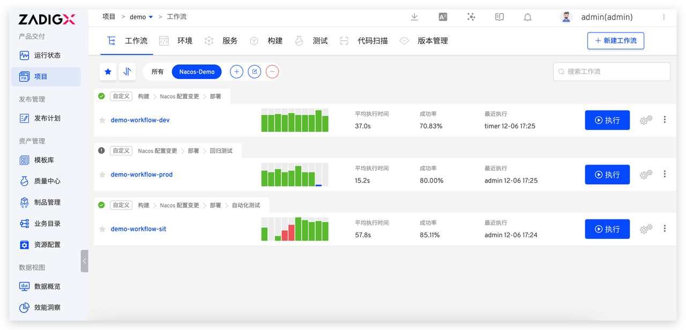

## Engineer Usage

Below, we will detail how to achieve Nacos configuration consistency changes on Zadig during the development, testing, and production release stages.

### Scenario 1: Developer Self-Testing and Joint Debugging

> Build > Nacos Configuration Change > Deploy, to achieve automated changes in the development environment's business and configuration.

When a development engineer needs to self-test and joint debug after code implementation, execute the demo-workflow-dev workflow, select the service that needs to be updated, choose the configuration to be changed in the Nacos configuration change task, and modify the configuration content.

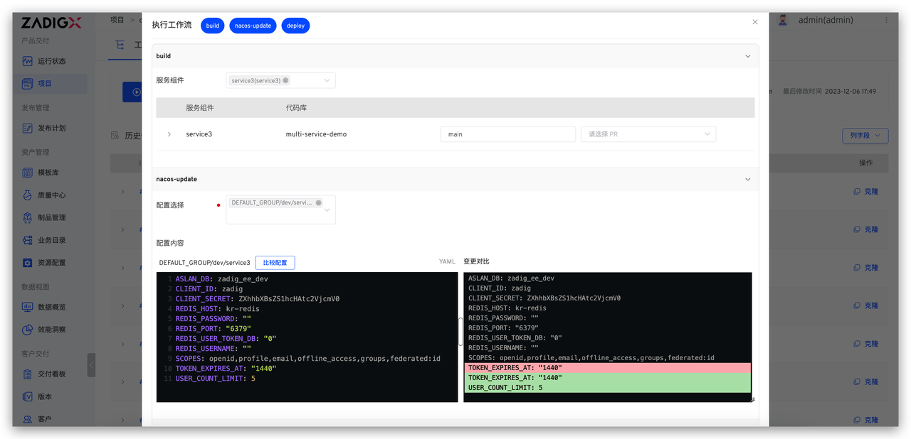

After the configuration change is successful, the deployment task will be automatically executed to update the development environment, achieving one-click changes in business code and configuration in the development environment, and enabling quick self-testing and joint debugging.

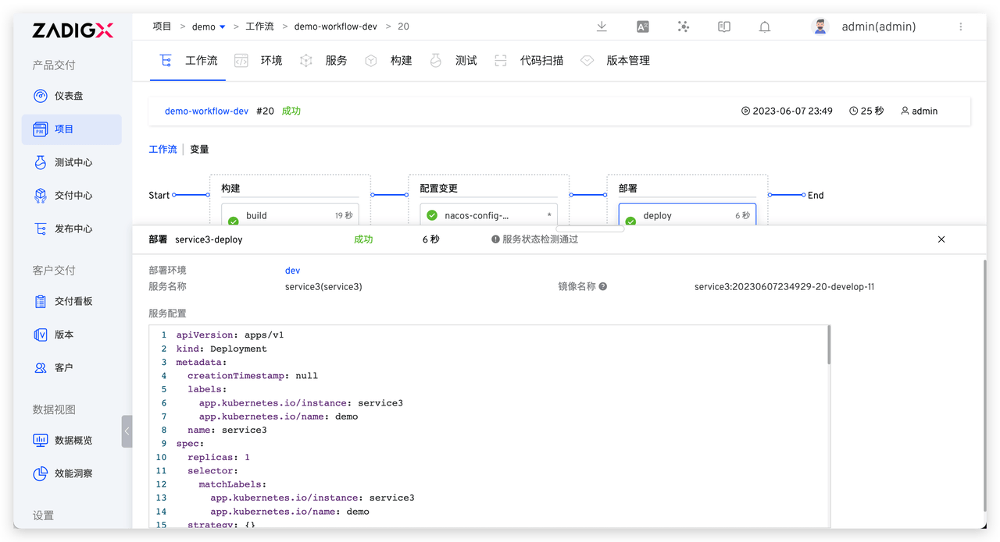
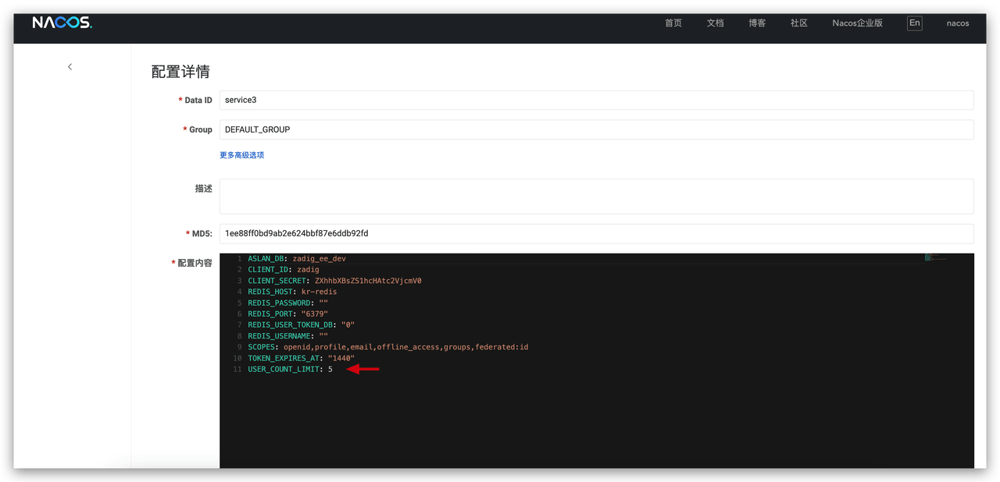

### Scenario 2: Tester Integration Testing

> Build > Nacos Configuration Change > Deploy > Automated Testing > IM Notification, to achieve automated and efficient changes in the test environment's business and configuration.

When the test engineer performs integration testing, execute the demo-workflow-sit workflow, select the service that needs to be updated and the corresponding configuration changes.

As shown in the figure below, click "Compare Configuration" and select the service configuration from the development environment to obtain the configuration differences between the development and test environments. After copying the different configurations, make the necessary modifications in the test environment's service configuration. By comparing the configurations before and after the change, you can clearly understand the changes. Finally, click "Execute Workflow" to complete the automated changes to the test environment configuration.

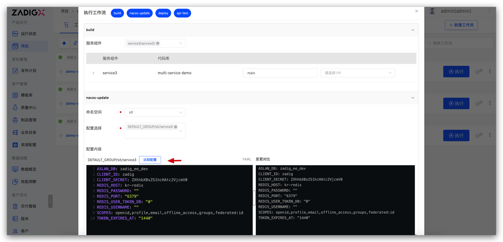
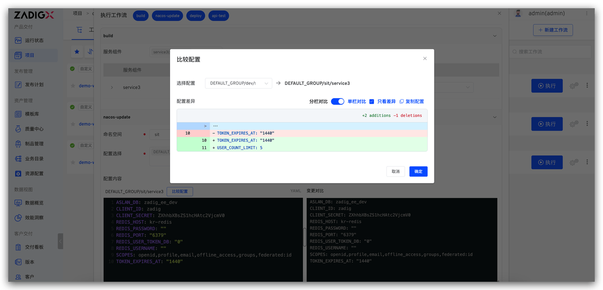
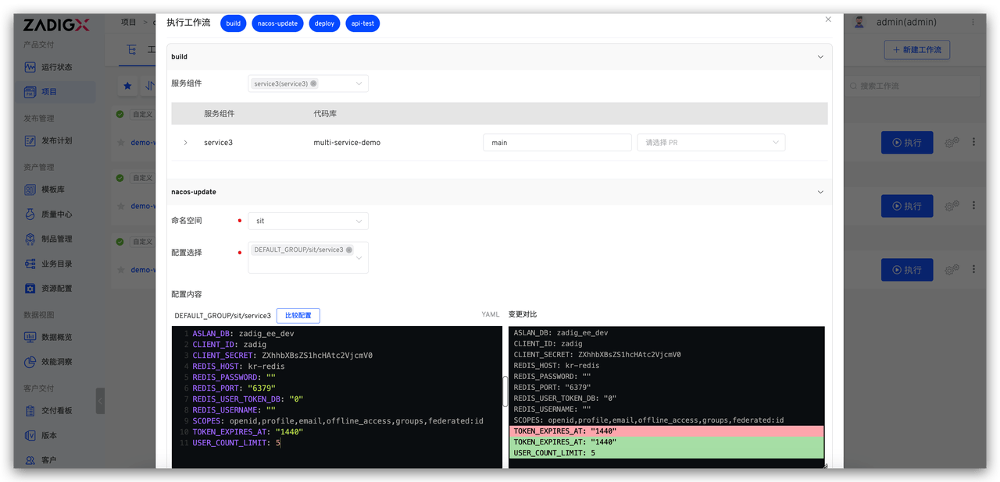

### Scenario 3: Release Engineer Production Release

> SRE Approval > Nacos Configuration Change > Deploy prod Environment > Automated Testing, to achieve automated and secure business and configuration deployment.

The release engineer executes the demo-workflow-prod workflow for production release, selects the Nacos configuration to be changed, and modifies the content.

Similar to the test engineer's operation, select the configuration from the test environment to obtain the differences between the test and production environments. After copying the different configurations, make the necessary changes to the production environment.

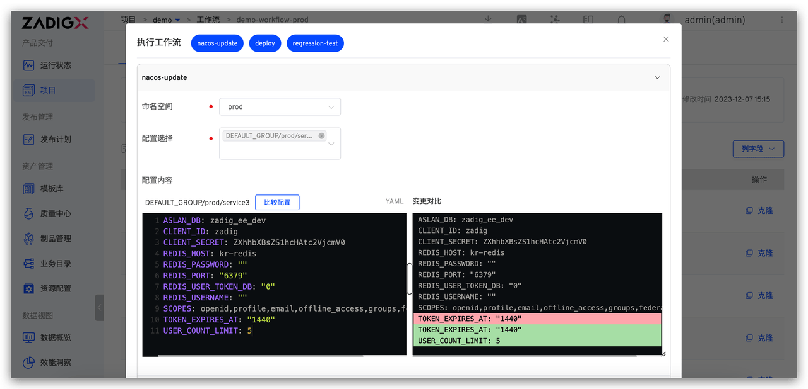

Additionally, given the seriousness of production releases, relevant responsible persons are usually required to approve the release content. Approval personnel can review the specific changes in the task through Zadig workflow task information to ensure the correctness and reliability of the published content.

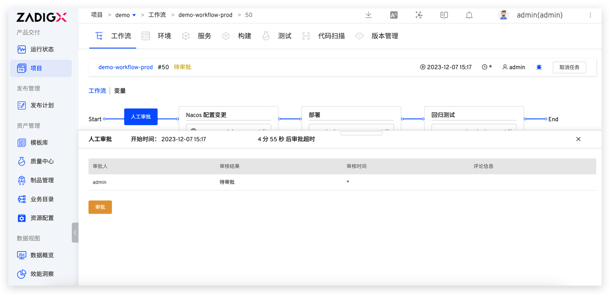
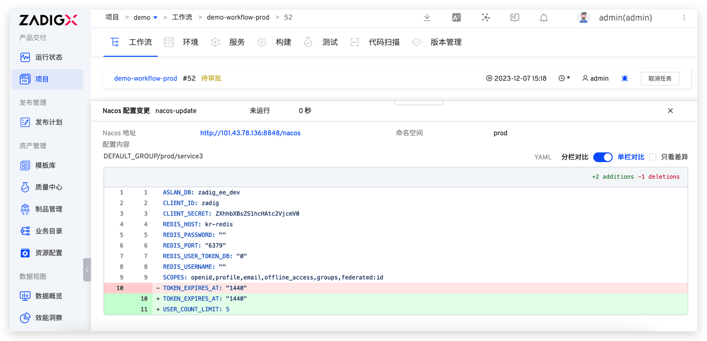

### Scenario 4: Release Engineer Configuration Rollback

If there is an issue with the production release, the configuration can be rolled back directly through the workflow.

The release engineer finds the task that needs to be rolled back, clicks the **Rollback** button, selects the configuration to roll back, and clicks the **OK** button to perform the rollback.

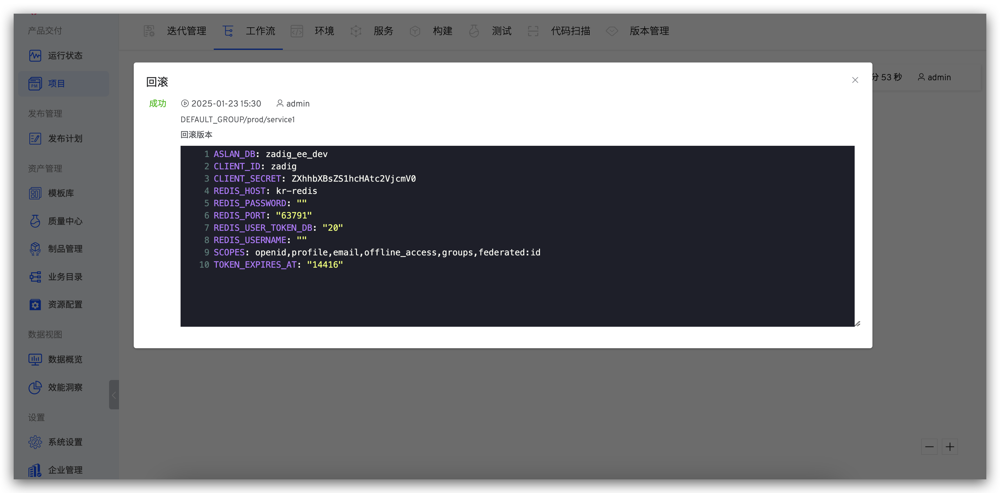