This article delves into how Zadig leverages Alibaba Cloud MSE to implement a full-link grayscale release solution, covering the solution's principles, administrator configurations, and practical operations for engineers in their daily use.

## Introduction to the Working Principle

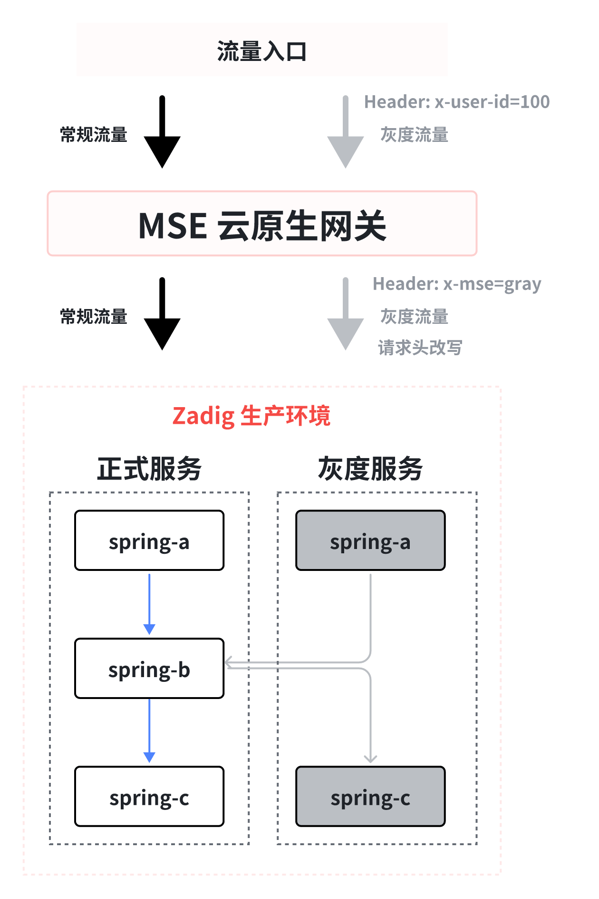

**Workflow Description:**

MSE Grayscale Release Task
1. Copy the YAML of the service in the baseline environment
2. Automatically add the suffix `-mse-<grayTag>` to the `metadata.name` of the resources in the YAML
3. Automatically add the necessary labels for MSE full-link grayscale release to the resources in the YAML
4. Users can set the grayscale image and replica count, and can directly modify other fields in the rendered YAML (labels used during the grayscale process cannot be deleted)
5. Generate the grayscale version resources based on the final YAML

Offline MSE Grayscale Service
1. Delete all Kubernetes resources with the grayscale label


## Pre-Operations

> MSE's full-link grayscale capability can support any K8S cluster. The full-link grayscale scenario requires the construction of gateway capabilities. The following example uses the cloud-native gateway that comes with MSE. Users can choose the appropriate gateway based on their own situation.

### Install the MSE Component

Install the MSE component in an Alibaba Cloud ACK cluster. For installation instructions, refer to the documentation: [Install ack-onepilot Component](https://help.aliyun.com/document_detail/2360531.html?spm=a2c4g.2359474.0.0.33a34ca1nN0X0c).

### Install the MSE Ingress Cloud Native Gateway

For installation instructions, refer to the documentation:
1. [Create an MSE Cloud Native Gateway](https://help.aliyun.com/document_detail/347638.html?spm=a2c4g.250951.0.0.c99b3e06EsealV)
2. [Access Container Service via MSE Ingress](https://help.aliyun.com/document_detail/438003.html?spm=a2c4g.440050.0.0.1e5e30d5JwFRF1#task-2229308)

The following uses services such as spring-a, spring-b, spring-c, and nacos as examples, combined with the MSE cloud-native gateway demonstration project, to illustrate the initialization and MSE grayscale release process.

## Administrators Perform Project Initialization

### Step 1: Create a New Project

Create a new project on Zadig, enter the project name, and select the "K8s YAML" project type.

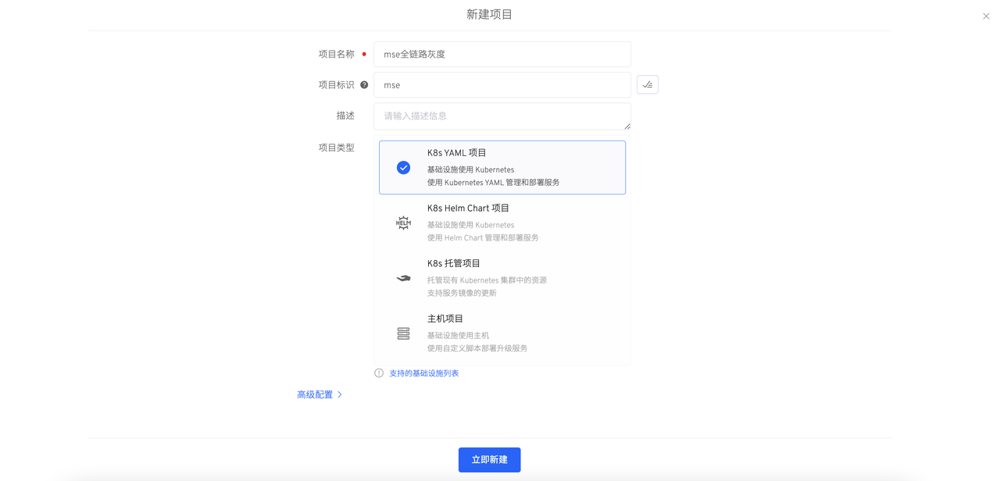

### Step 2: Create New Services

In the Zadig Service - Production Service module, create the `nacos`, `spring-a`, `spring-b`, and `spring-c` services and configure the corresponding YAML. For specific configuration, refer to [the example project YAML configuration](https://github.com/koderover/zadig/tree/main/examples/mse-demo).


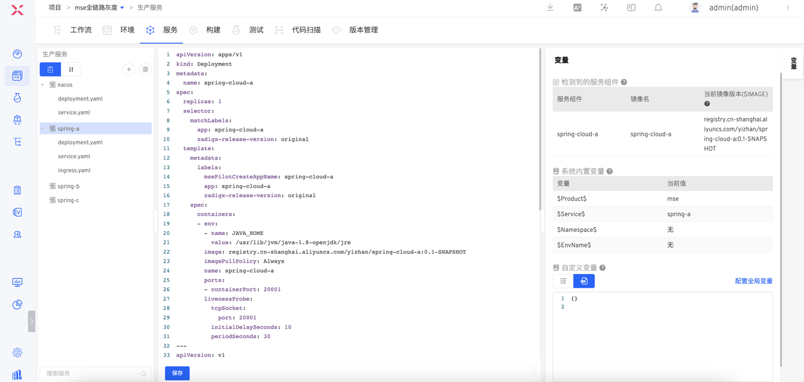

::: warning Warning
In the service deployment, you need to add the following selector and template.metadata.labels:

`zadigx-release-version: original`
:::

### Step 3: Create a New Environment and Enable MSE

1. Create a new production environment on Zadig

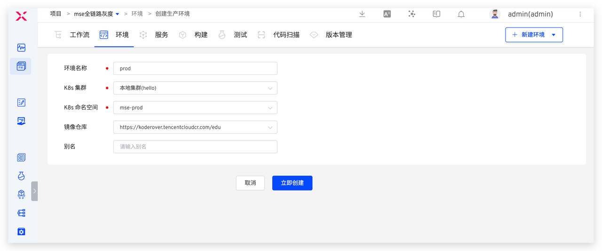

2. Execute the following command to enable MSE and label the namespace involved in the grayscale process (in the above image: mse-prod) with `mse-enable`.

``` bash
kubectl label namespace <NAMESPACE> mse-enable=enabled
```

3. Add the services `spring-a`, `spring-b`, `spring-c`, and `nacos` in the production environment.

4. Check if the services are successfully connected to MSE. In the Zadig environment, select a service, such as `spring-a`, and check if the `one-pilot-initcontainer` is successfully injected into the Pod YAML, as shown in the figure below.

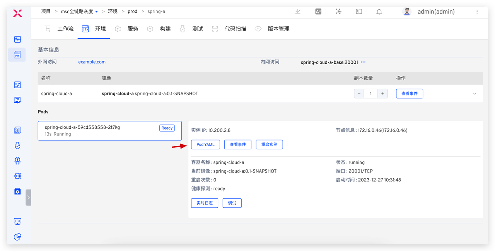
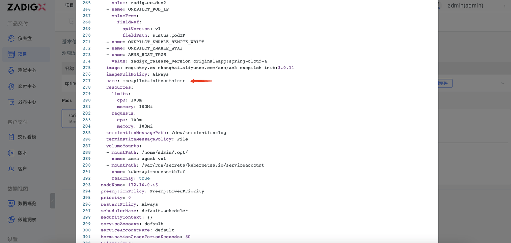

### Step 4: Configure the MSE Grayscale Release Workflow

1. Create a new release workflow named mse-gray-workflow, add tasks, and configure them as follows.
  1. `MSE Grayscale Release`: Used to deploy grayscale services
  2. [Optional] `General Task`: Used to verify the new version after grayscale
  3. `Offline MSE Grayscale`: Used to offline grayscale services

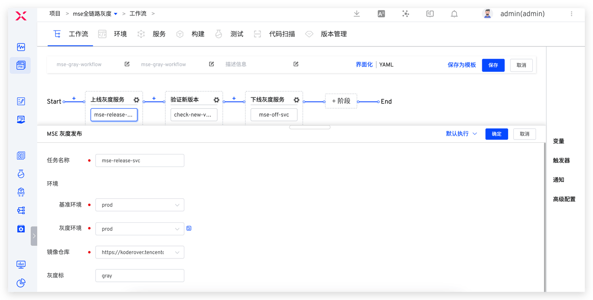


2. Create a new release workflow named prod-workflow, add a `Deployment` task to execute the production release, and configure it as shown in the figure below.

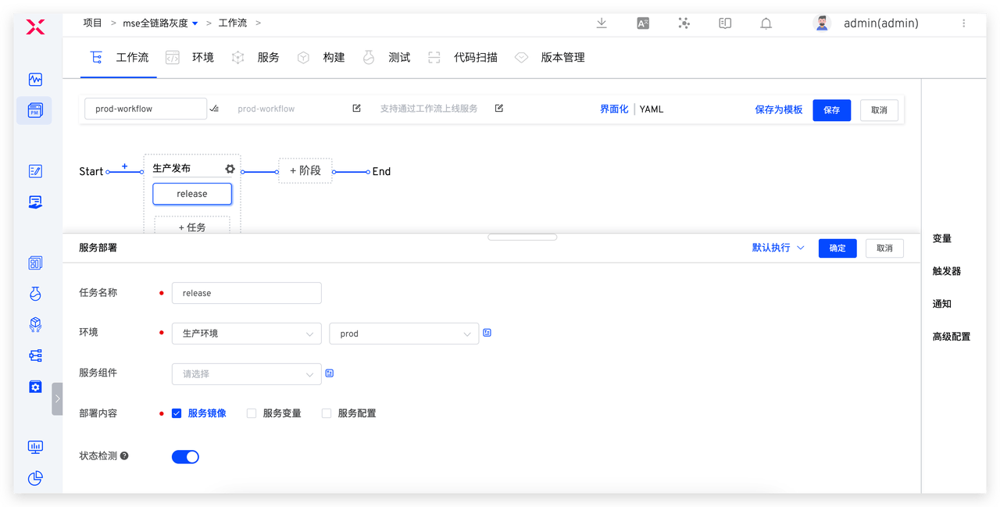

## Engineer Execution of MSE Grayscale Release

### Multiple Grayscale Service Deployments

Execute mse-gray-workflow , select service components `spring-cloud-a` and `spring-cloud-c` , set the grayscale mark, select the corresponding grayscale mirror, number of copies, modify the grayscale service YAML configuration, and click Execute to complete the grayscale service deployment.

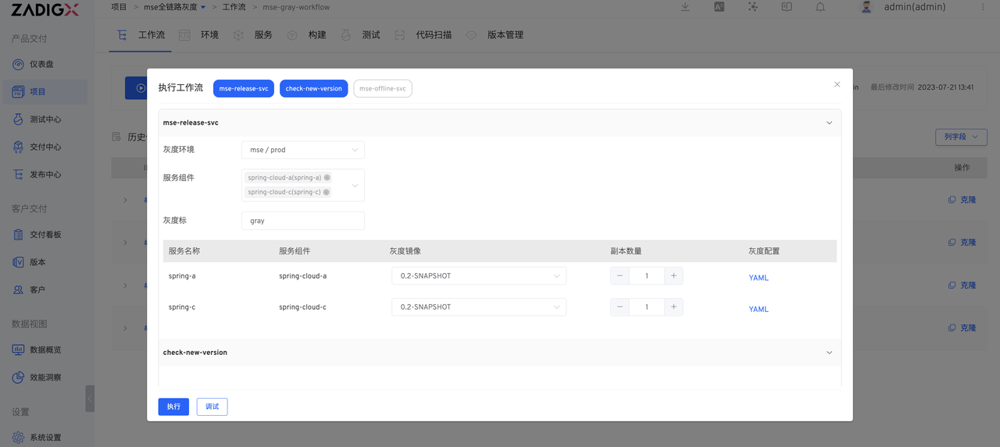


Here `spring-cloud-a` is the traffic entrance, so you need to manually add / Service and MSE Ingress some related fields of the resource in the grayscale service YAML
1. Set the grayscale traffic rules through the annotations of MSE Ingress and add a grayscale tag header to the grayscale traffic.
  The MSE Ingress cloud-native gateway supports configuration in three dimensions: request header, cookie, and weight. Only one of the three can be configured, and if multiple are configured, the effective rules are matched in the order of request header, cookie, and weight
  - By Request Header: Traffic segmentation based on Request Header. Add annotations `nginx.ingress.kubernetes.io/canary-by-header`, `nginx.ingress.kubernetes.io/canary-by-header-value`, or `nginx.ingress.kubernetes.io/canary-by-header-pattern`.
  - By Cookie: Traffic segmentation based on Cookie. Add annotation `nginx.ingress.kubernetes.io/canary-by-cookie`.
  - By Weight: Set the percentage of requests to the specified service (an integer value between 0 and 100). Add annotation `nginx.ingress.kubernetes.io/canary-weight`.

2. Set the `backend.service.name` of the grayscale routing rule to the name of the grayscale Service. The specific changes are as follows:

:::details
``` yaml
apiVersion: networking.k8s.io/v1
kind: Ingress
metadata:
  annotations: # Add grayscale routing
    mse.ingress.kubernetes.io/request-header-control-update: x-mse-tag gray
    nginx.ingress.kubernetes.io/canary: "true"
    nginx.ingress.kubernetes.io/canary-by-header: x-user-id
    nginx.ingress.kubernetes.io/canary-by-header-value: "100"
    nginx.ingress.kubernetes.io/canary-weight: "0"
  creationTimestamp: null
  labels:
    zadigx-release-service-name: spring-a
    zadigx-release-type: mse-gray
    zadigx-release-version: gray
  name: spring-cloud-a-mse-gray
spec:
  ingressClassName: mse
  rules:
  - host: example.com
    http:
      paths:
      - backend:
          service:
            name: spring-cloud-a-mse-gray  # Modify service configuration
            port:
              number: 20001
        path: /
        pathType: Prefix
status:
  loadBalancer: {}
---
apiVersion: v1
kind: Service
metadata:
  creationTimestamp: null
  labels:
    zadigx-release-service-name: spring-a
    zadigx-release-type: mse-gray
    zadigx-release-version: gray
  name: spring-cloud-a-mse-gray
spec:
  ports:
  - name: http
    port: 20001
    protocol: TCP
    targetPort: 20001
  selector:
    app: spring-cloud-a
    zadigx-release-service-name: spring-a
    zadigx-release-type: mse-gray
    zadigx-release-version: gray
status:
  loadBalancer: {}
```
:::

After deployment, you can view the operating status and basic information of the grayscale service in the production environment.

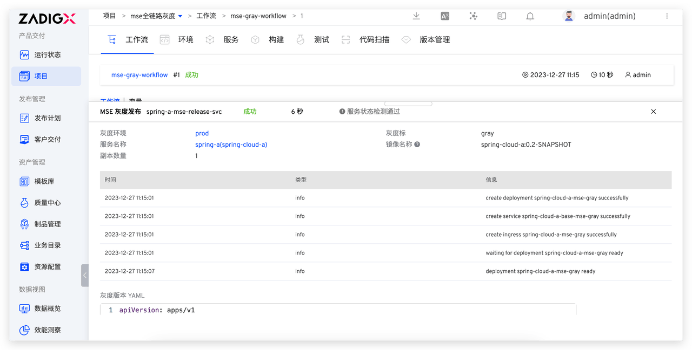


### Grayscale Result Verification

After the grayscale service is deployed, the new version of the function verification will be automatically performed or verified through other business methods.


### Official Release of Production Services

After verifying that the grayscale service is working correctly, execute the prod-workflow workflow, select the updated service and the corresponding image, and update the production service.


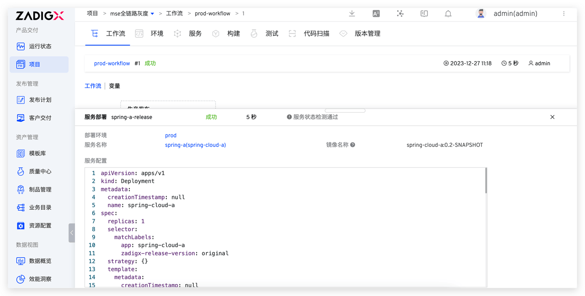

### Grayscale Service Cleanup and Offline

After the production release is successful, execute the mse-gray-workflow workflow, select the grayscale mark to be taken offline, and the corresponding grayscale service will be removed.

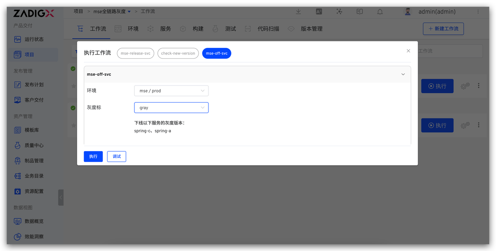
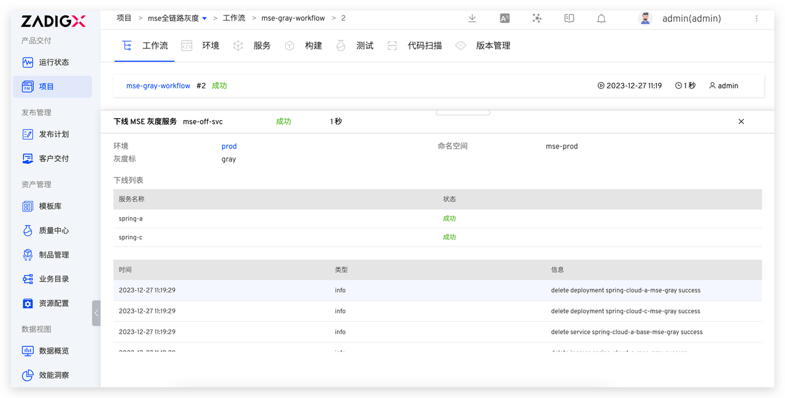
