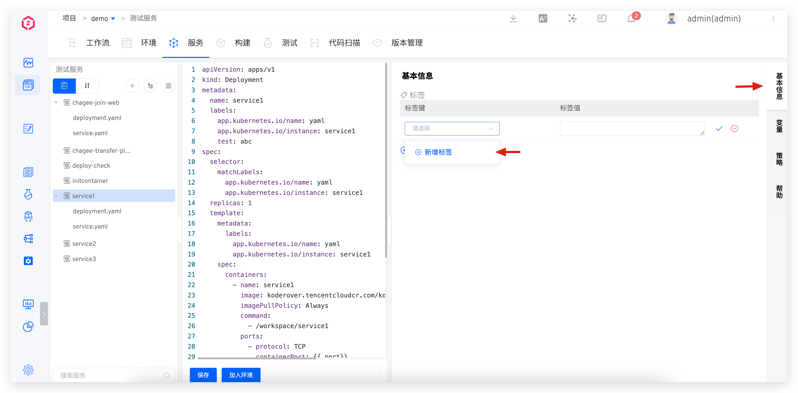
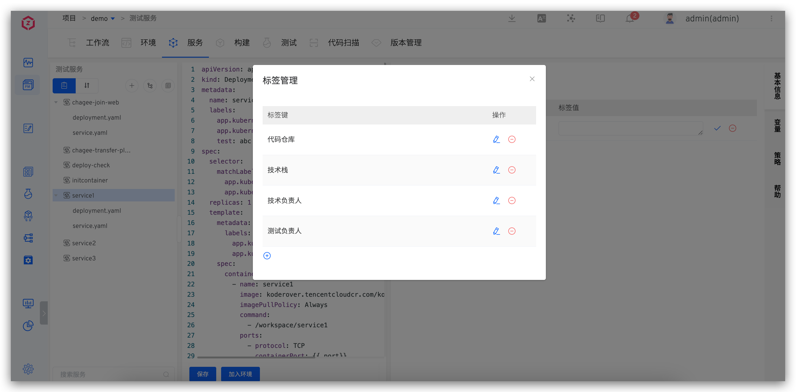
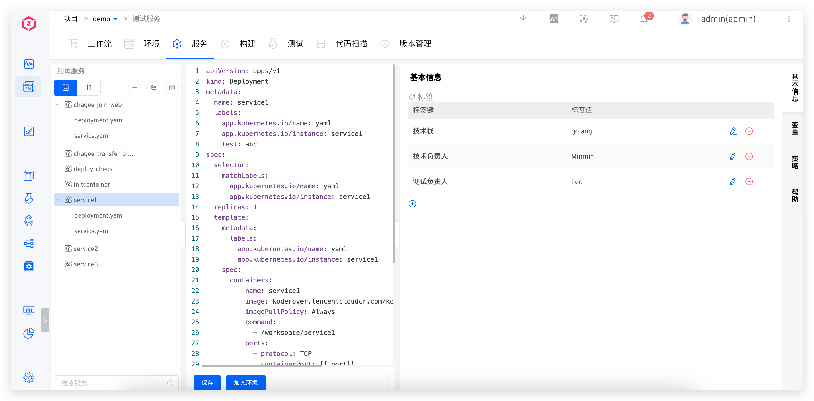
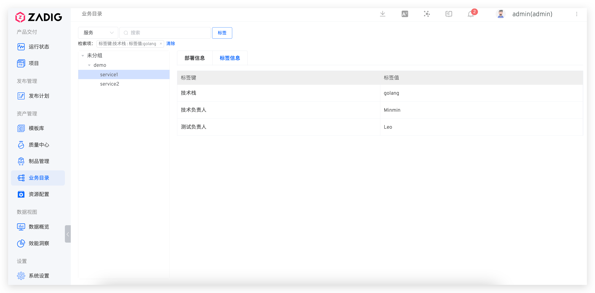

## Tag Management

On Zadig, you can easily achieve centralized management of service tags. Navigate to the "Services" page, and in the "Basic Information" section, add the corresponding service tags to associate existing tags with the service, thereby enhancing the classification and retrieval efficiency of the service.

## Tag Usage

### Quick Service Search

Visit the "Business Directory" and select the tag key-value pair to search for services.

### Service Meta Information Management

Tag the service with relevant meta information, and the third-party system obtains service meta information by calling Zadig OpenAPI. For OpenAPI details, refer to [document](/en/Zadig%20v3.4/api/service/#get-the-service-tag).