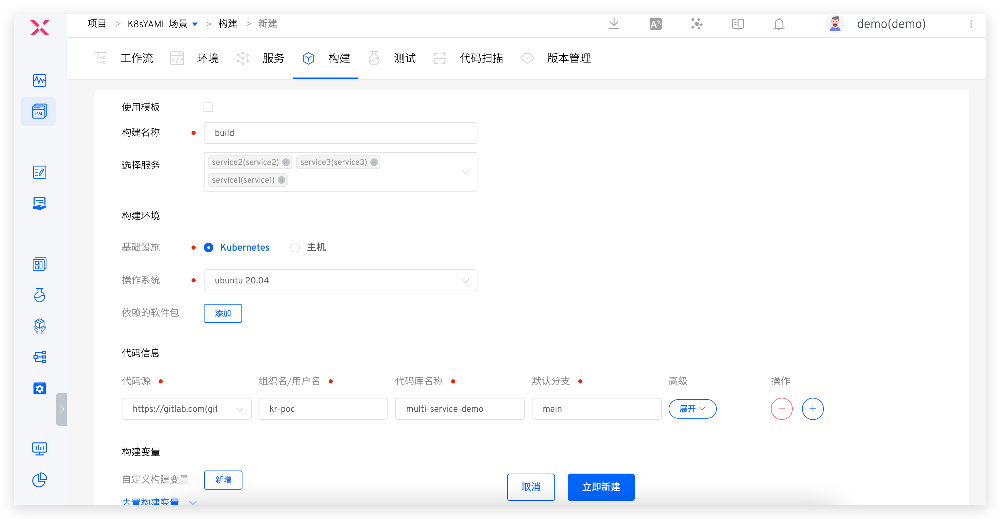

This article introduces how to share a build configuration among multiple services, significantly reducing the management and maintenance burden of build scripts.

## Configure Build

Take [multi-service-demo](https://github.com/koderover/zadig/tree/main/examples/multi-service-demo) as an example. This project includes 3 Golang services service1/service2/service3, and the directory structure related to the build is as follows:

```bash
├── Dockerfile # Define the Dockerfile for 3 services
├── Makefile   # Define the compilation for 3 services
├── src        # The source code for 3 services
   ├── service1
   ├── service2
   └── service3
```

### Step 1: Create a Build
Create a Zadig build, select multiple services in the `Service Selection` section, and configure the build environment, code information, and general build scripts as needed. Use the system-provided variables to achieve build sharing. The build scripts in this example are as follows:

```bash
cd zadig/examples/multi-service-demo
make build-$SERVICE
docker build -t $IMAGE -f Dockerfile --build-arg service=$SERVICE .
docker push $IMAGE
```


### Step 2: Associate Services

- When creating a build configuration, specify multiple services, or modify the build after creation and select multiple services in `Service Selection`.



- You can also choose to reuse existing build configurations as needed to achieve build sharing when configuring services.


## Configure Workflow

Edit the "Build" task in the workflow, select the service and the corresponding build, and multiple services can share the same build.

