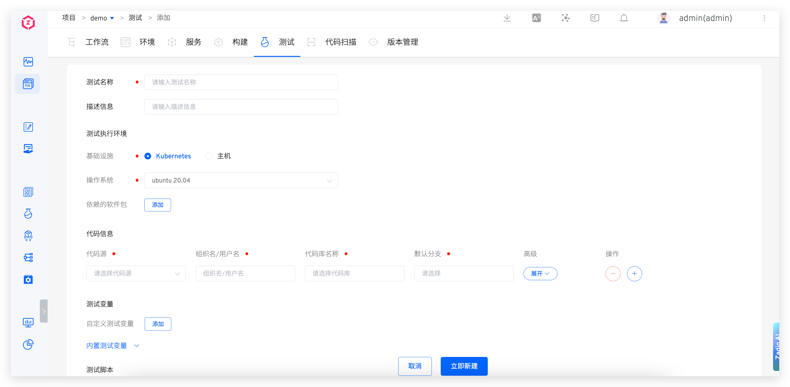
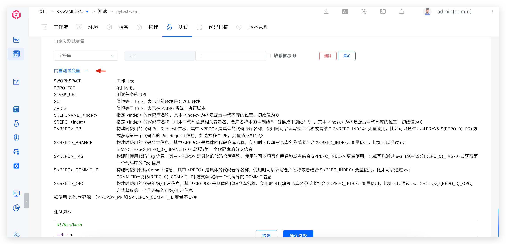
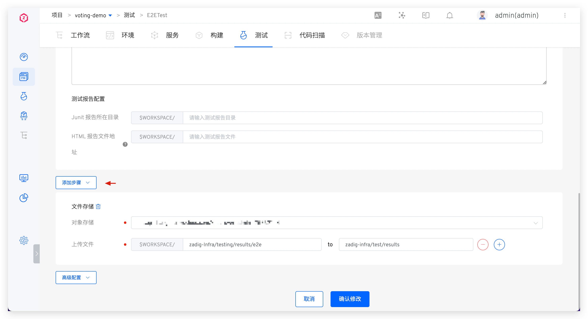
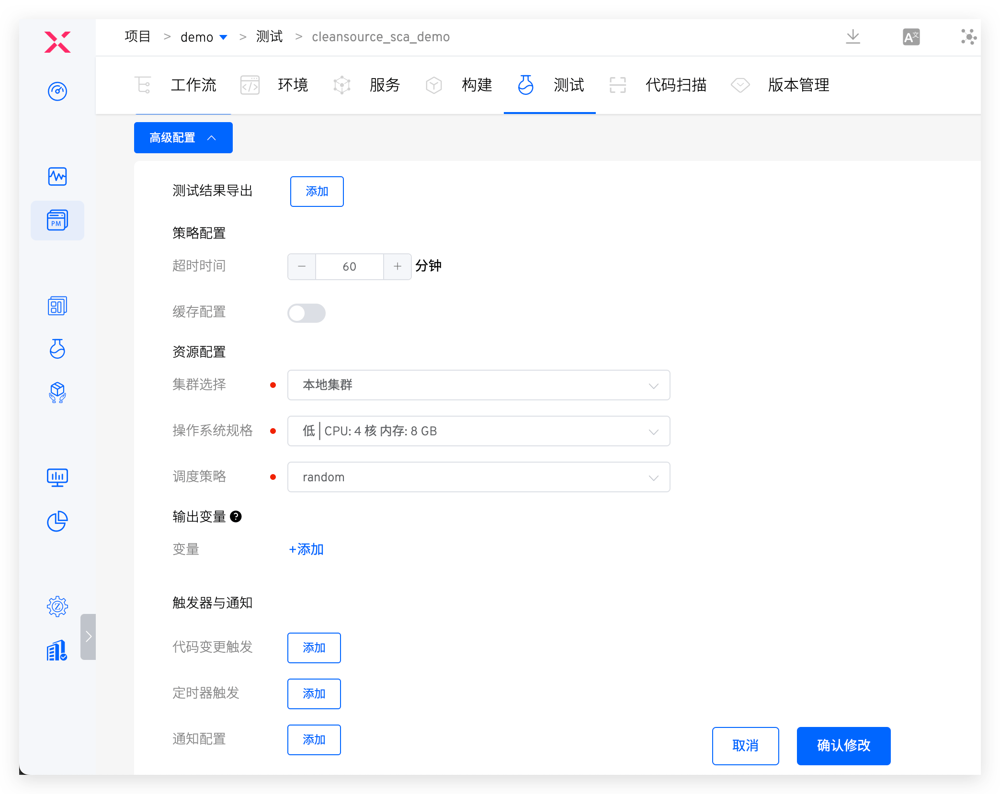
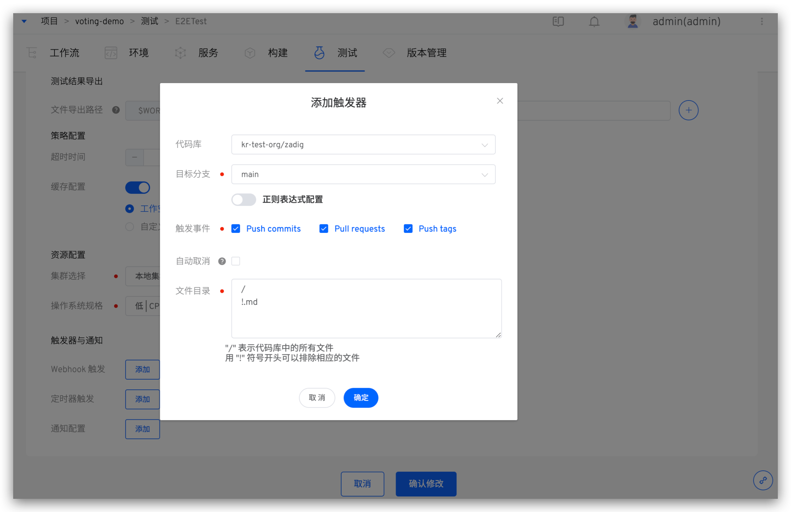
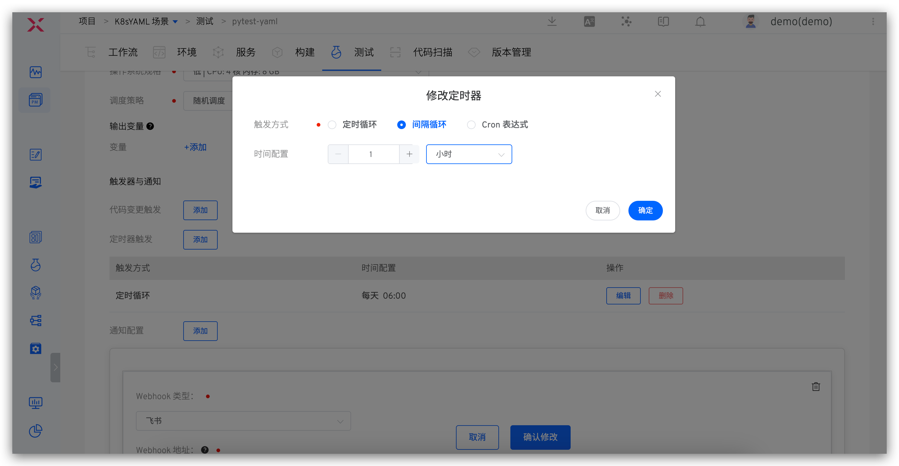
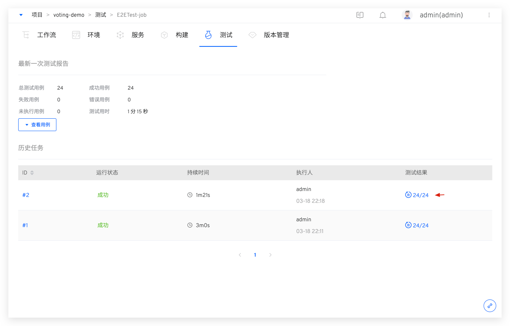

Zadig supports many test scenarios, including performance, function, interface, UI, and end-to-end automation testing. It comes with built-in mainstream testing frameworks such as jMeter and ginkgo, and can also [install software packages](/en/Zadig%20v3.4/settings/app/) to meet more diverse automation testing needs.

The testing module mainly includes management of automated test sets, support for testing environments, test execution, and result analysis. It also supports the output of standard Junit/Html test reports.

## Test Management

- `Test Management`: Cross-project test cases can be shared
- `Test Execution`: Supports CI/CD concurrent execution, individual execution, and cross-environment execution
- `Test Analysis`: Analysis of single-scenario time consumption and pass rate, as well as cross-team testing benefits and health analysis


## Test Configuration

### Test Execution Environment
Configure the environment in which the test task runs.



- `Infrastructure`: Supports executing test tasks on Kubernetes and hosts

- `Operating System`: Currently, the platform provides Ubuntu 18.04 / Ubuntu 20.04 for choice, and you can also customize the test execution environment. For details, refer to [Build Image Management](/en/Zadig%20v3.4/settings/custom-image/#%E6%AD%A5%E9%AA%A4-1-%E7%94%9F%E6%88%90%E6%9E%84%E5%BB%BA%E9%95%9C%E5%83%8F)
- `Packages`: Various tools needed during the compilation process, such as different versions of Java, Go, Govendor, Node, Bower, Yarn, Phantomjs, etc. The system currently includes common testing frameworks and tools such as Jmeter, Ginkgo, and Selenium

::: tip
1. When selecting software packages, pay attention to the dependencies between multiple software packages and install them in the correct order. For example: Govendor depends on Go, so you must select Go first, then Govendor
2. If there are other software packages or version requirements, the system administrator can configure the installation scripts in [Package Management](/en/Zadig%20v3.4/settings/app/)
:::

### Code Information
For test configuration code information, the code will be pulled according to the specified configuration when the test is executed. For supported code sources, refer to [Code Source Information](/en/Zadig%20v3.4/settings/codehost/overview/#function-compatibility-list). For specific fields in the code information, refer to [Code information field description](/en/Zadig%20v3.4/project/build/#%E4%BB%A3%E7%A0%81%E4%BF%A1%E6%81%AF).

### Test Variables
Includes system-built-in variables and custom variables, which can be used directly in test scripts.

> Tip: Add `env` commands to [Test script](#test-scripts) to view all test variables.



**Built-in Test Variables**

The built-in test variables and their descriptions are as follows:

|Variable Name|Description|
|-------|---|
|`WORKSPACE`|The working directory of the current test task|
|`PROJECT`|Project identifier|
|`TASK_URL`|The URL of the test workflow task|
|`CI`|The value is always true and can be used as needed|
|`Zadig`|The value is always true and can be used as needed|
|`REPONAME_<index>`|1. Get the name of the codebase at the specified `<index>`<br>2. `<index>` is the position of the code in the test configuration, with an initial value of 0<br>3. In the following example, using `$REPO_0` in the test script will get the name of the first codebase `Zadig`|
|`REPO_<index>`|1. Get the name of the codebase at the specified `<index>` and automatically replace the hyphen `-` in the name with an underscore `_`<br>2. `<index>` is the position of the code in the test configuration, with an initial value of 0<br>3. In the following example, using `$REPO_1` in the test script will get the converted name of the first codebase `test_resources`|
|`<REPO>_PR`|1. Get the Pull Request information for the specified `<REPO>` during the test process. Replace `<REPO>` with the specific codebase name when using it<br>2. If the `<REPO>` information contains a hyphen `-`, replace `-` with an underscore `_`<br>3. In the following example, to get the Pull Request information for the `test-resources` repository, use `$test_resources_PR` or `eval PR=\${${REPO_0}_PR}`<br>4. If multiple PRs are specified during the build, such as PR IDs 1, 2, 3, the value of the variable will be `1,2,3`<br>5. When the codebase is from the `other` code source, this variable is not supported|
|`<REPO>_BRANCH`|1. Get the branch information for the specified `<REPO>` during the test process. Replace `<REPO>` with the specific codebase name when using it<br>2. If the `<REPO>` information contains a hyphen `-`, replace `-` with an underscore `_`<br>3. In the following example, to get the branch information for the `test-resources` repository, use `$test_resources_BRANCH` or `eval BRANCH=\${${REPO_0}_BRANCH}`|
|`<REPO>_TAG`|1. Get the Tag information for the specified `<REPO>` during the test process. Replace `<REPO>` with the specific codebase name when using it<br>2. If the `<REPO>` information contains a hyphen `-`, replace `-` with an underscore `_`<br>3. In the following example, to get the Tag information for the `test-resources` repository, use `$test_resources_TAG` or `eval TAG=\${${REPO_0}_TAG}`|
|`<REPO>_COMMIT_ID`|1. Get the Commit ID information for the specified `<REPO>` during the test process. Replace `<REPO>` with the specific codebase name when using it<br>2. If the `<REPO>` information contains a hyphen `-`, replace `-` with an underscore `_`<br>3. In the following example, to get the Commit ID information for the `test-resources` repository, use `$test_resources_COMMIT_ID` or `eval COMMIT_ID=\${${REPO_0}_COMMIT_ID}`<br>4. When the codebase is from the `other` code source, this variable is not supported|
|`<REPO>_ORG`|1. Get the organization/user information for the specified `<REPO>` during the test process. Replace `<REPO>` with the specific codebase name when using it<br>2. If the `<REPO>` information contains a hyphen `-`, replace `-` with an underscore `_`<br>3. In the following example, to get the organization/user information for the `test-resources` repository, use `$test_resources_ORG` or `eval ORG=\${${REPO_0}_ORG}`|

**Custom Test Variables**

Explanation:
- Supports string, single-choice, and multi-choice type variables
- String-type variables can be set as sensitive information, such as Access Key Id, Secret Access Key, etc. After setting them as sensitive information, the plaintext will no longer be output in the test task's run log

### Test Scripts
Declare the specific execution process of the test and use test variables in the test script.

### Test Report Configuration
Configure the directory or specific path to the test file where the test report is located.


Explanation:
  - Supports test reports in standard Junit XML/Html format
  - For Junit test reports, configure the directory where they are located, such as `$WORKSPACE/path/to/junit_report/`. If there are multiple test reports in the directory, Zadig will merge all test reports into the final report
  - For Html test reports, configure the specific file path, such as `$WORKSPACE/path/to/html_report/result.html`. The Html test report file will be included in the IM notification content sent by the test task

### File Storage
In `Add Steps`, configure file storage to upload the specified file to the object store.



## Advanced Configuration


### Test Result Export
Set one or more file directories. After the test is completed, you can download them from the workflow task details page, as shown in the figure below:


### Policy Configuration
- `Timeout`: Configure the timeout time for the test task execution. If the test task is not successful after the set time threshold, it will be considered a timeout failure
- `Cache`: After the cache is enabled, the cache directory configured here will be used when the test task is executed. The directory configuration can use [Test variables](#test-variables)

### Resource Configuration
- `Cluster`: Select the cluster resource used when the test task runs. The local cluster refers to the cluster where the Zadig system is located. For cluster integration, refer to [Cluster Management](/en/Zadig%20v3.4/pages/cluster_manage/)
- `Resources`: Configure resource specifications for performing test tasks. The platform provides four configurations for High/Medium/Low/Lowest. In addition, you can also customize according to actual needs. If you need to use GPU resource, resource configuration form is `vendorname.com/gpu:num`, refer to [Scheduling GPU](https://kubernetes.io/zh-cn/docs/tasks/manage-gpus/scheduling-gpus/) for more information
- `Scheduling`: Select the cluster scheduling policy, and the default is `Random Scheduling` policy. Refer to [Set scheduling policy](/en/Zadig%20v3.4/pages/cluster_manage/#%E8%AE%BE%E7%BD%AE%E8%B0%83%E5%BA%A6%E7%AD%96%E7%95%A5) management
- `Use the host Docker daemon`: After enabling, use the Docker daemon on the node where the container is located during the test execution process to perform docker operations

### Output Variables
Output environment variables in the test can realize variable transfer between different tasks in the workflow, refer to [Variable passing](/en/Zadig%20v3.4/project/common-workflow/#%E5%8F%98%E9%87%8F%E4%BC%A0%E9%80%92).

### Webhook Trigger
Add trigger configuration to automatically trigger the specified event Webhook. Refer to [Code Source Information](/en/Zadig%20v3.4/settings/codehost/overview/#function-compatibility-list) for supported code sources.



Parameter Description:
- `Repository`: The code repository that needs to listen to the trigger event
- `Target Branch`: The base branch when submitting a pull request. Regular expression configuration is supported; see [Regexp Syntax](https://pkg.go.dev/regexp/syntax@go1.17.3#hdr-Syntax) for syntax
- `Trigger Events`: Specify the Webhook event that triggers the test run. The optional events are as follows:
    - `Push commits` event (Merge operation) triggered
    - `Pull requests` triggered when submitting a pull request
    - `Push tags` triggered after creating a tag
- `Auto Cancel`: `Push commits` and `Pull requests` events support automatic cancellation. If you want to trigger only the latest commit, using this option will automatically cancel the preceding tasks in the queue
- `File Directory`: By setting files and file directories, you can monitor files and directories, and trigger the test task when a file or directory changes (new/modify/delete). You can also ignore the corresponding file or directory changes and do not trigger the test task

Use the following code repository file structure as an example:

```bash
├── reponame  # Repository name
  ├── Dockerfile
  ├── Makefile
  ├── README.md
  ├── src
    ├── service1/
    ├── service2/
    └── service3/
```

| Trigger Scenario | File Directory Configuration |
|----|------------|
| All file updates|`/`|
| All file updates except *.md|`/`<br>`!.md`|
| All file updates except the service1 directory | `/`<br>`!src/service1/`|
| All file updates in the service1 directory | `src/service1/` |
| All file updates in the src directory (except the service1 directory)|`src`<br>`!src/service1/`|

### Timed Configuration
By configuring a timer, you can achieve periodic execution of test tasks. The currently supported timer methods are mainly:
- Timed Loop: Execute a workflow at a specific time, such as running at 12:00 every day or 10:00 every Monday
- Periodic Loop: Execute a task periodically, such as running a workflow every 30 minutes
- Cron Expression: Use standard Linux Cron expressions to flexibly configure timers, such as "45 4 1,10,22 * *" to run a workflow task at 4:45 on the 1st, 10th, and 22nd of each month

#### Timed Loop

Click the Add button to add a timed loop entry, selecting the cycle time and time point respectively.


#### Interval Loop

Click the Add button to add an interval loop entry, selecting the interval time and interval time units respectively.



#### Cron Expression
Click the Add button to add a Cron expression entry and fill in the Cron expression.


### Notification Configuration
Currently, it supports configuring the final execution status notification of test tasks to WeChat Work, DingTalk, Feishu, Email, and WebHook.

#### WeChat Work

For detailed information, refer to [WeChat Work Configuration Document](https://work.weixin.qq.com/help?doc_id=13376).

If you add to a certain group Bot, you can log in to the WeChat Work → right-click it, select Add Robot to get the relevant Webhook address.

Parameter Description:

- `Webhook Address`: The address of the WeChat Work group Bot
- `Notification Event`: Configurable notification rules, multiple workflow statuses can be selected

Configuration Diagram:


#### DingTalk
Refer to [DingTalk Custom Robot](https://developers.dingtalk.com/document/robots/custom-robot-access) for detailed information.

When adding a custom Bot to DingTalk, you must enable the security settings. There are three types of security settings, and you can set one or more:

- `Custom Keyword`: If you choose a custom keyword, please enter `Workflow`
- `Signature`: After enabling, refer to [Copy Webhook URL](https://developers.dingtalk.com/document/robots/customize-robot-security-settings) for the Webhook address
- `IP Address (Range)`: Please refer to the configuration documentation for specific settings

Configuration diagram:


#### Feishu
Refer to [Feishu](https://www.feishu.cn/hc/zh-CN/articles/360024984973) to configure the Feishu Bot and obtain the Webhook address. Copy the Webhook address and fill it into the test notification configuration.

Configuration diagram:


The notification effect is shown below. Click the link in the test results to view the HTML test report.


## Viewing the Test Report

Click the test results link in the test task to view the test report.



You can get an overview of the test case execution results and the proportion of different result types. You can filter failed/error cases and quickly view failure information to assist in analysis and troubleshooting.

