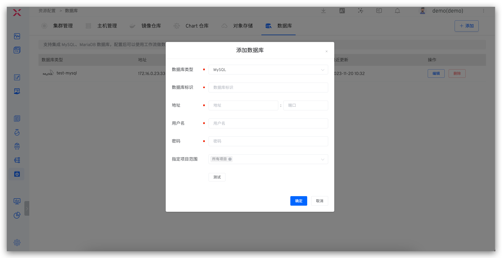

This article explains how to integrate and use databases on the Zadig system. Zadig supports the integration of MySQL and MariaDB databases, and after integration, workflows can be used to achieve automated data changes.

## How to Integrate

Click `Assets` → `Database` → `Add`, fill in the database configuration parameters, and save.
1. The database identifier field can be customized and must be globally unique to facilitate quick identification of the database in the Zadig system
2. After completing the configuration, you can click `Test` to test the database connectivity

## How to Use

Orchestrate SQL Data Change Tasks in the workflow to realize automated data changes. Refer to [SQL Change Tasks](/en/Zadig%20v3.4/project/workflow-jobs/#sql-data-changes).