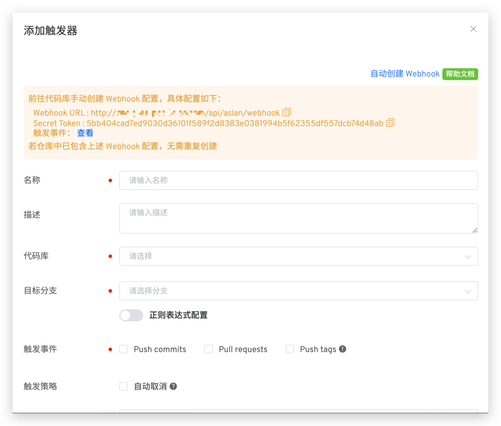
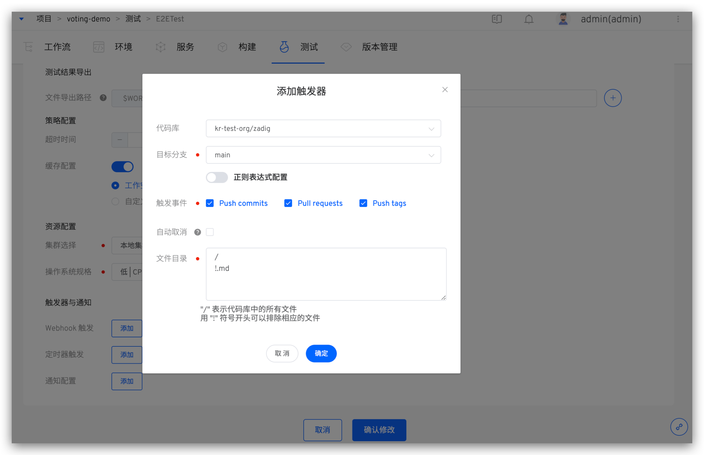

## Git Provider
Zadig supports the integration of the following code sources:

| Code Source | How to Integrate | Description |
|-------|---------|---|
| GitLab | [GitLab Code Source Integration](/en/Zadig%20v3.4/settings/codehost/gitlab/)| Authorization and authentication using OAuth2 |
| GitHub | [GitHub Code Source Integration](/en/Zadig%20v3.4/settings/codehost/github/)| Authorization and authentication using OAuth2 |
| Gerrit | [Gerrit Code Source Integration](/en/Zadig%20v3.4/settings/codehost/gerrit/)| Authorization and authentication using Basic Auth |
| Gitee Public Cloud | [Gitee Code Source Integration](/en/Zadig%20v3.4/settings/codehost/gitee/)| Authorization and authentication using OAuth2 |
| Gitee Private Deployment  | [Gitee Code Source Integration](/en/Zadig%20v3.4/settings/codehost/gitee-enterprise/)| Authorization and authentication using OAuth2 |
| Perforce | [Perforce Code Source Integration](/en/Zadig%20v3.4/settings/codehost/perforce/)| Authorization and authentication using Basic Auth |
| Other Requirements | [Integration of Other Code Sources](/en/Zadig%20v3.4/settings/codehost/others/)|For code sources that support the standard Git protocol, use SSH Key or Access Token for authentication|

## Function Compatibility List

The functions available in the system vary depending on the code source. The detailed descriptions are as follows.

| System Function | GitHub | GitLab | Gerrit | Gitee Public Cloud | Gitee Private Deployment| Perforce|Other Code Sources |
|:--------|:-----------------------------|:---------|:----|:---|:---|:----|:---|:----|
| Build configuration ( [illustration](#build-configuration) ) | ✅ | ✅ | ✅ | ✅ | ✅ | ✅ |✅|
| Test configuration ( [illustration](#test-configuration) ) | ✅ | ✅ | ✅ | ✅ | ✅ | ✅ | ✅|
| Code scanning configuration ( [illustration](#code-scanning-configuration) ) | ✅ | ✅ | ✅ | ✅ | ✅ |✅ |Supports Access Token method|
| General task configuration ( [illustration](#general-task-configuration) ) | ✅ | ✅ | ✅ | ✅ | ✅ |✅ |✅|
| Create K8s YAML Service ( [Illustrated](#create-k8s-yaml-service) ) | ✅ | ✅ | ✅ | ✅ | ✅ |—|—|
| Create K8s Helm Chart Service ( [Illustrated](#create-k8s-helm-chart-service) ) | ✅ | ✅ | ✅ | ✅ | ✅ |—|✅|
| Create K8s Helm Chart Service Template ( [Illustrated](#create-k8s-helm-chart-service-template) ) | ✅ | ✅ | ✅ | ✅ | ✅ |—|✅|
| Batch code information ( [illustration](#batch-code-information-entry) ) | ✅ | ✅ | — | ✅ | ✅ |—| — |
| Environment configuration ( [illustration](#environment-configuration) ) | ✅ | ✅ | — | — | — |—|—|
| Workflow trigger, automatic configuration ( [illustration](#automatic-workflow-trigger-configuration) ) | ✅ | ✅ | ✅ | ✅ | ✅ |—|—|
| Workflow trigger, manual configuration ( [illustration](#manual-workflow-trigger-configuration) ) | ✅ | ✅ | — | ✅ | ✅ |—|—|
| Test trigger ( [illustration](#test-trigger) ) | ✅ | ✅ | — | ✅ | ✅ |—|—|
| Code scan trigger ( [illustration](#code-scan-trigger) ) | ✅ | ✅ (Additional support for regular expressions) | — | — | — |—|—|
| Import Helm Chart Values File ( [Illustrated](#import-helm-chart-values-file) ) | ✅ | ✅ | — | — | —|—|—|
| Custom task source configuration ( [illustration](#custom-task-source-configuration) ) | ✅ | ✅ | — | ✅ | ✅ |—|✅|

## Illustration

### Build Configuration
::: details
</img>
:::

### Test Configuration
::: details
</img>
:::

### Code Scanning Configuration
::: details
</img>
:::

### General Task Configuration
::: details
</img>
:::

### Create a K8s YAML Service
::: details
</img>
:::

### Create a K8s Helm Chart Service
::: details
</img>
:::

### Create a K8s Helm Chart Service Template
::: details
</img>
:::

### Batch Code Information Entry

::: details
</img>
</img>
:::

### Environment Configuration
::: details
</img>
:::

### Workflow Triggers

#### Automatic Workflow Trigger Configuration
::: details
</img>
:::

#### Manual Workflow Trigger Configuration

::: details
</img>
:::

### Test Trigger
::: details
</img>
:::

### Code Scan Trigger
::: details
</img>
:::

### Import the Helm Chart Values File
::: details
</img>
:::

### Custom Task Source Configuration

</img>