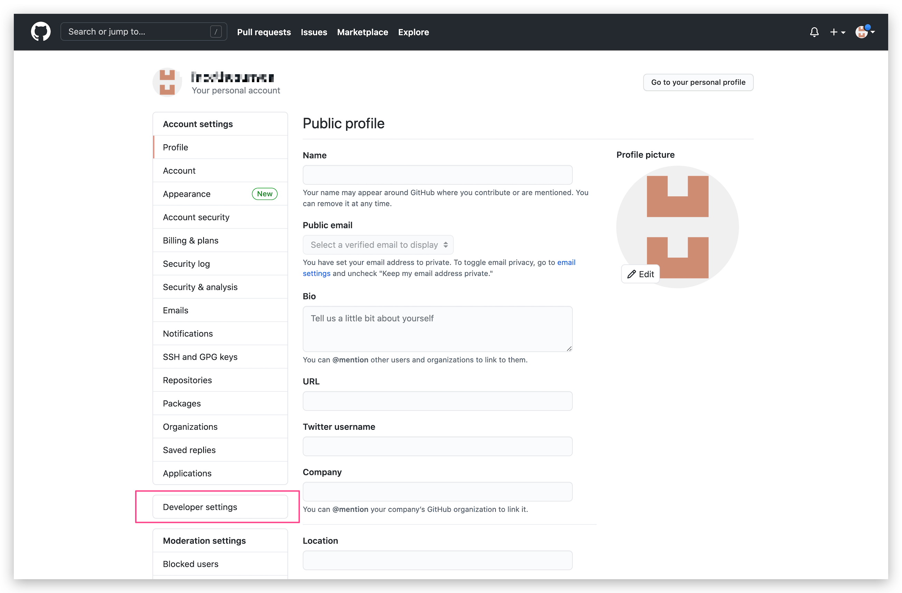
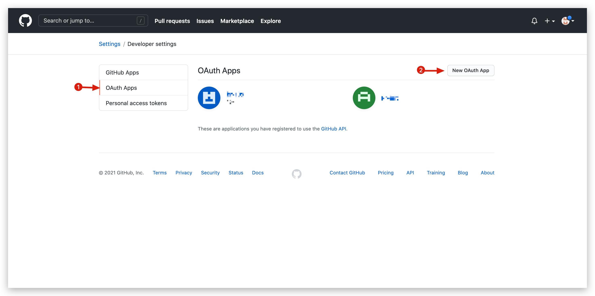
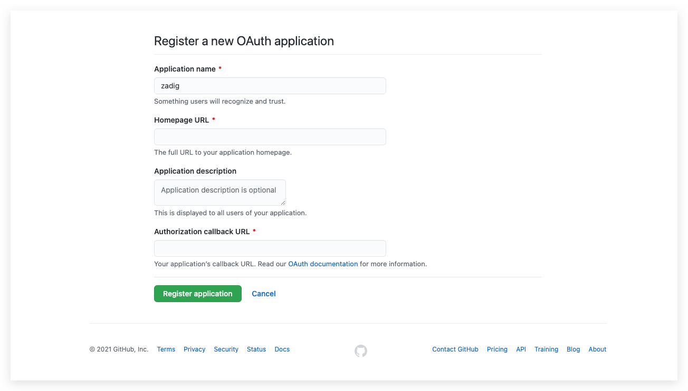
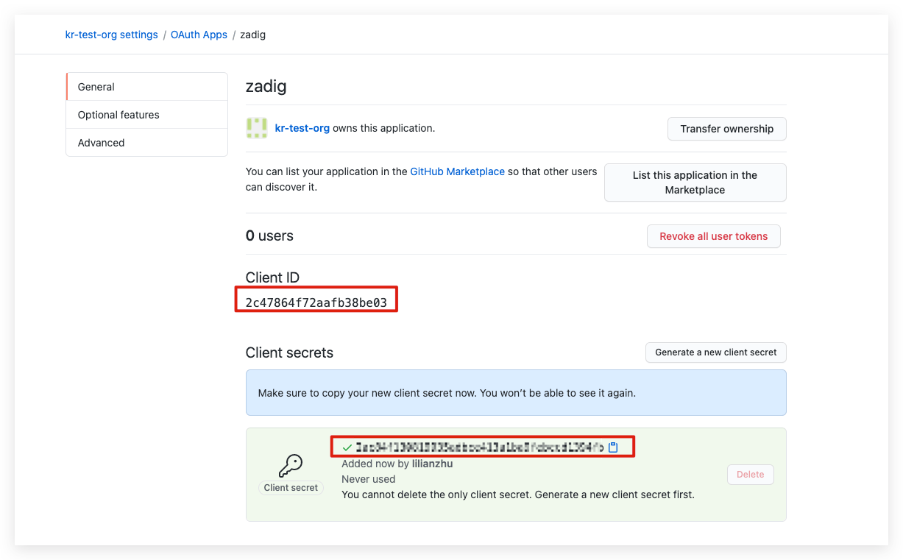
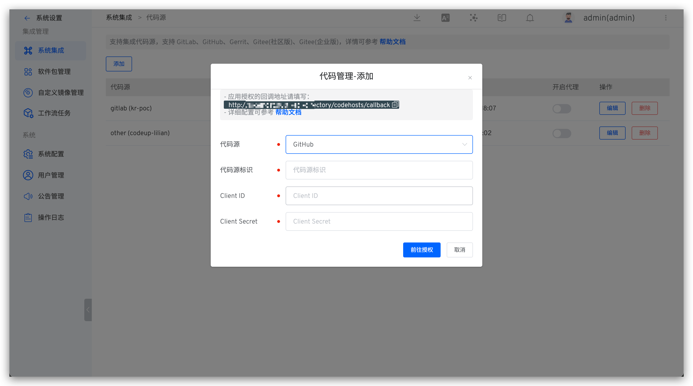
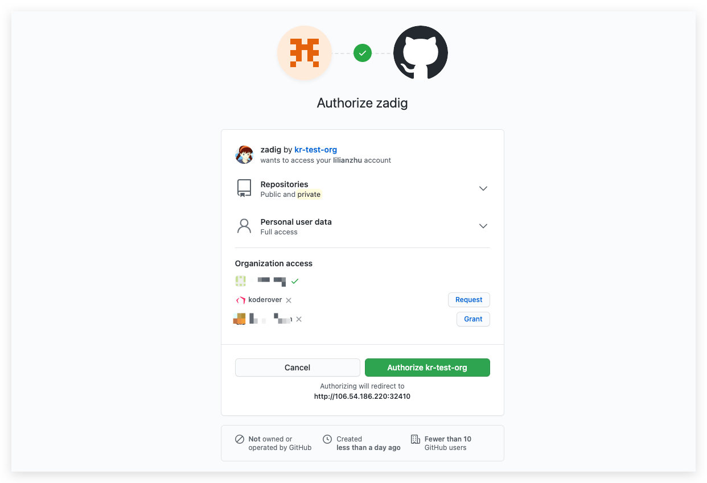

This article primarily explains how to integrate GitHub code sources on Zadig.

> Currently, the system uses the OAuth2 method to authorize and authenticate code with GitHub

To integrate GitHub, you can follow the configuration process below:

- GitHub Organization Administrator creates a new OAuth application
- Configure the OAuth application, filling in basic information and the callback URL
- Obtain the `Client ID` and `Client Secret` for the OAuth application
- Configure GitHub integration, entering the obtained `Client ID` and `Client Secret` into the Zadig system
- Go to GitHub for authentication and authorization

### Step 1: Create a New GitHub OAuth Application

> `To enable GitHub OAuth2, you must register an application in GitHub.`

1. Access to the codebase under a personal account: You can create a new application by clicking on the GitHub account avatar -> Settings -> Developer settings -> OAuth Apps.
2. Access to the code repository under a GitHub Organization: You can create a new application by clicking Organization Settings -> Developer settings -> OAuth Apps.

The following example uses a GitHub Organization, as shown below.

- Open `Organization Settings`.

- Select `Developer settings` -> `OAuth Apps` and click `New OAuth App` to create a new application.

### Step 2: Configure the GitHub OAuth Application

On the Create New Application page, you need to follow these steps:

- 1. Application name: Zadig, or any recognizable name.
- 2. Homepage URL: http://[koderover.yours.com]
- 3. Authorization Callback URL: `http://[koderover.yours.com]/api/directory/codehosts/callback`
- 4. Click Create

:::tip Note
The `koderover.yours.com` in the callback URL should be replaced with the actual address of the Zadig system deployment
:::

### Step 3: Obtain Client ID and Client Secret Information

After the application is successfully created, GitHub will return the basic information of the application. Click `Generate a new client secret` to generate the `Client Secret`.

The page will now display the complete `Client ID` and `Client Secret`.

### Step 4: Integrate Client ID and Client Secret into the System

Switch to Zadig System, and the administrator click `System Settings` -> `Integration` -> `Code Source` in turn -> click the Add button.

Fill in the following known information:

- `Provider`: Choose `GitHub` here
- `Alias`: Customize to help quickly identify the code source in the Zadig system. This information must be unique within the entire system
- `Client ID`: The Client ID returned after the application was successfully created in Step 3
- `Client Secret`: The Client Secret generated in Step 3

After confirming the information, click `Go to Authorization` and wait patiently. The system will then redirect to GitHub for authorization.

Click the authorization button, agree to the authorization, and GitHub will redirect to the Zadig system. The GitHub integration is now complete.