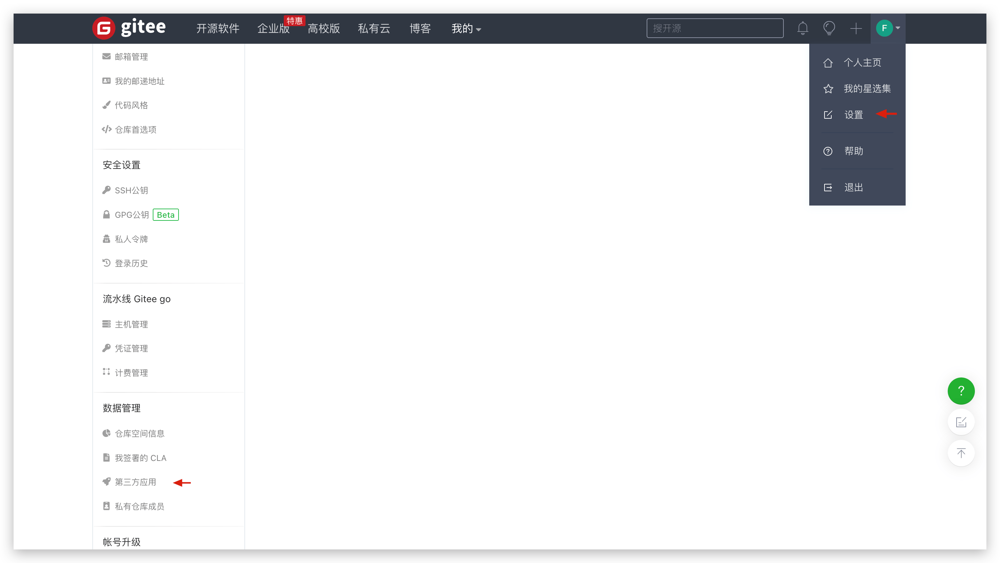
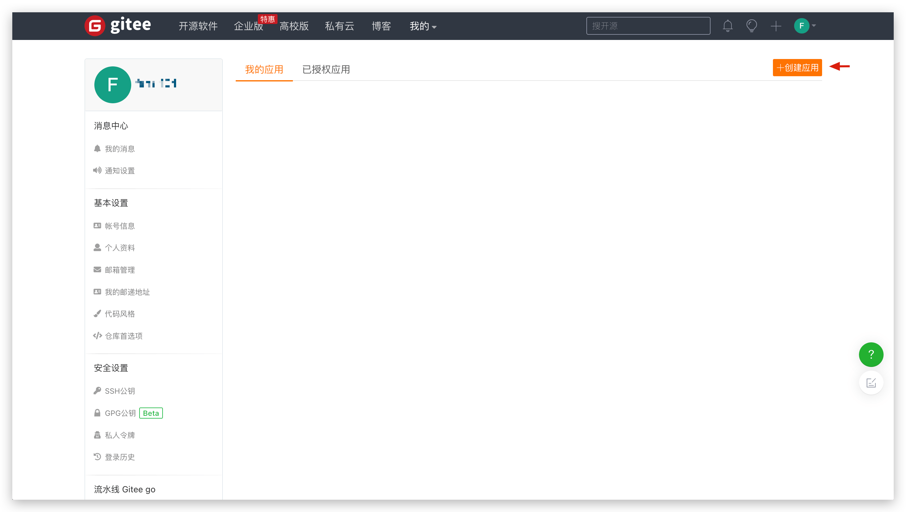
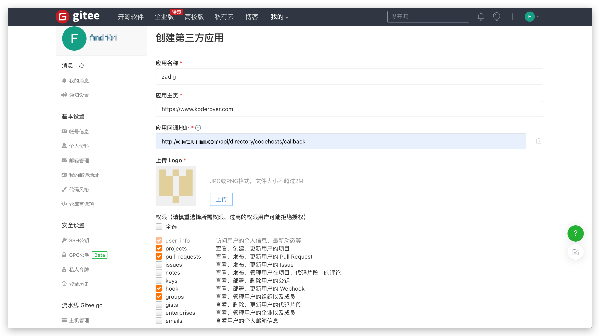
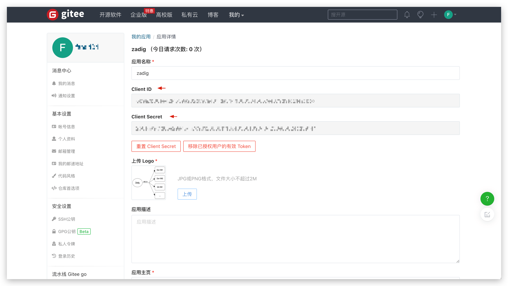
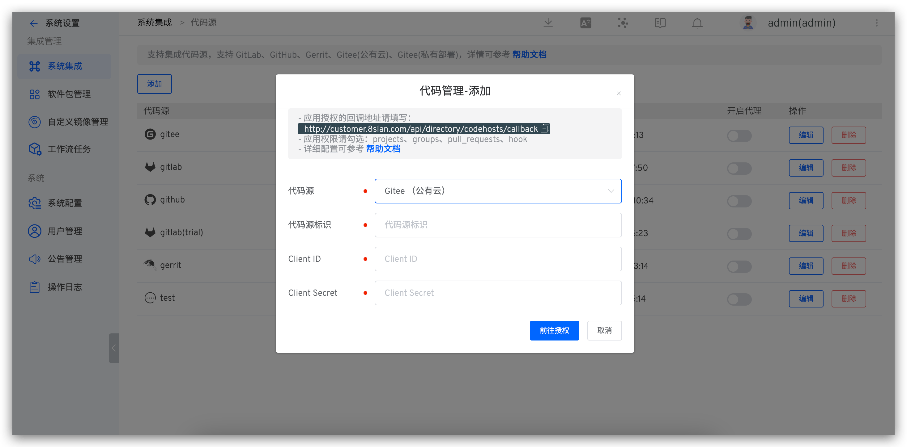
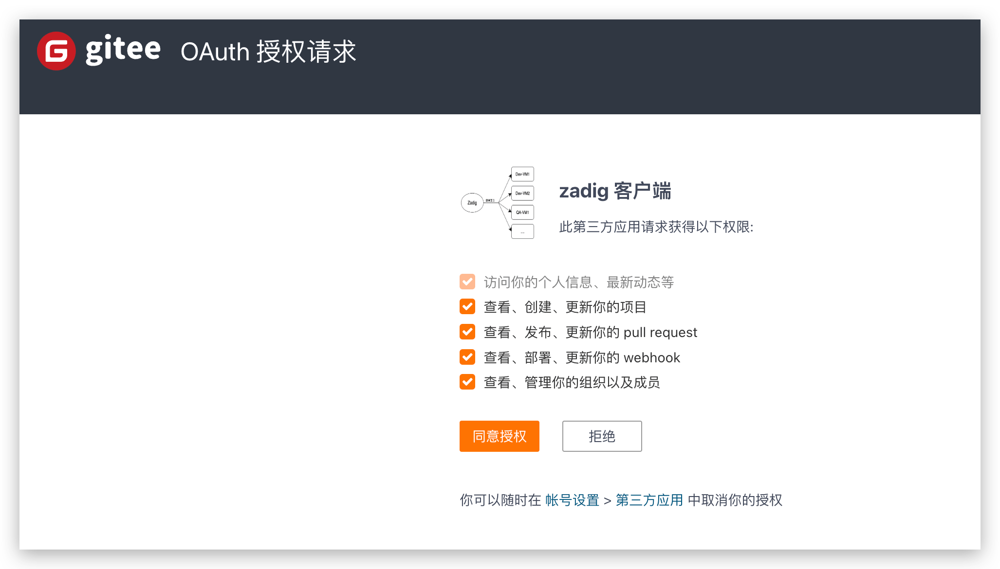

This article mainly introduces how to integrate Gitee code sources on Zadig.

Currently, the system uses OAuth2 for code authorization and authentication with Gitee. If you need to integrate Gitee, you can follow the configuration process below:

- Gitee Administrator Creates a New Third-Party Application
- Configure the third-party application by filling in the basic information and callback URL
- Obtain the `Client ID` and `Client Secret` information from the third-party application
- Configure Gitee integration by entering the obtained `Client ID` and `Client Secret` information into the Zadig system
- Redirect to Gitee for authentication and authorization

### Step 1: Create a New Gitee Third-Party Application

Click on the Gitee account avatar -> Settings -> Data Management -> Third-Party Applications -> Create Application to create a new application.

### Step 2: Configure the Gitee Third-Party Application

After filling in the following content, click Create:

- `App Name`: Zadig, or any recognizable name.
- `App Homepage`: http://[koderover.yours.com]
- `App Callback URL` : `http://[koderover.yours.com]/api/directory/codehosts/callback`
- `Upload LOGO`: Upload an image that meets the format and size requirements
- `Permissions`: Check `projects`, `pull_requests`, `hook`, and `groups`

:::tip Note
The `koderover.yours.com` in the application callback URL should be replaced with the actual address of the Zadig system deployment
:::

### Step 3: Obtain the Client ID and Client Secret Information

After the application is successfully created, you can obtain the `Client ID` and `Client Secret` information corresponding to the application.

### Step 4: Enter the Configuration into the Zadig System

Switch to the Zadig system, and the administrator should click `System Settings` -> `Integration` -> `Code Source` in sequence -> click the Add button.

Enter the following known information:

- `Provider`: Select `Gitee (Community Edition)`
- `Alias`: Customize this to help quickly identify the code source in the Zadig system. This information must be unique within the entire system
- `Client ID`: The Client ID returned after the application was successfully created in Step 3
- `Client Secret`: The Client Secret generated in Step 3

After confirming the information, click `Go to Authorization` and wait patiently. The system will redirect to Gitee for authorization.

After clicking `Agree Authorization`, the system will redirect back to Zadig, completing the Gitee integration.