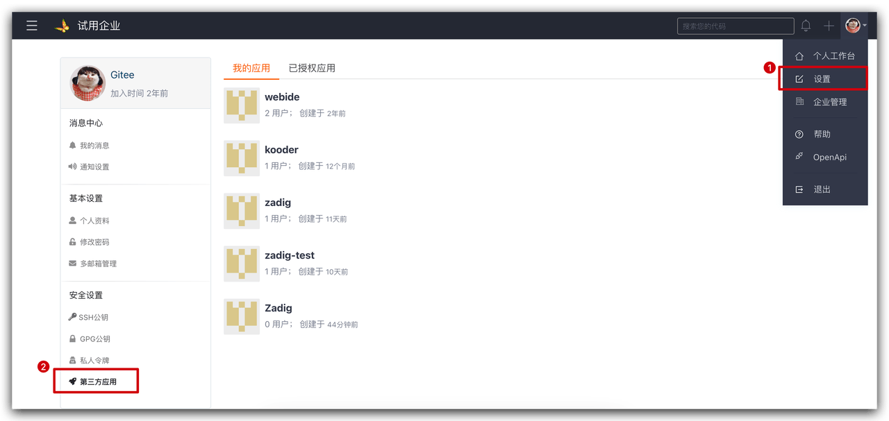
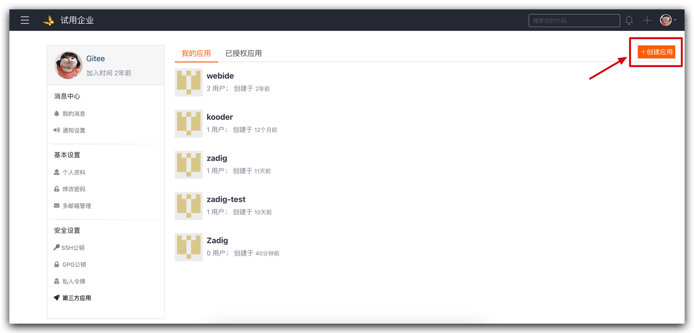
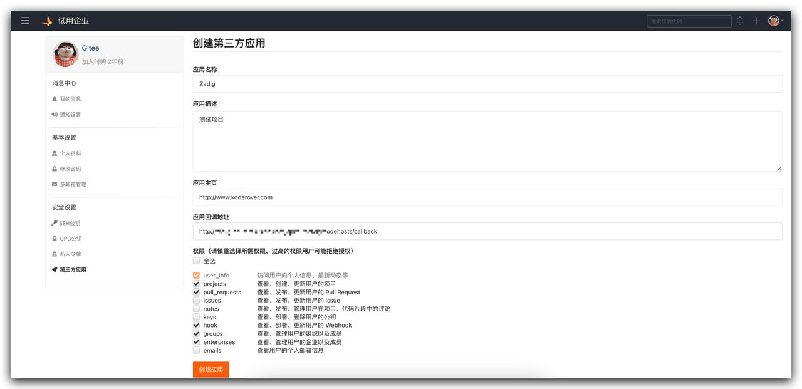
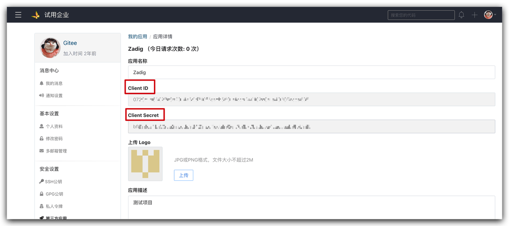
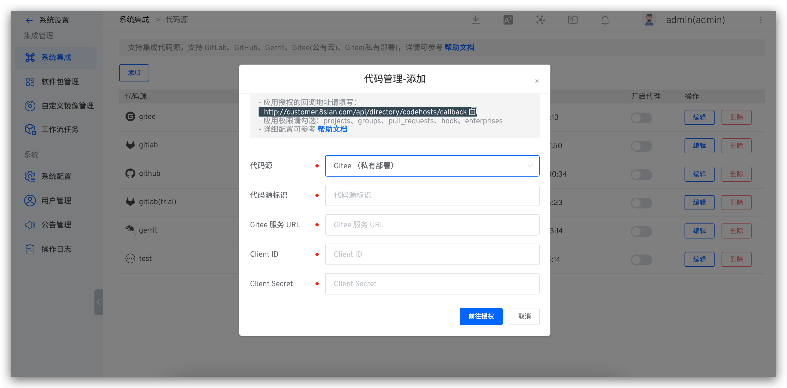
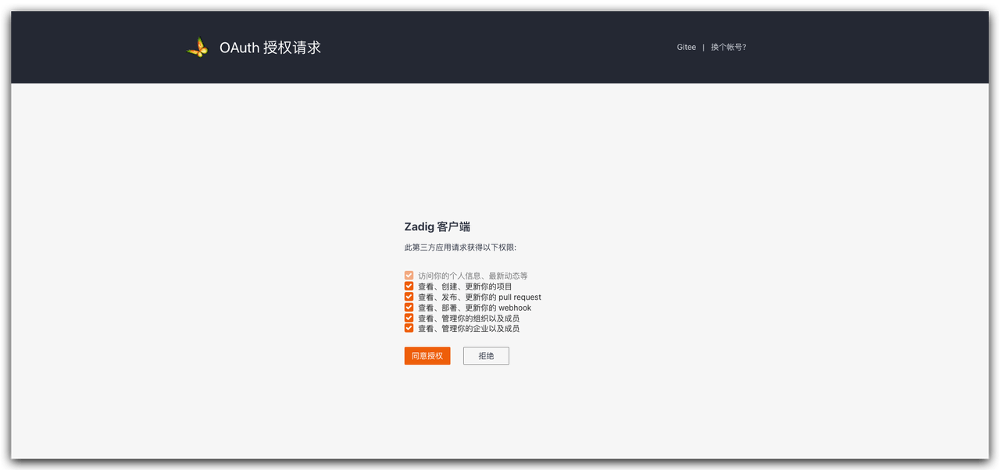

This article primarily introduces how to integrate Gitee private deployment code sources in Zadig.

Currently, the system uses OAuth2 for authentication with Gitee private deployment. If you need to integrate Gitee, you can follow the configuration process below:

- Gitee Administrator Creates a New Third-Party Application
- Configure the third-party application, filling in the basic information and callback URL
- Obtain the `Client ID` and `Client Secret` information from the third-party application
- Configure Gitee Integration, entering the obtained `Client ID` and `Client Secret` information into the Zadig system
- Redirect to Gitee for authentication and authorization

### Step 1: Create a New Gitee Third-Party Application

Click on the Gitee account avatar -> Settings -> Security Settings -> Third-Party Applications -> Create Application to create a new application.

### Step 2: Configure the Gitee Third-Party Application

After filling in the following content, click Create:

- `App Name`: Zadig, or any recognizable name.
- `App Homepage`: http://[koderover.yours.com]
- `App Callback URL` : `http://[koderover.yours.com]/api/directory/codehosts/callback`
- `Upload LOGO`: Upload an image that meets the format and size requirements
- `Permissions`: Check `projects`, `pull_requests`, `hook`, `groups`, `enterprises`

:::tip Note
Please enter the complete HTTP address (e.g., `http://koderover.yours.com`) for the application homepage and callback URL
Replace `koderover.yours.com` in the application homepage and callback URL with the actual address of the Zadig system deployment
:::

### Step 3: Obtain Client ID and Client Secret Information

After the application is successfully created, you can obtain the `Client ID` and `Client Secret` information for the application.

### Step 4: Enter the Configuration into the Zadig System

Switch to the Zadig system, and the administrator should sequentially click `System Settings` -> `Integration` -> `Code Source` -> then click the Add button.

Enter the following known information:

- `Provider`: Select `Gitee (Enterprise Edition)`
- `Alias`: Customize to make it easily identifiable in the Zadig system. This information must be unique within the entire system
- `Client ID`: The Client ID returned after the application was successfully created in Step 3
- `Client Secret`: The Client Secret generated in Step 3

After confirming the information is correct, click `Go to Authorization` and wait patiently. The system will then redirect to Gitee for authorization.

After clicking `Agree Authorization`, the system will redirect back to Zadig, completing the Gitee private deployment integration.