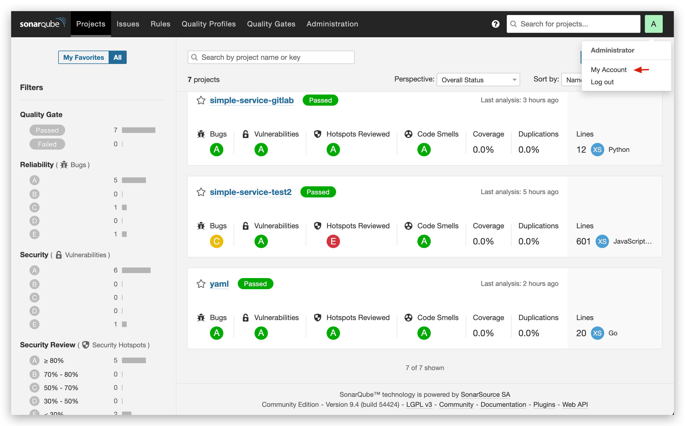

This article introduces SonarQube code quality management platform integration in the Zadig system.

## Generate API Token in SonarQube System

Log in to SonarQube -> Click on the account avatar in the upper right corner -> `My Account`.

Switch to the `Security` page, fill in the Token name in `Generate Token`, and click the `Generate` button on the right.

## Integrate SonarQube in Zadig

In Zadig, sequentially access `System Settings` -> `Integrations` -> `Code Scanner`, and add the relevant information of SonarQube as shown below.

Parameter description:

- `Address`: The SonarQube system address, for example, `https://sonar.koderover.com`
- `Identifier`: Customized to facilitate quick identification in the Zadig system; the system identifier must be unique
- `Token`: The API Token created in the previous step