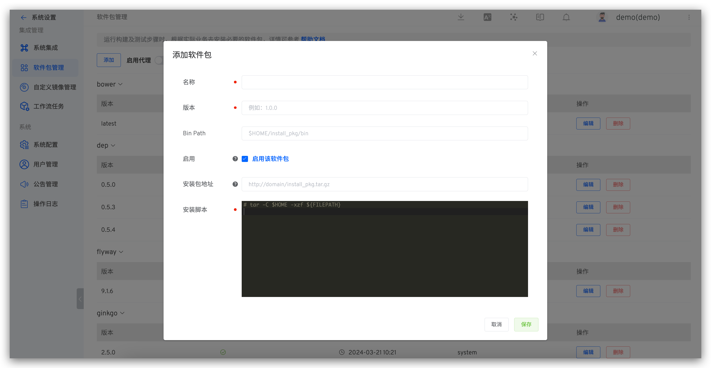

This article explains how to configure and use packages in the Zadig system. When running builds, tests, code scans, and general tasks in Zadig, users typically need to install necessary software package environments based on their specific business requirements. For example, compiling backend-related code requires Go environment, Java environment, etc., while front-end code requires NodeJS environment and other environments.

## Create a New Software Package

Click `System Settings` -> `Packages` -> Click `Add`.

Parameter Description:
- `Name`: The package name
- `Version`: The package version
- `Bin Path`: The software package binary installation path. Default is `$HOME/package`
- `Enabled`: Controls whether the package is displayed in the package list. Packages currently in use are not affected. Enabled packages can be displayed in `Project` -> `Build` -> `Add` Build -> `Dependent Software Packages`
- `Package Address`: The system automatically downloads the installation package from the configured address and caches it. The installation package can be obtained through the `${FILEPATH}` variable
- `Installation Script`: The software package installation `shell` script

## Using Software Packages

Supports configuring dependent software packages for builds, tests, code scans, and general tasks. Reference the following documentation:

- [Build Configuration](/en/Zadig%20v3.4/project/build/)
- [Test Configuration](/en/Zadig%20v3.4/project/test/#test-configuration)
- [Code Scan Configuration](/en/Zadig%20v3.4/project/scan/)
- [General Task Configuration](/en/Zadig%20v3.4/project/workflow-jobs/#general-tasks)

## Built-in Software Packages

To facilitate quick configuration, the system includes the following commonly used software packages. Visit `System Settings` -> `Package Management` to view specific configurations.

- `bower`
- `dep`
- `ginkgo`
- `glide`
- `go`
- `jMeter`
- `java`
- `maven`
- `node`
- `phantomjs`
- `php`
- `python`
- `yarn`