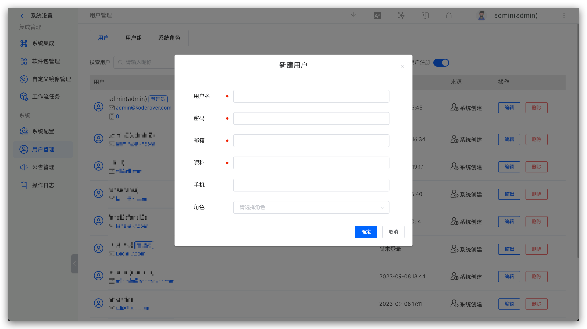
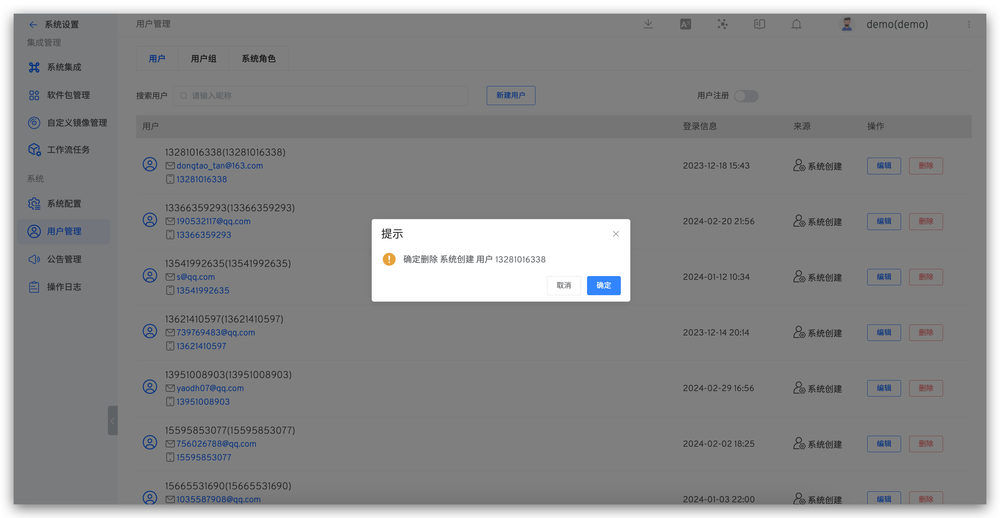
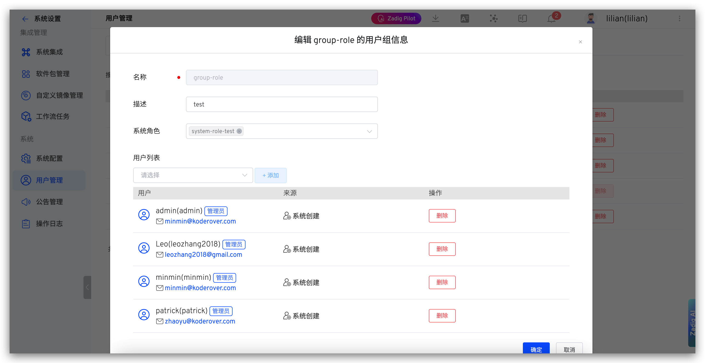
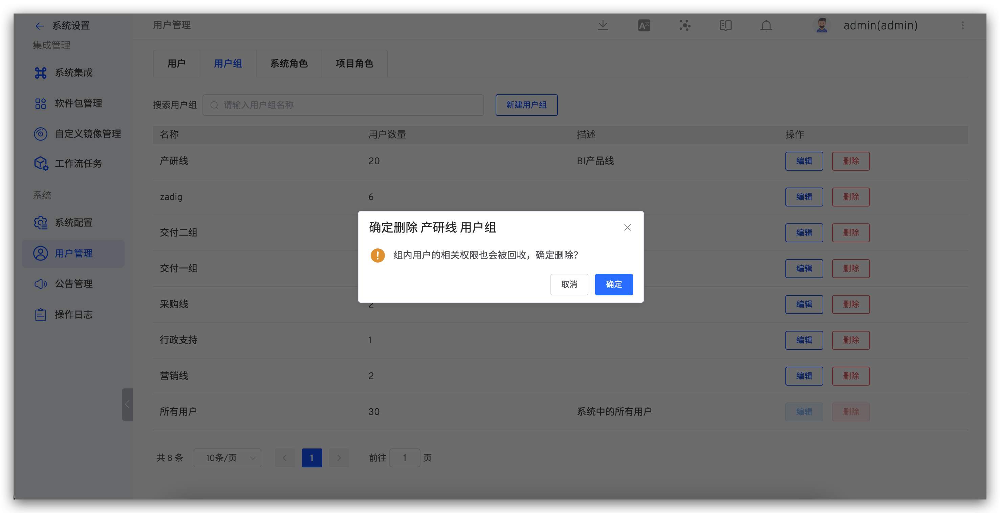
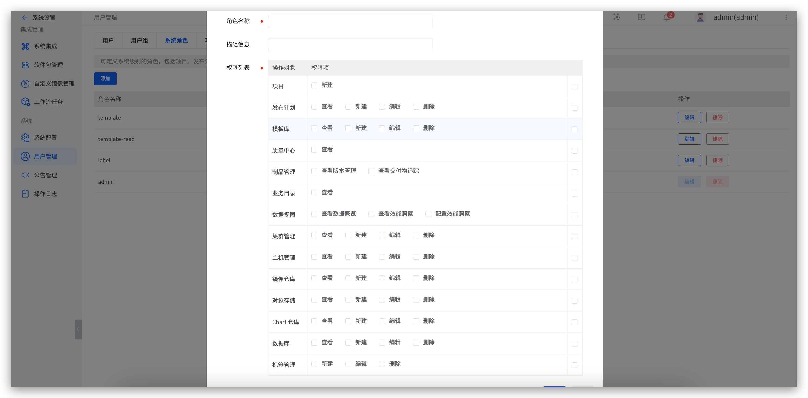
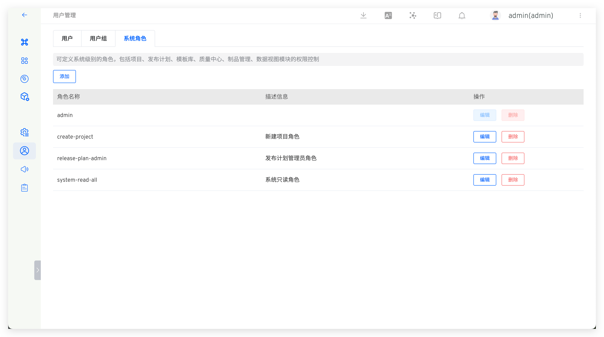
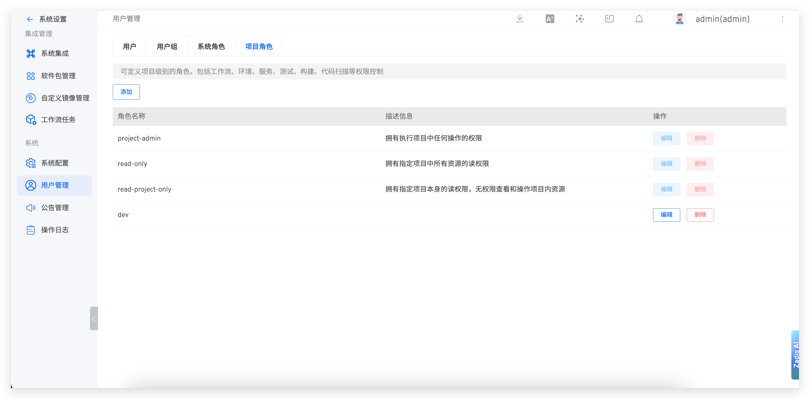

This article introduces the basic functions of Zadig user management, including: user management, user group management, and system role management.

## Users

### Create a New User

The system administrator goes to system settings → User Management → User → Create New User, and fills in the user information.

Explanation:
- The username and user source uniquely identify a user
- Role information comes from [system roles](#system-roles). If no role is given when creating a user, then the user is an ordinary user of the system and only has permission to view public projects.

### Delete a User

Explanation:

- Deleting a user will also delete their permissions. When creating an account with the same name again, the user will not have the original permissions by default
- When deleting users from sources such as OpenLDAP/OAuth/GitHub/custom account systems, only the account data in the Zadig system will be deleted, and the data in the original account system will not be deleted

## User Group Management

### Create a New User Group

The system administrator goes to system settings → User Management → User Group, and configures the user group information.

### Delete a User Group

Select the user group to delete. Note that the built-in `All Users` group, which includes all users in the Zadig system, cannot be deleted.

::: tip
After deleting a user group, the relevant permissions of the users in the group will also be revoked. Please confirm the operation is correct before proceeding.
:::

## System Roles

Define system-level roles, including permission control for project resources, release plans, template libraries, quality centers, artifact management, and data views.

### Create a New Role

The system administrator goes to system settings → User Management → System Roles → Create New System Role, fills in the role information, and configures the permissions.

### Role List

View all roles in the system. Click `Edit` to view the permissions included in the role. The `admin` role is a built-in system administrator role.

## Project Roles

Define global project roles that can be used within projects.

Built-in Global Project Roles:
- `project-admin`: Has permission to perform any operation in the specified project
- `read-only`: Has read permissions for all resources in the specified project
- `read-project-only`: Has read permissions for the specified project itself but no permissions to view or operate resources within the project