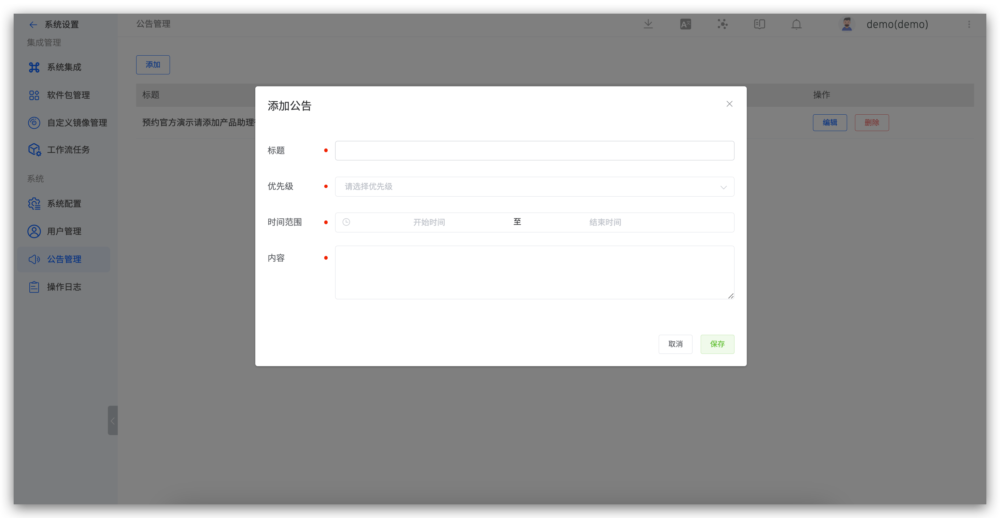
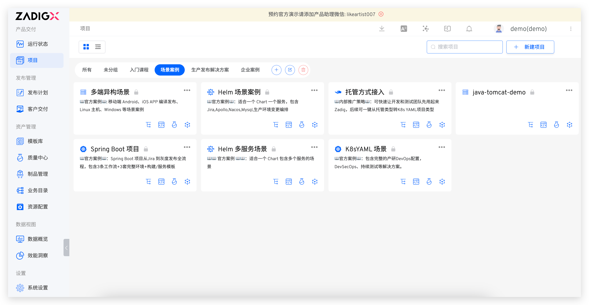

This article introduces the announcement configuration in Zadig. Zadig supports administrators in publishing global announcements, which, once set, can be received by all logged-in users. Administrators can also control the timing of announcements by configuring flexible publishing strategies.

## Issuing an Announcement

Administrators can go to `System Settings` → `Announcement` → `Add` to create a new announcement

Parameter Description:
- `Title`: Title of the announcement
- `Priority`: Priority levels: high, medium, low
- `Time Range`: The time range for the announcement display, accurate to the second
- `Content`: Specific content of the announcement

Click Save, and the announcement will appear as follows:

