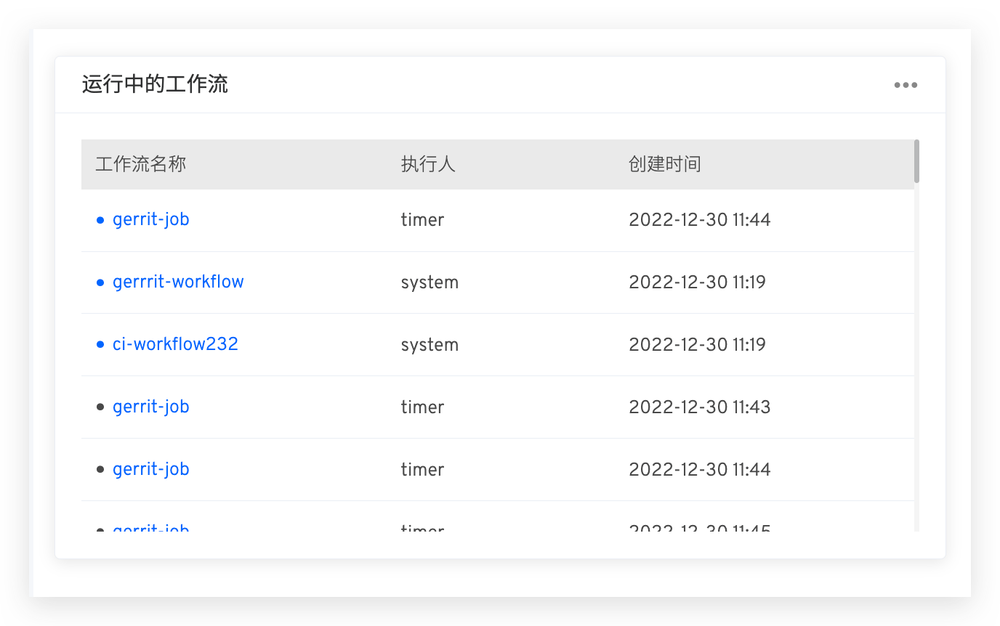
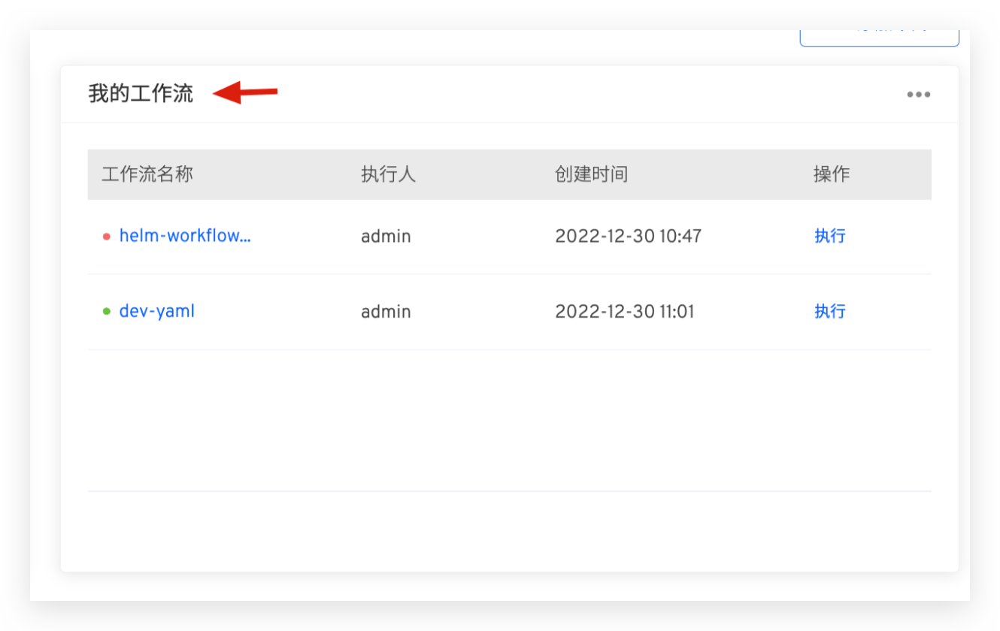
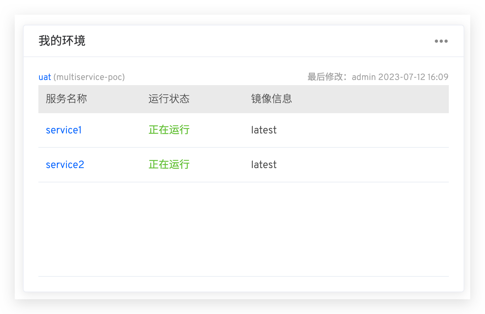

The Zadig Workbench provides views of running workflows, my workflows, and my environments. Developers can customize their personal workbench to monitor the status of workflows and environments they are interested in.

## Add a Card

1. Go to the "Workbench" page
2. Click "Add Card."
3. Select the card you want to add

Below is a brief introduction to the types of cards supported by Zadig.

### Running Workflows

Displays a list of workflows currently running in the system.

### My Workflows

By configuring, you can view information about the workflows you are interested in. Click the upper right corner of the "My Workflows" card -> Click the "Edit" button to select the workflows you are following.

After completing the configuration, the card displays the names, statuses, recent task executors, and recent task creation times of the workflows you are interested in.

### My Environments

By configuring, you can view information about the environments and services you are interested in. Click the upper right corner of the "My Environments" card -> Click the "Edit" button to select the environments and services you are following.

After completing the configuration, the card displays the environments you are interested in, the latest update information for those environments, the status of the services, and the corresponding image information.

