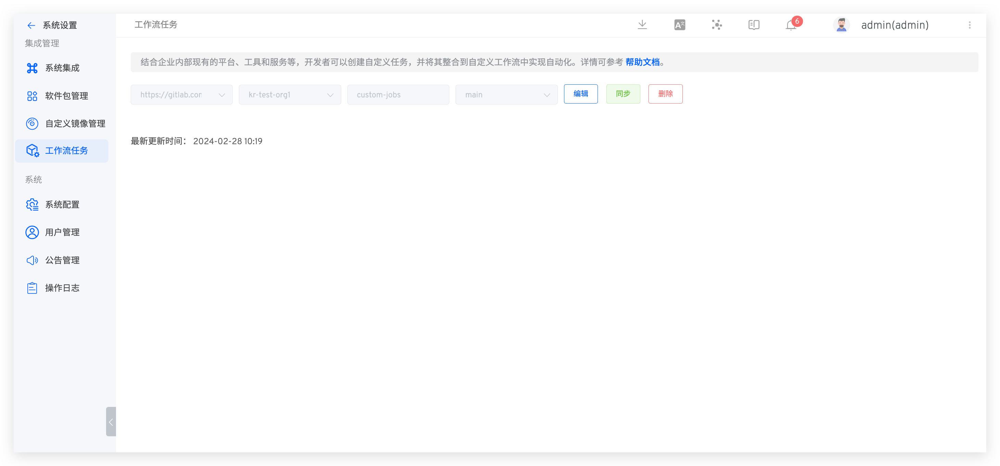
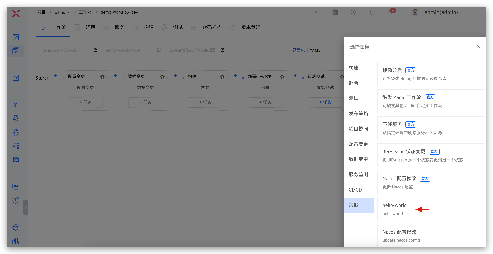
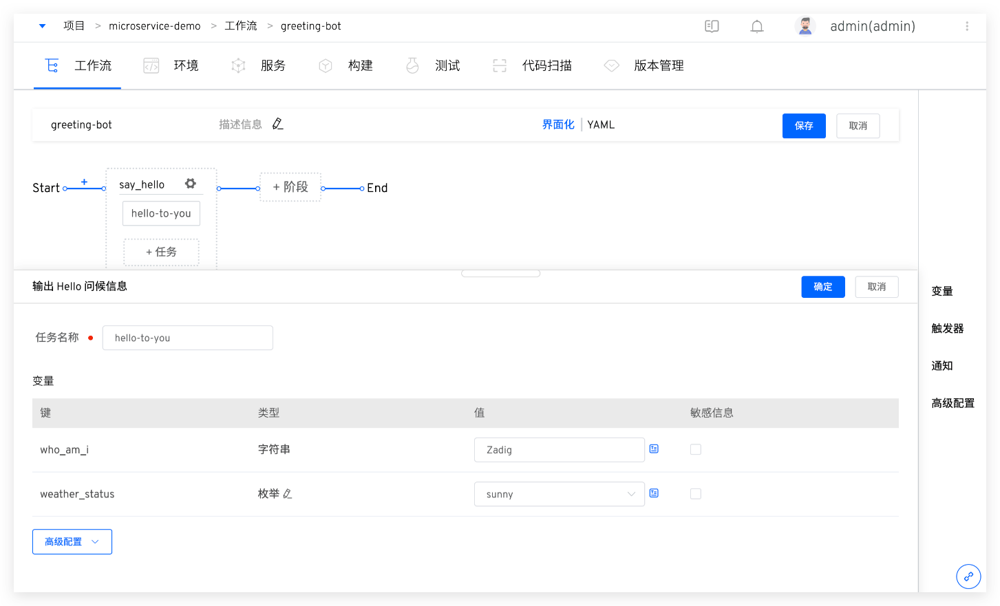
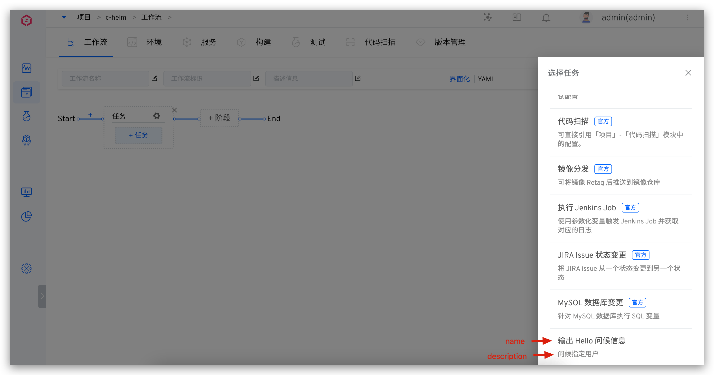
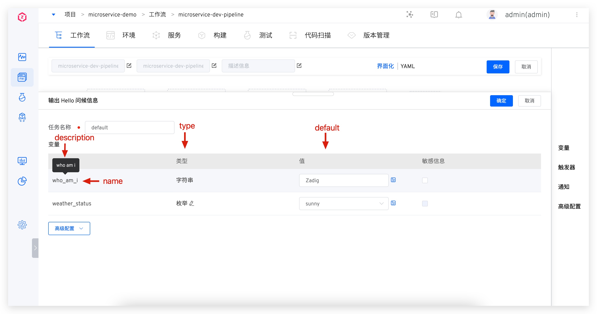

This article describes how to use custom tasks in Zadig system to achieve openness of workflows. The following content includes: How to implement custom tasks and how to use custom tasks.

## Implement Custom Tasks

Encoding implements custom workflow tasks and puts the code and configuration into the library. The following is a description of the print `Hello Zadig` tasks as an example.

> Please refer to the documentation for supported code sources: [code source information](/0) .

**Step 1** : Encoding and implementing the logic of custom tasks and saving them. The source code of this example main.go The content is as follows:
``` go
package main

import (
    "fmt"
    "github.com/spf13/viper"
)

const (
	WhoAmI        = "WHO_AM_I"
	WeatherStatus = "WEATHER_STATUS"
)

func main() {
    viper.AutomaticEnv()

    who_am_i := viper.GetString(WhoAmI)
    weather_status := viper.GetString(WeatherStatus)
    fmt.Printf("Hello %s, today is %s", who_am_i, weather_status)
}
```
**Step 2** : Compile the source code, build a mirror and go to the mirror repository push The relevant commands and Dockerfile references are as follows:
> Compile source code commands
``` bash
CGO_ENABLED=0 GOOS=linux GOARCH=amd64 go build -v -o greeting-bot main.go
```
> Dockerfile content:
``` dockerfile
FROM alpine/git:v2.30.2

# https://wiki.alpinelinux.org/wiki/Setting_the_timezone
RUN sed -i 's/dl-cdn.alpinelinux.org/mirrors.aliyun.com/g' /etc/apk/repositories && apk add tzdata && \
    cp /usr/share/zoneinfo/Asia/Shanghai /etc/localtime && \
    echo Asia/Shanghai  > /etc/timezone && apk del tzdata

WORKDIR /app
ADD greeting-bot .
ENTRYPOINT ["/app/greeting-bot"]
```
> Mirror construction and push command:
```
docker build -f Dockerfile --tag koderover.tencentcloudcr.com/koderover-public/greeting-bot:amd64
docker push koderover.tencentcloudcr.com/koderover-public/greeting-bot:amd64
```
**Step 3** : Write a task configuration file in the YAML format and submit the YAML file to the code base. The YAML configuration file `greeting-bot.yaml` of this example is as follows:
``` yaml
name: "输出 Hello 问候信息"           # 任务名称
category: "build"                   # 任务类型
version: "v0.0.1"                   # 任务版本
description: "问候指定用户"           # 任务描述
image: koderover.tencentcloudcr.com/koderover-public/greeting-bot:amd64 # 上一步中构建出来的镜像

inputs:                             # 配置在 Zadig 中可填写的变量
  - name: who_am_i                  # 变量名称
    description: "who am i"         # 变量描述
    type: string                    # 变量类型，支持 string（单行文本）、text（多行文本）以及 choice（单选）三种类型
    default: "Zadig"                # 变量的默认值
  - name: weather_status
    description: "what's the weather like today"
    type: choice                    # choice 类型的变量
    choice_option:                  # choice 类型变量的可选值
    - "sunny"
    - "cloudy"
    - "rainy"
    default: "sunny"               # choice 类型变量的默认值

envs:                               # 环境变量，启动上述镜像容器时会自动注入为环境变量，除了 envs，还支持使用 cmds 和 args
  - name: WHO_AM_I                  # 环境变量名称
    value: $(inputs.who_am_i)       # 环境变量的值，使用 $(inputs.who_am_i) 形式表示使用 Zadig 中的输入
  - name: WEATHER_STATUS
    value: $(inputs.weather_status)

```

> The directory structure organization in the code base meets the following forms:
``` bash
path/to/your/repo                # 代码库根目录
├── greeting-bot                 # 任务目录，当有多个任务时，分别组织在单独的目录中
│   └── v0.0.1                   # 版本号
│       └── greeting-bot.yaml    # 任务的 YAML 文件，文件名称和任务目录名称保持一致
```
At this point, a complete custom workflow task has been developed, and let’s look at how to use the task.

## Using Custom Tasks
Before using tasks, you need to integrate the code source and mirror repository in the system and configure the source of workflow tasks:
1. Refer to [the code source integration](/0) to integrate the above code library in Zadig
2. Refer to [the mirror warehouse integration](/0) , the mirror warehouse corresponding to the mirror is integrated in Zadig
3. The system administrator accesses `系统设置` -> `集成管理` -> `工作流任务` , configures the code repository, branch and other information and saves it (i.e.: the code repository and branch where the YAML configuration file is located).

> If the integration source is successful and the task implementation in the code base is changed, just click `同步` .



After the configuration is complete, add tasks to the workflow, select tasks and save the workflow. For more advanced functions, please refer to [the workflow](/0) .





## Task Configuration YAML Syntax
### Basic Information

For example:
```yaml
name: "输出 Hello 问候信息"
category: "build"
version: "v0.0.1"
description: "问候指定用户"
image: koderover.tencentcloudcr.com/koderover-public/greeting-bot:amd64
```

Parameter Description:
- `name` : Task name, as shown in the figure below.
- `category` : Task type, including build (Build), deploy (Deployment), test (Test), project-manager (Project Management), config-change (Configuration Change), data-change (Data Change), release (Publish Policy). Other fields can be entered in double quotes: `"这是一个自定义的字段"`
- `version` : The version number of the task
- `description` : Task description information, as shown in the figure below
- `image` : The mirror address of the task



### inputs

inputs is used to define the value of the variable that can be passed into the container when configuring the workflow.

For example:
```yaml
inputs:
  - name: who_am_i
    description: "who am i"
    type: string
    default: "Zadig"
  - name: weather_status
    description: "what's the weather like today"
    type: choice
    choice_option:
    - "sunny"
    - "cloudy"
    - "rainy"
    default: "sunny"
```

Parameter Description:
- `name` : Variable name
- `description` : Description information
- `type` : three types: variable type: string (single-line text), text (multi-line text) and choice (single-choice)
- `choice_option` : When type is type choice , optional variable value
- `default` : Variable default value

The corresponding relationship between parameters and system fields is shown in the figure below



### envs

The variable information entered when executing a workflow can be passed into the container through envs. When the task container starts, the content configured in envs is automatically injected.

For example:
```yaml
envs:
  - name: WHO_AM_I
    value: $(inputs.who_am_i)
  - name: WEATHER_STATUS
    value: $(inputs.weather_status)
```
Parameter Description:
- `name` : Environment variable name
- `value` : Environment variable value, use $ ( inputs.who_am_i ) form to represent the input in Zadig

### cmds and args

If you need to modify the startup command of the container, you can configure the cmds and args parameters.

Give an example
```yaml
cmds:
- "/bin/sh"
- "-c"
args:
- "echo $(inputs.CONTENT)" # Configuration content supports use $ ( inputs.who_am_i ) Formal parameters
```
## More Demo

The following custom tasks are built-in to be used directly:

- `Jira Issue 状态变更` Zadig Combine the workflow stage to change the Jira Issue status and connect with project management. The source code is located in [jira-updater](/0) .
- `执行 Jenkins Job` : Pass in Jenkins build parameters, trigger the specified Jenkins Job execution, the source code is located in [jenkins-runner](/0) .
- `MySQL 数据库变更` : Execute SQL statement for the MySQL database to realize the linkage change of data and code changes, and the source code is located in [mysql-runner](/0) .

In addition, a workflow task shared code base is also opened: [koderover/zadig-jobs](/0) , which contains several demo implementations and scenario descriptions for developers to use and refer to.