Zadig Toolkit is a Visual Studio Code plug-in for Zadig, a product under KodeRover.
This plug-in allows developers to avoid paying attention to the cumbersome platform switching. They can obtain the core capabilities of Zadig products in the IDE, and can easily view the Kubernetes environment in the Zadig project, debug and upgrade service, restart and live log viewing, etc.
In the daily code development process, the service can be deployed to the Zadig cloud without submitting it to the Git repository after the code is modified, and no need to package the image. This will facilitate developers to perform service self-test, joint debugging and integrated verification.
Currently, the functions supported by Zadig Toolkit are as follows:
- Zadig Environment View
- Microservice restart, service image replacement, service details viewing, Pod real-time log viewing, logging into service instance Pod
- Remotely debug local applications and configure remote development environment

::: warning 版本兼容性
The Zadig Toolkit plugin supports v1.12.0 - v1.16.0 versions.
:::

## Preparation
- System preparation: [Installation Zadig v1.12.0+ Version](/0)
- Project preparation: [How to use it GitHub + Zadig Achieve product-level continuous delivery](/0)

## Install Plug-Ins
- Open Visual Studio Code and enter the app market.
- Search `Zadig Toolkit` in the app market, view details and install.


## Configuration Plug-In
1. Open the installed Zadig Toolkit plugin.
2. Click `设置` to enter the plug-in configuration page.

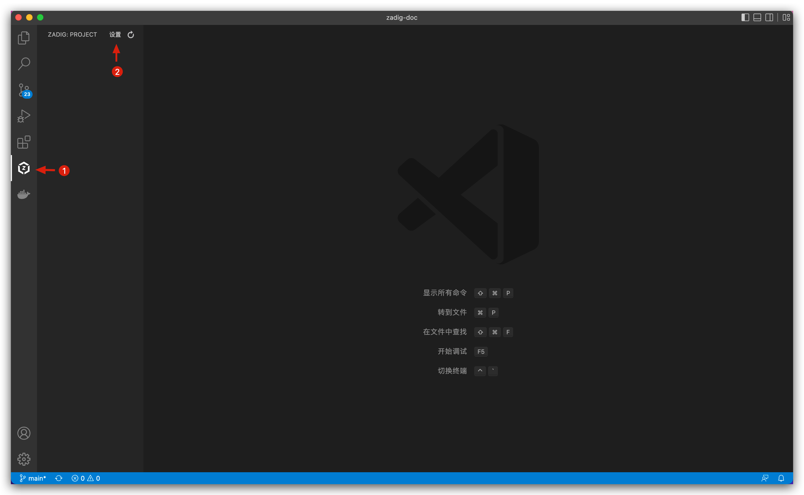


**Configuration parameter description:**
1. Zadig Deployment address: Please fill in the complete URI according to the actual agreement, for example: `http://zadig.com` .
2. Zadig API Token : Enter the Zadig system and click `账号设置` as shown in the figure below.

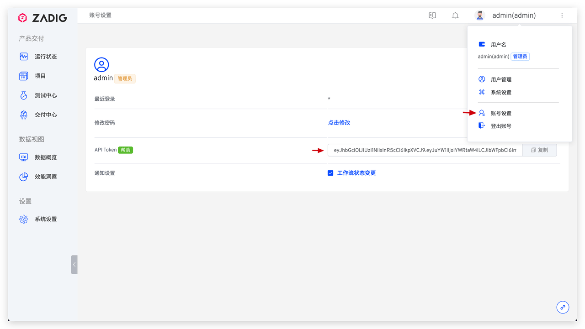

After the configuration is complete, you can see the items in the Zadig system in the left column.


## How to Use
### Remote Debug Local Code

The following is a prepared `voting-demo` project as an example to introduce how to perform remote debugging through Zadig Toolkit

- Select `voting-demo` items -> `dev` environment, click the icon on the right side of the environment to set Kube Config (that is, dev config profile) of the cluster where the environment is located, you can select the configuration file in the file directory or manually enter its path and press Enter.

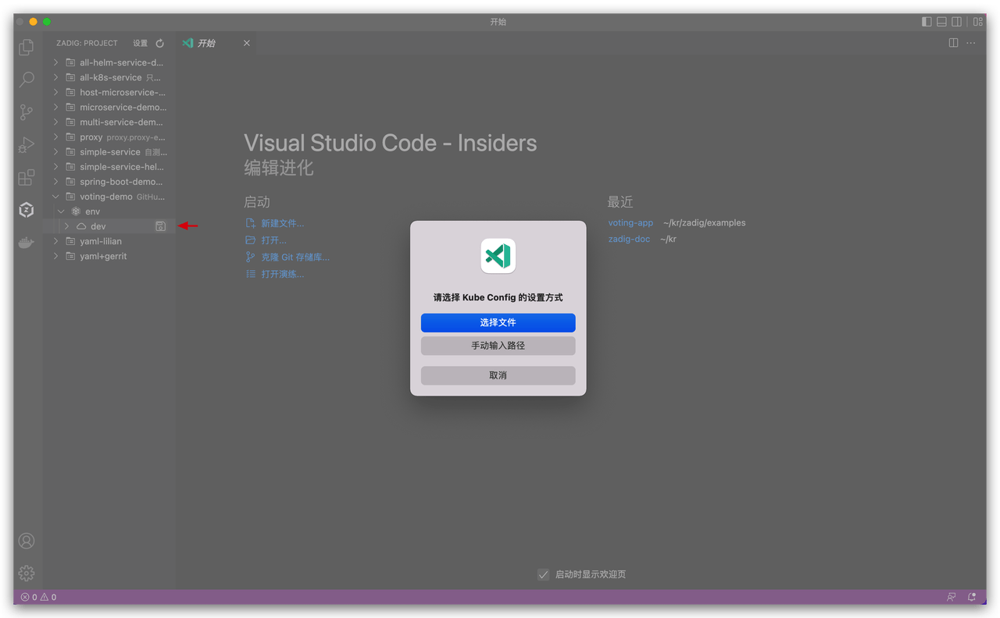

- Select `vote` service and click the debug button to enter development mode.


- Select the local development code directory, in this case [koderover/zadig](/0) -> examples -> voting-app .


- Select the basic image `python:3.10.4-buster` used by the development environment.

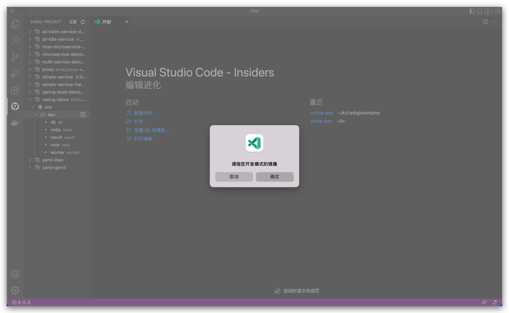


- Wait for a while and after the development mode is started and executed, enter development container `dev` , and the contents in the selected directory will be automatically synchronized to the development container.


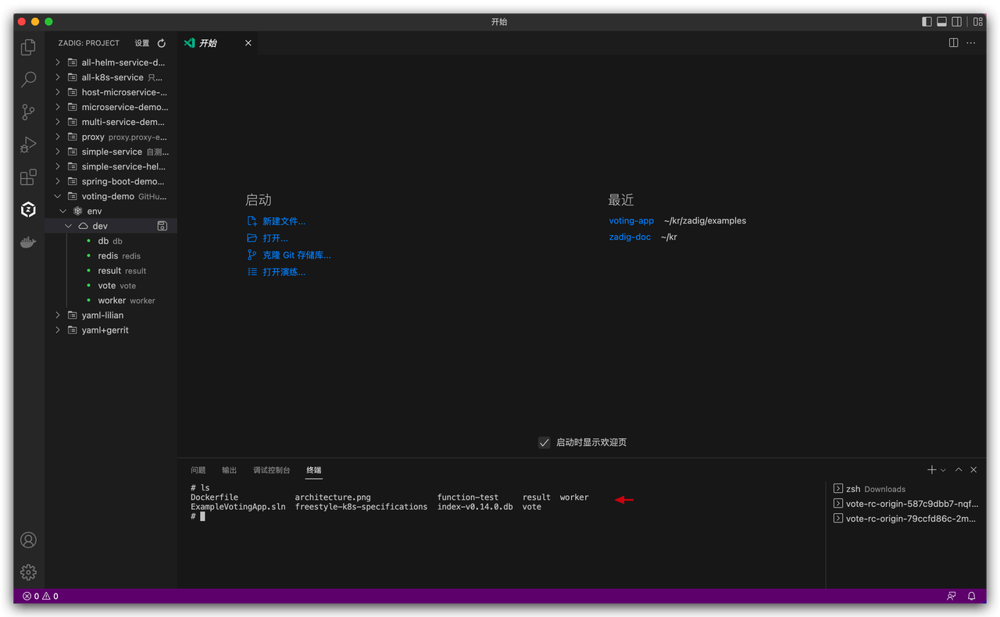

- Modify the local code and save: Modify the background color of the first voting button.


- The modified code will be automatically synchronized to the remote `dev` development environment. Enter `vote` directory in the terminal and execute the startup command.

```bash
pip install -r requirements.txt -i https://mirrors.aliyun.com/pypi/simple/
gunicorn app:app -b 0.0.0.0:80 --log-file - --access-logfile - --workers 4 --keep-alive 0
```

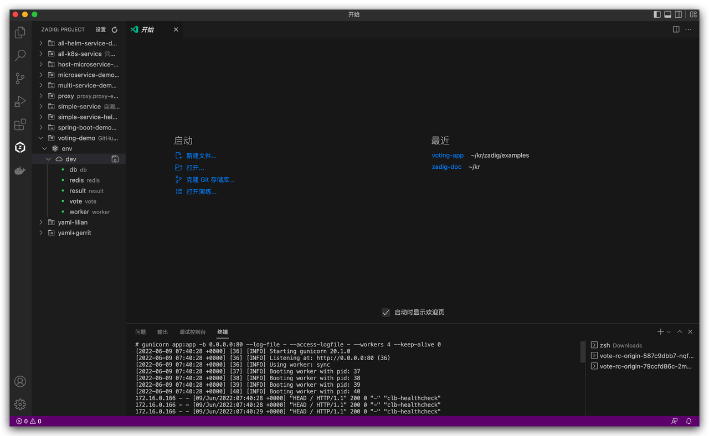

- Visit the vote service address, and the modification results are shown in the figure below.


- Click the red button to confirm that the development mode is ended and the container returns to normal.

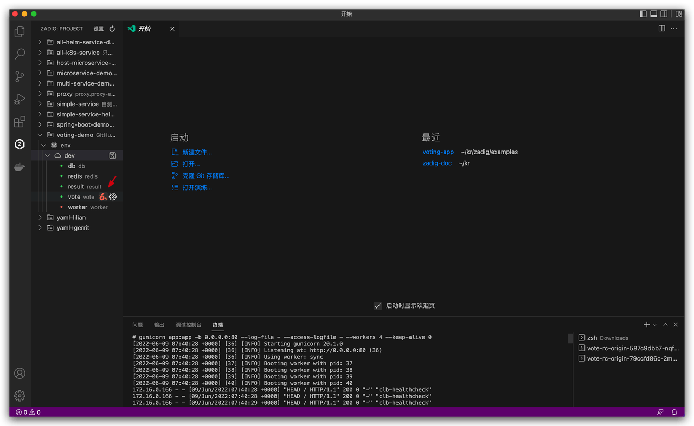
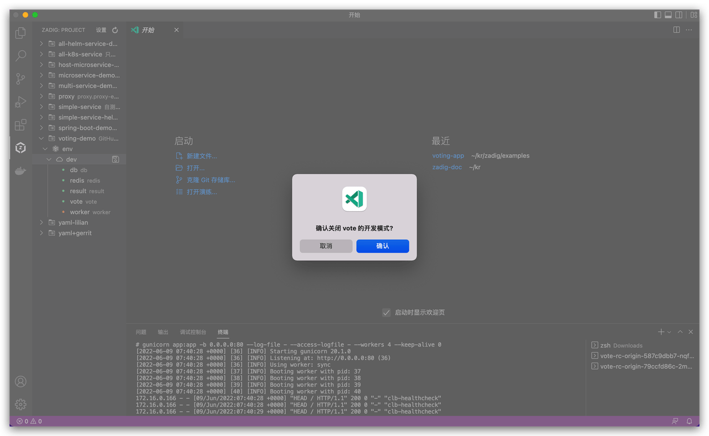

At this point, a complete local debugging process demonstration has been completed.

### View Environment and Services

During the daily joint commissioning test, the service needs to be diagnosed. Through the Zadig Toolkit, you can view the status of the service, restart the service, change the service image, view the service's real-time log, and log in to the corresponding pod of the service.

- Right-click the service to view service details, view the service real-time log in the service details page, and click the modification icon on the right side of the image to modify the service image.

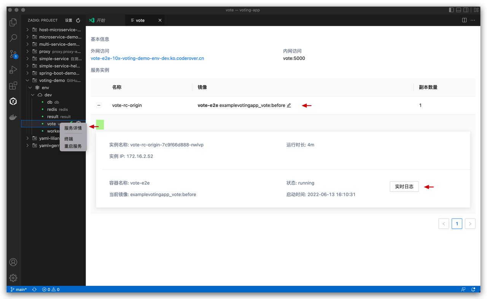

- After right-clicking on the service, click `重启服务` to restart the service.

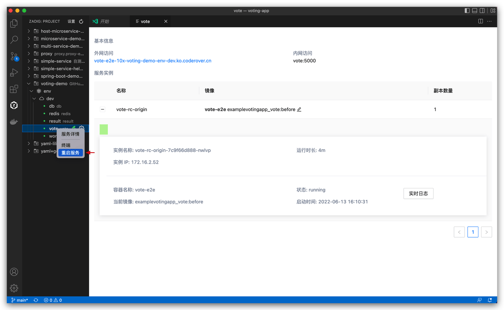

- Right-click on the service and click `终端` to log in to the corresponding service Pod

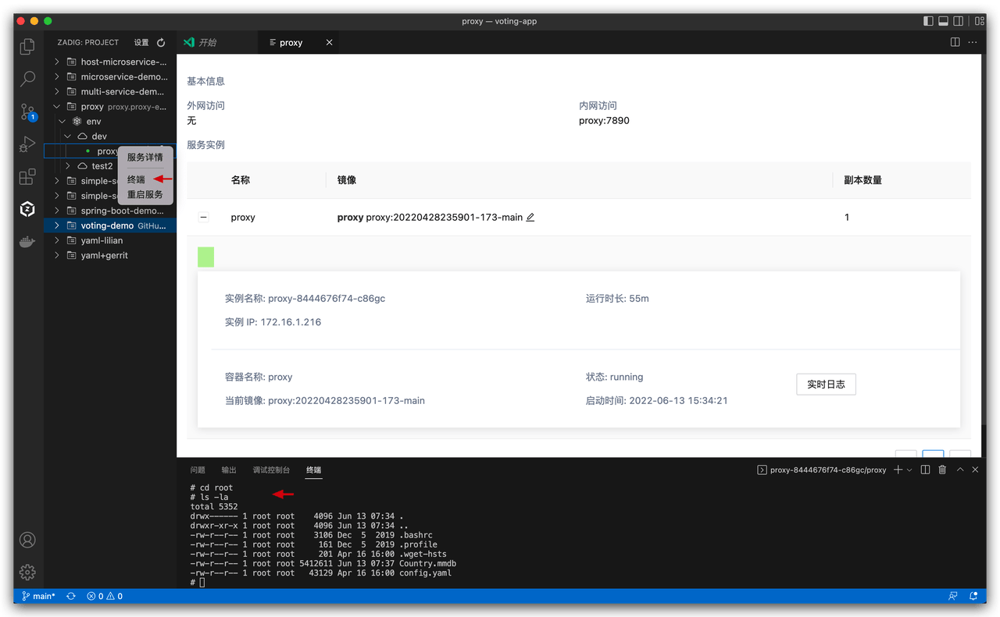

### Configure a Remote Development Environment

- When you need to modify the basic image of the development environment, or modify the synchronized local code directory, you can quickly set it by clicking the `开发模式配置` button.

> Description of each field in the configuration:
``` json
[
  {
    "projectName": 项目名称,
    "envName": 环境名称,
    "serviceName": 服务名称,
    "containerName": 开发环境容器名称,
    "image": 开发环境基础镜像,
    "codeDir": 同步至开发环境容器中的本地目录
  }
]
```

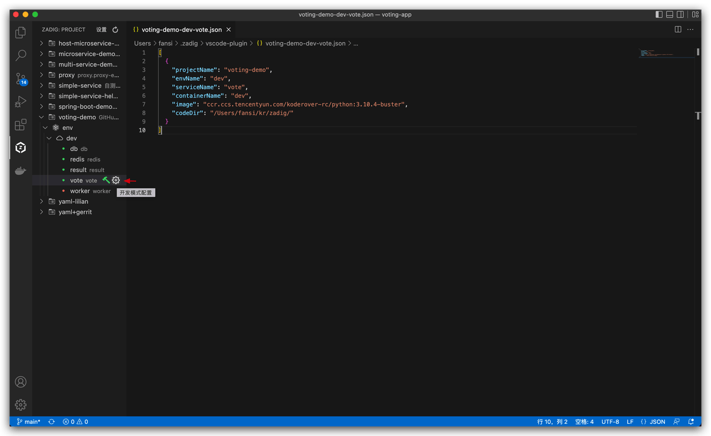

- After saving the custom development mode configuration, click `启动开发模式` and the development mode will be quickly started based on the information in the configuration file.

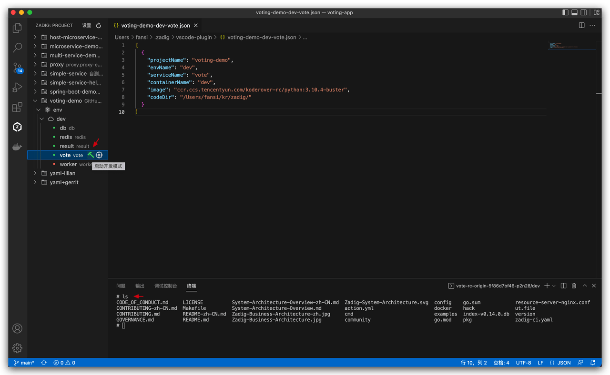