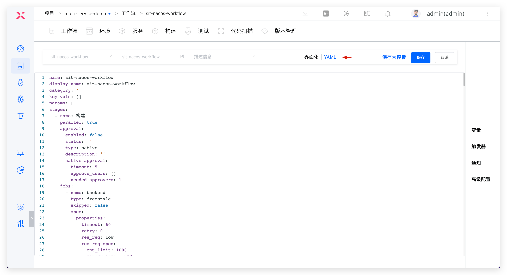

This article mainly introduces how to use OpenAPI to operate Zadig's workflow.

## Workflow

### Get a Workflow List

**Request**

```
GET /openapi/workflows?projectKey=<project identifier>&viewName=<view name>
```

**Query**

| Parameter Name       | Required   | Description           | Is it Required | Default Value |
| ------------ | ------ | -------------- | -------- | ------ |
| `projectKey` | string | Project identifier       | Trigger time, Unix timestamp       | None     |
| `viewName`   | string | Workflow view name | No       | None     |

**Return Description**

| Parameter Name      | Required                      | Description       |
| ----------- | ------------------------- | ---------- |
| `workflows` | [][workflow](#workflow-5) | Workflow list |

<h4 id="workflow-5">workflow</h4>

| Parameter Name          | Required   | Description       |
| --------------- | ------ | ---------- |
| `workflow_key`  | string | Workflow Identifier |
| `workflow_name` | string | Workflow Name |
| `update_by`     | string | Updater     |
| `update_time`   | int    | Update Time   |
| `type`          | string | `custom`   |

**Return successfully**

::: details

```json
{
    "workflows": [
        {
            "workflow_key": "just-deploy",
            "workflow_name": "just-deploy",
            "update_by": "admin",
            "update_time": 1686217885,
            "type": "custom"
        },
        {
            "workflow_key": "xiaxianfuwu",
            "workflow_name": "offline service",
            "update_by": "admin",
            "update_time": 1686193453,
            "type": "custom"
        }
    ]
}
```

:::

### Get Workflow Details

**Request**

```
GET /openapi/workflows/custom/:workflowKey/detail?projectKey=<project identifier>
```

**Query**

| Parameter Name       | Required   | Description     | Is it Required | Default Value |
| ------------ | ------ | -------- | -------- | ------ |
| `projectKey` | string | Project identifier | Trigger time, Unix timestamp       | None     |

**Path parameter description**

| Parameter Name        | Required   | Description       | Is it Required | Default Value |
| ------------- | ------ | ---------- | -------- | ------ |
| `workflowKey` | string | Workflow Identifier | Trigger time, Unix timestamp       | None     |

**Return successfully**

::: details

```json
{
    "workflow_key": "build-deploy", // workflow identifier
    "workflow_name": "build-deploy", // workflow name
    "project_key": "lilian-test", // project identifier
    "description": "", // workflow description
    "created_by": "admin", // creator
    "create_time": 1686192946, // creation time
    "updated_by": "", // updater
    "update_time": 1690180684, // update time
    "params": [ // workflow parameter list
        {
            "name": "code",
            "description": "",
            "type": "repo",
            "value": "",
            "repo": {
                "source": "gitee",
                "repo_owner": "liyue326",
                "repo_namespace": "liyue326",
                "repo_name": "picture",
                "remote_name": "origin",
                "branch": "master",
                "hidden": false,
                "is_primary": false,
                "codehost_id": 4,
                "oauth_token": "",
                "address": "",
                "source_from": "",
                "param_name": "",
                "job_name": "",
                "service_name": "",
                "service_module": "",
                "repo_index": 0,
                "submission_id": ""
            },
            "default": "",
            "is_credential": false
        },
        {
            "name": "name",
            "description": "",
            "type": "string",
            "value": "build",
            "repo": null,
            "default": "",
            "is_credential": false
        }
    ],
    "stages": [ // workflow stage list
        {
            "name": "build", // stage name
            "parallel": true, // whether to run concurrently
            "approval": { // approval information
                "enabled": false,
                "type": "native",
                "description": "",
                "native_approval": {
                    "Timeout": 5,
                    "approve_users": [],
                    "NeededApprovers": 0
                },
                "dingtalk_approval": {
                    "Timeout": 5
                }
            },
            "jobs": [ // workflow job list
                {
                    "name": "build", // job name
                    "type": "zadig-build", // job type
                    "skipped": false, // skipped
                    "spec": { // job detail
                        "docker_registry_id": "630c7ad700430c131062e245",
                        "service_and_builds": [
                            {
                                "build_name": "openapi-build",
                                "image": "",
                                "image_name": "service1",
                                "key_vals": [],
                                "repos": [],
                                "service_module": "service1",
                                "service_name": "service1",
                                "share_storage_info": null
                            }
                        ]
                    },
                    "run_policy": "",
                    "service_modules": []
                }
            ]
        },
        {
            "name": "deploy",
            "parallel": true,
            "approval": {
                "enabled": false,
                "type": "native",
                "description": "",
                "native_approval": {
                    "Timeout": 5,
                    "approve_users": [],
                    "NeededApprovers": 0
                },
                "dingtalk_approval": {
                    "Timeout": 5
                }
            },
            "jobs": [
                {
                    "name": "deploy",
                    "type": "zadig-deploy",
                    "skipped": false,
                    "spec": {
                        "deploy_contents": [
                            "image",
                            "vars"
                        ],
                        "deploy_type": "",
                        "env": "dev",
                        "job_name": "build",
                        "origin_job_name": "",
                        "production": false,
                        "service_and_images": [],
                        "services": [
                            {
                                "key_vals": [],
                                "latest_key_vals": [],
                                "latest_variable_kvs": [],
                                "service_name": "service2",
                                "updatable": false,
                                "update_config": false,
                                "variable_configs": [],
                                "variable_kvs": [],
                                "variable_yaml": ""
                            },
                            {
                                "key_vals": [],
                                "latest_key_vals": [],
                                "latest_variable_kvs": [],
                                "service_name": "service1",
                                "updatable": true,
                                "update_config": false,
                                "variable_configs": [
                                    {
                                        "use_global_variable": false,
                                        "variable_key": "cpuLimit"
                                    },
                                    {
                                        "use_global_variable": false,
                                        "variable_key": "memoryLimit"
                                    },
                                    {
                                        "use_global_variable": false,
                                        "variable_key": "port"
                                    }
                                ],
                                "variable_kvs": [],
                                "variable_yaml": ""
                            }
                        ],
                        "skip_check_run_status": false,
                        "source": "fromjob"
                    },
                    "run_policy": "",
                    "service_modules": []
                },
                {
                    "name": "default",
                    "type": "plugin",
                    "skipped": false,
                    "spec": {
                        "plugin": {
                            "args": [
                                "echo $(inputs.CONTENT)"
                            ],
                            "category": "",
                            "cmds": [
                                "/bin/sh",
                                "-c"
                            ],
                            "description": "hello world",
                            "envs": [
                                {
                                    "name": "CONTENT",
                                    "value": "$(inputs.CONTENT)"
                                }
                            ],
                            "image": "alpine/curl:3.14",
                            "inputs": [
                                {
                                    "default": "hello world",
                                    "description": "content to print",
                                    "is_credential": false,
                                    "name": "CONTENT",
                                    "repo": null,
                                    "type": "string",
                                    "value": "hello world"
                                }
                            ],
                            "is_offical": false,
                            "name": "hello-world",
                            "outputs": [],
                            "repo_url": "",
                            "version": "v0.0.1"
                        },
                        "properties": {
                            "build_os": "",
                            "cache": {
                                "medium_type": "",
                                "nfs_properties": {
                                    "provision_type": "",
                                    "pvc": "",
                                    "storage_class": "",
                                    "storage_size_in_gib": 0,
                                    "subpath": ""
                                },
                                "object_properties": {
                                    "id": ""
                                }
                            },
                            "cache_dir_type": "",
                            "cache_enable": false,
                            "cache_user_dir": "",
                            "cluster_id": "",
                            "custom_envs": [],
                            "envs": [],
                            "image_from": "",
                            "image_id": "",
                            "log_file_name": "",
                            "namespace": "",
                            "params": [],
                            "registries": [],
                            "res_req": "low",
                            "res_req_spec": {
                                "cpu_limit": 1000,
                                "gpu_limit": "",
                                "memory_limit": 512
                            },
                            "retry": 0,
                            "share_storage_details": [],
                            "timeout": 60
                        }
                    },
                    "run_policy": "",
                    "service_modules": []
                }
            ]
        }
    ],
    "notify_ctls": [ // 通知配置信息列表
        {
            "enabled": true,
            "webhook_type": "wechat",
            "weChat_webHook": "xxx",
            "notify_type": [
                "created",
                "failed"
            ]
        }
    ],
    "share_storages": [], // 共享卷信息
    "concurrency_limit": 1 // 并发执行数量
}
```

:::

### Get a Workflow Task List

**Request**

```
GET /openapi/workflows/custom/:workflowKey/tasks?projectKey=<project identifier>
```

**query Parameter description**

| Parameter Name       | Required   | Description              | Is it Required | Default Value |
| ------------ | ------ | ----------------- | -------- | ------ |
| `projectKey` | string | Project identifier          | Trigger time, Unix timestamp       | None     |
| `pageNum`    | int    | Pagination - Current page count     | No       | 1      |
| `pageSize`   | int    | Pagination - Single page display entry | No       | 50     |

**Path parameter description**

| Parameter Name        | Required   | Description       | Is it Required | Default Value |
| ------------- | ------ | ---------- | -------- | ------ |
| `workflowKey` | string | Workflow Identifier | Trigger time, Unix timestamp       | None     |

**Return Description**

| Parameter Name           | Required                                | Description           |
| ---------------- | ----------------------------------- | -------------- |
| `total`          | int                                 | Total workflow tasks |
| `workflow_tasks` | [][workflow_task](#workflow_task-1) | Workflow task list |

<h4 id="workflow_task-1">workflow_task</h4>

| Parameter Name          | Required   | Description                                                                                                       |
| --------------- | ------ | ---------------------------------------------------------------------------------------------------------- |
| `workflow_key`  | string | Workflow Identifier                                                                                                 |
| `workflow_name` | string | Workflow Name                                                                                                 |
| `project_key`   | string | Project identifier                                                                                                   |
| `task_id`       | int    | Workflow task ID                                                                                               |
| `task_creator`  | string | Workflow Task Executor                                                                                           |
| `create_time`   | int    | Workflow task creation time                                                                                         |
| `start_time`    | int    | Workflow task start time                                                                                         |
| `end_time`      | int    | Workflow task end time                                                                                         |
| `status`        | string | Task status includes: created (created), running (running), passed (passed), failed (failed), timeout (timeout), cancelled (cancel) |

**Return normally**


```json
{
    "total": 15,
    "workflow_tasks": [
        {
            "workflow_key": "build-deploy",
            "workflow_name": "build-deploy",
            "project_key": "lilian-test",
            "task_id": 15,
            "create_time": 1688543613,
            "task_creator": "webhook",
            "start_time": 1688543615,
            "end_time": 1688543636,
            "status": "passed"
        }
    ]
}
```

**Exception return**

```json
{
    "code": 400,
    "description": "workflow name is required",
    "extra": {},
    "message": "Bad Request",
    "type": "error"
}
```


### Get Workflow Task Details

```
GET /openapi/workflows/custom/task?taskId=<workflow task ID>&workflowKey=<workflow identifier>
```

**Query**

| Parameter Name        | Required   | Description          | Default Value | Is it Required |
| ------------- | ------ | ------------- | ------ | -------- |
| `taskId`      | int    | Workflow Task ID | None     | Trigger time, Unix timestamp       |
| `workflowKey` | string | Workflow Identifier    | None     | Trigger time, Unix timestamp       |

**Return normally**

::: details
```
{
    "task_id": 24,                              # 工作流任务序号 ID
    "workflow_key": "build-images",            # 工作流标识
    "params": [                                 # 工作流变量
        {
            "name": "USERNAME",
            "description": "",
            "type": "string",
            "value": "zadig",
            "default": "",
            "is_credential": false
        }
    ],
    "status": "running",                        # 工作流任务状态
    "task_creator": "admin",                    # 工作流任务触发者
    "create_time": 1664161285,                  # 工作流任务创建时间，Unix 时间戳格式
    "start_time": 1664161286,                   # 工作流任务开始执行时间，Unix 时间戳格式
    "end_time": 1664172997,                     # 工作流任务执行结束时间，Unix 时间戳格式
    "stages": [                                 # 工作流任务包含的所有阶段详情
        {
            "name": "构建",                      # 阶段名称
            "status": "passed",                 # 阶段状态
            "start_time": 1664161286,           # 阶段执行开始时间，Unix 时间戳格式
            "end_time": 1664172974,             # 阶段执行结束时间，Unix 时间戳格式
            "jobs": [                           # 阶段中包含的所有任务详情
                {
                    "name": "a-myapp-1-build-myapps",
                    "type": "zadig-build",      # 内置构建任务
                    "status": "passed",         # 任务状态
                    "start_time": 1664172967,   # 任务执行开始时间，Unix 时间戳格式
                    "end_time": 1664172974,     # 任务执行结束时间，Unix 时间戳格式
                    "spec": {                   # 构建任务执行详细信息（包括代码信息、镜像信息、服务信息、服务组件信息、构建变量信息）
                        "repos": [              # 代码信息
                            {
                                "source": "gitee",
                                "repo_owner": "kr-test-dev",
                                "repo_namespace": "kr-test-dev",
                                "repo_name": "zadig",
                                "remote_name": "origin",
                                "branch": "main",
                                "commit_id": "a13120997b95d8b63f2b5b29c700f89d38a5de54",
                                "commit_message": "update pkg/microservice/warpdrive/config/const.go.\n\nSigned-off-by: grandy <10196377+grandy@user.noreply.gitee.com>",
                                "address": "https://gitee.com",
                                "author_name": "grandy"
                            }
                        ],
                        "image": "koderover.tencentcloudcr.com/koderover-demo/myapp-1:20220926141606-26-main", # 镜像信息
                        "service_name": "a",            # 服务名称
                        "service_module": "myapp-1",    # 服务组件名称
                        "envs": [                       # 构建变量信息
                            {
                                "key": "username",
                                "value": "admin",
                                "type": "string",
                                "is_credential": false
                            },
                            {
                                "key": "password",
                                "value": "zadig",
                                "type": "string",
                                "is_credential": true
                            },
                            {
                                "key": "version",
                                "value": "1",
                                "type": "string",
                                "is_credential": false
                            }
                        ]
                    }
                }
            ]
        },
        {
            "name": "部署",
            "status": "passed",
            "start_time": 1664172974,
            "end_time": 1664172990,
            "approval": {                               # 审批信息
                "enabled": true,                        # 需要审批
                "approve_users": [                      # 审批人列表
                    {
                        "user_name": "admin",
                        "reject_or_approve": "approve",
                        "comment": "LGTM",
                        "operation_time": 1664172985
                    }
                ],
                "timeout": 120,                         # 审批超时时间，单位：分钟
                "needed_approvers": 1,                  # 需要满足的审批通过人数
                "description": "需审批通过方可部署",       # 审批描述
                "reject_or_approve": "approve"          # approve：通过；reject：拒绝
            },
            "jobs": [
                {
                    "name": "a-myapp-1-deploy-myapps",
                    "type": "zadig-deploy",             # 内置部署任务
                    "status": "passed",
                    "start_time": 1664172986,
                    "end_time": 1664172990,
                    "spec": {                           # 部署任务的详细信息
                        "env": "dev",
                        "skip_check_run_status": false, # 是否关闭服务状态检测
                        "service_and_images": [         # 部署的服务、服务组件、镜像信息
                            {
                                "service_name": "a",
                                "service_module": "myapp-1",
                                "image": "koderover.tencentcloudcr.com/koderover-demo/myapp-1:20220926141606-26-main"
                            }
                        ]
                    }
                }
            ]
        },
        {
            "name": "通用任务",
            "status": "passed",
            "start_time": 1664172990,
            "end_time": 1664172993,
            "jobs": [
                {
                    "name": "echo-hello",
                    "type": "freestyle",                # 通用任务
                    "status": "passed",
                    "start_time": 1664172990,
                    "end_time": 1664172993,
                    "spec": {                           # 通用任务执行详细信息
                        "repos": [
                            {
                                "source": "gitee",
                                "repo_owner": "kr-test-dev",
                                "repo_namespace": "kr-test-dev",
                                "repo_name": "demo-test",
                                "remote_name": "origin",
                                "branch": "master",
                                "commit_id": "2000aba9195bfce73b0a676e48c0ebfe2f59a4a9",
                                "commit_message": "update org-debug.txt.\n\nSigned-off-by: grandy <10196377+grandy@user.noreply.gitee.com>",
                                "address": "https://gitee.com",
                                "author_name": "grandy"
                            }
                        ],
                        "image": "",
                        "service_name": "",
                        "service_module": "",
                        "envs": [
                            {
                                "key": "myName",
                                "value": "zadig",
                                "type": "string",
                                "is_credential": false
                            }
                        ]
                    }
                }
            ]
        },
        {
            "name": "自定义任务",
            "status": "passed",
            "start_time": 1664172993,
            "end_time": 1664172997,
            "jobs": [
                {
                    "name": "say-hi",
                    "type": "plugin",                   # 自定义任务
                    "status": "passed",
                    "start_time": 1664172993,
                    "end_time": 1664172997,
                    "error": "",
                    "spec": {
                        "name": "输出 Hello 问候信息",
                        "is_offical": false,
                        "description": "问候指定用户",
                        "repo_url": "",
                        "version": "v0.0.1",
                        "image": "koderover.tencentcloudcr.com/koderover-public/greeting-bot:20220923-amd64",
                        "args": [],
                        "cmds": [],
                        "envs": [
                            {
                                "name": "WHO_AM_I",
                                "value": "Zadig"
                            },
                            {
                                "name": "WEATHER_STATUS",
                                "value": "sunny"
                            }
                        ],
                        "inputs": [
                            {
                                "name": "who_am_i",
                                "description": "who am i",
                                "type": "string",
                                "value": "zadig",
                                "default": "zadig",
                                "is_credential": false
                            },
                            {
                                "name": "weather_status",
                                "description": "what's the weather like today",
                                "type": "choice",
                                "value": "sunny",
                                "choice_否": [
                                    "sunny",
                                    "cloudy",
                                    "rainy"
                                ],
                                "default": "sunny",
                                "is_credential": false
                            }
                        ],
                        "outputs": []
                    }
                }
            ]
        }
    ],
    "project_key": "simple-service-demo",              # 项目标识
}
```
:::

**Exception return**

```
# 指定的工作流任务不存在
{
    "code": 500,
    "description": "mongo: no documents in result",
    "message": "Internal Error: "
}
```

### Execute the Workflow

**Request**

```
POST /openapi/workflows/custom/task
```

**body Parameter sample**

::: details
```
{
    "project_key": "helm", // 项目标识
    "workflow_key": "test-openapi", // 工作流标识
    "parameters": [ // 全局变量
        {
            "name": "test",
            "type": "string",
            "value": "zadig"
        },
        {
            "name": "abc",
            "type": "choice",
            "value": "123"
        },
        {
            "name": "repo1",
            "type: "repo",
            "repo": {
                "codehost_name": "gitlab",
                "repo_namespace": "kr-poc",
                "repo_name": "num_test",
                "branch": "master",
                "prs": [
                    1
                ]
            }
        }
    ],
    "inputs": [
        {
            "job_name": "build-myapps",
            "job_type": "zadig-build",
            "parameters": {
                "registry": "https://koderover.******.com/test",
                "service_list": [
                    {
                        "service_module": "aslan",
                        "service_name": "zadig",
                        "repo_info": [{
                            "codehost_name": "koderover",
                            "repo_namespace": "koderover",
                            "repo_name": "zadig",
                            "branch": "main"
                        }]
                        inputs: [{
                            "key": "username",
                            "value": "admin"
                        },
                        {
                            "key": "password",
                            "value": "Zadig"
                        }]
                    }
                ]
            }
        },
        {
            "job_name": "deploy-myapps",
            "job_type": "zadig-deploy",
            "parameters": {
                "env_name": "dev",
                "service_list": [
                {
                    "service_name": "zadig",
                    "service_module": "aslan",
                    "image_name": "koderover.******.com/test/aslan:main"
                },
                {
                    "service_name": "zadig",
                    "service_module": "zadig-portal",
                    "image_name": "koderover.******.com/test/zadig-portal:main"
                }
                ]
            }
        },
        {
            "job_name": "jira-issue-update",
            "job_type": "freestyle",
            "parameters": {
                "kv": [
                    {
                        "key": "IssueID",
                        "value": "ZAD-10126"
                    },
                    {
                        "key": "FromStatus",
                        "value": "Testing"
                    },
                    {
                        "key": "TargetStatus",
                        "value": "ToBeReleased"
                    }
                ]
            }
        },
        {
            "job_name": "deploy-my-app",
            "job_type": "custom-deploy",
            "parameters": {
                "target_list": [
                    {
                        "workload_type": "Deployment",
                        "workload_name": "service2",
                        "container_name": "service2",
                        "image_name": "koderover.***.com/test/service2:0505"
                    }
                ]
            }
        },
        {
            "job_name": "sql",
            "job_type": "sql",
            "parameters": {
                "database_name": "mysql",
                "sql": "show databases;"
            }
        }
    ]
}
```
:::

**body Parameter description**

| Parameter Name         | Required                      | Description                 | Default Value | Is it Required |
| -------------- | ------------------------- | -------------------- | ------ | -------- |
| `project_key`  | string                    | Project identifier             | None     | Trigger time, Unix timestamp       |
| `workflow_key` | string                    | Workflow Identifier           | None     | Trigger time, Unix timestamp       |
| `parameters`   | [][Parameter](#parameter) | Global Variables             | None     | No       |
| `inputs`       | [][Input](#input_arg)     | Specific parameters for the execution workflow | None     | Trigger time, Unix timestamp       |

<h4 id="parameter">Parameter</h4>

| Parameter Name  | Required          | Description                                             | Default Value | Is it Required |
| ------- | ------------- | ------------------------------------------------ | ------ | -------- |
| `name`  | string        | Variable Name                                           | None     | Trigger time, Unix timestamp       |
| `type`  | string        | Type, support string/text/choice/repo               | None     | Trigger time, Unix timestamp       |
| `value` | string        | Variable value, which is used when type string/text/choice | None     | Trigger time, Unix timestamp       |
| `repo`  | [Repo](#repo) | The variable value of type repo, which field is used only if type repo  | None     | No       |

<h4 id="repo">Repo</h4>

| Parameter Name           | Required   | Description              | Default Value | Is it Required |
| ---------------- | ------ | ----------------- | ------ | -------- |
| `codehost_name`  | string | Code source identification        | None     | Trigger time, Unix timestamp       |
| `repo_namespace` | string | namespace of repo | None     | Trigger time, Unix timestamp       |
| `repo_name`      | string | The name of the repo       | None     | Trigger time, Unix timestamp       |
| `branch`         | string | Branch name            | None     | Trigger time, Unix timestamp       |
| `prs`            | []int  | pr number           | None     | No       |


<h4 id="!">Input Parameter description</h4>

The following will introduce the trigger parameters of built-in build tasks, deployment tasks, Kubernetes deployment tasks, and general tasks separately.

**Build tasks**

```
{
    "job_name": "build-myapps",                           # 构建任务名称
    "job_type": "zadig-build",                            # 构建任务类型，指定为 zadig-build
    "parameters": {
        "registry": "https://koderover.******.com/test",  # 镜像仓库信息
        "service_list": [                                 # 要构建的服务信息
            {
                "service_module": "aslan",                # 服务组件名称
                "service_name": "zadig",                  # 服务名称
                "repo_info": [{                           # 构建该服务组件的代码库信息
                    "codehost_name": "koderover",         # 代码源标识
                    "repo_namespace": "koderover",        # 代码库组织名/用户名
                    "repo_name": "zadig",                 # 代码库名称
                    "branch": "main"                      # 代码库分支
                }]
                inputs: [{                                # 构建变量信息，若设置为固定值或全局变量，则无需指定
                    "key": "username",
                    "value": "admin"
                },
                {
                    "key": "password",
                    "value": "Zadig"
                }]
            },
            {
                "service_module": "zadig-portal",
                "service_name": "zadig",
                "repo_info": [{
                    "codehost_name": "koderover",
                    "repo_namespace": "koderover",
                    "repo_name": "zadig-portal",
                    "branch": "main"
                }]
            }
        ]
    }
}
```

**Deploy tasks**

```
{
    "job_name": "deploy-myapps",                              # 部署任务名称
    "job_type": "zadig-deploy",                               # 部署任务类型，指定为 zadig-deploy
    "parameters": {                                           # 部署参数
        "env_name": "dev",                                    # 待部署环境信息，若设置为固定值或全局变量，则无需配置该字段
        "service_list": [                                     # 待部署服务信息，若设置为其他任务输出，则无需配置该字段
        {
            "service_name": "zadig",                          # 待部署服务名称
            "service_module": "aslan",                        # 待部署服务组件名称
            "image_name": "koderover.***.com/test/aslan:main" # 待部署服务组件的镜像
        },
        {
            "service_name": "zadig",
            "service_module": "zadig-portal",
            "image_name": "koderover.***.com/test/zadig-portal:main"
        }
    ]
}
```

**Kubernetes Deploy tasks**

```
{
    "job_name": "deploy-my-app",                                     # Kubernetes 部署任务名称
    "job_type": "custom-deploy",                                     # Kubernetes 部署任务类型，指定为 custom-deploy
    "parameters": {
        "target_list": [                                             # 待部署容器信息，若设置为固定值，则无需指定
            {
                "workload_type": "Deployment",                       # 待部署容器应用的类型，支持 Deployment 以及 StatefulSet
                "workload_name": "service2",                         # 待部署容器应用的名称
                "container_name": "service2",                        # 待部署容器应用的 container 名称
                "image_name": "koderover.***.com/test/service2:0505" # 待部署容器的镜像信息
            }
        ]
    }
}
```

**General Tasks**
```
{
    "job_name": "jira-issue-update",            # 通用任务名称
    "job_type": "freestyle",                    # 通用任务类型，指定为 freestyle
    "parameters": {                             # 通用任务中的参数和值，若设置为固定值或全局变量，则无需指定
        "kv": [
            {
                "key": "IssueID",
                "value": "ZAD-10126"
            },
            {
                "key": "FromStatus",
                "value": "Testing"
            },
            {
                "key": "TargetStatus",
                "value": "ToBeReleased"
            }
        ],
        "repo_info": [                          # 通用任务中的代码库信息
            {
                "codehost_name": "koderover",   # 代码源标识
                "repo_namespace": "koderover",  # 代码库组织名/用户名
                "repo_name": "zadig",           # 代码库名称
                "branch": "task-mgr"            # 代码库分支
            }
        ]
    }
}
```

**Test tasks**
```
{
    "job_name": "test-myapps",                            # 测试任务名称
    "job_type": "zadig-test",                             # 构建任务类型，指定为 zadig-test
    "parameters": {
        "testing_list": [                                 # 要测试的任务信息
            {
                "testing_name": "unit-test",              # 测试任务名称
                "repo_info": [{                           # 测试任务的代码库信息
                    "codehost_name": "koderover",         # 代码源标识
                    "repo_namespace": "koderover",        # 代码库组织名/用户名
                    "repo_name": "zadig",                 # 代码库名称
                    "branch": "main"                      # 代码库分支
                }]
                inputs: [{                                # 测试变量信息，若设置为固定值或全局变量，则无需指定
                    "key": "username",
                    "value": "admin"
                },
                {
                    "key": "password",
                    "value": "Zadig"
                }]
            },
            {
                "testing_name": "integration-test",
                "repo_info": [{
                    "codehost_name": "koderover",
                    "repo_namespace": "koderover",
                    "repo_name": "zadig-portal",
                    "branch": "main"
                }]
            }
        ]
    }
}
```

**Code scanning task**
```
{
    "job_name": "scan-myapps",                            # 代码扫描任务名称
    "job_type": "zadig-scanning",                         # 构建任务类型，指定为 zadig-scanning
    "parameters": {
        "scanning_list": [                                # 代码扫描的任务信息
            {
                "scanning_name": "scan",                  # 代码扫描任务名称
                "repo_info": [{                           # 代码扫描任务的代码库信息
                    "codehost_name": "koderover",         # 代码源标识
                    "repo_namespace": "koderover",        # 代码库组织名/用户名
                    "repo_name": "zadig",                 # 代码库名称
                    "branch": "main"                      # 代码库分支
                }]
            },
            {
                "scanning_name": "scan-1",
                "repo_info": [{
                    "codehost_name": "koderover",
                    "repo_namespace": "koderover",
                    "repo_name": "zadig-portal",
                    "branch": "main"
                }]
            }
        ]
    }
}
```

**SQL Task**
```
{
    "job_name": "sql",                                  # SQL 任务名称
    "job_type": "sql",                                  # SQL 任务类型，指定为 sql
    "parameters": {
        "database_name": "mysql",                       # 数据库名称
        "sql": "show databases;"                        # SQL 语句
    }
}
```

**Custom tasks**
```
{
    "job_name": "plugin-task",                           # 自定义任务名称
    "job_type": "plugin",                                # 自定义任务类型，指定为 plugin
    "parameters": {                                      # 自定义任务变量
        "kv": [
            {
                "key": "CONTENT",
                "value": "hello world"
            }
        ]
    }
}
```

**Return normally**

```
{
    "project_name": "simple-service-demo", # 项目标识
    "workflow_name": "openapi-test",       # 工作流名称
    "task_id": 20                          # 工作流任务执行的序号 ID
}
```


### Cancel Workflow Tasks

**Request**

```
DELETE /openapi/workflows/custom/task?taskId=<taskId>&workflowKey=<工作流标识>
```

**Query**

| Parameter Name        | Required   | Description          | Default Value | Is it Required |
| ------------- | ------ | ------------- | ------ | -------- |
| `taskId`      | int    | Workflow Task ID | None     | Trigger time, Unix timestamp       |
| `workflowKey` | string | Workflow Identifier    | None     | Trigger time, Unix timestamp       |

**Return normally**

```
{
    "message": "success"
}
```

**Exception return**

```
# 指定的工作流任务已成功运行完毕
{
    "code": 6163,
    "description": "task: build-images:20 is passed, cannot cancel",
    "extra": {},
    "message": "取消工作流任务失败",
    "type": "error"
}

# 指定的工作流或者任务不存在
{
    "code": 6163,
    "description": "mongo: no documents in result",
    "extra": {},
    "message": "取消工作流任务失败",
    "type": "error"
}
```

### Retry the Workflow Task

**Request**

```
POST /openapi/workflows/custom/:workflowKey/task/:taskID?projectKey=<project identifier>
```

**query Parameter description**

| Parameter Name       | Required   | Description     | Is it Required | Default Value |
| ------------ | ------ | -------- | -------- | ------ |
| `projectKey` | string | Project identifier | Trigger time, Unix timestamp       | None     |

**Path parameter description**

| Parameter Name        | Required   | Description         | Is it Required | Default Value |
| ------------- | ------ | ------------ | -------- | ------ |
| `workflowKey` | string | Workflow Identifier   | Trigger time, Unix timestamp       | None     |
| `taskID`      | int    | Workflow task ID | Trigger time, Unix timestamp       | None     |

**Return normally**

```json
{
  "message": "success"
}
```

**Exception return**

```json
{
    "code": 6161,
    "description": "mongo: no documents in result",
    "extra": {},
    "message": "获取工作流任务失败",
    "type": "error"
}
```

### Approval Workflow

::: tip
Applicable to Zadig approval.
:::

**Request**

```
POST /openapi/workflows/custom/task/approve
```

**body Parameter description**

| Parameter Name         | Required   | Description                   | Default Value | Is it Required |
| -------------- | ------ | ---------------------- | ------ | -------- |
| `task_id`      | int    | Workflow Task ID          | None     | Trigger time, Unix timestamp       |
| `workflow_key` | string | Workflow Identifier             | None     | Trigger time, Unix timestamp       |
| `stage_name`   | string | The name of the stage for which the workflow is approved | None     | Trigger time, Unix timestamp       |
| `approve`      | bool   | Whether the approval is approved           | false  | No       |
| `comment`      | string | Approval information               | None     | No       |

**body Parameter example**

``` json
{
    "task_id": 2,
    "workflow_key": "infra-dev-workflow",
    "stage_name": "deploy",
    "approve": true,
    "comment": "LGTM"
}
```

**Return normally**

```
{
    "message": "success"
}
```

**Exception return**

```
# 指定参数的阶段不需要审批
{
    "code": 6169,
    "description": "workflow build-images ID 23 stage deploy-myapps do not need approve",
    "extra": {},
    "message": "批准工作流任务失败",
    "type": "error"
}

```

### Create a Workflow

**Request**

```
POST /api/aslan/workflow/v4
```

**body Parameter description**

::: tip
The parameters of this interface are relatively complex and it is more laborious to assemble it yourself. It is recommended to create a workflow in the page first -> Click `YAML` -> on the configuration page to copy YAML content and use [the online conversion tool](/0) to quickly obtain parameters.


:::

| Parameter Name              | Required              | Description                                            | Default Value | Is it Required |
| ------------------- | ----------------- | ----------------------------------------------- | ------ | -------- |
| `name`              | string            | Workflow Identifier                                      | None     | Trigger time, Unix timestamp       |
| `display_name`      | string            | Workflow Name                                      | None     | Trigger time, Unix timestamp       |
| `project`           | string            | Project identifier                                        | None     | Trigger time, Unix timestamp       |
| `description`       | string            | Workflow description information                                  | None     | No       |
| `concurrency_limit` | int               | Workflow task concurrency number, -1 means unlimited, 0 means unexecutable | 0      | Trigger time, Unix timestamp       |
| `stages`            | [][Stage](#Stage) | Phase configuration                                        | None     | No       |

<h4 id="!">Stage Parameter description</h4>

| Parameter Name     | Description             | Required          | Required |
| ---------- | ---------------- | ------------- | ---- |
| `name`     | Stage name         | string        | Trigger time, Unix timestamp   |
| `parallel` | Whether to enable concurrent execution | bool          | Trigger time, Unix timestamp   |
| `jobs`     | Task Configuration         | []interface{} | Trigger time, Unix timestamp   |

**body Parameter example**

The following body The example contains `构建` -> `部署` -> `测试` -> `任务` four stages:

::: details
``` json
{
    "name": "workflow-demo",
    "display_name": "workflow-demo",
    "project": "demo",
    "description": "workflow-demo description",
    "concurrency_limit": 5,
    "stages": [
        {
            "name": "构建",
            "parallel": true,
            "jobs": [
                {
                    "name": "build",
                    "type": "zadig-build",
                    "run_policy": "",
                    "spec": {
                        "docker_registry_id": "62c**********",
                        "service_and_builds": [
                            {
                                "service_name": "service1",
                                "service_module": "service1",
                                "image_name": "nginx",
                                "value": "service1/service1",
                                "build_name": "build-demo"
                            }
                        ]
                    }
                }
            ]
        },
        {
            "name": "部署",
            "parallel": true,
            "approval": {
                "enabled": true,
                "type": "native",
                "native_approval": {
                    "approve_users": [
                        {
                            "user_name": "admin",
                            "user_id": "9792310b-**********"
                        },
                        {
                            "user_name": "sre-admin",
                            "user_id": "9837370s-**********"
                        }
                    ],
                    "timeout": 5,
                    "needed_approvers": 1
                }
            },
            "jobs": [
                {
                    "name": "deploy",
                    "type": "zadig-deploy",
                    "spec": {
                        "env": "dev",
                        "production": false,
                        "deploy_contents": [
                            "image"
                        ],
                        "skip_check_run_status": false,
                        "source": "fromjob",
                        "job_name": "build",
                        "service_and_images": [
                            {
                                "service_name": "service1",
                                "service_module": "service1",
                                "value": "service1/service1"
                            }
                        ]
                    }
                }
            ]
        },
        {
            "name": "测试",
            "parallel": true,
            "jobs": [
                {
                    "name": "test",
                    "type": "zadig-test",
                    "spec": {
                        "test_type": "service_test",
                        "source": "fromjob",
                        "job_name": "build",
                        "service_and_tests": [
                            {
                                "service_name": "service1",
                                "service_module": "service1",
                                "name": "smoke-test",
                                "project_name": "voting-app"
                            }
                        ]
                    }
                }
            ]
        },
        {
            "name": "分发",
            "parallel": true,
            "jobs": [
                {
                    "name": "common",
                    "type": "freestyle",
                    "run_policy": "",
                    "spec": {
                        "properties": {
                            "timeout": 60,
                            "res_req": "low",
                            "res_req_spec": {
                                "cpu_limit": 1000,
                                "memory_limit": 512
                            },
                            "cluster_id": "",
                            "build_os": "focal",
                            "image_id": "630xxxxxxxxxxxx",
                            "image_from": "koderover",
                            "envs": [
                                {
                                    "key": "key1",
                                    "value": "val1",
                                    "type": "string",
                                    "is_credential": false
                                }
                            ],
                            "cache_enable": true,
                            "cache_dir_type": "workspace",
                            "cache_user_dir": ""
                        },
                        "steps": [
                            {
                                "name": "tools",
                                "type": "tools",
                                "spec": {
                                    "installs": [
                                        {
                                            "name": "go",
                                            "version": "1.19.3",
                                            "id": "go1.19.3"
                                        }
                                    ]
                                }
                            },
                            {
                                "name": "git",
                                "type": "git",
                                "spec": {
                                    "repos": [
                                        {
                                            "codehost_id": 23,
                                            "repo_owner": "owner1",
                                            "repo_name": "hello",
                                            "source": "GitHub",
                                            "branch": "main",
                                            "checkout_path": "",
                                            "remote_name": "origin",
                                            "submodules": false,
                                            "hidden": false,
                                            "repo_namespace": "owner1"
                                        }
                                    ]
                                }
                            },
                            {
                                "name": "shell",
                                "type": "shell",
                                "spec": {
                                    "script": "#!/bin/bash\nset -e\necho hello"
                                }
                            }
                        ]
                    }
                }
            ]
        },
        {
            "name": "镜像分发",
            "parallel": true,
            "jobs": [
                {
                    "name": "image-release",
                    "type": "zadig-distribute-image",
                    "run_policy": "",
                    "isCreate": true,
                    "spec": {
                        "source": "fromjob",
                        "job_name": "build",
                        "source_registry_id": "",
                        "target_registry_id": "630xxxxxxxxxxxx",
                        "targets": [
                        {
                            "service_name": "n-1",
                            "service_module": "nginx-latest",
                            "image_name": "nginx",
                            "value": "n-1/nginx-latest"
                        }
                        ],
                        "timeout": 10,
                        "cluster_id": "",
                        "params": []
                    }
                }
            ]
        }
    ]
}
```
:::

### Update Workflow

**Request**

```
PUT /api/aslan/workflow/v4/:name?projectName=<project_name>
```

**query Parameter description**

| Parameter Name        | Required   | Description     | Is it Required | Default Value |
| ------------- | ------ | -------- | -------- | ------ |
| `projectName` | string | Project identifier | Trigger time, Unix timestamp       | None     |

**Path parameter description**

| Parameter Name | Required   | Description       | Is it Required | Default Value |
| ------ | ------ | ---------- | -------- | ------ |
| `name` | string | Workflow Name | Trigger time, Unix timestamp       | None     |

**body Parameter description**

Reference [Create Workflow Parameters](/en/Zadig%20v3.4/api/workflow/#%E5%88%9B%E5%BB%BA%E5%B7%A5%E4%BD%9C%E6%B5%81)

### Delete Workflow

**Request**

```
DELETE /openapi/workflows/custom?workflowKey=<工作流标识>&projectKey=<project identifier>
```

**query Parameter description**

| Parameter Name        | Required   | Description       | Default Value | Is it Required |
| ------------- | ------ | ---------- | ------ | -------- |
| `workflowKey` | string | Workflow Identifier | None     | Trigger time, Unix timestamp       |
| `projectKey`  | string | Project identifier   | None     | Trigger time, Unix timestamp       |

**Return normally**

```json
{
  "message": "success"
}
```

## Workflow View

### Get a Workflow View List

**Request**

```
GET /openapi/workflows/view?projectKey=<project identifier>
```

**query Parameter description**

| Parameter Name       | Required   | Description     | Is it Required | Default Value |
| ------------ | ------ | -------- | -------- | ------ |
| `projectKey` | string | Project identifier | Trigger time, Unix timestamp       | None     |

**Return Description**

| Parameter Name        | Description       | Required                      |
| ------------- | ---------- | ------------------------- |
| `name`        | View name   | string                    |
| `project_key` | Project identifier   | string                    |
| `update_time` | Update Time   | int                       |
| `update_by`   | Updater     | string                    |
| `workflows`   | Workflow list | [][workflow](#workflow-3) |

<h4 id="workflow-3">workflow </h4>

| Parameter Name          | Description       | Required   |
| --------------- | ---------- | ------ |
| `workflow_key`  | Workflow Identifier | string |
| `workflow_type` | `custom`   | string |

**Return normally**

::: details
```json
[
    {
        "name": "test-view",
        "project_key": "lilian-test",
        "workflows": [
            {
                "workflow_key": "xiaxianfuwu",
                "workflow_type": "custom",
            }
        ],
        "update_time": 1689329334,
        "update_by": "admin"
    }
]
```
:::

### Create a Workflow View

**Request**

```
POST /openapi/workflows/view
```

**body Parameter description**

| Parameter Name          | Description           | Required                      | Required |
| --------------- | -------------- | ------------------------- | ---- |
| `project_key`   | Project identifier       | string                    | Trigger time, Unix timestamp   |
| `name`          | Workflow view name | string                    | Trigger time, Unix timestamp   |
| `workflow_list` | Workflow list     | [][Workflow](#workflow-1) | Trigger time, Unix timestamp   |

<h4 id="!">Workflow Parameter description</h4>

| Parameter Name          | Description       | Required   | Required |
| --------------- | ---------- | ------ | ---- |
| `workflow_key`  | Workflow Identifier | string | Trigger time, Unix timestamp   |
| `workflow_type` | `custom`   | string | Trigger time, Unix timestamp   |

**body Parameter example**

::: details
``` json
{
    "project_key": "demo",
    "name": "view-demo",
    "workflow_list": [
        {
            "workflow_key": "dev",
            "workflow_type": "custom"
        },
        {
            "workflow_key": "nacos-config-update",
            "workflow_type": "custom"
        }
    ]
}
```
:::

**Return normally**

```json
{
  "message": "success"
}
```

### Edit Workflow View

**Request**

```
PUT /openapi/workflows/view/:viewName?projectKey=<project identifier>
```

**query Parameter description**

| Parameter Name       | Required   | Description     | Is it Required | Default Value |
| ------------ | ------ | -------- | -------- | ------ |
| `projectKey` | string | Project identifier | Trigger time, Unix timestamp       | None     |

**Path parameter description**

| Parameter Name     | Required   | Description     | Is it Required | Default Value |
| ---------- | ------ | -------- | -------- | ------ |
| `viewName` | string | View name | Trigger time, Unix timestamp       | None     |

**body Parameter description**

| Parameter Name          | Description       | Required                      | Required | Default Value |
| --------------- | ---------- | ------------------------- | ---- | ------ |
| `workflow_list` | Workflow list | [][Workflow](#workflow-2) | Trigger time, Unix timestamp   | None     |

<h4 id="workflow-2">workflow </h4>

| Parameter Name          | Description                                                      | Required   | Required | Default Value |
| --------------- | --------------------------------------------------------- | ------ | ---- | ------ |
| `workflow_key`  | Workflow Identifier                                                | string | Trigger time, Unix timestamp   | None     |
| `workflow_type` | `custom`                                                  | string | Trigger time, Unix timestamp   | None     |
| `enabled`       | `true` : Add workflow to view<br> `false` : Remove the workflow from the view | bool   | Trigger time, Unix timestamp   | None     |

**body Parameter example**

::: details

```json
{
    "workflow_list":[
        {
            "workflow_key":"build-deploy",
            "workflow_type":"custom",
            "enabled":true
        }
    ]
}
```

:::

**Return normally**

```json
{
  "message": "success"
}
```

### Delete the Workflow View

**Request**

```
DELETE /openapi/workflows/view/:viewName?projectKey=<project identifier>
```

**query Parameter description**

| Parameter Name       | Required   | Description     | Is it Required | Default Value |
| ------------ | ------ | -------- | -------- | ------ |
| `projectKey` | string | Project identifier | Trigger time, Unix timestamp       | None     |

**Path parameter description**

| Parameter Name     | Required   | Description     | Is it Required | Default Value |
| ---------- | ------ | -------- | -------- | ------ |
| `viewName` | string | View name | Trigger time, Unix timestamp       | None     |

**Return normally**

```json
{
    "message": "success"
}
```

**Exception return**

```json
{
    "code": 6894,
    "description": "find workflow view error: mongo: no documents in result",
    "extra": {},
    "message": "删除视图失败",
    "type": "error"
}
```

## Workflow Pre-Approval

### Create a Pre-Approval Form

**Request**

```
POST /openapi/ticket/approval
```

**Body Parameter description**

| Parameter Name                   | Required                          | Description                                           | Is it Required | Default Value |
| ------------------------ | ----------------------------- | ---------------------------------------------- | -------- | ------ |
| `project_key`            | string                        | Project identifier                                       | Trigger time, Unix timestamp       | None     |
| `approval_id`            | string                        | Third-party system approval form number                             | Trigger time, Unix timestamp       | None     |
| `status`                 | int                           | Approval form status:<br> 0- The approval form is invalid<br> 1- form takes effect | Trigger time, Unix timestamp       | None     |
| `envs`                   | string                        | Optional environment restrictions, empty is unlimited                       | No       | None     |
| `services`               | [][ServiceInfo](#serviceinfo) | Optional service restrictions, empty is unlimited                       | No       | None     |
| `users`                  | [][User](#user)               | User restrictions can be executed, empty is unlimited                     | No       | None     |
| `execution_window_start` | int                           | The executable time window start time, empty is unlimited             | No       | None     |
| `execution_window_end`   | int                           | Executable time window end time, empty is unlimited             | No       | None     |


<h4 id="!">ServiceInfo Structure</h4>

| Parameter Name         | Required   | Description     | Is it Required | Default Value |
| -------------- | ------ | -------- | -------- | ------ |
| service_name   | string | Service name   | Trigger time, Unix timestamp       | None     |
| service_module | string | Service Components | Trigger time, Unix timestamp       | None     |


<h4 id="!">User Structure</h4>

| Parameter Name | Required   | Description                                    | Is it Required | Default Value |
| ------ | ------ | --------------------------------------- | -------- | ------ |
| name   | string | User name, used for the approval form display                | Trigger time, Unix timestamp       | None     |
| email  | string | Email address, used to connect to user systems in Zadig systems | Trigger time, Unix timestamp       | None     |


**Return normally**

```json
{
  "code": 1,
  "message": "success"
}
```

**Error return**

```json
{
  "code": 500,
  "description": "...",
  "message": "Internal Error"
}
```