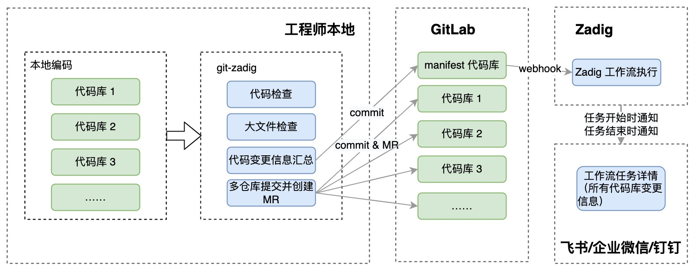
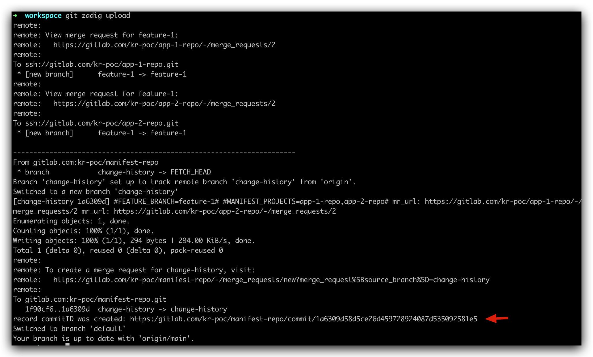
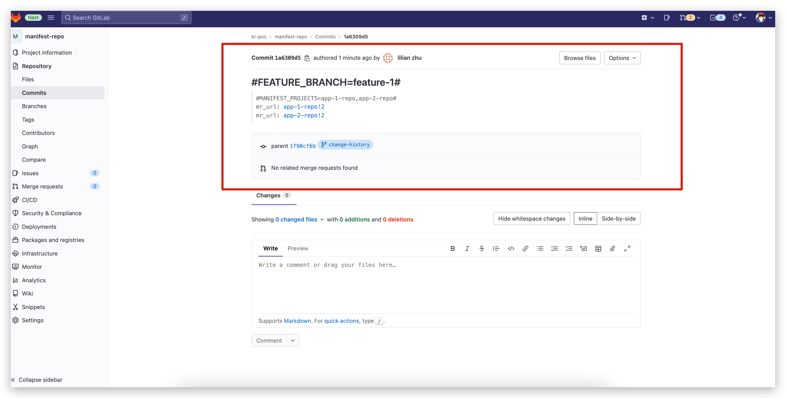
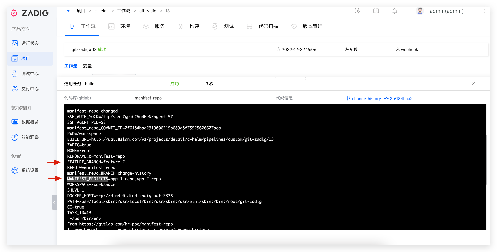

git-zadig is a Git plug-in with multi-warehouse collaborative management capabilities. It has related functions such as multi-warehouse management, local code inspection, multi-warehouse submission and creation of Merge Requests, summary of code change information, and linking Zadig workflow for daily iterative verification.
> Currently only GitLab is supported.



## Administrator Operations
### Prepare the manifest Configuration File
Configure manifest file

> manifest The data structure is completely inherited from Google 's git-repo tool, format reference [document](/0)

- Element remote Attribute type : Non-required, used to specify the remote code warehouse type. When the remote code repository is GitLab , specify <remote  type = "gitlab"/> and can be automatically created in the change repository MR .
- Element manifest-url: non-required, specify the repository address where manifest is located, and is used to generate the commit record link information. If you do not fill in, it will be automatically generated according to the current manifest clone address. When the address is special, it may be automatically generated inaccurately. This requires manual specification.
- Element record-branch: non-required, specifying a branch in the manifest-url repository to record the MR information created during the multi-repository submission. Make sure that the configured branch already exists in the manifest-url repository and that the branch's push permission is open.

Configuration file example:
> Sample reference: [https://github.com/koderover/zadig/tree/main/examples/git-zadig-demo](/0)

```xml
<manifest>
    <record-branch>change-history</record-branch>
    <manifest-url>https://gitlab.com/kr-poc/manifest-repo</manifest-url>
    <remote name="origin"
            fetch="https://gitlab.com/kr-poc"
            review="https://gitlab.com"
            type="gitlab"/>

    <default revision="main"
            remote="origin"
            sync-j="4" />

    <project path="app-1-repo" name="app-1-repo" />
    <project path="app-2-repo" name="app-2-repo" />
</manifest>
```

### Configuring Zadig Workflow

Configure the Zadig workflow according to the actual situation and add the corresponding Git , refer to [the documentation](/en/Zadig%20v3.4/project/common-workflow/#git-%E8%A7%A6%E5%8F%91%E5%99%A8) .

1. The build process uses the git-zadig tool to synchronize the code


2. Configure triggers


::: tip Caution
  1. Trigger the code base to select the repository where the manifest file is located
  2. The record-branch element configuration in the target branch and manifest file remains consistent
  3. Trigger event selection Push commits
:::

3. Configure IM Notifications


### Prepare Pre-Check Scripts

- Write git hook scripts and submit them to the code repository for unified management. Reference tutorial: [git hook](/0)
- For example: [https://github.com/koderover/zadig/tree/main/examples/git-hook-demo](/0)

## Engineer Operation
### Download and Install the git-zadig Tool

1. Download the system version of the git-zadig tool on Zadig, as shown in the figure below.


2. After decompression, place the git-zadig tool into the PATH and add executable permissions.

### Use Scenario 1: Multi-Storey Submission and Trigger the Zadig Workflow

#### Specific Operations
1. Initialize the working directory and download all relevant repos locally
``` bash
git zadig init -u <manifest-url> -b <manifest-branch>
git zadig sync
```

2. Create a feature branch and start encoding
```bash
git zadig start --all <branch>
```

3. After the encoding is completed, submit the code and execute the upload command
```bash
# Execute locally in each project directory
git add .
git commit -m "msg"

# Execute under workspace
git zadig upload
```


**Upload Operation instructions**
1. Fill in the necessary MR title and description information
2. Remove the comments before commit that need to be submitted

#### Implementation Effects

1. Manifest repository obtains a summary of changes, and the change code base MR is automatically created.




Get the commit URL of the manifest repository from the output, access the URL, and obtain the summary information of the multi-repository code submission, including the modified code base, feature branch and corresponding MR information

2. Workflow triggers the effect automatically




3. IM notification effect


### Use Scenario 2: Add a Pre-Check Script

1. Add a pre-check script for single/multi-storey warehouses. The script will automatically identify whether the current working directory belongs to a single or multi-storey warehouse and initialize it separately.
```bash
git zadig hook -u <hook-url> -b <hook-branch>
```


2. Doing git under the current project can find that hook checks have been injected.


3. Clean up the single warehouse/multi-store pre-check script, and the script will automatically identify whether the current workflow directory is a single warehouse or a multi-store.
``` bash
git zadig hook -c
```