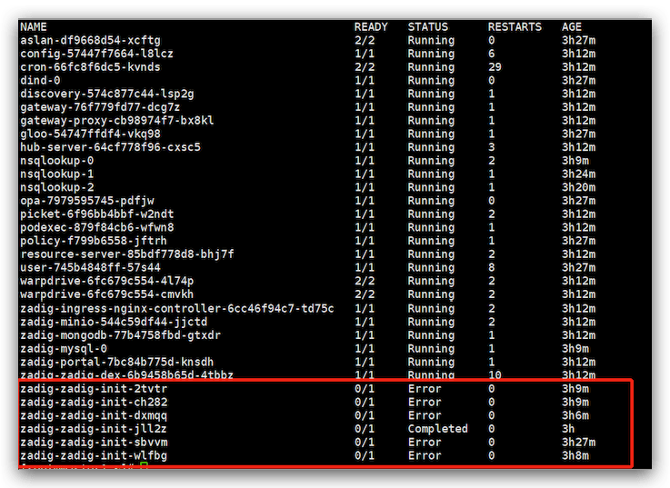

## Deployment Section

### MongoDB and MinIO are in Pending status, installation failed?

When installing the Zadig system, it does not interfere with cluster storage details. Therefore, when there is no default storage class or no storage class is specified, PVs need to be created in advance to allow MinIO and MongoDB to run correctly. Below is a working PV YAML example:

::: details
```
apiVersion: v1
kind: PersistentVolume
metadata:
  name: zadig-reserved-pv
spec:
  capacity:
    storage: 20Gi
  accessModes:
    - ReadWriteOnce
  hostPath:
    path: "/mnt/zadig/data"
    type: Directory
---
apiVersion: v1
kind: PersistentVolume
metadata:
  name: task-pv-volume
spec:
  capacity:
    storage: 20Gi
  accessModes:
    - ReadWriteOnce
  hostPath:
    path: "/mnt/zadig/data2"
    type: Directory
```
:::

### When installing Zadig using hostpath type PersistentVolume, MongoDB container keeps reporting permission issues and cannot create directories, Pod startup fails

This is caused by the container not having write permissions to the path specified in the PersistentVolume. You can manually create the file directory and give it `777` permission mode, for example:

```bash
mkdir /mnt/zadig/data
chmod 777 /mnt/zadig/data
```

### MySQL Pod startupProbe reports warning information during installation


When installing Zadig, the MySQL Pod will start startup probe checks 15 seconds after creation. The purpose is to ensure sufficient time to protect slow-starting applications. Each time an abnormality is detected, a warning will be reported. The system will perform up to 10 probe checks within 100 seconds. Please wait patiently when encountering this situation.

::: tip Extended Knowledge
For knowledge about Kubernetes Startup Probe, you can read [Configure Startup Probes](https://kubernetes.io/docs/tasks/configure-pod-container/configure-liveness-readiness-startup-probes)
:::

### zadig-init Pod status is Error during installation



The zadig-init Job will perform some system initialization work, completing the setup of built-in users, roles, and binding data. The completion of this Job depends on slow-starting basic components such as MySQL/MongoDB. Please wait patiently when encountering this situation. This Job will be retried up to 10 times. Once there is a Job with status `Completed`, the Zadig system can be used normally. If the Job is still not completed after 10 retries, please contact us.

### Installation error: Error: failed to install CRD crds/enterprise.gloo.solo.io_v1_AuthConfig.yaml: ...
> Complete error message: Error: failed to install CRD crds/enterprise.gloo.solo.io_v1_AuthConfig.yaml: unable to recognize "": no matches for kind "CustomResourceDefinition" in version "apiextensions.k8s.io/v1"

The Zadig system has requirements for Kubernetes cluster version. When encountering this error, please check your Kubernetes cluster version. The cluster version needs to be 1.16 or above for normal installation and use.

### After installation, accessing Zadig reports error 405 Method Not Allowed

This is caused by using the wrong entry point. The unified traffic entry point for accessing the Zadig system is on the gateway-proxy service. You only need to direct traffic to the gateway-proxy service. **Do not** direct traffic directly to the zadig-portal service.

## Operations Section

### How to determine if Kubernetes cluster nodes are abnormal

Step 1: Query node status

```
kubectl get node -o wide
```

Step 2: Use the following command to query high-load nodes. If nodes are abnormal, this command can generally be used to query:
```
kubectl top node
```

If you find that a node's status is unknown, then the node already has abnormalities. At this time, there are several solutions:
- Set the node to cordon, delete related abnormal Pods from the node, and let them be reassigned to normal nodes
- Restart the node server to let the node's kubelet communicate normally with the apiserver on the master

> For more Kubernetes cluster abnormality diagnosis, see [Official Kubernetes Cluster Diagnosis](https://kubernetes.io/docs/tasks/debug-application-cluster/debug-cluster/)

### How to resolve when workflow execution is stuck at the `Preparing Environment` stage?

This is caused by the build Pod not starting normally. Use the following command to query the running status of the build Pod and troubleshoot the specific reason why it failed to start.

> Common causes include but are not limited to: cluster resource shortage, cluster nodes configured with taints...

```
kubectl get pod -n <Zadig deployment Namespace>     # Query Pods with abnormal status
kubectl describe pod <PodName>                      # View detailed reasons why abnormal status Pods failed to start
```

### How to resolve when managed cluster is down?

Recover the managed cluster and reconnect the downed cluster in the Zadig system. Reference documentation: [Cluster Management](/en/Zadig%20v3.4/pages/cluster_manage/).

### How to resolve when environment page cannot get workload information?
You can start troubleshooting from the connection status of the cluster where the environment's corresponding Namespace is located:

- If using proxy mode to connect to the cluster, perform disconnect and reconnect operations
- If using direct connection mode to connect to the cluster, check if the configured kubeconfig file has expired

> Cluster management reference documentation: [Cluster Management](/en/Zadig%20v3.4/pages/cluster_manage/).

### How to resolve when aslan service appears in `crashloopbackoff` status?

You can troubleshoot from the following approaches:
- Check if the MongoDB/MySQL instance connection information used by aslan is correct
- Check if the database instance is normal

### How to safely Patch services?

Use K8s rolling update method. Note that when changing aslan, warpdrive service components, there should be no running workflows.

## How to schedule multiple Pod replicas to nodes in different zones

You can add Pod anti-affinity scheduling strategies when writing YAML to solve this using some features of Kubernetes itself. See [Kubernetes Documentation](https://kubernetes.io/zh/docs/concepts/scheduling-eviction/assign-pod-node/)

## The Ingress created by the system can work normally, why can't it work when using kubectl apply locally?

Because the Ingress created by Zadig will automatically add kubernetes.io/ingress.class to describe the Ingress class used, so the YAML used for manual kubectl apply also needs to include this item.


