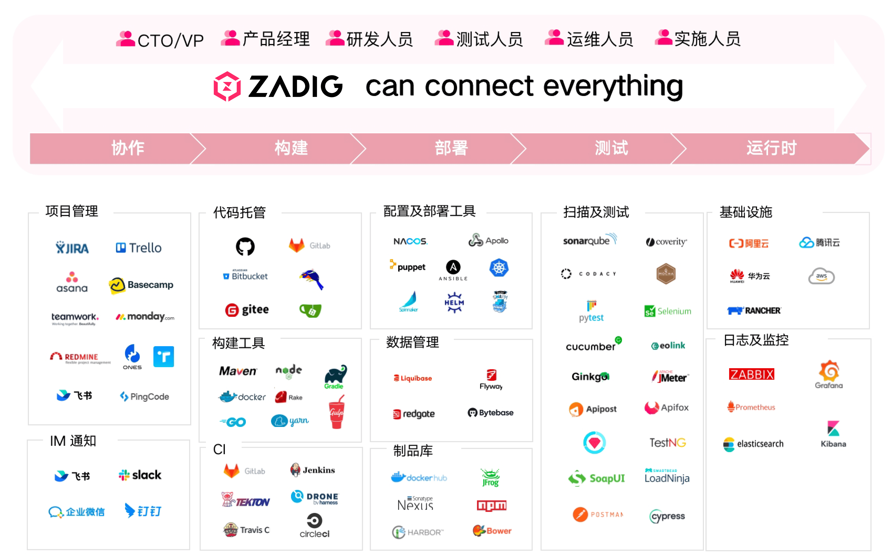
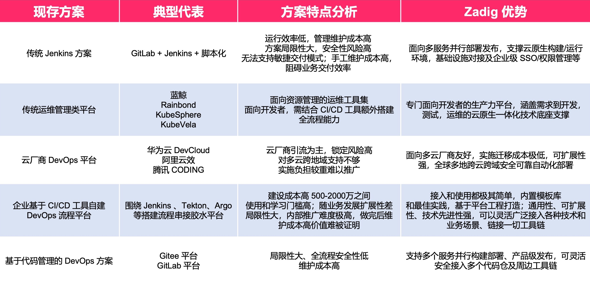
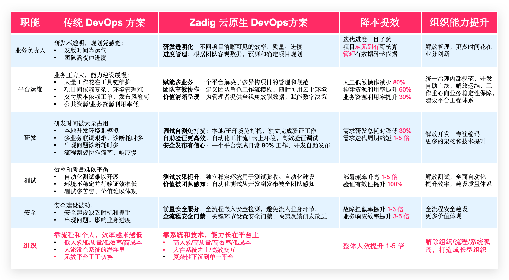

## Platform Introduction

Zadig is a self-service cloud-native DevOps platform developed by KodeRover based on Kubernetes, with 100% open-source code. Zadig provides flexible and scalable workflow support, multiple release strategy orchestrations, and one-click security audits, and continuously optimizes the development process through intelligent capabilities such as AI environment inspection, AI performance diagnosis, and AI Pilot. The platform also supports customized enterprise-level XOps agile performance dashboards, deeply integrates with multiple enterprise-level platforms, and achieves one-click management and governance of thousands of services through project template-based batch fast access. Its primary goal is to help enterprises achieve digital transformation in product and research, making engineers the innovation engine and supporting the infinite value links of the digital economy.

## Zadig Value Chain

## Comparison with Traditional DevOps Solutions

Most existing practices are primarily "single-point tools + scripting" or operation and management platforms. In contrast, Zadig is a developer-centric, neutral, cloud-native integrated value chain platform.

## Business Architecture

## User Value

Establish a baseline for full-process engineering collaboration in product and research, operate scientifically, and unleash team productivity, ensuring that everyone's value is reflected.

## Core Capabilities

- **Flexible and Easy-to-Use High-Concurrency Workflows**

  Simple configuration can automatically generate high-concurrency workflows, allowing multiple microservices to be built, deployed, and tested in parallel, significantly improving code verification efficiency. Customizable workflow steps, combined with manual approval, ensure flexible and controllable business delivery quality.

- **Developer-Friendly Cloud-Native Environment**

  Create or replicate a complete isolated environment within minutes to handle frequent business changes and product iterations. Based on a full-scale baseline environment, quickly provide developers with an independent self-test environment. One-click cluster resource management enables easy debugging of existing services and verification of business code.

- **Efficient Collaborative Testing Management**

  Conveniently integrate mainstream testing frameworks such as JMeter and Pytest, and manage and accumulate UI, API, and E2E test case assets across projects. Through workflows, provide pre-test verification capabilities to developers. Continuous testing and quality analysis fully leverage the value of testing.

- **Powerful and Maintenance-Free Template Library**

  Share K8s YAML templates, Helm Chart templates, build templates, and workflow templates across projects to achieve unified configuration management. Based on a single template, hundreds of microservices can be created, and developers can use them with minimal configuration, significantly reducing the burden of operations and maintenance.

- **Safe and Reliable Release Management**

  Custom workflows connect people, processes, and internal and external systems for compliance approval, supporting flexible orchestration of blue-green, canary, batched gray, and Istio release strategies. The production environment is presented through multi-cluster and multi-project perspectives, ensuring transparent and reliable release processes.

- **Stable and Efficient Customer Delivery**

  Simplify the product implementation process for suppliers, including customer versions, customer private clouds, public clouds, and offline environments, as well as product license management. The supplier management plane links the customer console to complete the implementation, update, and maintenance of the customer environment, enhancing the quality of external services.

- **Objective and Precise Performance Insights**

  Gain a comprehensive understanding of the system's operating status, including clusters, projects, environments, workflows, and key process pass rates. Provide objective performance measurement data for build, test, and deployment at the project level, accurately analyze R&D performance bottlenecks, and promote steady improvement.

- **Cloud-Native IDE Plugin**

  Developers can access Zadig's core capabilities directly within the VSCode IDE without switching platforms. After writing code, they can deploy it to a self-test environment with one click, without packaging the image, quickly completing self-test, joint debugging, and integration verification, significantly boosting development efficiency.