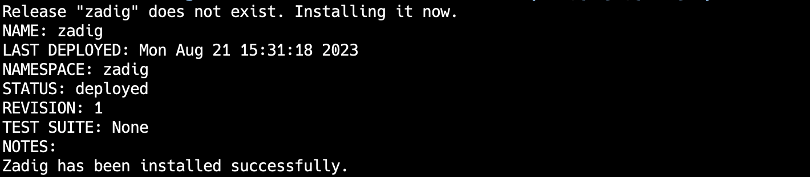

Install Kubernetes and Zadig on a single cloud host or virtual machine using Sealos. This is suitable for users who are new to Kubernetes and Zadig and want a quick experience.

::: danger
The one-click installation method with Sealos does not support version upgrades and is not recommended for production use.
:::

## Step 1: Prepare a Linux Machine

::: warning
To avoid conflicts during installation or other unknown errors that may cause installation failure, it is recommended that your operating system remains clean and does not have any software that could cause conflicts installed.
:::

### Hardware Requirements

|  Operating System                                               |  Minimum Requirements                         |
| ------------------------------------------------------ | ---------------------------------|
| **Ubuntu** 18.04+                       | CPU: 4 cores, Memory: 8 GB, Hard Disk: 50 GB |

For more detailed installation requirements, please refer to [Sealos Installation Prerequisites](https://docs.sealos.io/zh-Hans/docs/lifecycle-management/quick-start/)

### Network Requirements
- The server must have access to the external network

### Other Requirements
- The installation must be performed with the Root user; using `sudo` is not recommended
- Ensure that the server's firewall configuration allows access to the port range 30000 - 32767 for external access
::: tip
- If you log in to the machine via SSH, to prevent the script from timing out and causing the SSH connection to drop, it is recommended to add the line `ServerAliveInterval 60` in the client's local `~/.ssh/config` file
:::

## Step 2: Install Sealos

::: tip
If you have already installed Sealos, you can skip this step. Ensure you are using version v4.3.0 or later.
:::

```bash
wget https://github.com/labring/sealos/releases/download/v4.3.0/sealos_4.3.0_linux_amd64.tar.gz
tar -zxvf sealos_4.3.0_linux_amd64.tar.gz sealos && chmod +x sealos && mv sealos /usr/bin
```

## Step 3: Install Kubernetes and Zadig

```bash
# The server's IP address will be used to access the Zadig system
export IP=<node external ip>
export PORT=<30000~32767 any port>

sealos run labring/kubernetes:v1.24.0 labring/helm:v3.22.0 labring/calico:v3.24.1 labring/openebs:v3.4.0
sealos run --env IP=${IP} --env PORT=${PORT} labring/zadig:3.4.0
```



The installation process is expected to take about 20 minutes. The actual time may vary depending on the hardware configuration and network conditions
When you see the output as shown in the figure, it means the installation has been completed.

## Step 4: Verify the Installation

You can check the service startup status using the following command:

```bash
kubectl -n zadig get po
```
## Step 5: Access the System


In the installation result output, you will find the system's access address.

::: tip
Professional License Acquisition and Configuration Reference Document: [License](/en/Zadig%20v4.0/enterprise-mgr/#license)
:::

## Uninstall

You can uninstall the currently installed Kubernetes and Zadig system with a single command:

```bash
sealos reset
```