Workflows have capabilities such as building, deploying, testing, production releases, project collaboration, configuration changes, data changes, and service monitoring. This article introduces how to configure and use the tasks corresponding to these capabilities.

## Build
### Build

Parameter Description:
- `Task Name` : Supports lowercase English letters, numbers, or hyphens within 32 characters, and must start with a lowercase English letter; in the same workflow, the task name must be unique
- `Image Repository` : Select the image repository. After the build task is successfully executed, the built image (i.e., the built-in `$IMAGE` variable) will be pushed to the selected repository
- `Service Component` : Supports runtime input or specifying pre-tasks.
- `Component List` :
  - `Variable Configuration` : Configure the variable value in the build, see [variable assignment](/en/Zadig%20v4.0/project/common-workflow/#variable-assignment-method)
  - `Branch Configuration` : Select the code repository and specify the default branch and branch options. The specified branch will be used by default when executing the workflow
  - `Shared Storage Configuration` : See [shared storage](/en/Zadig%20v4.0/project/common-workflow/#shared-storage)

## Deployment
### Container Service Deployment

Parameter Description:
- `Task Name` : Supports lowercase English letters, numbers, or hyphens within 32 characters, and must start with a lowercase English letter; in the same workflow, the task name must be unique
- `Environment` : Select the environment to be deployed, and see [variable assignment](/en/Zadig%20v4.0/project/common-workflow/#variable-assignment-method)
- `Service Component` : Supports two configuration methods: manual input or specifying pre-build tasks (the system will use the `$IMAGE` variable output from the build task to deploy the service)
- `Deployment Content` : Includes the following three options:
  - `Service Image` : Update the service image
  - `Service Variables` : Update the service variables. See the definition of variables: [Service variables](/en/Zadig%20v4.0/project/service/k8s/#variable-configuration)
    - Variable sources support runtime input and global variables/other task outputs
  - `Service Configuration` : Update the service configuration. See the service configuration source: [Service Configuration](/en/Zadig%20v4.0/project/service/k8s/#create-service)
- `Service Variables and Configuration` : When `Deployment Content` includes `Service Variables`, configure the services and variables that can be updated by the workflow
- `Status Detection` : If enabled, the deployment task will poll the service operation status
  - If the service instance's Replicas = AvailableReplicas, the deployment is successful, and the workflow task status is successful
  - If the service container is in a waiting state due to ImagePullBackOff/ErrImagePull/CrashLoopBackOff/ErrImageNeverPull, it is considered a deployment failure, and the workflow task status is a failure
  - When the deployment timeout time is exceeded, the success is not met / Failure condition, the deployment timeout is exceeded. The deployment timeout setting can see [service policy configuration](/en/Zadig%20v4.0/project/service/k8s/#policy-configuration)

::: tip
- When the service component of the deployment task is specified as `Global Variables/Other Task Outputs`, the system will use the `$IMAGE` variable output from the build task to deploy the service.
- When deploying using a version, the phase is not executed concurrently, and the deployment tasks are deployed in the order of service orchestration.
- When deploying using a version, if the deployment task is configured with only `Service Image`, it supports automatically filtering out services that do not exist in the environment.
:::

### Host Service Deployment

Parameter Description:
- `Task Name` : Supports lowercase English letters, numbers, or hyphens within 32 characters, and must start with a lowercase English letter; in the same workflow, the task name must be unique
- `Environment` : The environment to be deployed
- `Object Storage` : Object storage for binary package storage
- `Service Component` : Supports two configuration methods: runtime input and pre-build tasks (the system will use the `$IMAGE` and `$ARTIFACT` variables output from the build task to deploy the service)

### Kubernetes Deployment
Deploy containers in the specified namespace of the specified cluster.

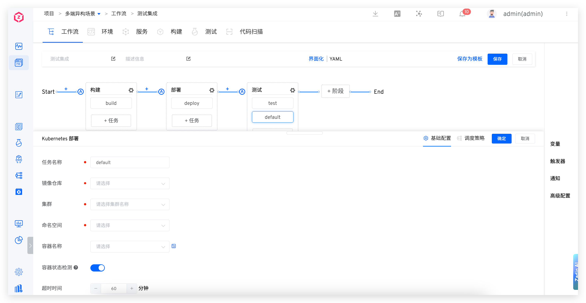

Parameter Description:
- `Task Name` : In the same workflow, the task name must be unique
- `Image Repository` : When executing the Kubernetes deployment task, which image repository is used to retrieve the image to deploy the target container
- `Cluster` : The cluster where the container to be deployed is located
- `Namespace` : The namespace where the container to be deployed is located
- `Container` : Specify container applications in the namespace (currently supports Deployment resources and Statefulset resources)
- `Container Status Detection` : If enabled, the deployment task will poll the container's running status. The container runs normally before the deployment timeout, and the task status will be successful
- `Timeout` : Container deployment timeout

### Update K8s YAML Task
It can help solve the problem of automatically updating native K8s resources, such as updating container CPUs and Mem, updating Istio's VirtualService configuration, etc.

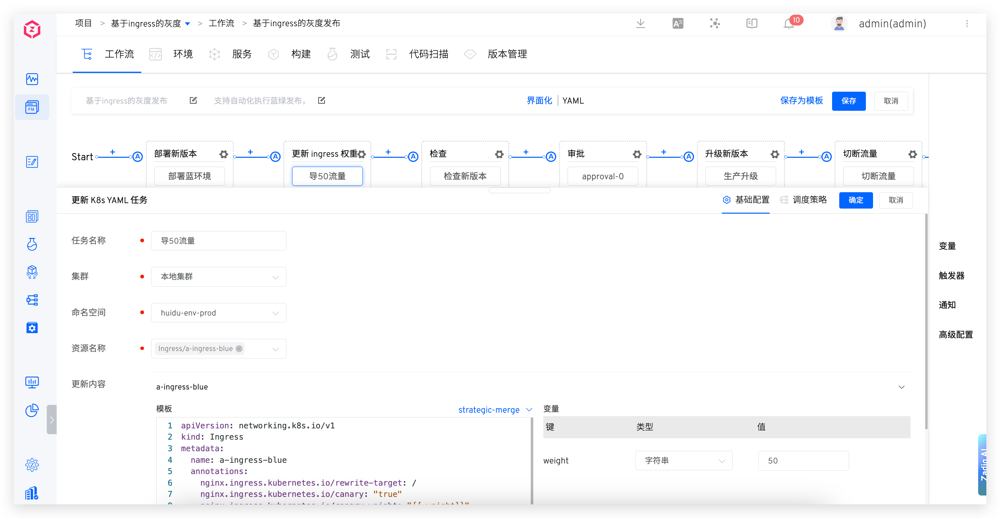

Parameter Description:
- `Cluster` : Cluster information
- `Namespace` : The namespace where the instance is located in K8s
- `Resource Name` : The resource name that needs to be modified, supports updating multiple resources at once
- `Update Content` :
  - `Template` : Configure the corresponding update content, supports variables in `{{.Key}}` format. After setting variables in the template, the variable area will be automatically parsed, and variable types and default values can be configured. The parsed variables can be used
  - `Strategy` : Supports strategic-merge/merge/json. See the [K8s official documentation](https://kubernetes.io/docs/tasks/manage-kubernetes-objects/update-api-object-kubectl-patch/) for specific usage methods

Execute the workflow, fill in the variables for the updated content, and the workflow completes execution according to the set tasks.

## Test
### Test
Supports referencing test configurations in workflows.

Task types include service testing and product testing:
- `Product Test` : Just specify the test
- `Service Test` : Specify the service component and configure the corresponding relationship between the service component and test. The source of the service component can be specified as runtime input or as pre-task output (including: build tasks, deployment tasks, image distribution tasks)
  - `Service Component` : Supports two configuration methods: runtime input and pre-build task. If there is code information in the pre-task, you can choose `Repo Sync`. If the code repository of the test task is consistent with the selected task, then when executing the workflow, you only need to select service components and code information in the pre-task, and the test task will automatically reference the corresponding input.

After selecting the specific test configuration, you can set the default branches and variables of the code repository in the test configuration, and enable shared storage as needed. Refer to the document:

- [Variable assignment](/en/Zadig%20v4.0/project/common-workflow/#variable-assignment-method)
- [Shared storage](/en/Zadig%20v4.0/project/common-workflow/#shared-storage)

### Code scanning
Use the configured Sonar for code scanning tasks to verify code quality.

Parameter Description:
- `Task Name` : In the same workflow, the task name must be unique.
- `Task Type` :
  - `Product Scan` : Just scan the specified code.
  - `Service Scan` : Specify the service component and configure the corresponding code scanning task for scanning. The selection of the service component supports output from the pre-task, and can be chained with build tasks.
    - `Service Component` : Supports two configuration methods: runtime input and pre-build task. If there is code information in the pre-task, you can choose `Repo Sync`. If the code repository of the code scanning task is consistent with the selected task, then when executing the workflow, you only need to select service components and code information in the pre-task, and the code scanning task will automatically reference the corresponding input.
- `Scan Name` : Select the code scanning task in the project, and you can choose multiple options.
- `Scan Configuration` : You can set the default branch of the code base in code scanning, enable shared storage as needed, and you can refer to [shared storage](/en/Zadig%20v4.0/project/common-workflow/#shared-storage) for configuration.

## Process Control

### Manual Approval

Support Zadig Approval, Feishu Approval, DingTalk Approval, Enterprise WeChat Approval, detailed configuration and use of reference documents [workflow Approval](/en/Zadig%20v4.0/workflow/approval/#zadig-%E5%AE%A1%E6%89%B9)

### Notification

During the execution process, the workflow supports orchestrating notification tasks. Notification members support runtime input or fixed members. Currently, it supports four notification methods: email, Enterprise WeChat, Feishu, and DingTalk.

## Release Strategies
Supports Helm Chart Deployment, MSE, Blue-Green Deployment, Canary Deployment, Batched Gray Deployment, and Istio Deployment. For detailed information, refer to the document: [Publishing Policy](/en/Zadig%20v4.0/project/release-workflow/).

### Helm Chart Deployment

> Applicable only in K8s Helm Chart projects.

Charts that are already in the Chart repository can be automatically deployed to the environment.

#### Configure Tasks
Edit the workflow and add the "Helm Chart Deployment" task: Click "+ Task", select the "Helm Chart Deployment" task, and configure the environment.

#### Perform Tasks
Select the environment, Release, and modify the Chart information and values content as needed, then execute the workflow.

### Update Istio Gray Policy

> Automatically update the Istio gray policy in the full link gray. For usage practice, refer to [Istio Full Link Gray](/en/Zadig%20v4.0/env/istio-gray-release/).

- `Task Name` : In the same workflow, the task name must be unique.
- `Baseline Environment` : Baseline production environment
- `Gray Strategy` :
  - `Based on Traffic Ratio` : Control production traffic according to the configured traffic ratio
  - `Based on Request Header` : Control production traffic according to the configured request header

## Project Management
### JIRA Issue Status Change
After completing a certain stage of the workflow, the status of the Issue in the corresponding JIRA project can be automatically changed.

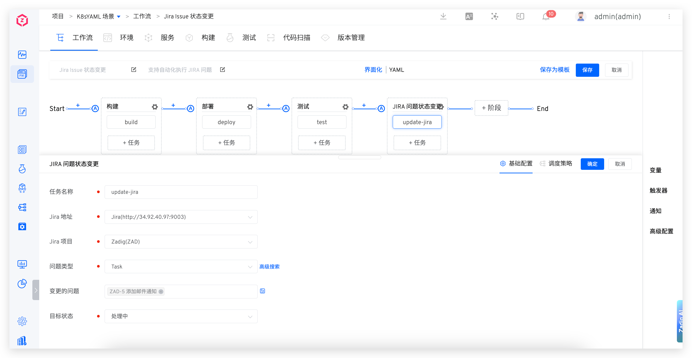

Parameter Description:
- `Task Name` : In the same workflow, the task name must be unique.
- `Jira Project` : Select the corresponding project under the Jira space.
- `Issue Type` : Select the corresponding type as needed.
- `JQL Search`: In `Advanced Search`, it supports searching for issues using JQL statements. Ensure the correctness of the JQL statement.
- `Change Issue` : Select the problem of the required change and refer to the document [variable assignment](/en/Zadig%20v4.0/project/common-workflow/#variable-assignment-method) .
- `Target Status` : Select the status you need to change to.

::: tip
1. In the JQL search, the variable `{{.system.username}}` is also supported, such as  `issuetype = Task and assignee = {{.system.username}}`
2. The value of `{{.system.username}}` is the currently logged-in user in the Zadig system. If you use this variable for searching, ensure that the user exists in Jira
:::

### Feishu Work Item Status Change
After completing a certain stage of the workflow, the status of the work item in the corresponding Feishu space can be automatically changed.

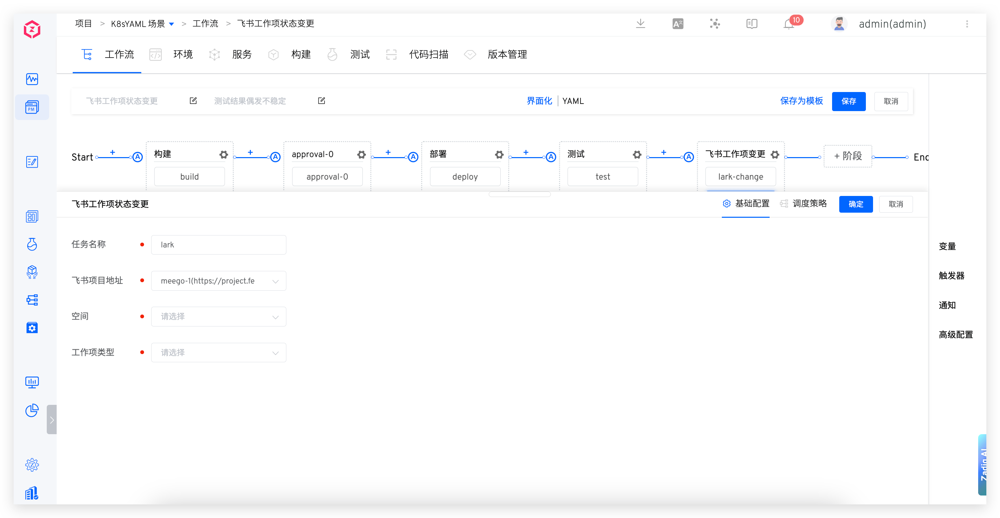

Parameter Description:
- `Task Name` : In the same workflow, the task name must be unique.
- `Space` : Select the desired Feishu space.
- `Work Item Type` : Select the corresponding type as needed.

When executing the workflow, select the work item to be changed and the corresponding target status. After clicking to execute, the Feishu project status will be automatically changed.

::: tip Tips
Currently, only state mode work item changes are supported.
:::

## Configuration changes
### Apollo Configuration Change
Through the execution of workflow tasks, multiple configuration changes managed by Apollo can be supported simultaneously.

Parameter Description:
- `Task Name` : In the same workflow, the task name must be unique.
- `Apollo Address` : Select the bound Apollo address. If you need to add one, go to [Apollo Configuration](/en/Zadig%20v4.0/settings/configsystem/apollo/) to view details.
- `Apollo Configuration Range` : Configure the configuration range that can be changed, supports TEXT, JSON, XML, YAML, HTML, Properties.

### Nacos Configuration Change
Through the execution of workflow tasks, multiple configurations managed by Nacos can be changed simultaneously. After execution, the workflow supports rolling back the Nacos configuration to the version before the change.

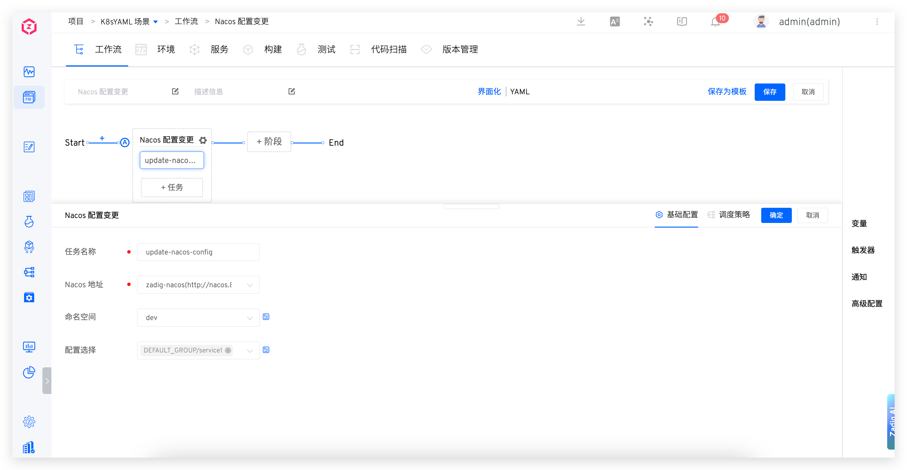

Parameter Description:
- `Task Name` : In the same workflow, the task name must be unique.
- `Nacos Address` : Select a previously bound Nacos address. If you need to add one, go to [Nacos Configuration](/en/Zadig%20v4.0/settings/configsystem/nacos/) for more details.
- `Namespace` : Select the desired namespace
- `Configuration` : Select the corresponding configuration, and multiple selections are supported.

## Data changes
### SQL Data Changes
SQL commands can be executed for the specified database, combined with build and other tasks, to achieve one-stop data and code changes. SQL data rollback is supported, and the rollback SQL scripts must be provided by the user.

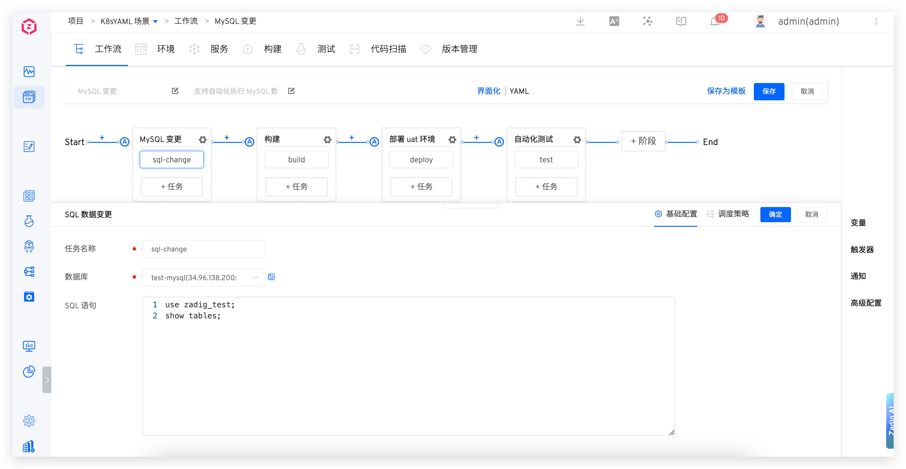

Parameter Description:
- `Database` : Select the database to be changed, which must be integrated into the system in advance
- `SQL Statement` : The SQL statement for the change, supporting multiple lines. Please specify the database name in the SQL statement

### DMS Data Change Work Order
Automatically submit SQL change work orders to Alibaba DMS and wait for the work orders to be completed.

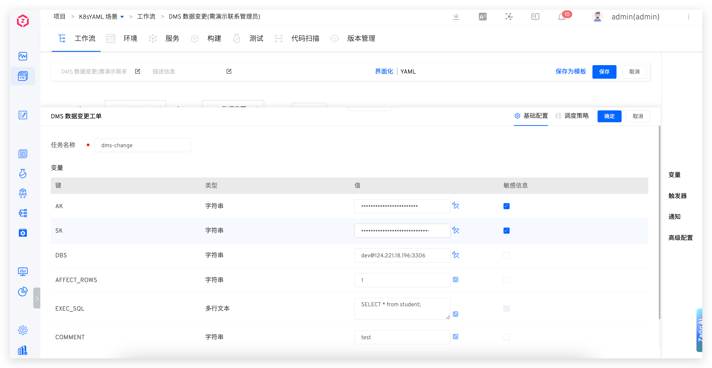

Parameter Description:
- `AK`: Alibaba Cloud account AK
- `SK`: Alibaba Cloud account SK
- `DBS` : The database to be changed, for example: `test@127.0.0.1:3306,test@127.0.0.2:3306`
- `AFFECT_ROWS` : The number of affected rows
- `EXEC_SQL` : The SQL statement to be executed
- `COMMENT` : The comment information for the work order

## Service Monitoring

<!--
### 观测云监测

 对观测云监测器在指定观测时间内的事件进行监控，当出现不低于配置级别的事件时，则检测结果异常。

参数说明：
- `观测云服务`：选择系统集成中配置的观测云监测系统
- `观测时间`：配置观测云监测时间
- `选择监控器`：选择观测云系统中的监控器并配置需要关注的最低事件级别
- `失败策略`：配置工作流任务失败的策略，包括以下两种
  - `单个监控异常任务立即失败`：只要有一个监测器结果异常，工作流任务就失败结束，不会等待所有监测器执行完毕
  - `所有监控完成后存在异常时任务失败`：所有监控器执行完毕后有异常结果时，工作流任务才失败

监测异常时，可点击查看事件详情分析服务是否健康。

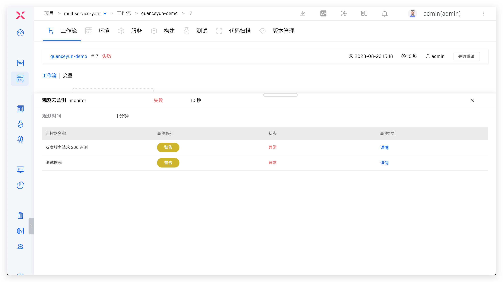 -->

### Grafana Monitoring

Use Grafana to monitor the service health during the specified monitoring period.

Parameter Description:
- `Grafana Service` : Select the Grafana monitoring system configured in the system integration
- `Monitoring Time` : Configure the Grafana monitoring time
- `Select Alert Rules` : Select the alert rules configured in the Grafana system
- `Failure Strategy` : Configure the failure strategy for the workflow task, including the following two options:
  - `Single Monitor Abnormal Task Immediately Failed` : If any monitor result is abnormal, the workflow task will fail immediately and will not wait for all monitors to complete
  - `All Monitors Completed with Abnormal Results` : The workflow task will fail if there are any abnormal results after all monitors have completed

When monitoring abnormalities, you can click to view the event details to analyze whether the service is healthy.

## CI/CD

### Execute Jenkins Job

Supports executing multiple Jenkins jobs using the workflow. 
Specific configuration method: Add an `Execute Jenkins Job` task to the workflow -> Select the Jenkins system -> Add multiple Jenkins jobs -> Configure the parameters in the Jenkins job.

### Execute Blue Whale Operation

Can trigger the execution plan of the Blue Whale Operation Platform.

Parameter Description:
- `Blue King System` : Select the Blue Whale system configured in the system integration
- `Business` : The business unit in Blue Whale
- `Execution Plan` : Select a predefined execution plan in the Blue Whale system

## Other Requirements
### General Tasks
Supports functions such as pulling code, executing shell scripts, and file storage.
- `Execution Method` :
  - `Single Task Execution` : Execute only one task
  - `Service Component Multi-Task Execution` : Divide into multiple tasks based on the selected service component
    - `Service Component` : Supports two configuration methods: runtime input and pre-build tasks. If there is code information in the pre-task, you can choose `Use the code information of the selected task`. If the code repository of the code scanning task is consistent with the selected task, then when executing the workflow, you only need to select the service component and code information in the pre-task, and the code scanning task will automatically reference the corresponding input.
- `Execution Environment` : Refer to [the build environment configuration](/en/Zadig%20v4.0/project/build/#%E6%9E%84%E5%BB%BA%E7%8E%AF%E5%A2%83)
- `Code Information` : Configure the code repository for the general task, supporting two methods: direct configuration and variable assignment
  - Direct configuration: For specific fields, please refer to the document [code information.](/en/Zadig%20v4.0/project/build/#code-information)
  - Use variables: After configuring the workflow variable of the code base type, set the value of the code source here to `Global Variables/Other Task Output` You can refer to [the variable](/en/Zadig%20v4.0/project/common-workflow/#custom-variables) for configuring the workflow variable.
- `Variables` : Configure custom variables for general tasks. Variable assignment supports three ways, refer to [variable assignment](/en/Zadig%20v4.0/project/common-workflow/#variable-assignment-method)
- `Add Steps` : Including adding Shell script execution and file storage, please refer to [more build configurations](/en/Zadig%20v4.0/project/build/#advanced-configuration)
  - Among them, the `Select Cluster` configuration source supports runtime input and fixed values.

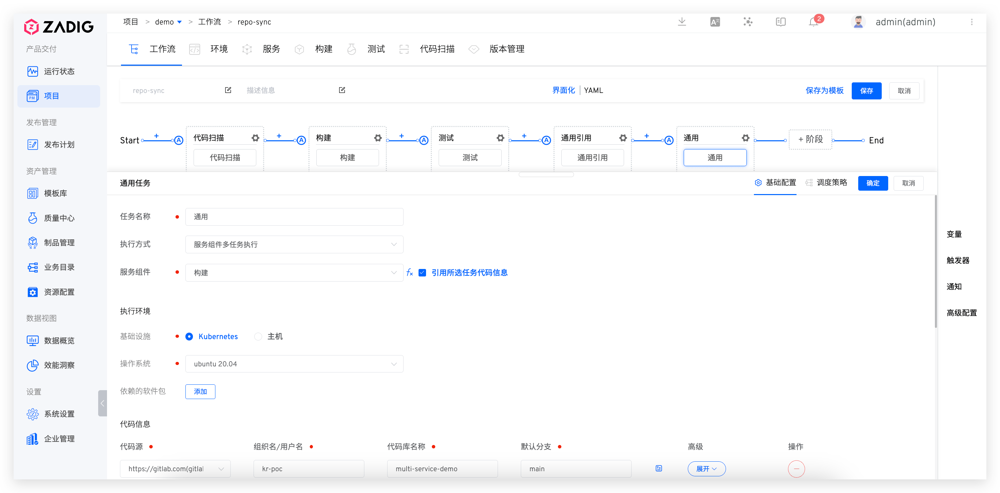

### Mirror Distribution

The mirror can be pushed to a specified image registry.

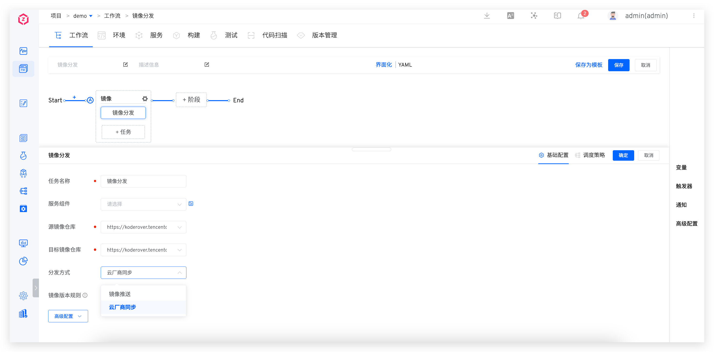

Parameter Description:
- `Task Name` : In the same workflow, the task name must be unique.
- `Service Component` : The service component that needs to be distributed, supporting manual input and other task outputs.
- `Source image registry` : The source of the mirror to be distributed.
- `Target image registry` : The target repository for mirror distribution.
- `Distribution Method` :
  - `Image Push` : Retag the mirror and push it to the target image registry
  - `Cloud Vendor Synchronization` : Use cloud vendor multi-region synchronization. Zadig is responsible for converting the mirror address to ensure that subsequent tasks can obtain the correct mirror address, while the actual mirror synchronization is completed by the cloud vendor.
- `Image Version Rule` : Turn on and configure the rules. The mirror distribution task will generate the version of the target image according to the specified rules, supporting the following combinations of variables and constants.

> When executing the mirror distribution task, the mirror versions of all services are generated according to the rules in the configuration.

| Variable Name | Description              |
|--------|-----------------------------|
| `{{.project}}` | Project Name |
| `{{.workflow.name}}` | Workflow Name |
| `{{.workflow.task.creator}}`  | Workflow Task Executor |
| `{{.workflow.task.timestamp}}` | Workflow Task Execution Time, in Unix timestamp format |
| `{{.workflow.task.id}}` | Workflow Task Serial Number |
| `{{.workflow.input.imageTag}}` | This variable can be used when the service component is specified as runtime input, and its value is the input value |
| `{{.job.<Deployment Task Name>.envName}}`| Specify the environment name in the deployment task |
| `{{.job.preBuild.imageTag}}` | This variable can be used when the service component is specified as another task output, and its value is the image version of the pre-build task |

In addition to the above variables, it also supports the use of variables output in the pre-task. Refer to the document: [Output variables](/en/Zadig%20v4.0/project/common-workflow/#variable-passing) .

### Trigger Zadig Workflow

Can trigger other Zadig workflows.
- The triggered workflow needs to meet the criteria: only common tasks/custom tasks/triggered Zadig workflow tasks
- Can trigger workflows in all projects

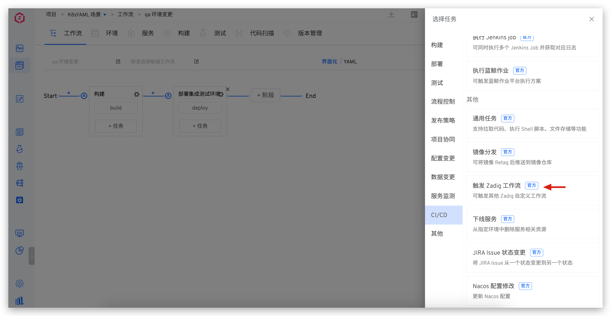

Supports triggering all workflows or specifying the corresponding relationship between service components and workflows to trigger partial workflows.

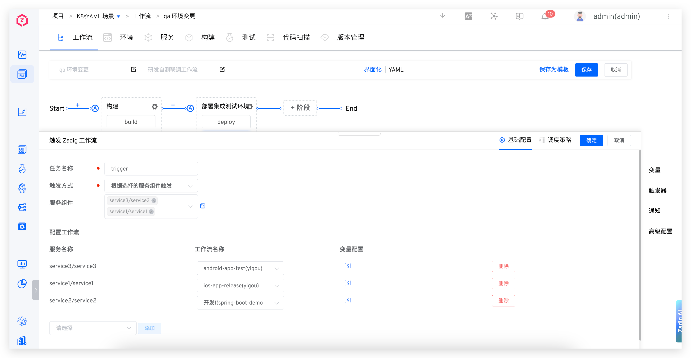

Click Variable Configuration to configure custom variables in the triggered workflow to realize variable transmission across workflows and projects. For workflow custom variables, please refer to the documentation: [Custom variables](/en/Zadig%20v4.0/project/common-workflow/#custom-variables) .

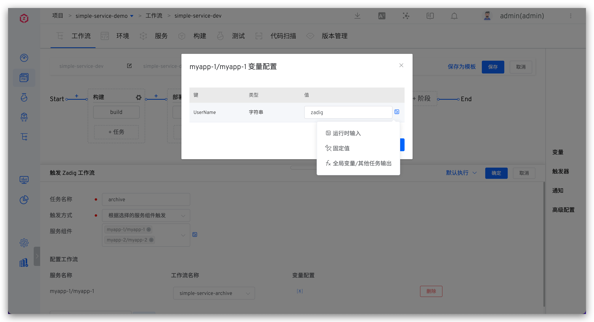

### Offline Service
> Supported in K8s YAML projects and K8s Helm Chart projects.

Remove the service from the environment.

::: tip
If the service is added to the environment through deployment, the offline service will delete the service resources from the K8s cluster; if the service is added to the environment through import-only, the resources of the service in the K8s cluster will still exist after the offline service.
:::

### Custom Tasks
Define the implementation of tasks yourself and configure custom tasks in the workflow. For detailed usage, refer to [Custom Tasks](/en/Zadig%20v4.0/settings/custom-task/).

## Supported Configuration Methods in Different Tasks

The related configuration items in the task support rich [assignment methods](/en/Zadig%20v4.0/project/common-workflow/#variable-assignment-method) . See the following table for the supported methods in different tasks:

| Task | Configuration Items | Fixed Value | Runtime Input | Global Variables/Other Task Output |
|:--------: | :----: |:--------:|:--------:|:--------:|
| Build | Build Variables | √ | √ | √ |
| Deploy | Environment | √ | √ | - |
|         | Service Components | - | √ | √ |
| Kubernetes Deployment | Container | √ | √ | - |
| Test | Test Variables | √ | √ | √ |
| JIRA Issue Status Change | Changed Issues | - | √ | √ |
| Nacos Configuration Change | Namespace | √ | √ | - |
|  | Configuration Default Values | √ | √ | - |
| SQL Data Change| Variables |  √ | √ | √ |
| DMS Data Change Work Order| Variables |  √ | √ | √ |
| General| Code Source |  - | √ | √ |
| | Custom Variables |  √ | √ | √ |
|Mirror Distribution| Service Components |  - | √ | √ |
|Trigger Zadig Workflow| Service Components |  - | √ | √ |
|| Variables in the Triggered Workflow | √ | √ | √ |
|Offline Service| Environment | √ | √ | -  |
| Execute Jenkins Job | Variables | √ | √ | √ |
| JIRA Issue Status Change | Variables | √ | √ | √ |
| Nacos Configuration Modification | Variables | √ | √ | √ |
| Custom Tasks | Variables | √ | √ | √ |

## Advanced Configuration

In the advanced configuration of the task, you can specify the task's timeout time, the cluster resources used, the scheduling policy, and whether to enable shared storage, etc. The list of tasks that support advanced configuration is as follows:
| Task | Supports Advanced Configuration
|:--------: | :----: |
| Build | √ |
| Test | √ |
| Code scanning | √ |
| SQL Data Change | √ |
| DMS Data Change Work Order | √ |
| General Tasks | √ |
| Mirror Distribution | √ |
| Execute Jenkins Job | √ |
| JIRA Issue Status Change | √ |
| Nacos Configuration Modification | √ |
| Custom Tasks | √ |

For timeout time, resource configuration, and shared storage configuration, refer to the documentation:

- [Timeout policy configuration](/en/Zadig%20v4.0/project/build/#advanced-configuration)
- [Resource configuration](/en/Zadig%20v4.0/project/build/#advanced-configuration)
- [How to use shared storage](/en/Zadig%20v4.0/project/common-workflow/#shared-storage)