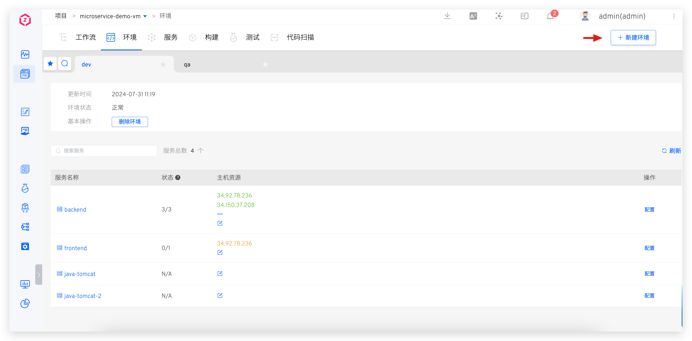
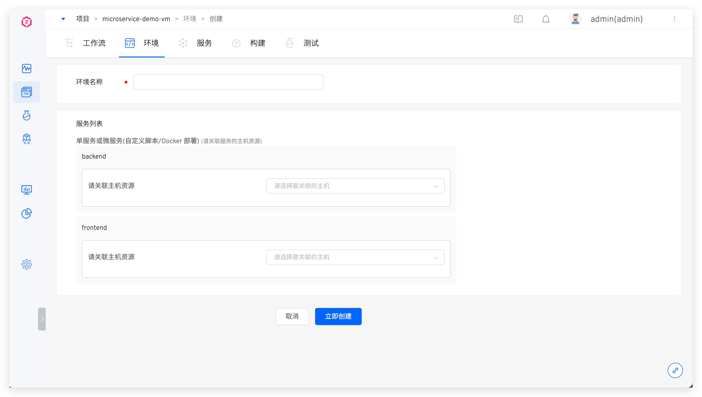
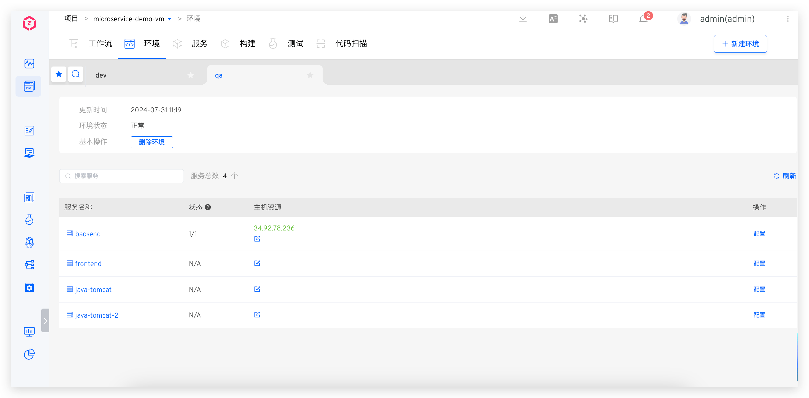
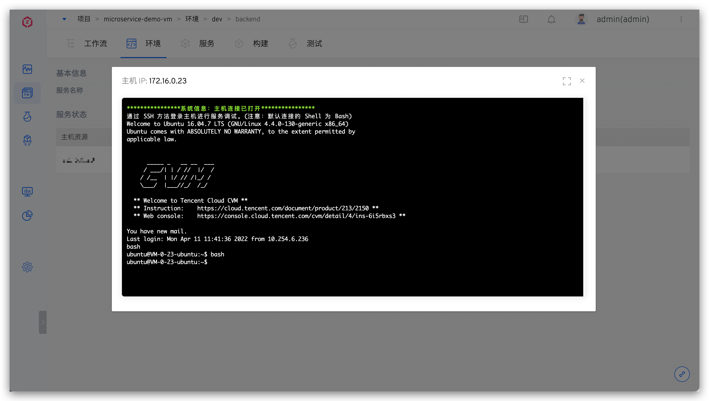
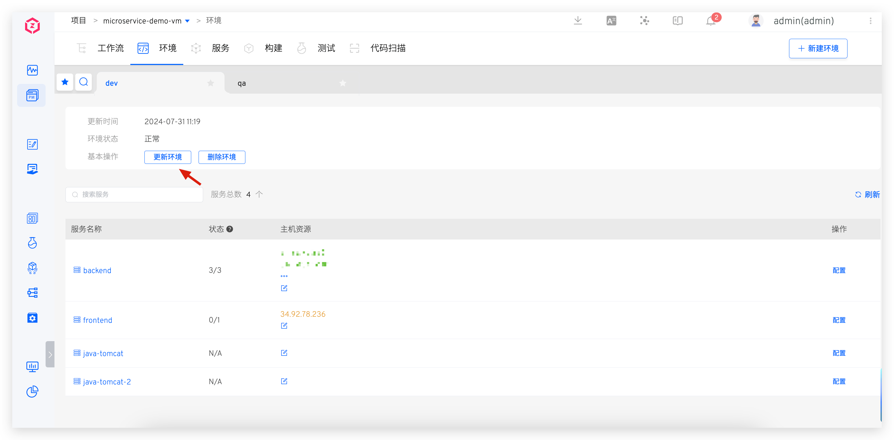
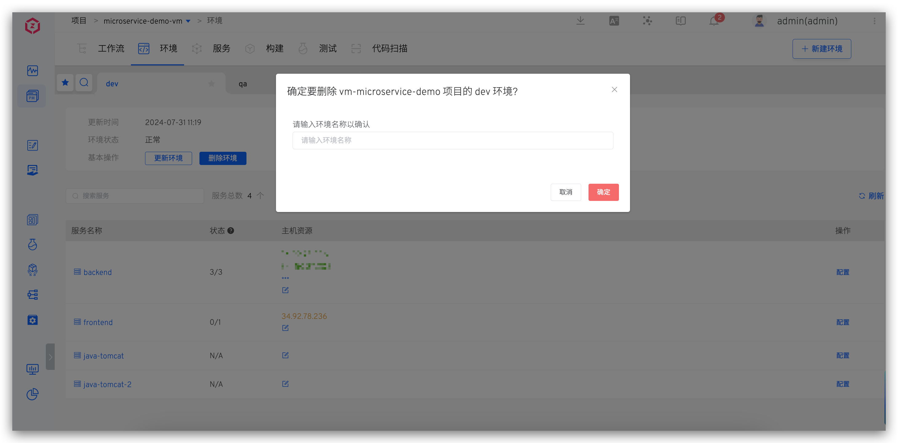

This article introduces environment-related operations in free projects.

## Create a New Environment
In a free project, click the `Create New Environment` button to enter the new environment page.

Parameter Description:

- `Environment Name`: The name of the environment to be created, for example: `dev`, `pre-release`.
- `Service List`: Select the associated host resources for the services. When deploying services using workflows, the services will be deployed on the associated host resources. You can also choose not to associate host resources initially and modify them in the environment details after the environment is created.

> Associating host resources requires integrating hosts in the system first; refer to [Host Integration](/en/Zadig%20v4.0/settings/vm-management/).

## View the environment

### Basic Information

After the environment is created, click on different environment tabs to switch to the respective environment details page.

Basic Information Description:

- `Update Time`: The update time of the environment. If the environment has never been updated, this will be the creation time of the environment.
- `Environment Status` : Including two states: `Running` and `Updatable` . When there is any modification in [the service](/en/Zadig%20v4.0/project/vm/service/) after the environment is created (change / Add / ), the environment's status will become updating.
- `Basic Operations`: Update or delete the environment.

Service List Information Description:

- `Service Name`: The name of the service. When the service has been modified in [services](/en/Zadig%20v4.0/project/vm/service/), you can click the update button on the right side of the service to update it.
- `Status`: The number of services running normally in the associated host resources / total number of services. If the service is not associated with any host resources, the status will be `N/A`.
- `Host Resources`: The host resources associated with the service.
- `Operation`: Includes using workflows to build, deploy, and upgrade services; viewing build, deployment, and upgrade logs; and viewing service configurations.

### Log in to the Host

After entering the service details, click the `Login` operation after the host resources to quickly log in to the corresponding host for convenient daily debugging.

> It is necessary to note that the corresponding host is online, and can be viewed in [Host Management](/en/Zadig%20v4.0/settings/vm-management/#view-host)

### Start and Stop Services

Refer to [service start and stop configuration](/en/Zadig%20v4.0/project/service/vm/#start-and-stop-configuration)

## Update the Environment

When the environment is updatable, click `Update Environment` in the basic operations to update the environment.

::: tip
When the system detects that the services and environment are inconsistent under the current project, the environment will be in an updatable state. The causes of inconsistency include, but are not limited to:
1. The service configuration has changed.
2. The services have changed, such as services being deleted from the project or new services being added to the project.
:::

## Delete the Environment

Click the `Delete Environment` button in the basic operations and enter the environment name to delete the environment. Note that this only deletes the environment data in Zadig and does not delete the services deployed on the host entities in the environment.

