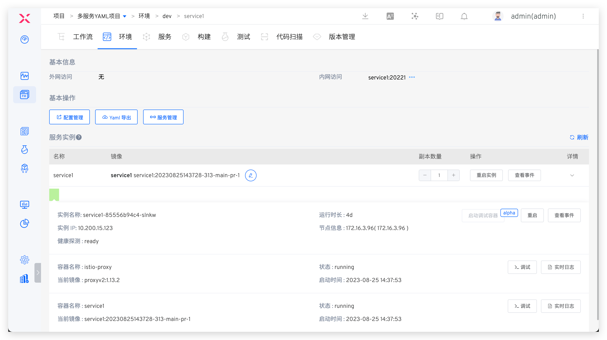
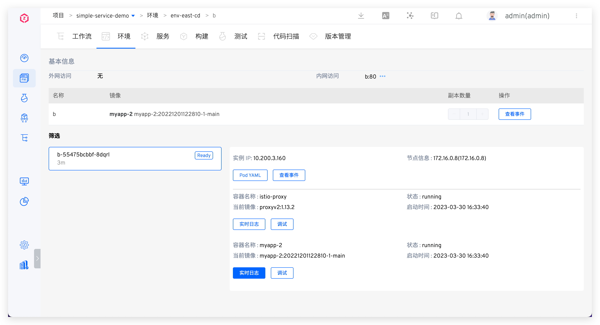
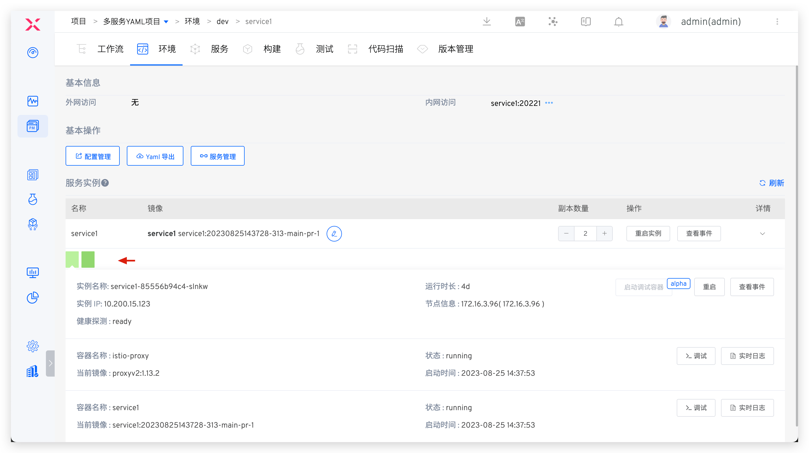
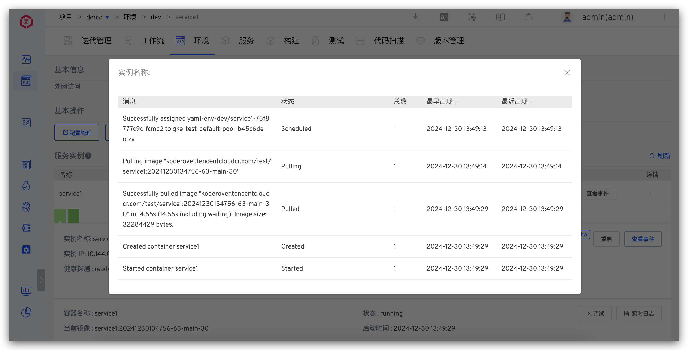
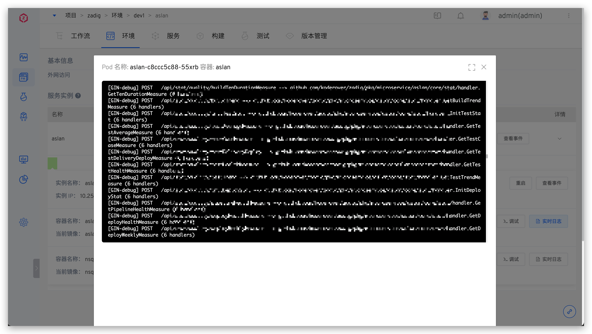
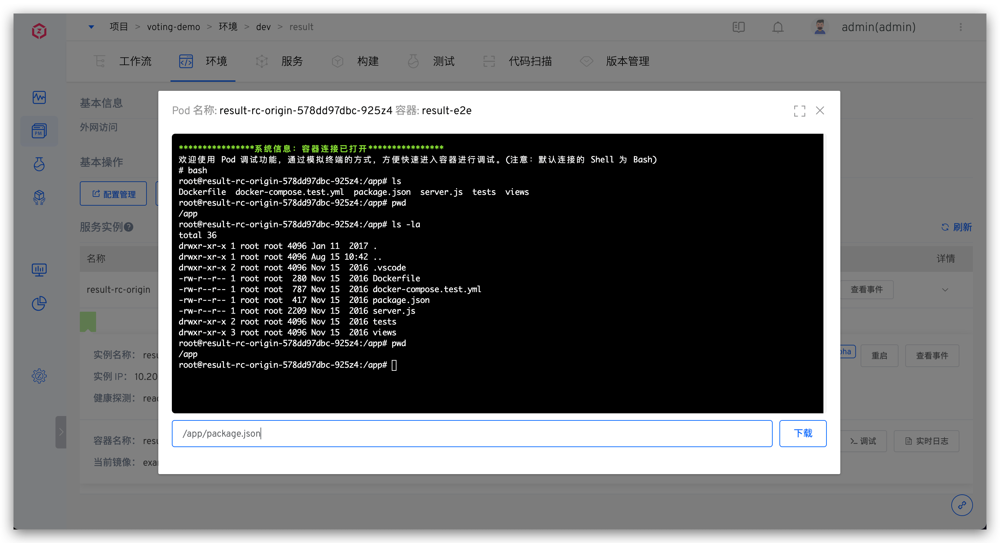
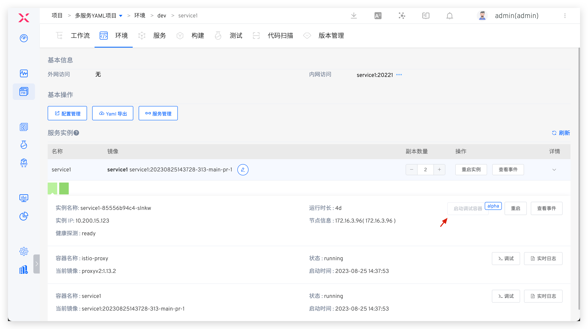
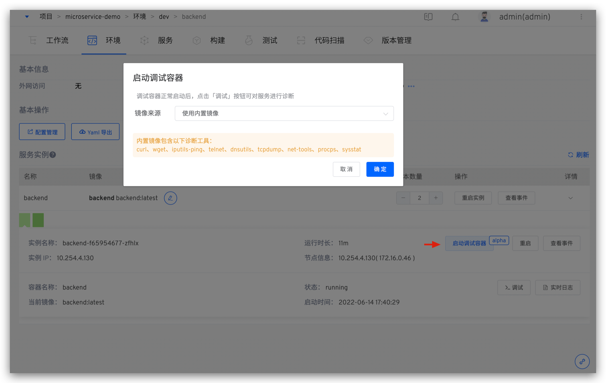
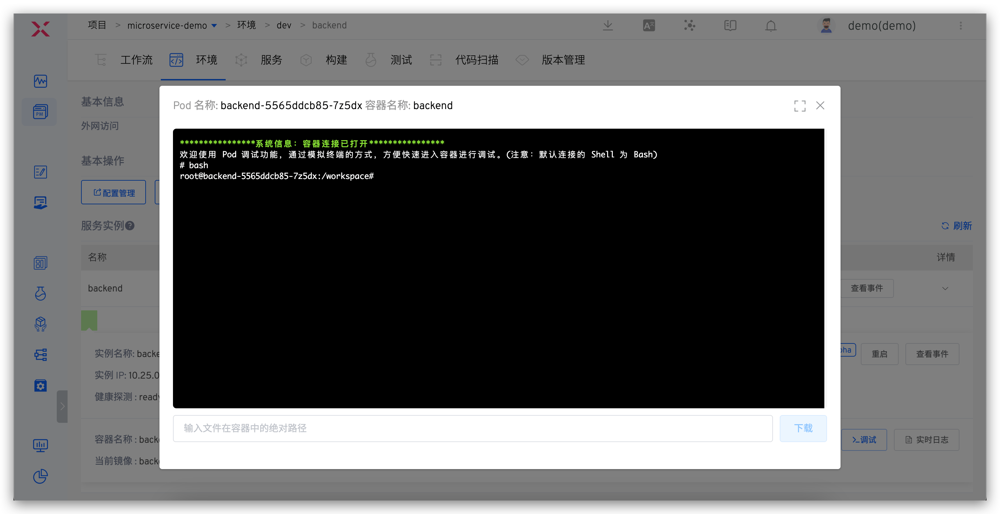

This article introduces the service-related operations in the environment in the projects that use Kubernetes (i.e., K8s YAML project/K8s Helm Chart project/K8s hosting project).

Click the service name in the service list to enter the service details page. The service details page displays detailed information about the service, and users can perform operations such as service restart, debugging, scaling, configuration management, and image updates.

When viewing production services, only read operations are allowed (such as operation status, service events, real-time logs, and logging into the service container for debugging).

> Production environment/production services are supported in K8s YAML projects and K8s Helm Chart projects.

## Basic Information
The basic information of the service displays the external network access information and the internal network Service access information.

- `External Access` : Service Ingress configuration information
- `Internal Access` : Service configuration information

## Basic Operations
> This feature is available in K8s YAML projects.

- `Configuration` : View and edit the ConfigMap defined in the service template. After modification, the service will be restarted based on the new configuration
- `YAML Export` : Export service information in K8s YAML format
- `Service` : Link to the details of the template associated with the service

## Service Instance Operations
- `Image Update` : Click the edit button to the right of the image to update the image used by the service. After selecting a new image, the container will automatically pull and update the image, and then restart
- `Restart Instance` : Click the button to restart the service
- `View Events` : View Pod events
- `Replica Number` : Dynamically adjust the number of service replicas

### Service Instance Details

The service instance details list displays all instances of the container service. After switching the instance, you can view the container details and health detection status of each service instance (Pod).

Users can perform operations on individual service instances:

- `Restart` : Restart the selected instance
- `View Events` : View the current service instance Pod events

- `Real-time Log` : View the real-time logs of the specified container under the service instance

- `Debug` : Log in to the service container for debugging and support downloading files from the container

- `Start Debug Container` alpha Start the debug container, you can log in to the debug container to debug the service. For details, refer to [the startup debug container.](#%E5%90%AF%E5%8A%A8%E8%B0%83%E8%AF%95%E5%AE%B9%E5%99%A8-alpha)

### Start Debug Container alpha

::: tip
The normal use of this feature depends on the K8s cluster version where the debugged service is located, as described below:

1. This feature is not available when the K8s cluster version is below v1.16
2. When the K8s cluster version is in v1.16 ~ v1.22, the cluster system component configuration needs to be adjusted, use feature-gates settings EphemeralContainers = true
3. When the K8s cluster version is v1.23 and above, this feature can be used without additional operations
:::

To start a debug container, you can use the system's built-in image or input a custom image based on actual needs.
> `curl` / `wget` / `iputils-ping` / `telnet` / `dnsutils` / `tcpdump` / `net-tools` / `procps` / `sysstat` tools available directly in the built-in image.

After the debug container `Zadig-debug` starts normally, click `Debug` to log in to the container and use the tools in the container to debug the service.

