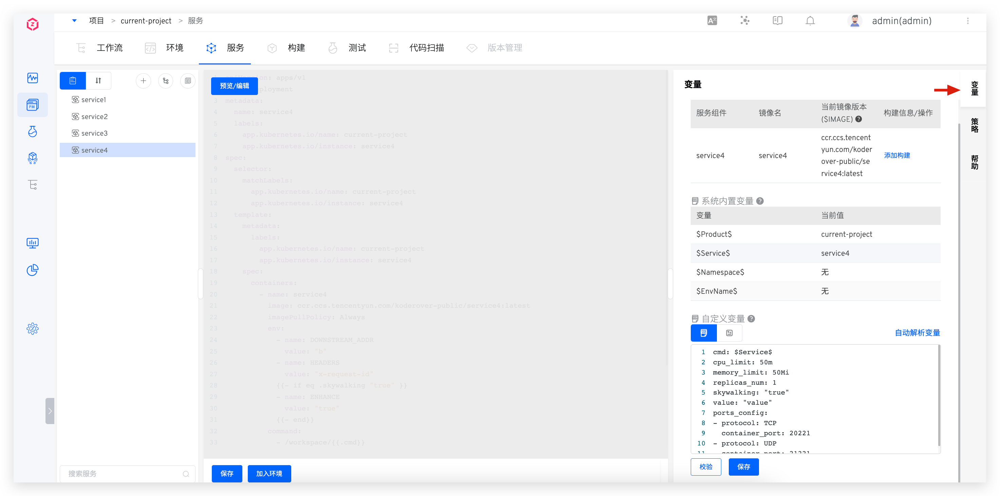
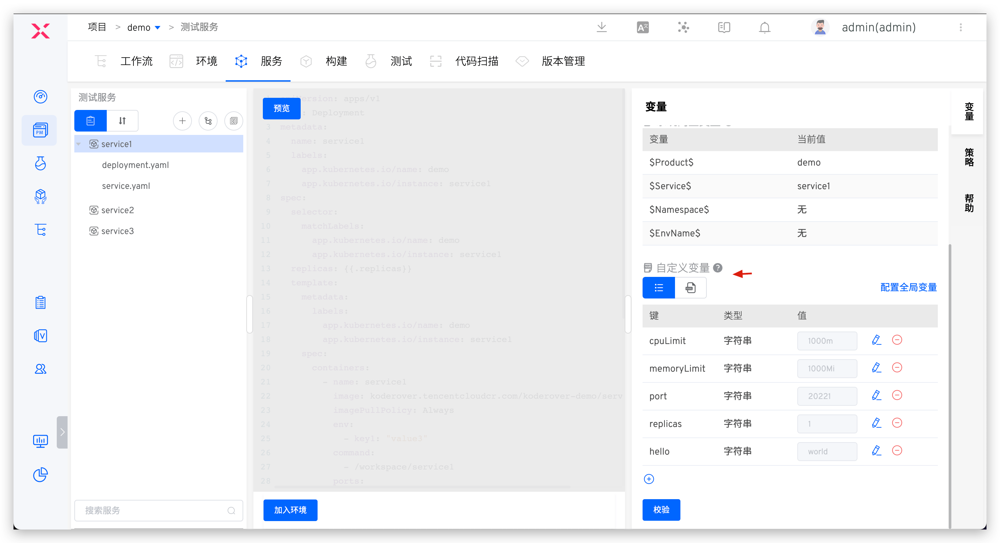
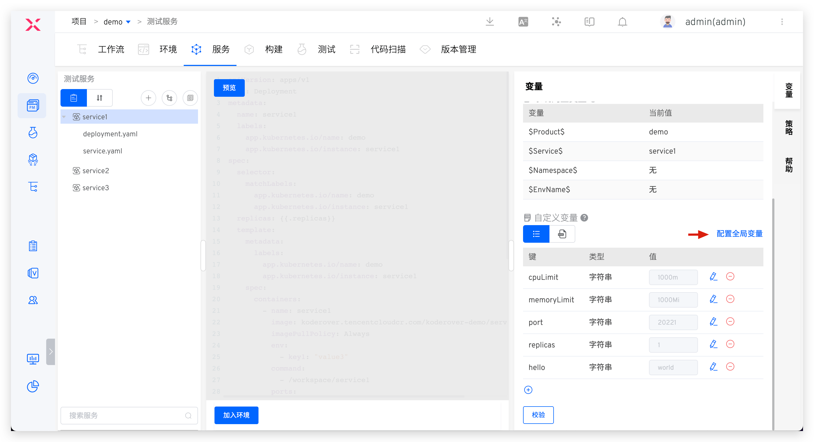
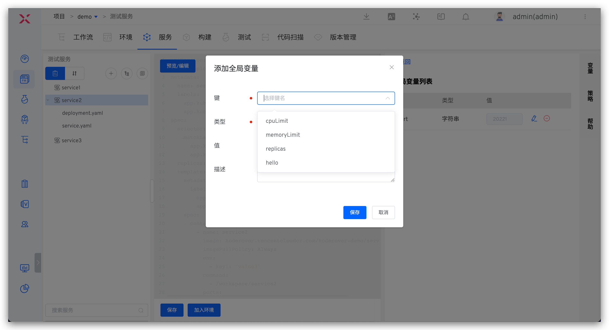

This article introduces the service variable features in the K8s YAML project.

## Variable Configuration
Select the service and click `Variable` on the right to enter the service variable configuration page. This includes system built-in variables, custom variables, and global variables.

- System built-in and custom variables can be referenced in the service YAML configuration
- In the service's YAML configuration, the container name and image information cannot use the built-in variables `$Namespace$` and `$EnvName$`
- Supports the configuration of global variables, which can override default values when creating a new environment to achieve differentiated configurations for different environments



### System Built-in Variables
These include `$Namespace$`, `$Product$`, `$Service$`, and `$EnvName$`, which can be directly referenced in YAML. Specific descriptions are as follows:
- `$Namespace$`: The name of the K8s namespace where the project's environment is located
- `$Product$`: The project name
- `$Service$`: The service name
- `$EnvName$`: The name of the created environment

### Custom Variables
- Content in the service's YAML configuration file in the form of <span v-pre>`{{.Key}}`</span> can be automatically parsed into custom variables.
- Click the `Key-values Pair` and `YAML` icons below the custom variable to switch the variable view.
- The type and default value of the service variable can be modified and validated. It supports four types: string, single choice, boolean, and YAML.



### Global Variables
Click `Global Variable` to the right of the custom variable to configure it.



Add global variables. The default available keys come from all services' custom variables (variables with the same key name are considered the same), or you can enter a custom key name to add.



## Use of Variables

### Create a New Environment

When creating a new environment, you can configure service variables and environment global variables to override the default values of variables in the service configuration, achieving differentiated configurations for different environments.

1. Global variables need to be configured in the service in advance. When creating a new environment, you can configure environment-level global variables
2. Supports using system built-in variables to assign values to global and service variables
3. Only global variables associated with services in the new environment service list can be specified when creating a new environment
4. Configure variable values for the service, which can be customized, or you can select to use the environment's global variables with one click


### Update Environment Global Variables

In the environment, click `Update Global Variables` to update the global variables in the corresponding environment.

1. Global variables in the environment take effect in the current environment
2. After modifying the value of the global variable, the services associated with the global variable will be automatically updated to apply the latest variable value.
3. Supports deleting global variables that are not associated with any service
4. Supports adding new global variables, which need to be defined first in the service's global variables


### Update Service Variables

When adding or updating services in an environment, you can modify the service variables, supporting manual modification or using environment global variables. When updating the service, you can also select whether to update the current service YAML version by checking `Update Service Configuration`.


## Variable Example

``` YAML
apiVersion: apps/v1
kind: Deployment
metadata:
  name: $T-Service$
  labels:
    app.kubernetes.io/name: $T-Project$
    app.kubernetes.io/instance: $T-Service$
  annotations:
{{.annotations}}
spec:
  selector:
    matchLabels:
      app.kubernetes.io/name: $T-Project$
      app.kubernetes.io/instance: $T-Service$
  replicas: {{.replicas_num}}
  template:
    metadata:
      labels:
        app.kubernetes.io/name: $T-Project$
        app.kubernetes.io/instance: $T-Service$
    spec:
      containers:
        - name: $T-Service$
          image: ccr.ccs.tencentyun.com/koderover-public/$T-Service$:latest
          imagePullPolicy: Always
          env:
            - name: DOWNSTREAM_ADDR
              value: "b"
            - name: HEADERS
              value: "x-request-id"
            {{- if .skywalking}}
            - name: ENHANCE
              value: "true"
            {{- end}}
          command:
            - /workspace/{{.cmd}}
          ports:
          {{- range .ports_config}}
            - protocol: {{ .protocol }}
              containerPort: {{.container_port}}
          {{- end}}
          resources:
            limits:
              memory: {{.memory_limit}}
              cpu: {{.cpu_limit}}
```

### Custom Variables

``` yaml
cmd: $Service$
cpu_limit: 50m
memory_limit: 50Mi
replicas_num: 1
skywalking: true
value: value
ports_config:
  - protocol: TCP
    container_port: 20221
  - protocol: UDP
    container_port: 21221
annotations: |1-
    owner: "John Doe"
    team: "DevOps"
```

## Best Practices Reference

Use the variable capabilities of services to achieve differentiated configurations in different environments. Best practice reference is as follows:

- [Database Isolation](/en/Zadig%20v4.0/env/multi-env/#database-isolation)
- [Domain Name Differentiation](/en/Zadig%20v4.0/env/multi-env/#differentiated-domain-name-access)