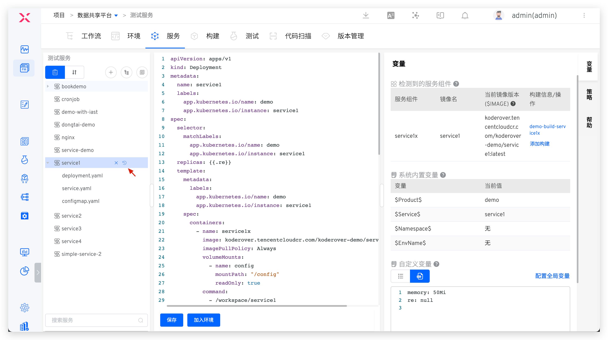
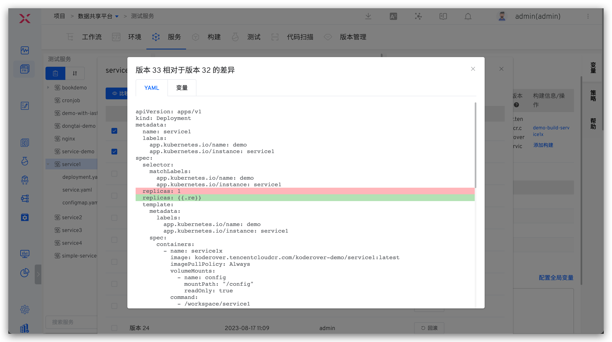
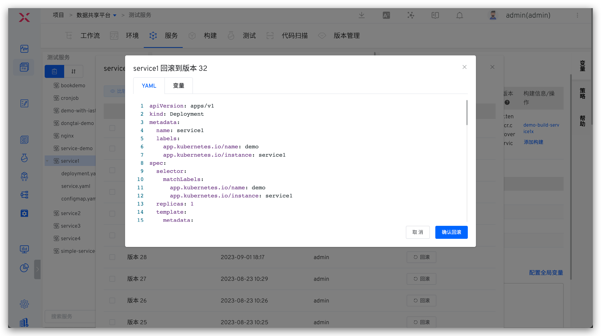
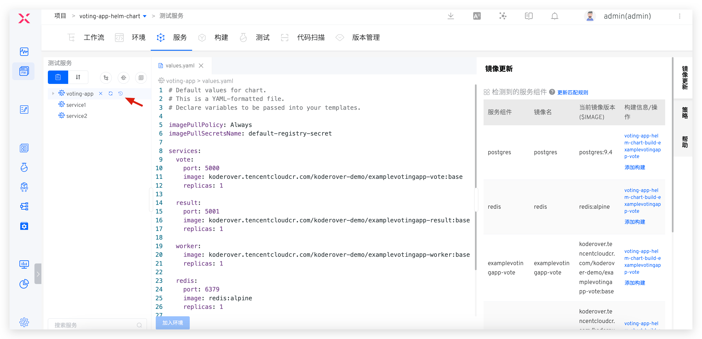
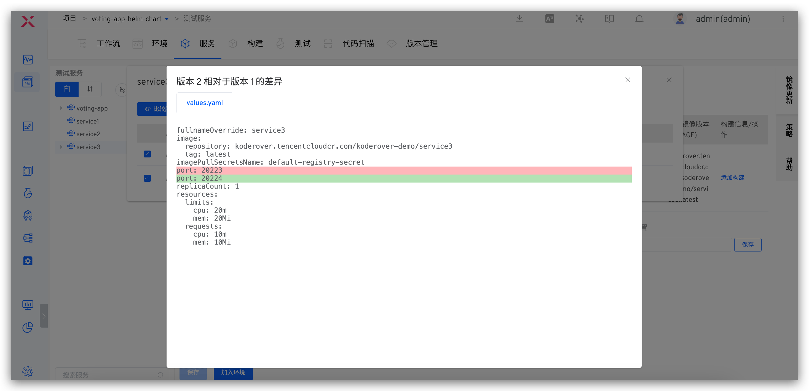
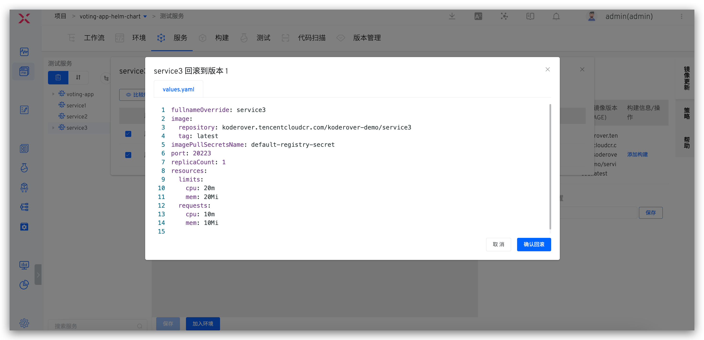

This article explains the version records and rollback of Zadig services.

## K8s YAML Project

::: tip
A new version is only generated when there are changes to the service YAML
:::

Click the historical version icon to the right of the service to view all versions of the service.

It supports comparing differences between different service versions and rolling back the service to a specified version with one click.

## Helm Chart Project

Click the historical version icon to the right of the service to view all versions of the service.

It supports comparing differences between values files of different versions and rolling back the service to a specified version with one click.

