This article introduces how to use Zadig's K8s YAML project variable configuration capabilities to achieve multi-environment isolation and global configuration management through a single configuration. Key use cases include:

- **Database Isolation**: Each environment's business data is stored independently in different databases, ensuring no interference
- **Differentiated Domain Access**: Use different domain names to access different environments
- **Differentiated Business Configuration**: Business configurations managed in Nacos, Apollo, and other configuration centers, with different environments using different configurations
- **Global Shared Configuration Management**: Globally manage configurations shared by multiple services

Zadig provides system-built-in variables and custom variables to distinguish different variable values across environments. The following sections detail the practical implementation of these configurations in the Zadig system.

## Database Isolation

> **Use Case**: Business data in different environments need to be isolated from each other, applicable when one database corresponds to multiple connection addresses or connects to different databases.

### Configure Service Variables

Using the `vote` service as an example, the database configuration is managed in a ConfigMap and mounted to the application via a volume. In Zadig, we extract database configuration items as custom variables:

- **`mgo_addr`**: Database address, default value set to `220.16.0.43` (adjustable based on actual conditions)
- **`mgo_db`**: Database name, default value set to `$Product$_$EnvName$_vote`

This uses system-built-in global variables:
- `$Product$`: Project name
- `$EnvName$`: Environment name

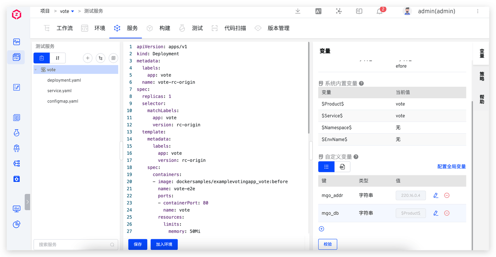

### Use Service Variables

When creating a new environment, variables in the configuration can use default values or be re-specified.

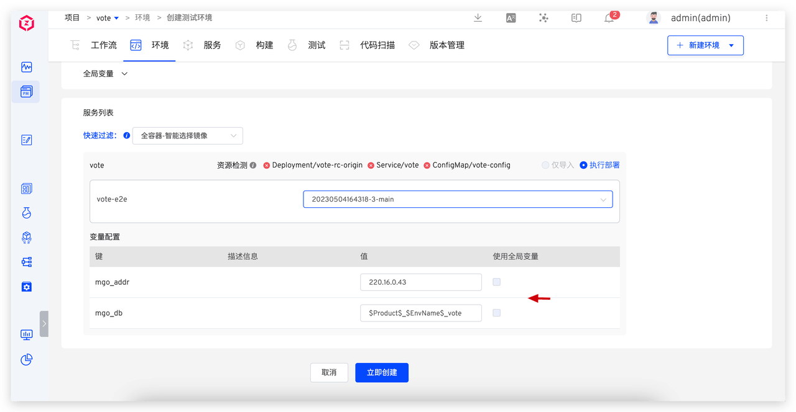

When the environment is created, variables are automatically rendered. For example:
- dev environment: `vote-dev-vote`
- qa environment: `vote-qa-vote`

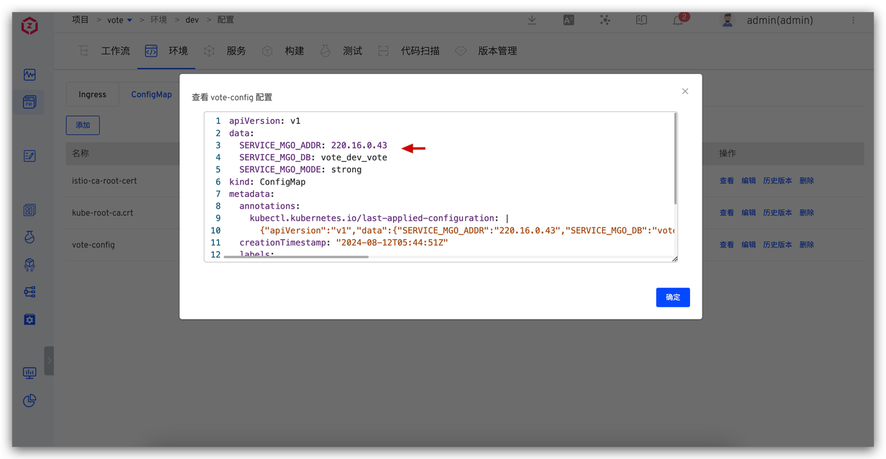
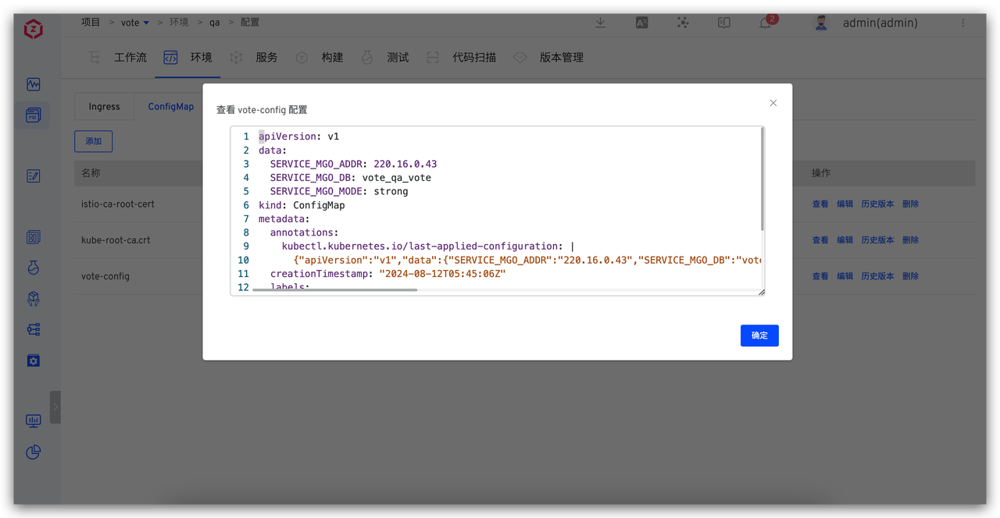

**Example YAML Configuration:**
:::details
```yaml
apiVersion: apps/v1
kind: Deployment
metadata:
  labels:
    app: vote
  name: vote-rc-origin
spec:
  replicas: 1
  selector:
    matchLabels:
      app: vote
      version: rc-origin
  template:
    metadata:
      labels:
        app: vote
        version: rc-origin
    spec:
      containers:
      - image: dockersamples/examplevotingapp_vote:before
        name: vote-e2e
        ports:
        - containerPort: 80
          name: vote
        volumeMounts:
        - name: config-volume
          mountPath: /app/config
      volumes:
      - name: config-volume
        configMap:
          name: vote-config
---
apiVersion: v1
kind: ConfigMap
metadata:
  name: vote-config
data:
  SERVICE_MGO_ADDR: {{.mgo_addr}}
  SERVICE_MGO_DB: {{.mgo_db}}
  SERVICE_MGO_MODE: strong
```
:::

## Differentiated Domain Access

> **Use Case**: Create multiple environments in Zadig and use different domain names to access different environments.

### Configure Wildcard Domain

Configure a wildcard domain for the cluster entry, such as `*.koderover.com`. Ensure the domain DNS correctly resolves to the external IP of the cluster [Ingress controller](https://kubernetes.io/zh/docs/concepts/services-networking/ingress-controllers/) LoadBalancer.


### Configure and Use Service Variables

Configure the external network access address for the service entry point. In Zadig, set a global variable: <span v-pre>{{.domain}}</span>, with the variable value configured as `vote-$EnvName$.koderover.com`

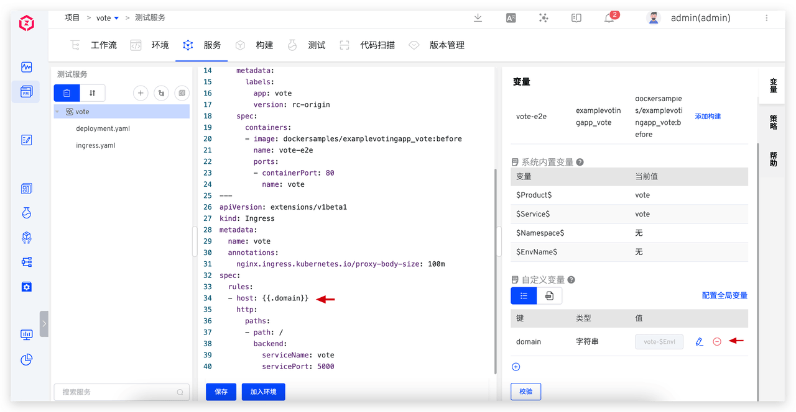

When creating a new environment, the system automatically renders the variables:

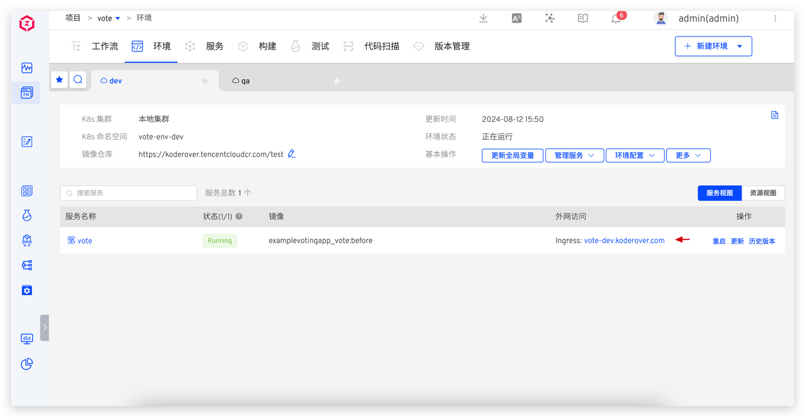
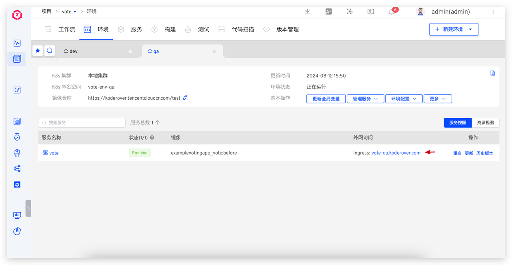

**Example YAML Configuration:**
:::details
```yaml
apiVersion: apps/v1
kind: Deployment
metadata:
  name: vote-rc-origin
spec:
  replicas: 1
  selector:
    matchLabels:
      app.kubernetes.io/instance: vote
      app.kubernetes.io/name: vote
  template:
    metadata:
      labels:
        app.kubernetes.io/instance: vote
        app.kubernetes.io/name: vote
    spec:
      containers:
      - image: dockersamples/examplevotingapp_vote:before
        name: vote-e2e
        ports:
        - containerPort: 80
          name: vote

---
apiVersion: networking.k8s.io/v1
kind: Ingress
metadata:
  name: vote
  annotations:
    nginx.ingress.kubernetes.io/proxy-body-size: 100m
spec:
  ingressClassName: {{.ingressClass}}
  rules:
  - host: {{.domain}}
    http:
      paths:
      - backend:
          service:
            name: vote
            port:
              number: 5000
        path: /
        pathType: ImplementationSpecific
---
apiVersion: v1
kind: Service
metadata:
  name: vote
spec:
  type: NodePort
  ports:
    - protocol: TCP
      port: 5000
      targetPort: 80
  selector:
    app.kubernetes.io/instance: vote
    app.kubernetes.io/name: vote
```
:::

## Differentiated Business Configuration

> **Use Case**: Service business configurations are managed in third-party configuration centers (such as Nacos, Apollo, etc.), with different environments using different configuration items. The following example uses an Apollo configuration center to demonstrate how to manage business configurations for different environments through Zadig.

### Configure Service Variables

Using the `myapp` service as an example, set the correspondence between Apollo configuration parameters and Zadig environment variables:

| Configuration Item | Description | Variable Type | Default Value |
|-------------------|-------------|---------------|---------------|
| `APOLLO_APP_NAMESPACE` | Apollo Configuration Center namespace | Custom variable `apollo_app_namespace` | `zadig.dev` |
| `APOLLO_APP_ID` | Apollo Configuration Center application | System-built-in variable `$Service$` | - |
| `APOLLO_APP_ENV` | Apollo Configuration Center environment | System-built-in variable `$EnvName$` | - |
| `APOLLO_APP_CLUSTER` | Apollo Configuration Center cluster | Custom variable `apollo_app_cluster` | `local` |


### Use Service Variables

When the environment starts or the `myapp` service starts, it retrieves service configuration from the corresponding configuration center.

dev and qa environment effects:

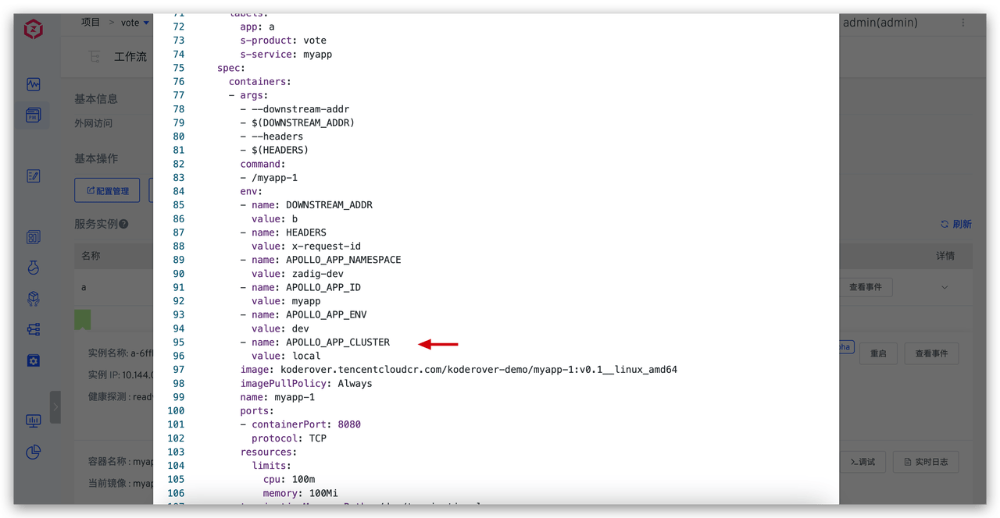
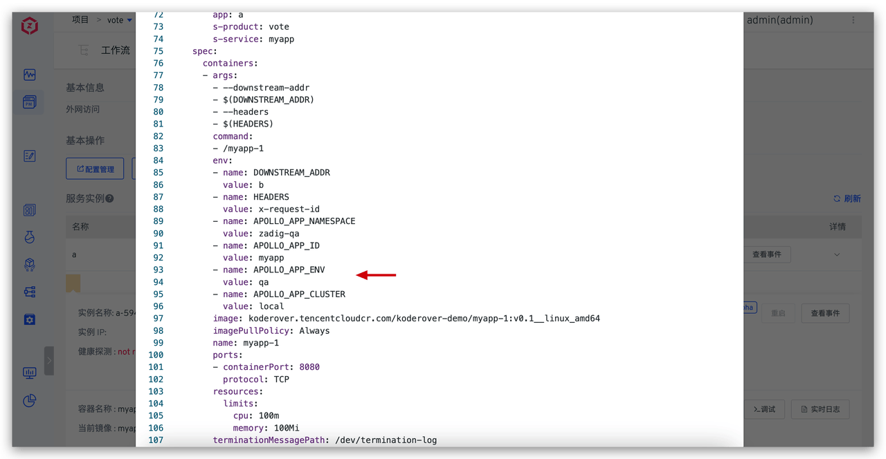

**Example YAML Configuration:**
:::details
```yaml
apiVersion: v1
kind: Service
metadata:
  name: a
  labels:
    app: a
spec:
  ports:
  - name: http
    port: 80
    targetPort: 8080
  selector:
    app: a

---

apiVersion: apps/v1
kind: Deployment
metadata:
  name: a
  labels:
    app: a
spec:
  selector:
    matchLabels:
      app: a
  replicas: 1
  template:
    metadata:
      labels:
        app: a
    spec:
      containers:
      - name: myapp-1
        image: koderover.tencentcloudcr.com/koderover-demo/myapp-1:v0.1__linux_amd64
        imagePullPolicy: Always
        command: ["/myapp-1"]
        args: ["--downstream-addr", "$(DOWNSTREAM_ADDR)", "--headers", "$(HEADERS)"]
        env:
          - name: DOWNSTREAM_ADDR
            value: "b"
          - name: HEADERS
            value: "x-request-id"
          - name: APOLLO_APP_NAMESPACE
            value: {{.apollo_app_namespace}}
          - name: APOLLO_APP_ID
            value: $Service$
          - name: APOLLO_APP_ENV
            value: $EnvName$
          - name: APOLLO_APP_CLUSTER
            value: {{.apollo_app_cluster}}
        ports:
        - containerPort: 8080
        resources:
          limits:
            cpu: 100m
            memory: 100Mi
```
:::

## Global Shared Configuration Management

In practical application scenarios, multiple services often share the same configuration information (such as database addresses, configuration management system addresses, etc.). To effectively manage these shared configurations and simplify maintenance work, we can use **global variables** to uniformly store and manage these variables.

### Benefits

- **Unified Management**: One modification, globally effective
- **Reduce Errors**: Avoid configuration inconsistencies caused by duplicate configurations
- **Improve Efficiency**: Simplify configuration maintenance work

### Configure Global Variables

Extract some variables from service variables as global variables:

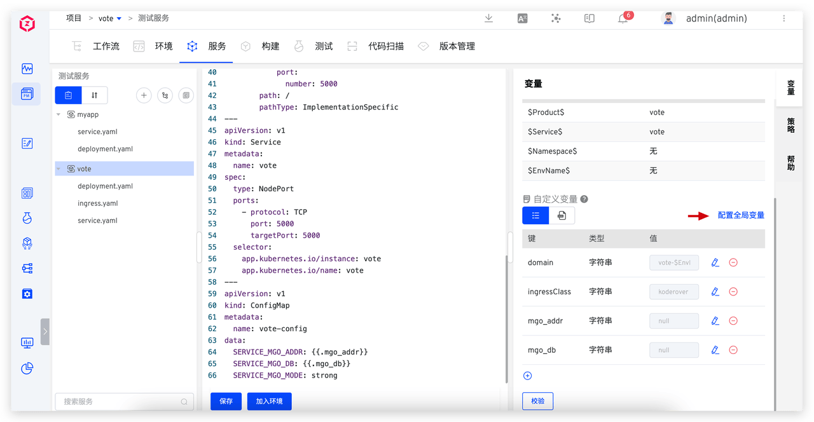


### Use Global Variables

When creating a new environment, you can choose whether the service uses global variables:

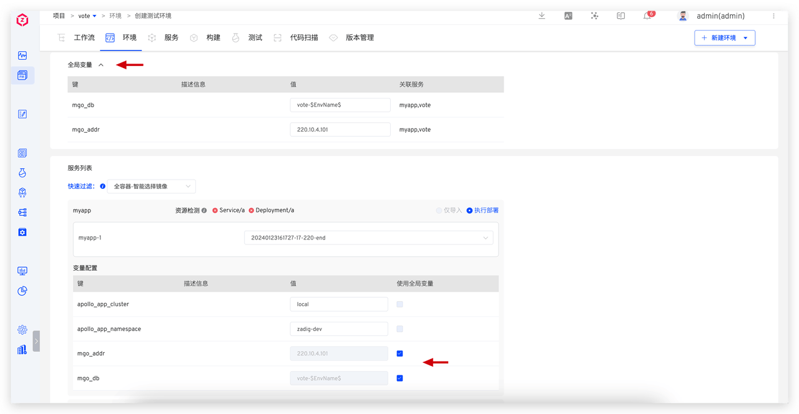

Global variable values in the environment can be modified. Once global variables change, all services that depend on these variables will be automatically updated to ensure configuration consistency and real-time updates:

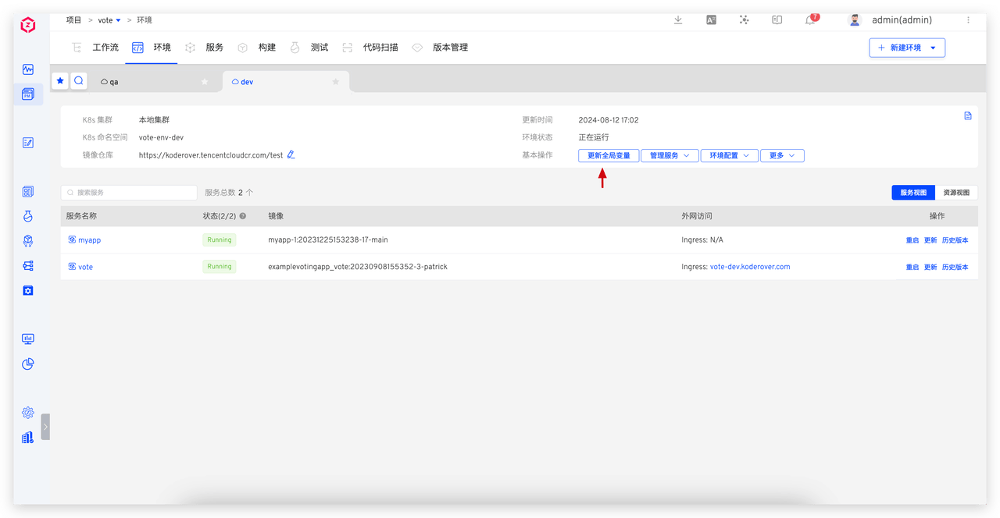
