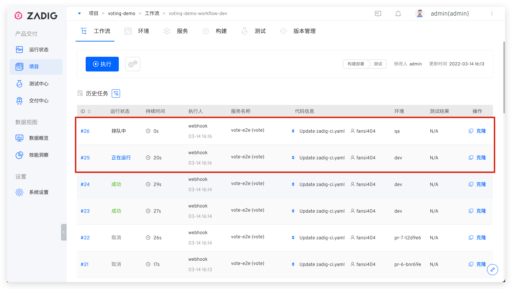

This article primarily introduces the load balancing capabilities of the Zadig environment. During peak usage periods, code changes that trigger workflow execution for service updates can lead to long wait times for workflow tasks due to environmental resource limitations, significantly impacting delivery efficiency. Zadig's environmental load balancing capability can alleviate the pressure on concurrent workflow tasks using environmental resources.

After simple configuration, the number of workflow tasks queued due to code changes can be reduced, maximizing resource utilization. The configuration steps are as follows:

1. Configure multiple environments
2. Configure product workflow Webhook triggers
3. Enable product workflow concurrency

## Step 1: Configure Multiple Environments
The Zadig system supports using a single set of service configurations to create multiple isomorphic environments. For detailed configuration steps, refer to [配置多套环境](/en/Zadig%20v4.0/env/multi-env/)

## Step 2: Configure the Workflow Webhook Trigger
After preparing multiple environments, configure the workflow trigger as shown in the figure below.

Explanation:
1. `部署环境`: Select multiple environments for deployment
2. `环境更新策略`: Select `动态选择空闲环境更新`
3. Complete other basic Webhook configuration items

At this point, the configuration is complete. Let's take a look at the final execution effect.

## Step 3: Enable Workflow Concurrency
Multiple tasks in the same workflow are executed serially by default. To reduce task queuing time, the concurrent execution capability of the workflow needs to be enabled.

Configuration method: Modify the workflow -> `运行策略` -> Select `并发运行`.

## Execution Effect
Submit two pull requests simultaneously, triggering two workflow tasks. These two tasks will deploy the service to relatively idle environments. If the workflow concurrency allows, these two tasks will be executed concurrently to improve delivery efficiency.
