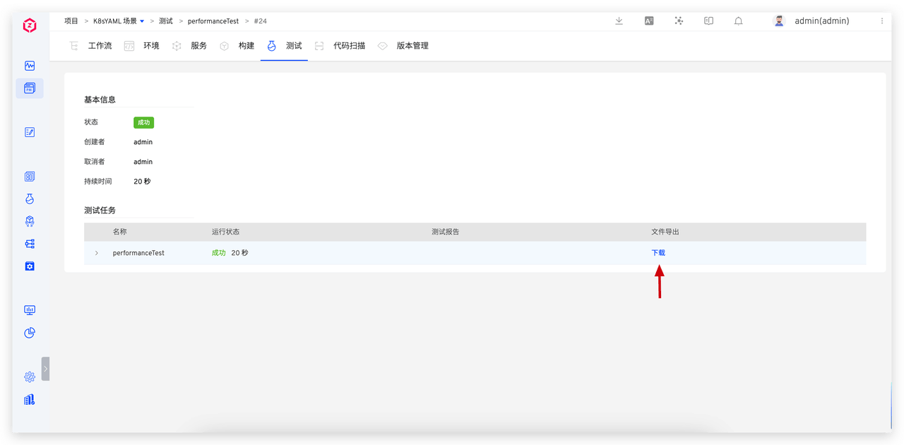
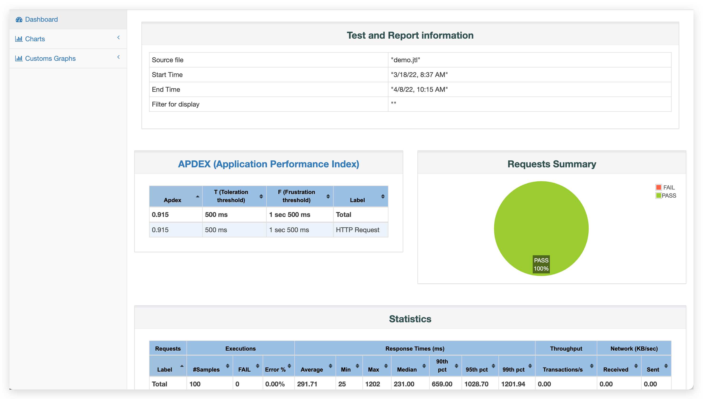

Zadig supports almost all testing tools and frameworks on the market. The following sections introduce the application practices of several mainstream testing frameworks in Zadig, including the management of automated test cases, the execution of automated tests, and the analysis of test reports. By leveraging Zadig's environmental capabilities, it enables the left shift of testing, empowering other roles to participate in quality assurance, effectively reducing the cost of problem discovery and resolution.

## JMeter

> For more information about JMeter, click [here](https://github.com/apache/jmeter).

### Organizing Automated Test Code

Based on the actual testing requirements and functions, write automated test code and organize it in the code repository. In this practice, we will use JMeter to perform a simple load test on the KodeRover official website. The source code for the automated test can be viewed by clicking [here](https://github.com/koderover/zadig/tree/main/examples/jMeter-demo).

### Configuring JMeter Packages

The Zadig system has a built-in JMeter application that can be used directly. If the built-in version does not meet your automated testing needs, refer to [Software Package Management](/en/Zadig%20v4.0/settings/app/) to add the required version. This example uses JMeter 5.4.3.

System administrators log in to Zadig → Access System Settings → Integration Management → Software Package Management, and add JMeter:


Parameter Description:
- Name: jMeter
- Version: 5.6.3
- Bin Path: $HOME/jmeter/bin
- Installation Package URL: https://dlcdn.apache.org/jmeter/binaries/apache-jmeter-5.6.3.tgz
- Installation Script:
```bash
mkdir -p $HOME/jmeter
tar -C $HOME/jmeter -xzf ${FILEPATH} --strip-components=1
```

### Configuring Automated Testing

Enter the project's test module, click `Create Test` to complete the test configuration.


This example configuration is as follows:
- Operating System: Ubuntu 20.04
- Packages: JMeter 5.6.3 and Java 1.12.0.1
- Code Information: Select the integrated code repository (the repository where the automated test source code is located)
- Test Script:
```bash
#!/bin/bash
set -ex
cd zadig/examples/jMeter-demo/
jmeter -n -t demo.jmx -l demo.jtl # run test
if [ -e reports ]; then
    rm -rf reports
fi
jmeter -g demo.jtl -o reports # generate reports
```
- Advanced Configuration: Configure the export of test results to download the test report for analysis after the test is executed. Fill in the test report directory, which in this case is `$WORKSPACE/zadig/examples/jMeter-demo/reports`

### Executing Automated Tests

After the configuration is complete, execute the automated tests.


### Analyzing the Test Report

Directly viewing the test report on the platform is not currently supported. After the automated testing is complete, click `Download` to download the test report to your local machine.



Interpret the downloaded test report to view the results of the load test and analyze performance bottlenecks.




## Ginkgo

> For more information about Ginkgo, click [here](https://github.com/onsi/ginkgo).

### Organizing Automated Test Code

Based on the actual testing requirements and functions, write automated test code and organize it in the code repository. In this practice, we will perform automated availability testing on the KodeRover official website and documentation site. The source code for the automated test can be viewed by clicking [here](https://github.com/koderover/zadig/tree/main/examples/test-demo/test).

### Configuring Packages

The Zadig system has built-in Ginkgo and Go applications that can be used directly. If the built-in versions do not meet your automated testing needs, refer to [Software Package Management](/en/Zadig%20v4.0/settings/app/) to add the required versions. This example depends on Go 1.16 and Ginkgo 2.0.0, and the configuration is as follows.

System Administrator Login to Zadig → Access System Settings → Integration Management → Package Management, and add Go and Ginkgo respectively:


Go Parameter Description:
- Name: go
- Version: 1.16.13
- Bin Path: $HOME/go/bin
- Installation Package URL: https://go.dev/dl/go1.16.13.linux-amd64.tar.gz
- Installation Script:

```bash
tar -C $HOME -xzf ${FILEPATH}
```

Ginkgo Parameter Description:
- Name: ginkgo
- Version: 2.0.0
- Bin Path: $HOME/ginkgo
- Installation Package URL: http://resource.koderover.com/ginkgo-v2.0.0-Linux.tar.gz
- Installation Script:
```bash
mkdir -p $HOME/ginkgo
tar -C $HOME/ginkgo -xvf ${FILEPATH}
chmod +x $HOME/ginkgo/ginkgo
```

### Configuring Automated Testing

Enter the project's test module, click `Create Test` to complete the test configuration.


This example configuration is as follows:
- Operating System: Ubuntu 20.04
- Packages: Go 1.16.13 and Ginkgo 2.0.0
- Code Information: Select the integrated code repository (the repository where the automated test source code is located)
- Test Script:

```bash
#!/bin/bash
set -ex

export GOPROXY=https://goproxy.cn,direct
cd zadig/examples/test-demo/test
ginkgo -v --junit-report=out.xml # Execute Test Cases and Generate JUnit XML Reports
```

- JUnit Report Directory: `$WORKSPACE/zadig/examples/test-demo/test`

### Executing Automated Tests

After the configuration is complete, execute the automated tests.


### Analyzing the Test Report

After the automated test is completed, click to view the test report to see the execution details of each test case and quickly filter and analyze failed test cases.


## Pytest
> For more information about Pytest, click [here](https://github.com/pytest-dev/pytest).

### Organizing Automated Test Code

Based on the actual testing requirements and functions, write automated test code and organize it in the code repository. In this practice, we will use Pytest to perform a mathematical operation test. The source code for the automated test can be viewed by clicking [here](https://github.com/koderover/zadig/tree/main/examples/pytest-demo/).

### Configuring Python Custom Images
To execute Pytest, Python needs to be installed in the environment. In Zadig, configure a custom image by referring to [Custom Image Management](/en/Zadig%20v4.0/settings/custom-image/).

Python 3.8 Custom Image Dockerfile Reference:

```Dockerfile
FROM python:3.8-slim

RUN apt-get clean && apt-get update && DEBIAN_FRONTEND=noninteractive apt-get install -y curl git tzdata

# Change Timezone
RUN ln -sf /usr/share/zoneinfo/Asia/Shanghai /etc/localtime

# install docker client
RUN curl -fsSL "http://resources.koderover.com/docker-cli-v19.03.2.tar.gz" -o docker.tgz &&\
    tar -xvzf docker.tgz &&\
    mv docker/* /usr/local/bin
```

After building the above Dockerfile into an image, complete the configuration in Zadig's "Custom Image".


### Configuring Automated Testing


Enter the specific project in Zadig and complete the configuration of the automated test as follows:
- Test Execution Environment: `python3.8`
- Code Information: Configure the code repository for the test execution
- Test Script: Configure the script to run the automated tests. In this example, the test script is as follows:
```bash
#!/bin/bash
set -x

pip install pytest-html

cd $WORKSPACE/zadig/examples/pytest-demo
pytest --junitxml=./junit.xml --html=./report.html # Execute Tests and Generate jUnit XML & HTML Test Reports
```
- Junit report directory: $WORKSPACE/zadig/examples/pytest-demo

### Executing Automated Tests

After the configuration is complete, execute the automated tests.


### Analyzing the Test Report

After the automated test is completed, click to view the test report to see the execution details of each test case and quickly filter and analyze failed test cases.


