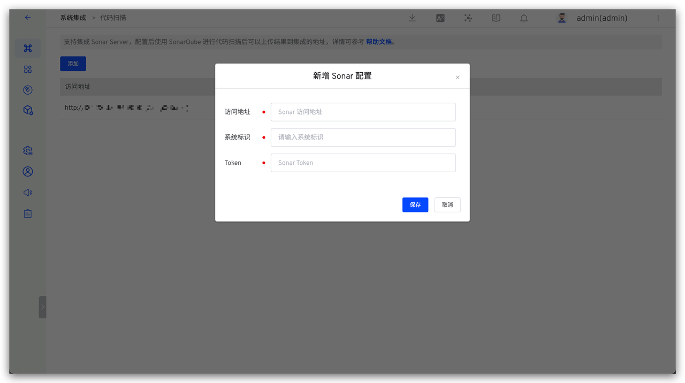
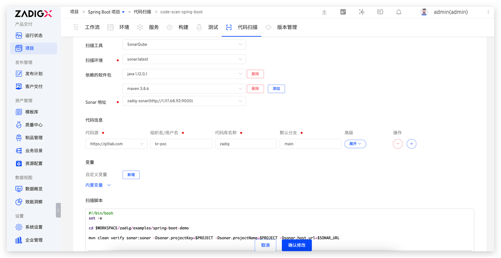
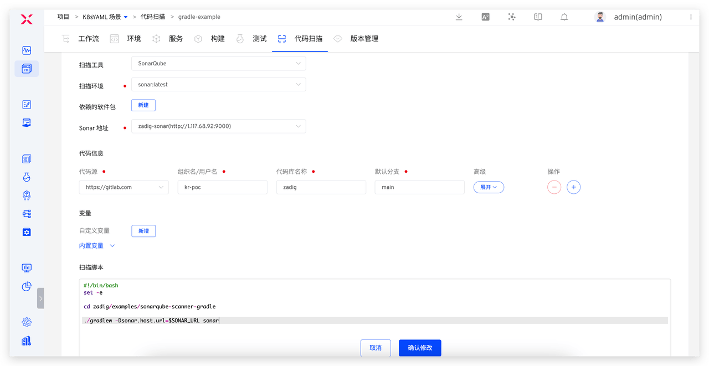
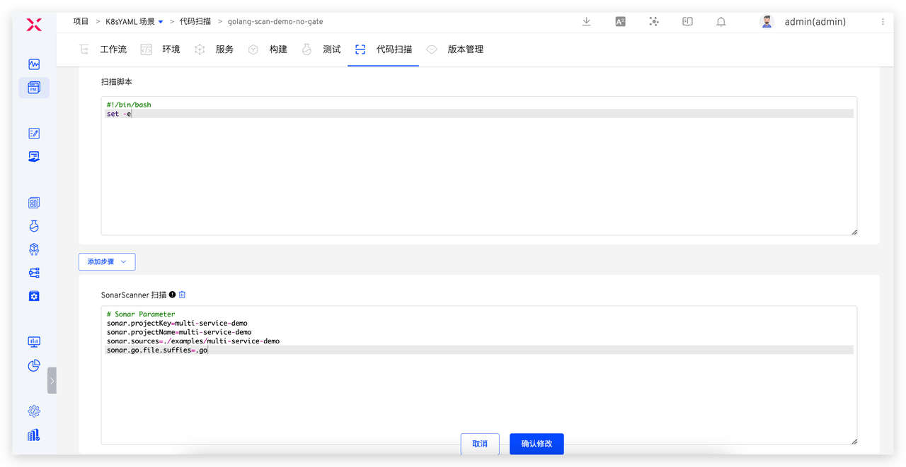
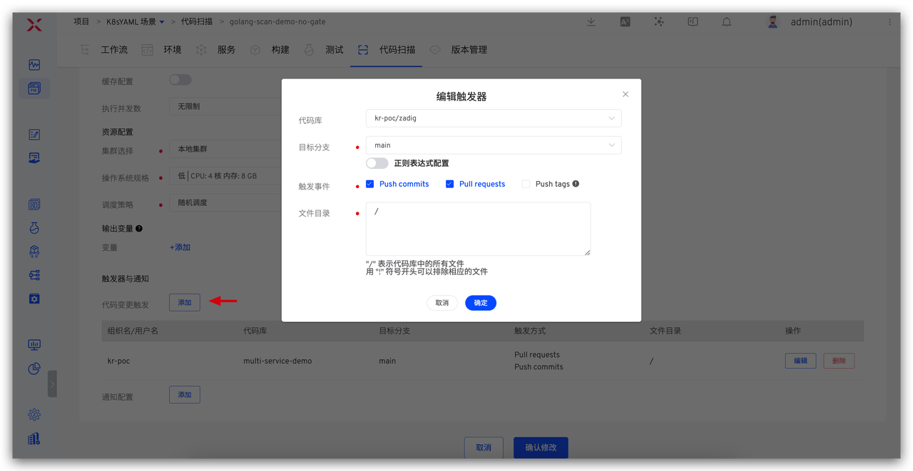
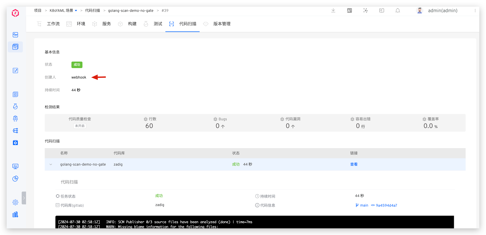
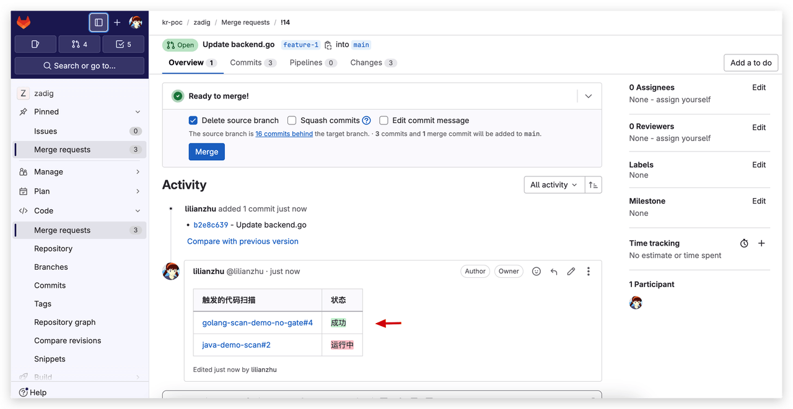
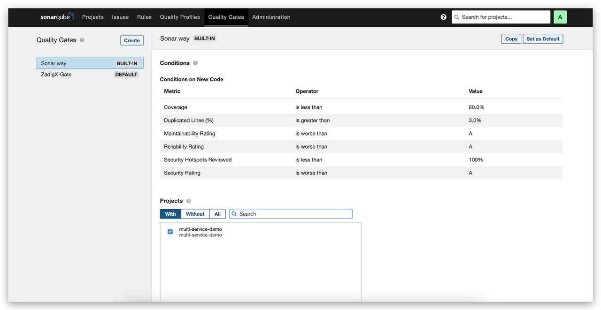
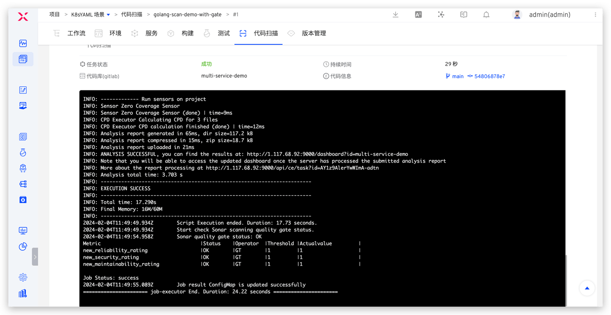

This article discusses how to use different scanning tools to perform Sonar code scanning on the Zadig platform, thereby improving the efficiency and quality of software development. Through detailed operation examples and configuration instructions, readers will learn how to configure and use tools such as Maven, Gradle, and SonarScanner on Zadig to provide strong support for project quality control. Additionally, this article explores advanced usage methods for Zadig code scanning, such as code change triggering, enabling quality gates, and the application of code scanning templates, aiming to help development teams better utilize the Zadig platform to automate and standardize code quality management.

## Preparation

To use code scanning in Zadig, you need to integrate Sonar Server first. For specific methods, refer to [documentation](/en/Zadig%20v4.0/settings/sonar/).



Below, we will introduce in detail how to configure and use different Sonar scanning tools on Zadig through specific examples.

## Use of Different Sonar Scanning Tools

According to Sonar's official documentation, the sonar analysis process, content, and results vary across different languages. For example, languages like JAVA and C# require analysis of compiled files such as .class and .dll, so the scanning tools used differ. Generally, JAVA uses Maven for sonar scanning; Gradle projects can directly use Gradle for code scanning, which is more convenient; other languages can use the SonarScanner CLI to perform the scanning process. Zadig has deeply integrated this, eliminating the need for additional downloading, setting up, and maintaining the SonarScanner CLI, thus reducing the maintenance and management burden of the tool. Additionally, Zadig centrally manages the Sonar Server address and Token information, which are automatically injected during code scanning, eliminating the need for additional configuration, reducing management burden, and enhancing security.

### Maven

Taking a Spring Boot project as an example, this section introduces how to configure and use Maven for code scanning in Zadig. The project source code can be found in the [spring-boot-demo](https://github.com/koderover/zadig/tree/main/examples/spring-boot-demo) repository.



Configuration instructions:
- Scan Environment: Basic Running Environment
- Dependent packages: Select the corresponding versions of JAVA and Maven. For package management, refer to [document](/en/Zadig%20v4.0/settings/app/)
- Sonar Host: Select the integrated Sonar Server address
- Code Information: Project source code repository address
- Scan Script:

```bash
#!/bin/bash
set -e

cd $WORKSPACE/zadig/examples/spring-boot-demo
mvn clean verify sonar:sonar -Dsonar.projectKey=$PROJECT -Dsonar.projectName=$PROJECT -Dsonar.working.directory=$WORKSPACE/$REPONAME_0/.scannerwork  -Dsonar.host.url=$SONAR_URL
```

Where:
- `$PROJECT`: Current project identifier
- `$SONAR_URL`: Sonar Server address

### Gradle

Taking a Gradle project as an example, we will introduce how to configure and use the Gradle build tool for code scanning on Zadig. The project source code can be found at: [sonarqube-scanner-gradle](https://github.com/koderover/zadig/tree/main/examples/sonarqube-scanner-gradle)



Configuration instructions:
- Scan Environment: Basic Running Environment. You can choose the official Sonar image or a custom image (which must include Java)
- Sonar Address: Select the integrated Sonar Server address
- Code Information: Project source code repository address
- Scan Script:

```bash
#!/bin/bash
set -e

cd zadig/examples/sonarqube-scanner-gradle
./gradlew -Dsonar.host.url=$SONAR_URL -Dsonar.working.directory=$WORKSPACE/$REPONAME_0/.scannerwork sonar
```

Where:
- `$SONAR_URL`: Sonar Server address

### SonarScanner

Taking a Go project as an example, we will introduce how to use Sonar Scanner CLI for code scanning on Zadig. The project source code can be found at: [multi-service-demo](https://github.com/koderover/zadig/tree/main/examples/multi-service-demo)




Configuration instructions:
- Scan Environment: Basic Running Environment. You can choose the official Sonar image; or a custom image (which must include Java and sonar-scanner)
- Sonar Address: Select the integrated Sonar Server address
- Code Information: Project source code repository address
- SonarScanner Scan: Add steps to fill in the Sonar scan parameters, for example:

```
# Sonar Parameter
sonar.projectKey=multi-service-demo
sonar.projectName=multi-service-demo
sonar.sources=./examples/multi-service-demo
sonar.go.file.suffies=.go
```

## Advanced Usage

### Code Change Trigger

After developers complete their code, they usually want timely feedback on code quality. Zadig supports automatically triggering code scanning upon code changes and feeding the results back to the code's MR/PR, providing an objective basis for code review.

- **Configure Triggers**: Edit code scan → Add code change triggers.



- **Effect display**: When you submit code on GitLab and create a Merge Request, the code scanning is automatically triggered, and the scan results are displayed on the MR.




### Enable Quality Gates

By setting up quality gates, you can perform strict quality checks before submitting the code to ensure it meets predefined quality standards and specifications. This helps improve code quality and reduce technical debt. SonarQube supports setting such quality gate rules for projects. After enabling "Quality Gate Check" in Zadig, the system will apply the quality gate rules from Sonar. If the scan task meets the rule conditions, the task passes; if not, the task fails.





### Code Scanning Template

For situations where multiple repositories have similar scanning processes, managing the scanning process for each repository individually can increase maintenance burden. To alleviate this, Zadig provides the code scanning template feature, allowing multiple repositories to share the same template. This way, when the scanning process needs to be updated, you only need to modify the template, and the scanning process for all associated repositories will be updated simultaneously, significantly reducing maintenance work.

- **Configure template**: Template library → Add and configure code scanning template.


- **Use template**: Create new code scan → Select "Use template" and choose the template → Fill in the code information.

