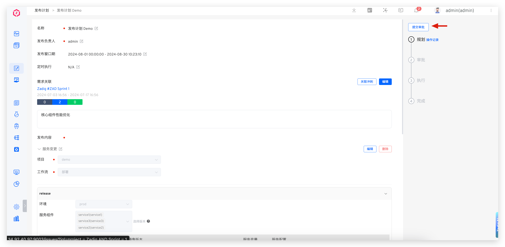
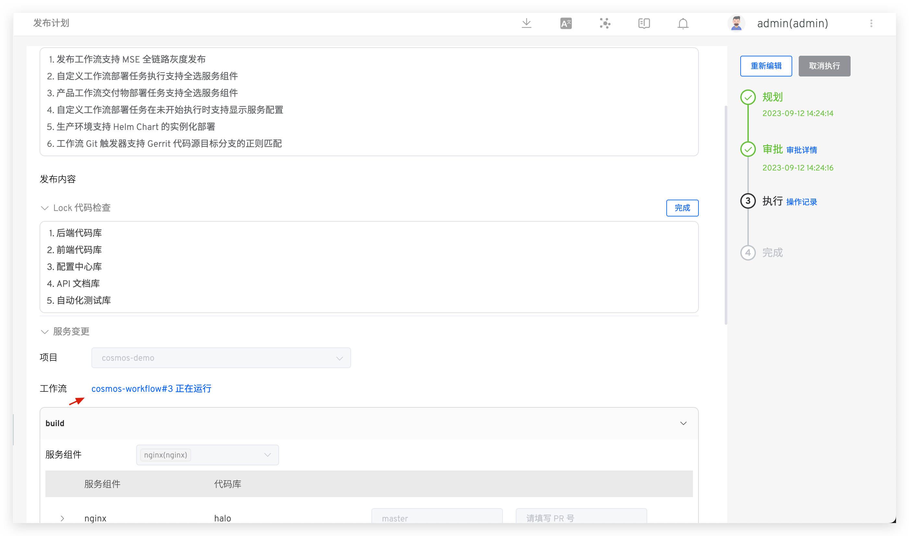

This article primarily explains how to use Zadig's release plan feature, including planning, approval, and execution of release plans, as well as tracking detailed operation records.

## Planning
Access Management -> Release Plan: Create a new release plan, fill in the details, and save it as a draft. This feature supports multi-person collaboration for planning the release.

Parameter Description:

- `Name`: The name of the release plan
- `Release Owner`: The person responsible for this release. After the release plan is formulated, only the owner can execute the release
- `Release Window`: The time window during which publishing operations can be performed
- `Scheduled Execution`: Execute the workflow in the release items at a specified time
- `Requirement Association`: The associated requirement list, supporting multiple JIRA sprints
- `Release Content`: Specific release content, which can include two types: rich text and workflow
    - `Rich Text Type`: Input content
    - `Workflow Type`: Select the project and workflow in Zadig and configure the workflow parameters as needed
- `Approval Configuration`: Configure approval as needed, supporting three methods: Zadig, Feishu, and DingTalk
    - `Zadig` : The approval application will be sent to the email address corresponding to the account Zadig For specific approval configuration, please refer to the document [Zadig](/en/Zadig%20v4.0/workflow/approval/#zadigx-%E5%AE%A1%E6%89%B9/)
    - `Feishu` : The approval application will be sent to Feishu. For specific approval configuration, please refer to the document [Feishu for approval.](/en/Zadig%20v4.0/workflow/approval/%E9%A3%9E%E4%B9%A6%E5%AE%A1%E6%89%B9/)
    - `Dingtalk` : The approval application will be sent to DingTalk. For specific approval configuration, please refer to the document [DingTalk approval.](/en/Zadig%20v4.0/workflow/approval/%E9%92%89%E9%92%89%E5%AE%A1%E6%89%B9/)

## Approval

> This applies to scenarios where the release plan includes approval configuration.

After the release owner submits the approval, the approver is responsible for the approval. Only after the approval is granted can the release owner proceed with the release.

::: tip
If the approval is rejected, the release plan content can be edited again and the release plan can be re-planned.
:::

## Execution

::: tip
1. Execution can be performed within the release time window.
2. Only the release owner can execute the release.
:::

For rich text type release content, click `Complete` on the right and enter the release notes.

For workflow type release content, click `Execute` on the right to automatically trigger the workflow execution. Click the link to view the workflow execution details.
<!-- 终版 ok 后再展开说明工作流执行参数 -->

For release items that need to be skipped, click `Skip`. Once all release items are either executed or skipped, the release plan will be automatically marked as completed.

## Operation Record

The system keeps a detailed record of the release plan's operation logs. Click `Operation Record` to view them.

