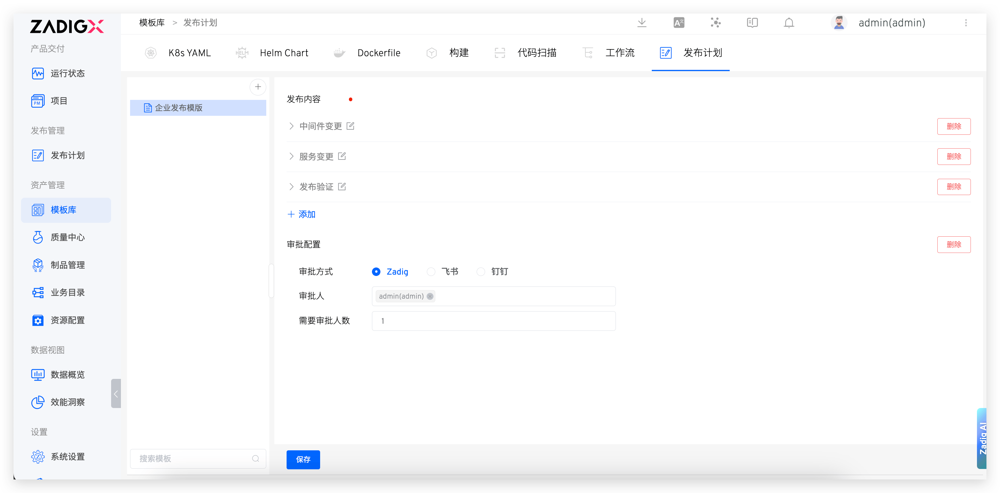
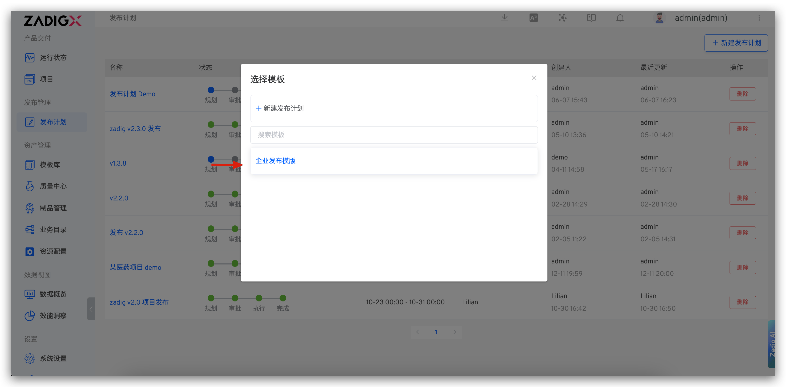

The release plan template enables users to design release specifications based on specific release requirements, thereby achieving the standardization and normalization of project releases.

## New Template

Go to `Assets` → `Templates` → `Release Plan` in sequence, click `+`, enter the template name and content, and save it.

## Using Templates

Visit `Release Plan` → `Create Release Plan` → select the release plan template.

