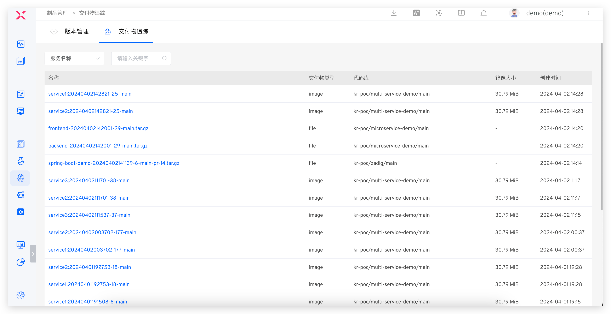
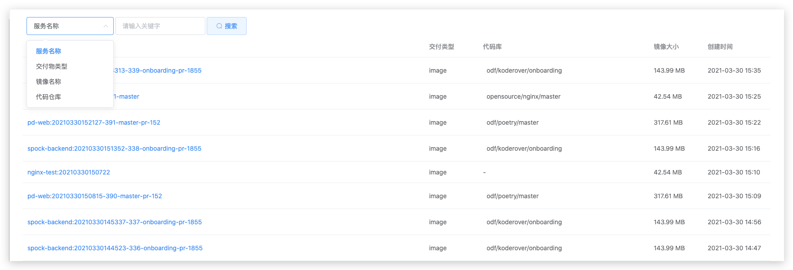
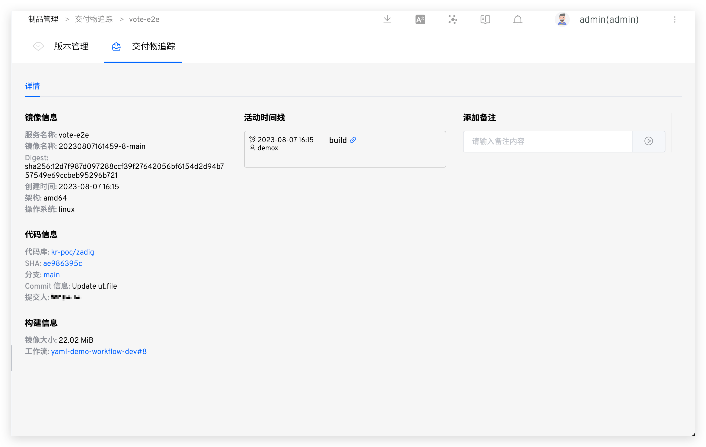
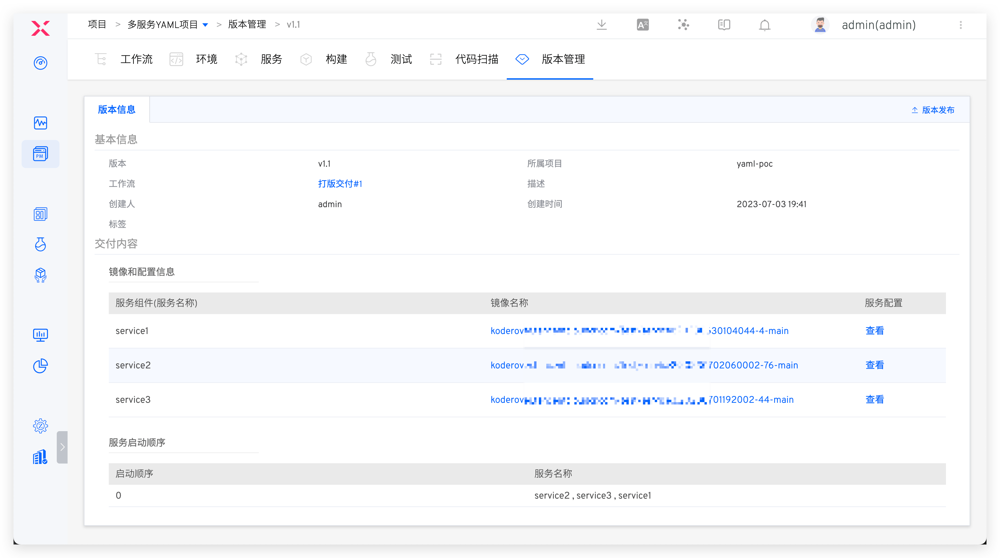

Delivery includes images and binary files

## Images and Binary Files

The stages each image or binary has gone through can be traced through the delivery tracking.

In the Delivery Center → Delivery Tracking, you can view all available images and basic information

You can filter and search by keyword based on the service name, delivery item type, image name, and code repository, as shown in the figure below:

After selecting a delivery item and clicking on it, you can view the delivery item details, which include the specific activity timeline, image information, code information, build information, Layer information, etc.:

You can also link directly from the version-managed image to the delivery item to facilitate viewing the delivery item details.

