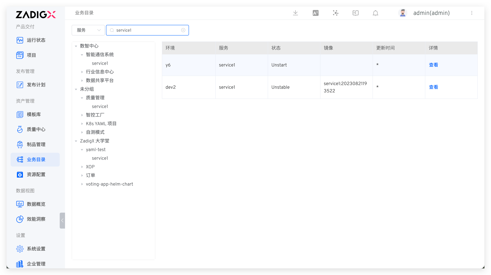

The Business Directory provides the service management perspective of the Zadig system. It allows you to quickly search for projects and services, view the operational status, image information, and update time of services across all environments, and jump directly to the environment to quickly check the services, especially useful for troubleshooting services with abnormal status.

