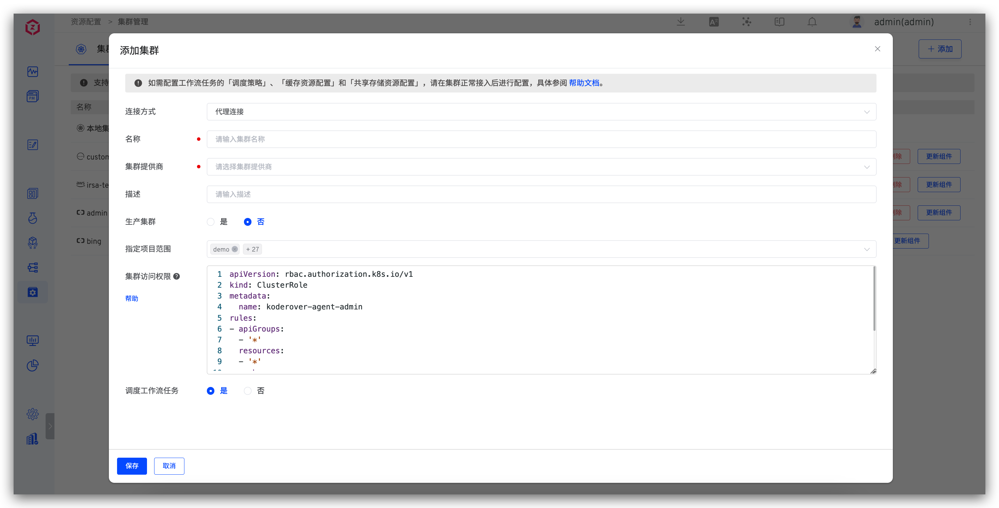
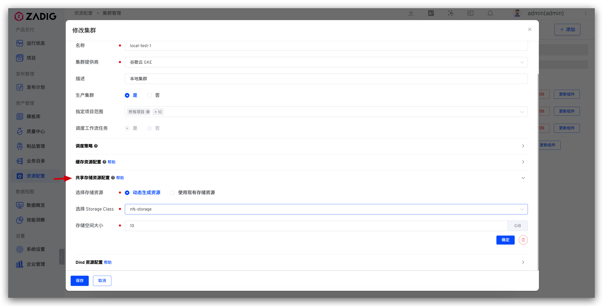

This article describes how to manage multiple clusters on the Zadig system. Zadig is installed on a local cluster and supports the access and use of multiple external Kubernetes cluster resources.

## Add a Cluster

### Basic Configuration

Visit `Resources` → `Cluster Management`, and click `Add`.



Parameter Description:

- `Connection Method`: Supports `Proxy Connection` and `Direct Connection` methods. For specific operations, please refer to [the proxy connection method](#%E4%BB%A3%E7%90%86%E8%BF%9E%E6%8E%A5) and [direct connection method](#%E7%9B%B4%E6%8E%A5%E8%BF%9E%E6%8E%A5) .
- `Name`: Cluster names only support lowercase letters, numbers, and hyphens.
- `Cluster Provider`: Supports `Alibaba Cloud ACK`, `Tencent Cloud TKE`, `Tencent Cloud TKE Serverless`, `Huawei Cloud CCE`, `Volcengine VKE`, `Amazon EKS`, `Microsoft Azure AKS`, `Google Cloud GKE`, `Oracle OKE`, and other self-built Kubernetes clusters.
- `Description`: The purpose description of the cluster.
- `Production Cluster`: After opening, build / Test / code scan / general task / custom task / grayscale release /istio release / blue and green release / canary release / update K8s YAML Tasks / new environment selection clusters, etc. all show whether it is production.
- `KubeConfig`: The content of the KubeConfig configuration file for the cluster to be connected. This is required when using the `Direct Connection` method.
- `Specify Project Scope`: Specifies which projects the cluster can be used by. `All Projects` includes all projects created after the cluster is added.

#### Proxy Connection
> Install an Agent in the external cluster. Applicable scenario: The external cluster can access the cluster where Zadig is located.

After selecting `Proxy Connection` and filling in the basic information of the cluster, execute the Agent installation script in the cluster to be connected, as shown in the figure:


After the script is executed, refresh the cluster list to check the cluster status. If the status is normal, the connection is successful.

#### Direct Connection
> Requires admin permissions for the external cluster. Configure its KubeConfig in the Zadig system. Applicable scenario: The cluster where Zadig is located can access the external cluster.

Select `Direct Connection` and fill in the basic information of the cluster and the KubeConfig content of the external cluster, then save.

### Alibaba Cloud ACK

Add a cluster, the cluster provider selects `Alibaba Cloud ACK` , and the other configurations refer to the description in [the basic configuration](#%E5%9F%BA%E7%A1%80%E9%85%8D%E7%BD%AE) .


### Tencent Cloud TKE

Add a cluster, the cluster provider selects `Tencent Cloud TKE` , and the other configurations refer to the description in [the basic configuration](#%E5%9F%BA%E7%A1%80%E9%85%8D%E7%BD%AE) .


### Tencent Cloud TKE Serverless

Add a cluster, the cluster provider selects `Tencent Cloud TKE Serverless` , and the other configurations refer to the description in [the basic configuration](#%E5%9F%BA%E7%A1%80%E9%85%8D%E7%BD%AE) .


### Huawei Cloud CCE

Add a cluster, the cluster provider selects `Huawei Cloud CCE` , and the other configurations refer to the description in [the basic configuration](#%E5%9F%BA%E7%A1%80%E9%85%8D%E7%BD%AE) .


### Amazon EKS

> Only proxy connection is supported.

Add a cluster, the cluster provider selects `Amazon EKS` , and the other configurations refer to the description in [the basic configuration](#basic-configuration) .


#### Using IRSA Configuration

Workflow tasks executed on Amazon EKS support the use of IRSA to interact with AWS. The specific configuration method is as follows:

1. [Create an IAM OIDC provider for the Amazon EKS cluster](https://docs.aws.amazon.com/zh_cn/eks/latest/userguide/enable-iam-roles-for-service-accounts.html): Each cluster needs to be created only once.
2. [Assign an IAM role to the Kubernetes service account](https://docs.aws.amazon.com/zh_cn/eks/latest/userguide/associate-service-account-role.html): Obtain the `role-arn`.
3. Configure the obtained `role-arn` in the Zadig system: "Cluster Configuration" - "Advanced Configuration" - enable "Use IRSA" and configure the Role ARN information.


4. Configure the workflow tasks to schedule to the corresponding Amazon EKS cluster.

> For detailed operations of the above steps 1 and 2, refer to the [Amazon EKS official documentation](https://docs.aws.amazon.com/zh_cn/eks/latest/userguide/iam-roles-for-service-accounts.html)

### Microsoft Azure AKS

Add a cluster, the cluster provider selects `Microsoft Azure AKS` , and the other configurations refer to the description in [the basic configuration](#%E5%9F%BA%E7%A1%80%E9%85%8D%E7%BD%AE) .


### Google Cloud GKE

Add a cluster, the cluster provider selects `Google Cloud GKE` , and the other configurations refer to the description in [the basic configuration](#%E5%9F%BA%E7%A1%80%E9%85%8D%E7%BD%AE) .


### Oracle OKE

> Only proxy connection is supported.

Add a cluster, the cluster provider selects `Oracle OKE` , and the other configurations refer to the description in [the basic configuration](#basic-configuration) .


### Standard Kubernetes Clusters

Add a cluster, the cluster provider selects `Standard Kubernetes Cluster` , and the other configurations refer to the description in [the basic configuration](#basic-configuration) .


## Basic Operations
- `Disconnect`: Disconnecting the cluster will not delete the environment resources already created in the cluster. If you need to clean up, please delete them manually. After the cluster is disconnected, you can reconnect by executing the Agent installation script again.
- `Edit`: You can modify the basic information and advanced configuration of the cluster.
- `Delete`: Deleting the cluster will not delete the environment resources already created in the cluster. If you need to clean up, please delete them manually.
- `Update Agent`: Update the Agent installed in the cluster by Zadig, i.e., the dind and koderover-agent components under the koderover-agent namespace.

## Cluster Access Permissions
For clusters connected via proxy, you can set the permissions for Zadig to access the cluster in the advanced configuration. After modifying the configuration, you need to actively disconnect the cluster and reconnect.

::: details Click to view configuration example
```
apiVersion: rbac.authorization.k8s.io/v1
kind: ClusterRole
metadata:
  name: koderover-agent-admin
rules:
- apiGroups:
  - '*'
  resources:
  - '*'
  verbs:
  - '*'
- nonResourceURLs:
  - '*'
  verbs:
  - '*'
```
:::

## Setting Scheduling Policies

Supports configuring whether to schedule workflow tasks to the cluster and setting the scheduling policies for cluster resources. For example, when executing workflow tasks:

- `Random Scheduling`: No label is required. Workflow tasks will be randomly scheduled to any node in the cluster.
- `Priority Scheduling`: Requires specifying a label. Workflow tasks will be preferentially scheduled to nodes that match the label. If the node resources cannot meet the scheduling requirements, the task will be assigned to other nodes.
- `Force Scheduling`: Requires specifying a label. Workflow tasks will be scheduled to nodes that match the label.
- `Configure Tolerance`: Tolerance (Toleration) is applied to Pods, allowing the scheduler to schedule Pods with corresponding taints. You can configure the tolerance in the text box. The specific parameters are as follows.
``` yaml
  — key: "key1"
    operator: "Equal"
    value: "value1"
    effect: "NoSchedule"
```

Toleration is applied to Pods. Tolerance allows the scheduler to schedule pods with corresponding taints.<br>
Taints and tolerances work together to allocate Pods to target nodes more precisely. Each node can have one or more taints, and if a Pod cannot tolerate these taints, it will not be deployed on that node. Note that tolerance allows scheduling but does not guarantee successful scheduling. In addition to tolerance, the scheduler will also evaluate other parameters. For more details, see: [Taints and Tolerations](https://kubernetes.io/zh-cn/docs/concepts/scheduling-eviction/taint-and-toleration/).

::: tip
Supports specifying cluster scheduling policies in workflow configurations. If not specified, the `Default` scheduling policy is used.
:::


## Cache Resource Configuration

Cache policies can be configured for different cluster resources as needed.

### Using Object Storage

Uses integrated object storage to cache resources. You can integrate object storage in [Object Storage Management](/en/Zadig%20v4.0/settings/object-storage/).

::: tip
Uploading of caches / Downloads are affected by network conditions. Using object storage as cache media does not necessarily improve construction efficiency. For more best practices, please refer to: [Zadig cache configuration guide](https://www.koderover.com/blog/build-cache/) .
:::


### Using Cluster Storage


You can use existing storage resources in the cluster or create resources dynamically as needed.

**Select a Storage Resource**

- `Dynamic Generation`: Select a file storage type StorageClass and specify the dynamically generated storage space size. Note: If Tencent Cloud cbs is used as StorageClass, the valid storage space size range (GiB): [10, 32000].
- `Use Existing Storage Resource`: Select an existing storage resource. Note: In the PVC creation of the storage resource, accessModes must be ReadWriteMany.

**Cache Directory Rules**

You can set the relative path rules for cache resources in cluster storage to implement shared caching or exclusive caching for different projects/workflows/service components. The following variables are supported:

    $PROJECT: Project name
    $WORKFLOW: Workflow name
    $SERVICE_MODULE: Service component name (not applicable in test workflows; for test workflow caches, this variable will be ignored)

For example:
| Cache Directory Rules | Description |
|---------------------------------------|--------------------------------------------------------------------------|
| `$PROJECT/$WORKFLOW/$SERVICE_MODULE`  | Set up separate caches for service components in the same project and the same workflow, ensuring different service components do not interfere with each other            |
| `$PROJECT/$WORKFLOW`                  | Share caches for the same workflow under the same project; different workflows have exclusive caches that do not interfere with each other                      |
| `$PROJECT/$SERVICE_MODULE`            | Share caches for the same service components under the same project                                               |
| `$PROJECT`                            | Share caches for the same project; cache resources for different projects will be stored in different directories of the cluster PVC, ensuring caches are shared and do not interfere with each other |
| `cache`                               | The cache resources will be stored in the cluster `/<PVC root directory>/cache` directory, and all projects share the cache            |
|  None                                   | The cache resources will be stored in the cluster `/<PVC root directory>` directory, and all projects share the cache                     |

:::tip
If the cluster's cache resource configuration is modified (e.g., `Dynamic Generation` is changed to `Use Existing Storage Resource`), the cached resources before the modification will no longer be effective after the modification. Caching will start again under the new storage resource.
:::

## Shared Storage Resource Configuration

### How to Configure
Click the `+` on the right side of the Shared Storage Resource Configuration to configure the storage resource.

- `Dynamic Generation`: Select a file storage type StorageClass and specify the dynamically generated storage space size. Note: If Tencent Cloud cbs is used as StorageClass, the valid storage space size range (GiB): [10, 32000].
- `Use Existing Storage Resource`: Select an existing storage resource. Note: In the PVC creation of the storage resource, accessModes must be ReadWriteMany.



### How to Use
Use shared storage resources in the workflow to realize storage resource sharing between multiple tasks. Reference document: [Configure shared storage in the workflow](/en/Zadig%20v4.0/project/common-workflow/#%E5%85%B1%E4%BA%AB%E5%AD%98%E5%82%A8) .

## Dind Resource Configuration

Configure the deployment information related to the Dind component of the cluster.
- `Replicas`: The default is 1, and can be adjusted as needed. After setting up multiple replicas, workflow tasks will be dispersed and scheduled to different Dind instances to avoid increasing the probability of failure due to a single Dind instance handling too many tasks.
- `Resource Limit`: CPU default is 4000m, and Memory default is 8192Mi.
- `Storage Resource`: Can be used to store image caches, etc. When specifying a cluster storage resource, select a file storage type StorageClass and specify the dynamically generated storage space size.
- `Scheduling Policy`: Dind component scheduling policy, default is random scheduling.


## Agent Configuration

Configure the deployment information related to the Agent component of the cluster.
- `Node Selector`: Configure node selectors to specify which nodes the Agent component will be deployed on
- `Toleration`: Configure tolerations to allow the Agent component to be scheduled on nodes with taints
- `Affinity`: Configure affinity rules to control the scheduling strategy of the Agent component


## Cluster Usage

1. After connecting to an external cluster in the Zadig , you can create a new environment on the cluster and use workflow to update the new environment. The environment operation can refer to [the new environment](/en/Zadig%20v4.0/project/env/k8s/#create-a-new-environment) .
2. Supports running workflows on specified clusters / Test / code scanning tasks, specify cluster resources in its advanced configuration, refer to the documentation (for building example): [build configuration](/en/Zadig%20v4.0/project/build/#advanced-configuration) .