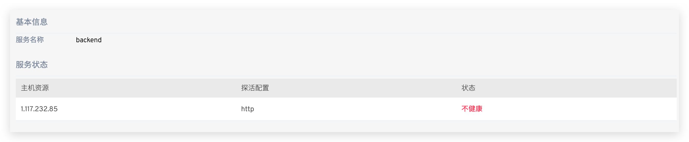

This article introduces how to manage hosts on the Zadig system, supporting access to Linux, MacOS, and Windows systems, as well as both AMD and ARM architectures.

It supports two access methods, each suitable for different use cases:
- SSH Connection: The host is used as an environmental resource
- Agent Access: The host is used as a workflow task node

## View Host

Access `Assets` → `Host Management` to view all host resources. The system will periodically (every 10 seconds) check the online status of the hosts based on the liveness configuration in the advanced settings.


## Add a Host

Visit `Assets` → `Host Management`, click `New`, fill in the parameters, and save.


Parameter Description:
- `Connection Method`:
    - `SSH Connection`: Select this when the host is used as an environmental resource
    - `Agent Access`: Select this when the host is used as a workflow task node
- `Host Name`: Custom, used to identify the host
- `Host Provider`: Choose from Alibaba Cloud, Tencent Cloud, Huawei Cloud, Amazon, Google Cloud, or a standard host provider
- `Host Tag`: Custom host tags for quick identification of host resources
- `Host Address`: The access address and port of the host, with the default port being 22
- `Username`: The username for logging into the host
- `Login Host`: If enabled, you can log into the host within the environment
- `SSH Private Key`: Used for login authentication
- `Task Root Directory`: The root directory for tasks when scheduling workflow tasks
- `Task Concurrency`: The number of concurrent tasks that can be executed

### SSH Access

> As an Environmental Resource


1. Step 1: Run the following command in the host $HOME/.ssh directory to generate SSH key pair

```bash
ssh-keygen -t rsa -C "your_email@example.com"
```
2. Step 2: Append the generated public key to the $HOME/.ssh/authorized_keys file

```bash
cat id_rsa.pub >> authorized_keys
```
3. Step 3: Fill in the generated private id_rsa field in the private key field of the picture above

### Agent Access

> As a Workflow Task Node

After saving the basic information of the host, select the corresponding command based on the host architecture and execute it on the host.


### Bulk Import of Hosts

Administrators can access `Assets` → `Host Management`, click `New`


Parameter Description:

- `Download Template`: The content of the imported host file must conform to the structure defined in the template file provided by Zadig
- `Upload File`: Modify the template file and upload the modified host list file
- `Import Options`:
    1. Incremental: Existing entries in the host management list will not be reimported; only new host information in the file will be added
    2. Overwrite Existing Hosts: Existing entries in the host management list will be reimported, and new host information in the file will be added

## Host Usage

### SSH Access

When adding resource configurations for a host service, you can choose either "Host Tag" or "Host Name".


You can view the deployment details of the service by clicking on the service in `Environment`.



### Agent Access

For build and general task execution environments, select "Host" in the infrastructure and choose the corresponding execution host tag to run workflow tasks on the corresponding host.

