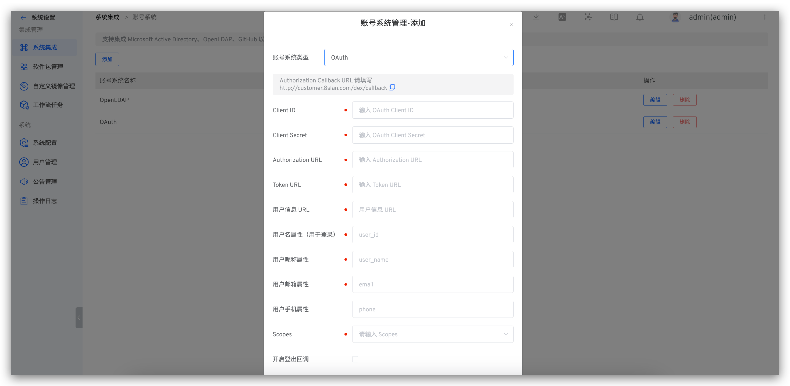

## How to Integrate

Zadig supports users logging in through OAuth 2.0 account authorization. Visit `System Settings` -> `Integration` -> `Account System` -> Click "Add" -> Select `OAuth`.



**Parameter Description:**
| Parameter Name                 | Description                                                 |
|------------------------|----------------------------------------------------|
| Client ID              | OAuth Client ID                                    |
| Client Secret          | OAuth Client Secret                                |
| Authorization URL      | Get the Authorization Code URL                       |
| Token URL              | Get the Access Token URL                             |
| User Information URL            | URL to Get User Information                                     |
| Username Attribute (for Login)     | Username Attribute Field for Login                                 |
| User Nickname Attribute             | User Nickname Attribute Field                                          |
| User Email Attribute             | User Email Attribute Field                                          |
| User Phone Attribute             | User mobile phone attribute field, optional                                     |
| Scopes                 | Relevant fields requested from the account system; reference the account system's documentation for more details            |

> If the user information returned by your OAuth provider is not at the root level, you need to nest it using `.`.
>
> For example, in the following return sample, to correctly parse the user information, you need to set the username attribute to `data.userinfo.user_id`, the user nickname attribute to `data.userinfo.fullname`, and the user email attribute to `data.userinfo.email`.
```
{
    "code": 0,
    "data": {
        "userinfo": {
            "user_id": "2022001",
            "fullname": "demo",
            "email": "demo@example.com"
        },
        "timestamp": 1655882773,
        ...
    }
    ...
}
```

## [Optional] Set as the Default Account System
Refer to [setting the default account system](/en/Zadig%20v4.0/settings/account/ldap/#optional-set-as-the-default-account-system).