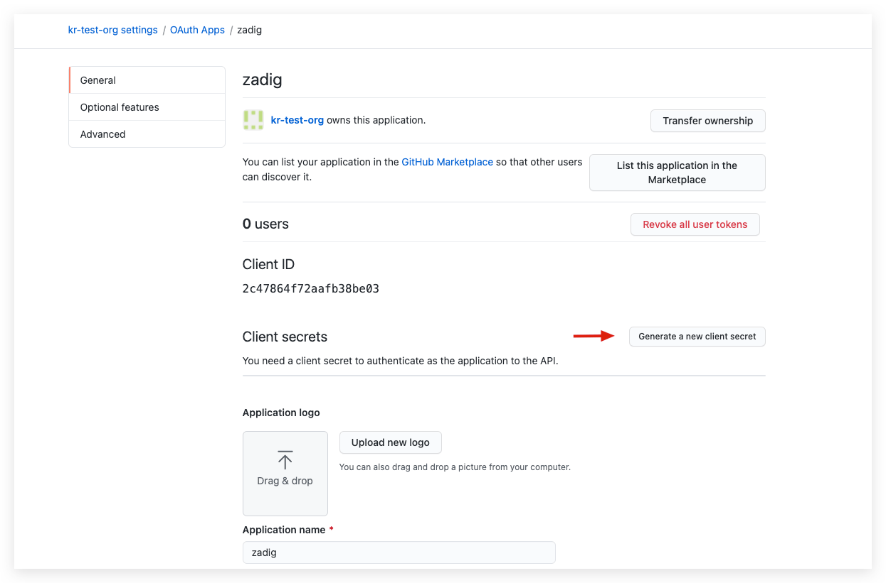
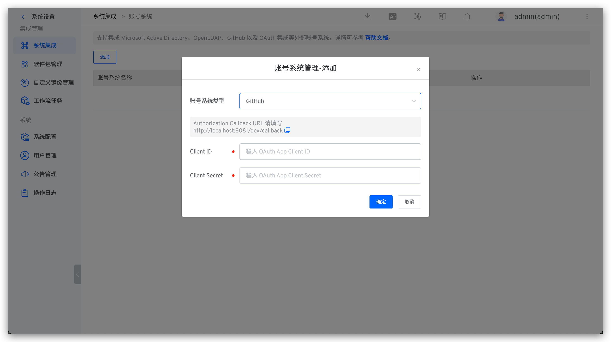

## How to Integrate

### Step 1: Create a GitHub OAuth App

Go to [GitHub](https://github.com/settings/applications/new) to register a new GitHub OAuth application.

On the New Application page, you need to complete the following steps:

1. Application name: Zadig, or any other recognizable name.
2. Homepage URL: http://[Zadig.yours.com]
3. Authorization Callback URL: `http://[Zadig.yours.com]/dex/callback`
4. Click "Create"

### Step 2: Obtain Client ID and Client Secret Information

After the application is successfully created, GitHub will display the basic information of the application. Click `Generate a new client secret` to generate the `Client Secret`.

The page now includes the complete `Client ID` and `Client Secret`.

### Step 3: Integrate GitHub OAuth

Click `System Settings` -> `Integration` -> `Account System` -> Click "Add" -> Select `GitHub`.

**Parameter Description:**
- `Client ID`: The Client ID obtained in Step 2.
- `Client Secret`: The Client Secret obtained in Step 2.

## [Optional] Set as the Default Account System
See: [setting the default account system](/en/Zadig%20v4.0/settings/account/ldap/#optional-set-as-the-default-account-system).