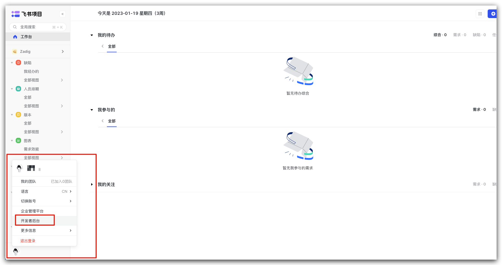
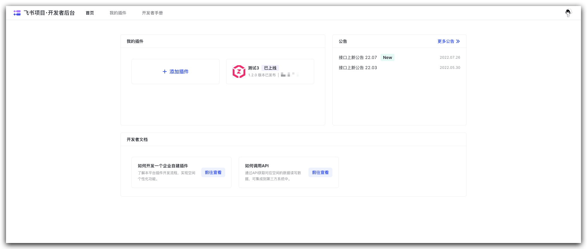
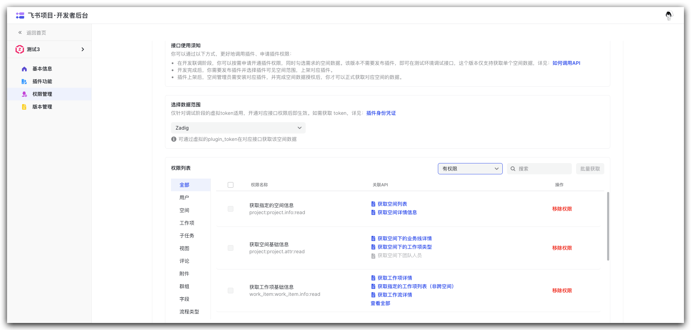
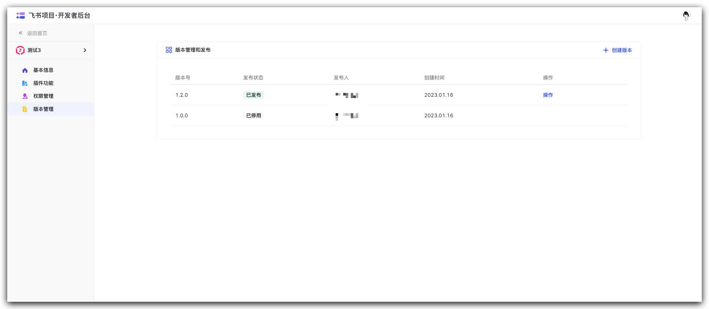
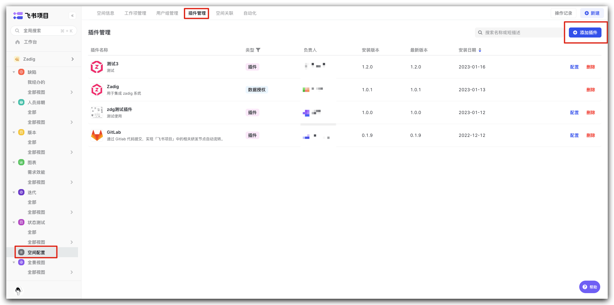
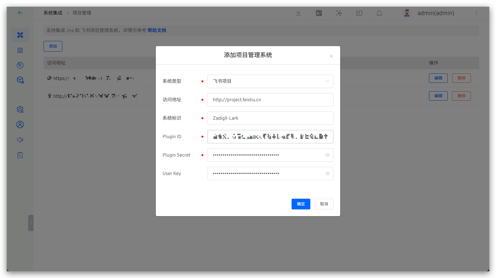

This article introduces how to integrate the Feishu project management system on the Zadig system. By configuring Feishu support in the system, tracking of Feishu work items is achieved. Users can change the status of Feishu work items through the "Feishu Work Item Status Change" tasks in the workflow.

## How to Configure

### Step 1: Feishu Plugin Configuration
Enter the Feishu project, click on the avatar in the lower left corner, and click "Developer Console".

Click "Add Plugin", enter the name, and complete the creation.

Enter "Permission Management", obtain the necessary permissions, and specify the address book permission scope.

Required permissions:
- Get specified space information
- Get basic space information
- Get basic work item information
- Create and update work items and workflows
- Add and update comments

After obtaining the necessary permissions, go to "Version Management", click "Create Version", fill in the relevant information, and publish it.

Return to the Feishu project homepage, select "Space Configuration" -> "Plugin Management" -> "Add Plugin", and add the plugin that has just been released.

### Step 2: Configure Feishu Integration in Zadig

Click "System Settings" -> "Integration" -> "Project Management" -> Click Add.

Parameter Description:
- `System Type`: Select Feishu project.
- `Access Address`: Feishu project address.
- `Identitiy`: Customize this to facilitate quick identification in the Zadig system. The system identifier must be unique.
- `Plugin ID`: The ID of the Feishu plugin, which can be obtained from the plugin basic information page.
- `Plugin Secret`: The Secret of the Feishu plugin, which can be obtained from the plugin basic information page.
- `User Key`: The User Key of a user with space permissions, which can be obtained by double-clicking the avatar.

Save the information after confirming it is correct.

## Usage Scenarios

### Automatically Trigger Workflow Through Feishu Project

Supports configuring Feishu project triggers in the workflow to automatically trigger Zadig Workflow after the status of Feishu work items is changed. Reference: [Feishu trigger](/en/Zadig%20v4.0/project/workflow-trigger/#feishu-project-trigger).

### Automatically Change Feishu Work Items Through Workflow

The workflow supports the status change task of Feishu work items, which can automatically change the status of Feishu work items through the Zadig workflow. For usage details, reference: [Change of Feishu work items](/en/Zadig%20v4.0/project/workflow-jobs/#feishu-work-item-status-change).