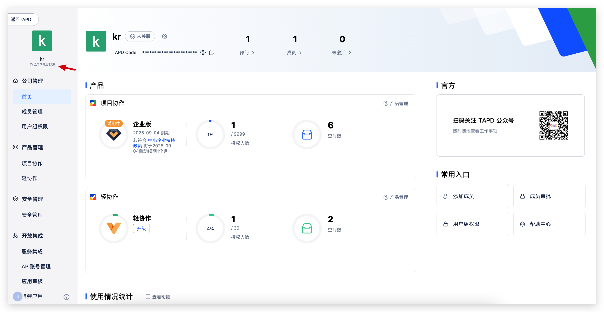
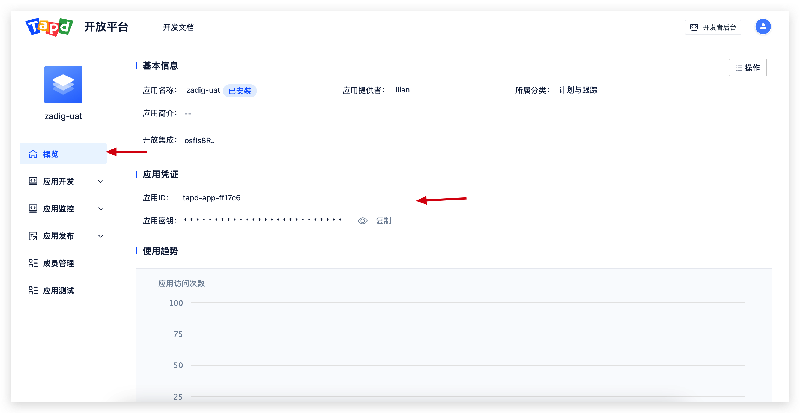
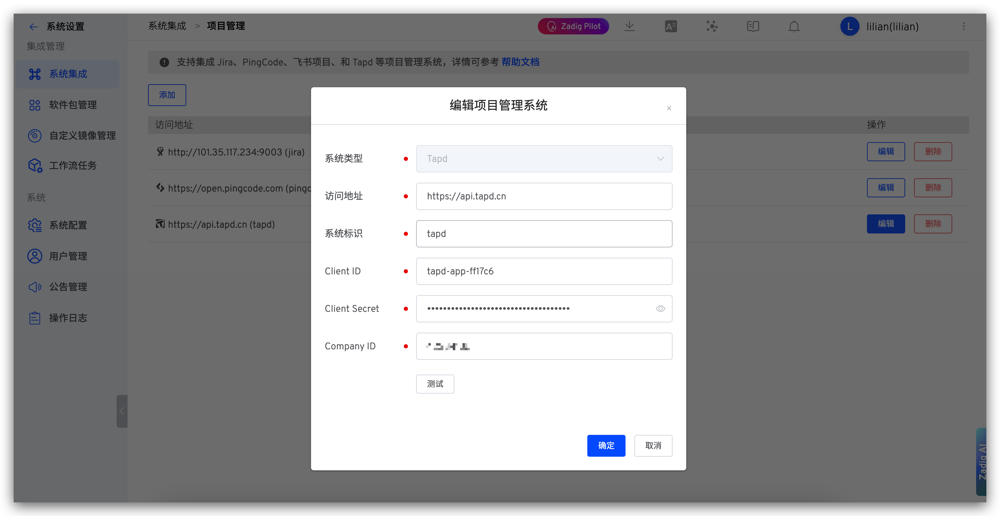

This article introduces how to integrate the project management system Tapd in the Zadig system, achieving automatic iteration status changes in Tapd.

## How to Configure

### Step 1: Get Company ID

Obtain the Company ID from the top-left corner of the company management page in Tapd.

### Step 2: Get Client ID and Client Secret

In Tapd company management -> `Custom Applications`, create a "Web Application Development" type application and configure the appropriate permissions.

**Required Permissions:**
- `Iteration`: Read-write
- `Project`: Read

Get the Client ID and Client Secret from the following location.

### Step 3: Configure Tapd Integration in Zadig

Go to `System Settings` -> `Integration Management` -> `Project Management` -> Click Add.

Parameter Description:
- `System Type`: Tapd
- `Access Address`: Tapd address, such as `https://api.tapd.cn`
- `Identifier`: Custom, convenient for quick identification in the Zadig system, system identifier must be unique
- `Client ID`: Tapd application Client ID, obtained from Step 2
- `Client Secret`: Tapd application Client Secret, obtained from Step 2
- `Company ID`: Tapd company identifier, obtained from Step 1

Save after confirming the information is correct.
