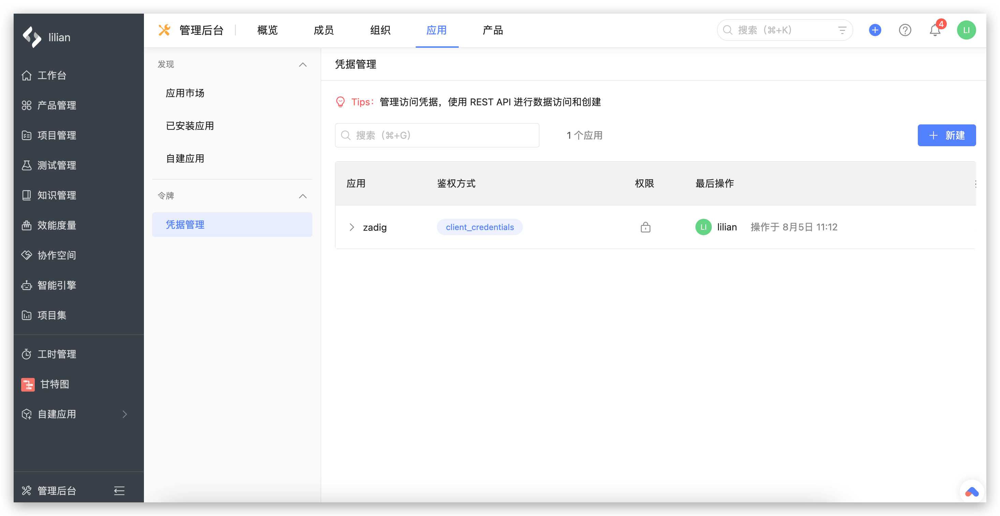
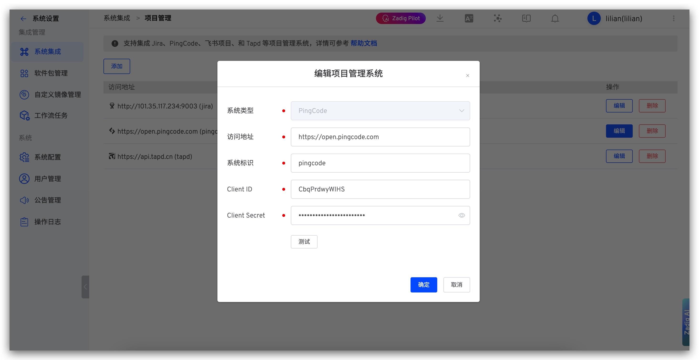

This article introduces how to integrate the project management system PingCode in the Zadig system, achieving automatic work item status changes in PingCode.

## How to Configure

### Step 1: Create Credentials

Create credentials in PingCode Admin Console -> `Applications` -> `Credential Management`.

- `Authentication Method`: client_credentials
- `Permissions`:
    - Project, Project Configuration Center: Read-only
    - Work Items: Read-write

### Step 2: Configure PingCode Integration in Zadig

Go to `System Settings` -> `Integration Management` -> `Project Management` -> Click Add.

Parameter Description:
- `System Type`: PingCode
- `Access Address`: PingCode address, such as `https://open.pingcode.com`
- `Identifier`: Custom, convenient for quick identification in the Zadig system, system identifier must be unique
- `Client ID`: PingCode application Client ID
- `Client Secret`: PingCode application Client Secret

Save after confirming the information is correct.
