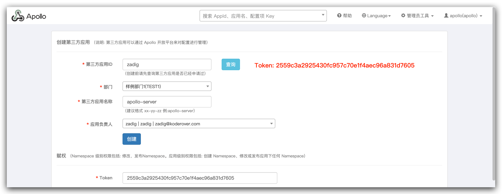
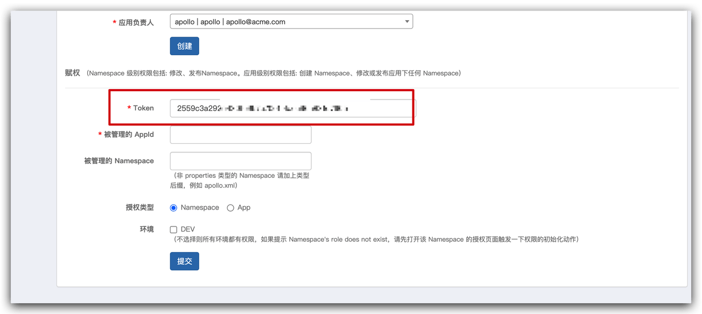
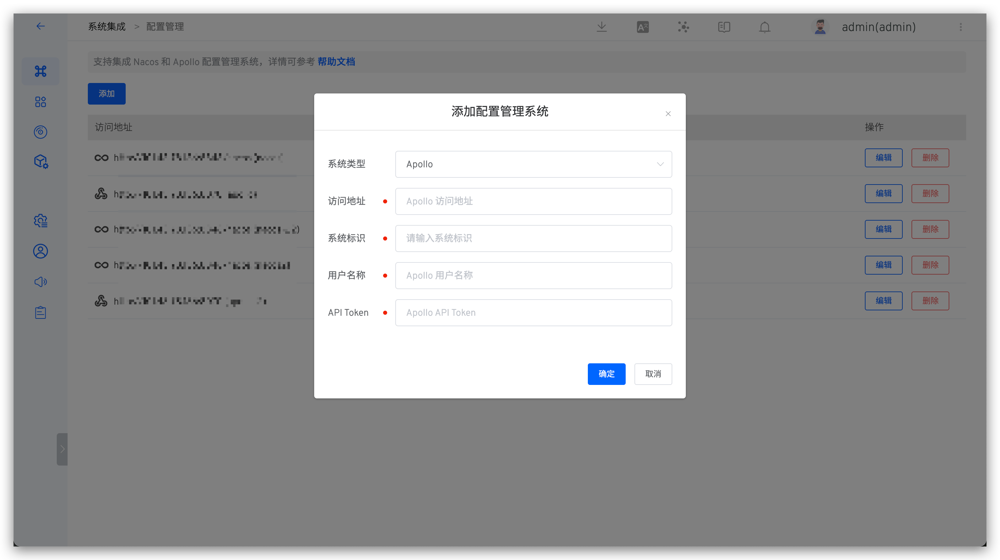

This article primarily introduces how to integrate and use Apollo in Zadig to achieve efficient and stable configuration change management.

## How to Connect

### Step 1: Create a Third-Party Application in Apollo
Go to `Admin Tools` -> `Open Platform Authorization Management`, fill in the required information, and complete the creation of the third-party application.

After successful creation, copy the token below.

### Step 2: Integrate Apollo in Zadig
Go to `System Settings` → `Integrations` → `Configuration Management`, add the Apollo configuration and pass the system connectivity verification.

Parameter Description:

- `Type`: Select `Apollo`
- `Access Address`: The address of the internal Apollo system, for example: `https://apollo.koderover.com`
- `Identifier`: Customize this to facilitate quick identification in the Zadig system; the system identifier must be unique
- `Username`: An existing user in the Apollo system used for interaction with the Zadig system
- `API Token`: The token copied in Step 2

## How to Use

Orchestrate Apollo Configuration Change tasks in the workflow to achieve Apollo configuration changes, refer to: [Apollo Configuration Change](/en/Zadig%20v4.0/project/workflow-jobs/#apollo-configuration-change).