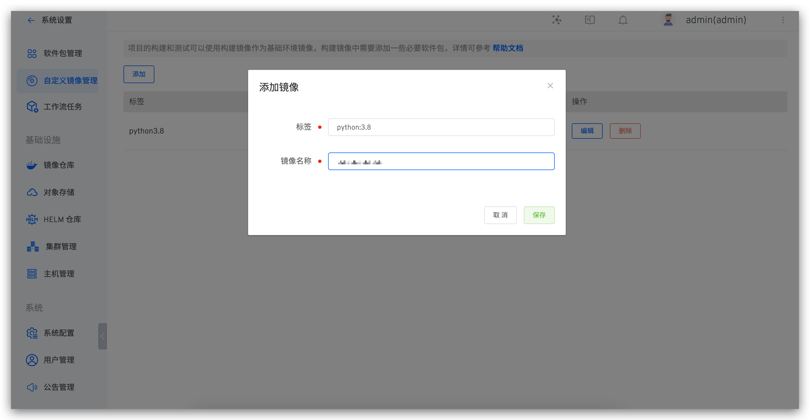
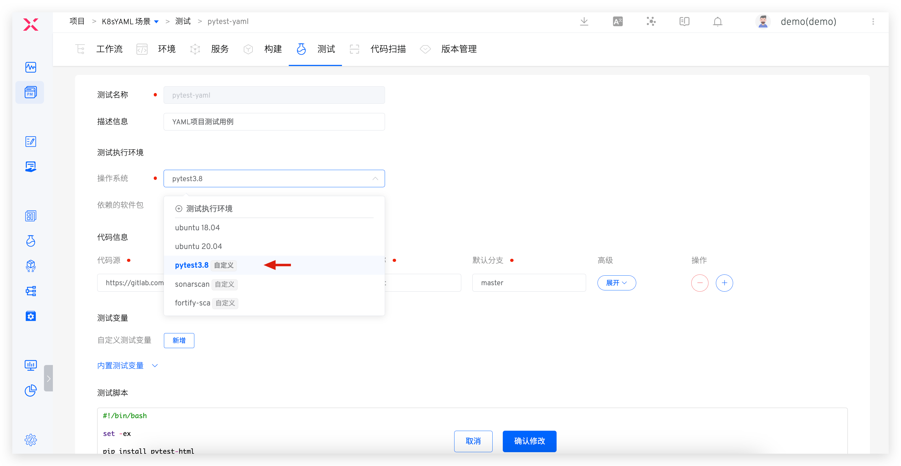

This article explains how to use custom images as the base runtime environment for building, testing, and code scanning in the Zadig system. If the build, test, or code scanning process requires installing many tools and dependencies, you can package these tools and dependencies into a custom image in advance. Using this custom image during the build, test, or code scanning process can significantly improve task execution efficiency.

## Step 1: Generate a Custom Image

- Write a Dockerfile and add Docker instructions according to your actual needs.

::: danger warning
When using a custom image, ensure that the dependencies required by the Zadig system are installed in the image; otherwise, it may not function properly.<br>
Required dependencies:
1. curl: for retrieving network resources
2. git: for executing git commands and fetching build code (please ensure version 2.11.0 or higher is installed)
3. tzdata: for maintaining container time synchronization

In addition to the above dependencies, the custom image used by the build module must also install:
- docker cli: for executing Docker commands, it must be installed in the `/usr/local/bin` directory.

In addition to the above dependencies, the custom image used by the code scanning module must also install:
- Java(Oracle JRE or OpenJDK)
- sonar-scanner
:::

You can refer to the following two examples of ubuntu:focal and centos:7.8.2003 to write your own Dockerfile:

```dockerfile
FROM ubuntu:focal

# Add custom instructions here

# The following are the dependencies required by Zadig

# Install tools curl git tzdata
RUN sed -i -E "s/[a-zA-Z0-9]+.ubuntu.com/mirrors.aliyun.com/g" /etc/apt/sources.list
RUN apt-get clean && apt-get update && DEBIAN_FRONTEND=noninteractive apt-get install -y curl git tzdata

# Modify the time zone
RUN ln -sf /usr/share/zoneinfo/Asia/Shanghai /etc/localtime

# Install docker client
RUN curl -fsSL "http://resources.koderover.com/docker-27.4.1.tgz" -o docker.tgz &&\
    tar -xvzf docker.tgz &&\
    mv docker/* /usr/local/bin
```

```dockerfile
FROM centos:7.8.2003

# Add custom instructions here

# The following are the dependencies required by Zadig

# Install tools curl git tzdata
RUN yum -y install curl git tzdata

# Modify the time zone
RUN ln -sf /usr/share/zoneinfo/Asia/Shanghai /etc/localtime

# Install docker client
RUN curl -fsSL "http://resources.koderover.com/docker-27.4.1.tgz" -o docker.tgz &&\
    tar -xvzf docker.tgz &&\
    mv docker/* /usr/local/bin
```

- To build the image, you can refer to the following command:

```bash
docker build -t name:tag -f Dockerfile .
```

- Push the image generated in the previous step to a public image repository or a private image repository that has been integrated into the Zadig system

```bash
docker push name:tag
```

## Step 2: Create a Custom Image

Click `System Settings` -> `Images` -> `Add` as shown below:



Parameter description:
- `Label`: Please provide a name that can be used to identify the image
- `Name`: Please fill in the image name that was uploaded to the image registry before. You need to fill in the complete image name, such as ccr.ccs.tencentyun.com/namespace/imageName:tag

## Step 3: Use a Custom Image

Custom images can be used in the build, test, and code scanning modules. The following example demonstrates using a custom image in the build module.

Enter the project's build section -> Click Add, and you can select the custom image in the `Image` option. When executing the build task, your custom image will be used as the operating system


