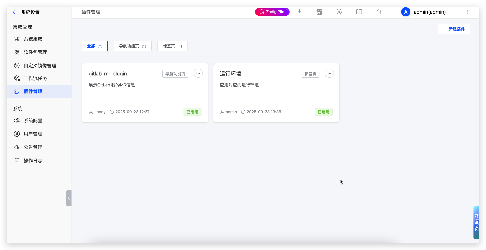
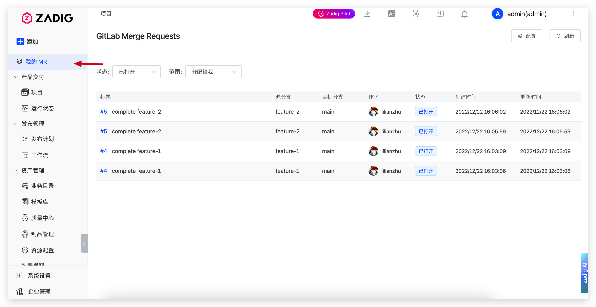
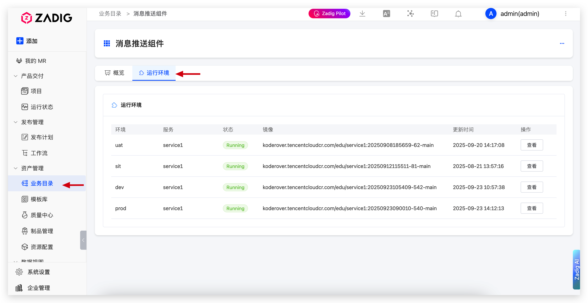

Zadig provides plugin management functionality that allows users to customize and extend platform capabilities based on business requirements, enhancing user experience.

## Feature Overview

Plugin management provides flexible extension mechanisms that enable users to:

- **Function Extension**: Extend system functionality through plugins to meet personalized needs
- **Interface Customization**: Customize navigation menus and business pages to improve user experience
- **Integration Enhancement**: Integrate third-party tools and services for richer functionality
- **Flexible Configuration**: Support enabling and disabling plugins

## Plugin Types

Plugins support two main types, each with different display locations and purposes:

### Navigation Function Page

Navigation function page plugins appear in the system sidebar menu as independent navigation items, providing independent functional pages.

### Tab Page

Tab page plugins are displayed in the tab area of business directories, adding additional tab content to existing business pages.

## Plugin Management

### View Plugin List

In System Settings → Plugin Management, you can view all installed plugins, including:
- Plugin name and description
- Plugin type (Navigation Function Page/Tab Page)
- Enabled status
- Action buttons

### Install New Plugin

1. Click the "New Plugin" button
2. Fill in plugin information:
   - **Plugin Name**: Display name of the plugin
   - **Plugin Type**: Select Navigation Function Page or Tab Page
   - **Route Path**: Access path of the plugin (only required for Navigation Function Page)
   - **Plugin Description**: Brief description of plugin functionality
   - **Plugin Status**: Enable or Disable
3. Upload the plugin file (plugin.js)
4. Click "Create" to complete installation

### Manage Plugin Status

- **Enable Plugin**: Plugin is visible and available in the system
- **Disable Plugin**: Plugin is hidden in the system, configuration information is retained
- **Delete Plugin**: Completely remove the plugin and its configuration
