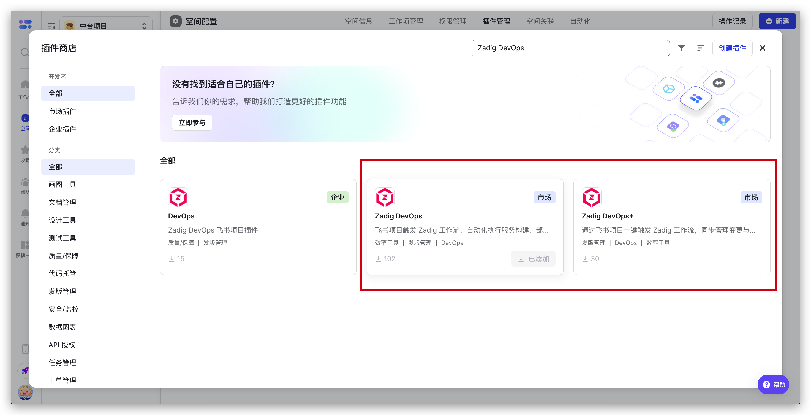
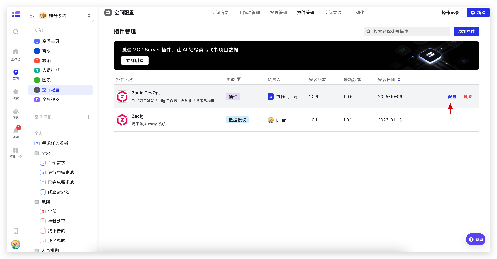
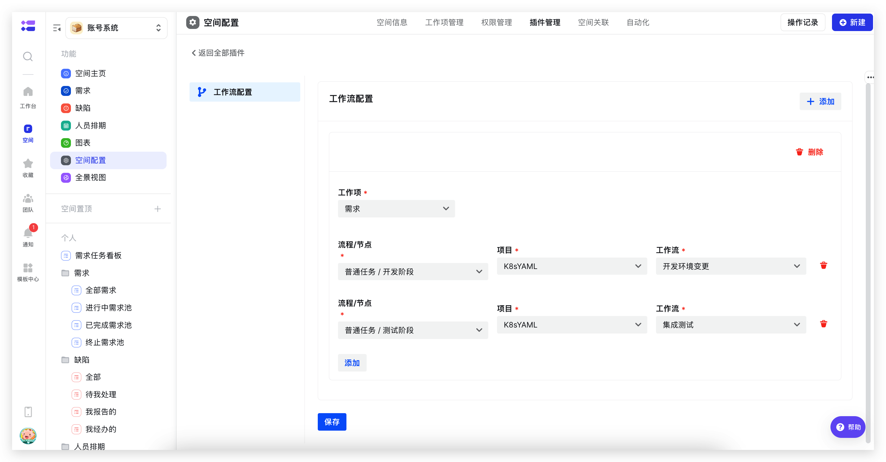
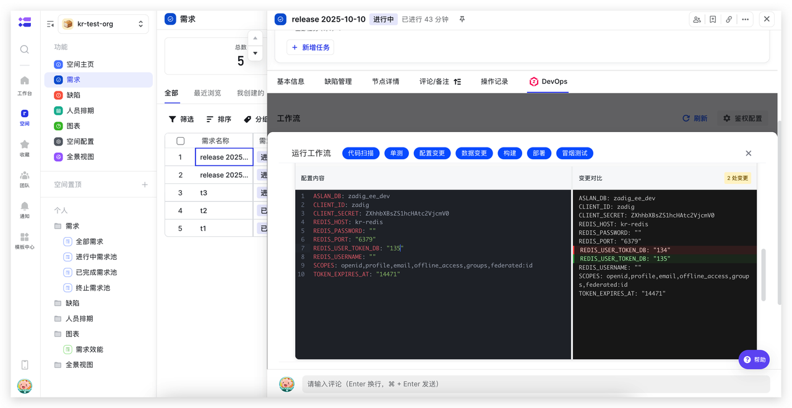
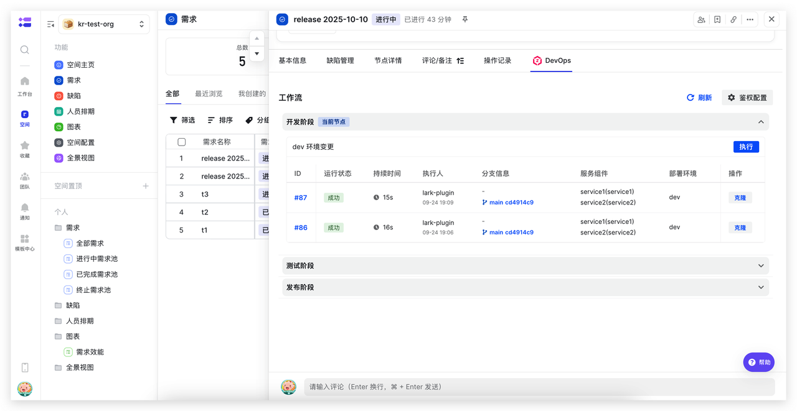
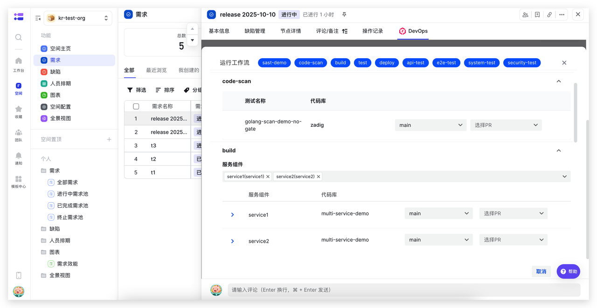
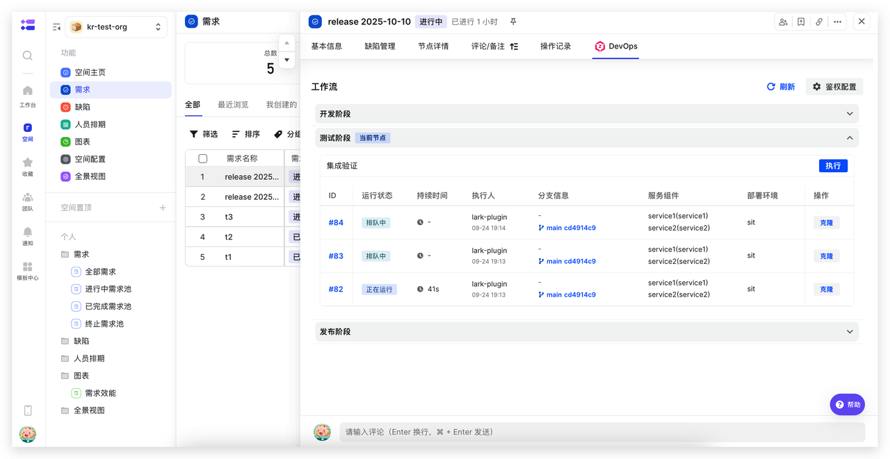
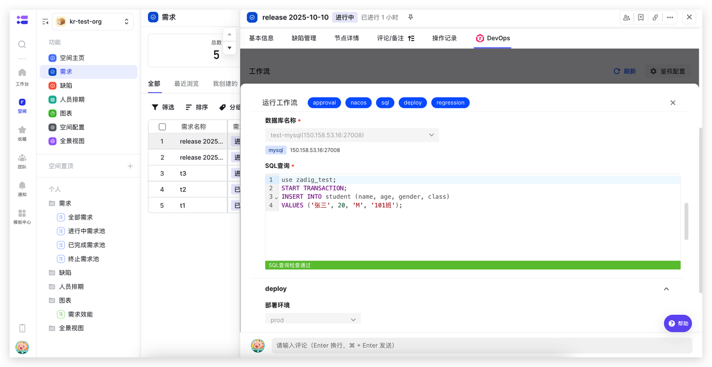
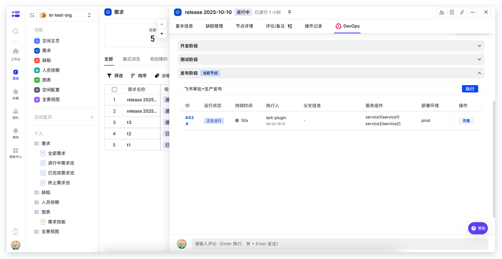

The Zadig DevOps Lark Project Plugin allows triggering Zadig workflows from Lark Project, automating service build, deployment, and release operations to improve efficiency and ensure quality.

## Plugin Configuration

### Install Plugin

Lark Project space administrators can find the "Zadig DevOps" plugin in plugin management, click "Add" to complete installation.

### Plugin Configuration

After installation, find the installed "Zadig DevOps" plugin in plugin management, click "Configure" on the right to start configuring the plugin.

Configure the corresponding relationship between work item nodes and Zadig workflows, as shown in the figure below.

## Use Cases

### Development and Self-Testing Phase: Update Development Environment and Perform Self-Testing Integration

Directly execute Zadig development workflows on Lark Project development nodes, automatically performing code scanning, unit testing, building, deployment, smoke testing, and other processes. Combined with configuration changes, data changes, and other capabilities, achieve consistent changes in the development process, reduce frequent system switching costs, and improve development efficiency.

### Integration Verification Phase: Update Test Environment and Perform Automated Verification

Directly execute Zadig test workflows on Lark Project test nodes, automatically completing interface testing, performance testing, security scanning, and other full processes to improve test verification efficiency and quality.

### Production Release Phase: Combine Lark Approval for Production Release

Directly execute Zadig release workflows on Lark Project release nodes, automatically completing service updates, configuration changes, data changes, and other processes. Combined with Lark approval applications, achieve efficient and stable releases.

