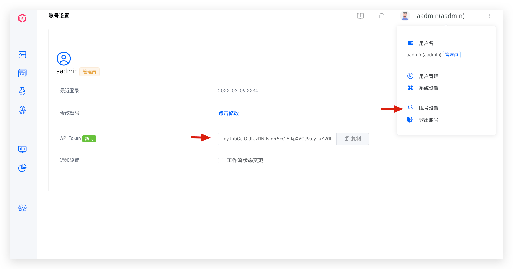

In addition to supporting Zadig Basic version API , it also provides more API support to help developers connect to internal enterprise systems. If you need more, please [contact the official](https://www.koderover.com/contacts) for more support.

## API Call Method

**Step 1: Get it API Token**

Click the user in the upper right corner, select `Account Settings` in the menu, and copy API Token



**Step 2: Call API**

In the requested HTTP Header, add the specified Authorization information, and you can call the Zadig API in the HTTP Client. The example is as follows:

> Tip: `yours.zadig.com` in the example is Zadig The system access address, please replace it according to the actual situation before requesting.

``` bash
curl -H 'Authorization: Bearer your-token' http://yours.zadig.com/api/aslan/system/notification/subscribe
```

## API Overview
### Project

| API Function Description                | API Links                                                                                                    |
| :-------------------------------------- | :----------------------------------------------------------------------------------------------------------- |
| Create an empty project                 | [POST /openapi/projects/project](/en/Zadig%20v4.0/api/project/#create-empty-project)                         |
| Create a YAML project and initialize it | [POST /openapi/projects/project/init/yaml](/en/Zadig%20v4.0/api/project/#create-yaml-project-and-initialize) |
| Create a Helm project and initialize it | [POST /openapi/projects/project/init/helm](/en/Zadig%20v4.0/api/project/#create-helm-project-and-initialize) |
| Get the project list                    | [GET /openapi/projects/project](/en/Zadig%20v4.0/api/project/#get-project-list)                              |
| Get the specified project details       | [GET /openapi/projects/project/detail](/en/Zadig%20v4.0/api/project/#get-specific-project-details)           |
| Delete the project                      | [DELETE /openapi/projects/project](/en/Zadig%20v4.0/api/project/#delete-project)                             |

### Workflow
| Module        | API Function Description  | API Links                                                                                                           |
| :------------ | :------------------------ | :------------------------------------------------------------------------------------------------------------------ |
| Workflow      | Get a workflow list       | [GET /openapi/workflows](/en/Zadig%20v4.0/api/workflow/#get-a-workflow-list)                                        |
|               | Get workflow details      | [GET /openapi/workflows/custom/:workflowKey/detail](/en/Zadig%20v4.0/api/workflow/#get-workflow-details)            |
|               | Get a workflow task list  | [GET /openapi/workflows/custom/:workflowName/tasks](/en/Zadig%20v4.0/api/workflow/#get-a-workflow-task-list)        |
|               | Get workflow task details | [GET /openapi/workflows/custom/task](/en/Zadig%20v4.0/api/workflow/#get-workflow-task-details)                      |
|               | Execute the Workflow      | [POST /openapi/workflows/custom/task](/en/Zadig%20v4.0/api/workflow/#execute-the-workflow)                          |
|               | Cancel workflow tasks     | [DELETE /openapi/workflows/custom/task](/en/Zadig%20v4.0/api/workflow/#cancel-workflow-tasks)                       |
|               | Retry the workflow task   | [POST /openapi/workflows/custom/:workflowName/task/:taskID](/en/Zadig%20v4.0/api/workflow/#retry-the-workflow-task) |
|               | Approval workflow         | [POST /openapi/workflows/custom/task/approve](/en/Zadig%20v4.0/api/workflow/#approval-workflow)                     |
|               | Create a workflow         | [POST /api/aslan/workflow/v4](/en/Zadig%20v4.0/api/workflow/#create-a-workflow)                                     |
|               | Update workflow           | [PUT /api/aslan/workflow/v4/:name](/en/Zadig%20v4.0/api/workflow/#update-workflow)                                  |
|               | Delete workflow           | [DELETE /openapi/workflows/custom](/en/Zadig%20v4.0/api/workflow/#delete-workflow)                                  |
| Workflow View | Get a workflow view list  | [GET /openapi/workflows/view](/en/Zadig%20v4.0/api/workflow/#get-a-workflow-view-list)                              |
|               | Create a workflow view    | [POST /openapi/workflows/view](/en/Zadig%20v4.0/api/workflow/#create-a-workflow-view)                               |
|               | Edit workflow view        | [PUT /openapi/workflows/view/:viewName](/en/Zadig%20v4.0/api/workflow/#edit-workflow-view)                          |
|               | Delete the workflow view  | [DELETE /openapi/workflows/view/:viewName](/en/Zadig%20v4.0/api/workflow/#delete-the-workflow-view)                 |

### Environment

| Module                                                      | API Function Description                | API Links                                                                                                                                                                                                                                                                                          |
| :---------------------------------------------------------- | :-------------------------------------- | :------------------------------------------------------------------------------------------------------------------------------------------------------------------------------------------------------------------------------------------------------------------------------------------------- |
| Environment addition, deletion, modification and inspection | View the environment list               | Test environment: [GET /openapi/environments](/en/Zadig%20v4.0/api/env/#test-environment)<br> Production environment: [GET /openapi/environments/production](/en/Zadig%20v4.0/api/env/#production-environment)                                                                                     |  |
|                                                             | View environment details                | Test environment: [GET /openapi/environments/:envName](/en/Zadig%20v4.0/api/env/#test-environment-2)<br> Production environment: [GET /openapi/environments/production/:envName](/en/Zadig%20v4.0/api/env/#production-environment-2)                                                               |
|                                                             | View environmental service details      | Test environment: [GET /openapi/environments/:envName/services/:serviceName](/en/Zadig%20v4.0/api/env/#test-environment-3)<br> Production environment: [GET /openapi/environments/production/:envName/services/:serviceName](/en/Zadig%20v4.0/api/env/#production-environment-3)                   |
|                                                             | Create a New Environment                | Test environment: [POST /openapi/environments](/en/Zadig%20v4.0/api/env/#test-environment-4)<br> Production environment: [POST /openapi/environments/production](/en/Zadig%20v4.0/api/env/#production-environment-4)                                                                               |
|                                                             | Editing environment                     | Test environment: [PUT /openapi/environments/:envName](/en/Zadig%20v4.0/api/env/#test-environment-5)<br> Production environment: [PUT /openapi/environments/production/:envName](/en/Zadig%20v4.0/api/env/#production-environment-5)                                                               |
|                                                             | Delete Environment                      | Test environment: [DELETE /openapi/environments/:envName](/en/Zadig%20v4.0/api/env/#test-environment-6)<br> Production environment: [DELETE /openapi/environments/production/:envName](/en/Zadig%20v4.0/api/env/#production-environment-6)                                                         |
|                                                             | List events                             | [GET /openapi/environments/kube/events](/en/Zadig%20v4.0/api/env/#list-events)                                                                                                                                                                                                                     |
| Manage Services                                             | Add a Service                           | Test environment: [POST /openapi/environments/service/yaml](/en/Zadig%20v4.0/api/env/#test-environment-7)<br> Production environment: [POST /openapi/environments/production/service/yaml](/en/Zadig%20v4.0/api/env/#production-environment-7)                                                     |
|                                                             | Update Service                          | Test environment: [PUT /openapi/environments/service/yaml](/en/Zadig%20v4.0/api/env/#test-environment-8)<br> Production environment: [PUT /openapi/environments/production/service/yaml](/en/Zadig%20v4.0/api/env/#production-environment-8)                                                       |
|                                                             | Delete Service                          | Test environment: [DELETE /openapi/environments/service/yaml](/en/Zadig%20v4.0/api/env/#test-environment-9)<br> Production environment: [DELETE /openapi/environments/production/service/yaml](/en/Zadig%20v4.0/api/env/#production-environment-9)                                                 |
| Environment Configuration                                   | Add environment configuration           | Test environment: [POST /openapi/environments/:envName/envcfgs](/en/Zadig%20v4.0/api/env/#test-environment-12)<br> Production environment: [POST /openapi/environments/production/:envName/envcfgs](/en/Zadig%20v4.0/api/env/#production-environment-12)                                           |
|                                                             | View the environment configuration list | Test environment: [GET /openapi/environments/:envName/envcfgs](/en/Zadig%20v4.0/api/env/#test-environment-13)<br> Production environment: [GET /openapi/environments/production/:envName/envcfgs](/en/Zadig%20v4.0/api/env/#production-environment-13)                                             |
|                                                             | View environment configuration details  | Test environment: [GET /openapi/environments/:envName/envcfgs](/en/Zadig%20v4.0/api/env/#test-environment-14)<br> Production environment: [GET /openapi/environments/production/:envName/envcfgs](/en/Zadig%20v4.0/api/env/#production-environment-14)                                             |
|                                                             | Update environment configuration        | [PUT /openapi/environments/envcfgs](/en/Zadig%20v4.0/api/env/#update-environment-configuration)                                                                                                                                                                                                    |
|                                                             | View Environment K8S Service Yaml       | Test: [GET /openapi/environments/services/yaml](/en/Zadig%20v4.0/api/env/#view-environment-k8s-service-yaml)<br>Production: [GET /openapi/environments/production/services/yaml](/en/Zadig%20v4.0/api/env/#view-environment-k8s-service-yaml-2)                                                    |
|                                                             | View Environment Helm Service Values    | Test: [GET /openapi/environments/services/values](/en/Zadig%20v4.0/api/env/#view-environment-helm-service-values)<br>Production: [GET /openapi/environments/production/services/values](/en/Zadig%20v4.0/api/env/#view-environment-helm-service-values-2)                                          |
|                                                             | Delete the environment configuration    | Test environment: [DELETE /openapi/environments/:envName/envcfgs](/en/Zadig%20v4.0/api/env/#test-environment-15)<br> Production environment: [DELETE /openapi/environments/production/:envName/envcfgs](/en/Zadig%20v4.0/api/env/#production-environment-15)                                       |
| Global Variables                                            | View global variables                   | Test environment: [GET /openapi/environments/:envName/variable](/en/Zadig%20v4.0/api/env/#test-environment-10)<br> Production environment: [GET /openapi/environments/production/:envName/variable](/en/Zadig%20v4.0/api/env/#production-environment-10)                                           |
|                                                             | Update Global Variables                 | Test environment: [PUT /openapi/environments/:envName/variable](/en/Zadig%20v4.0/api/env/#test-environment-11)<br> Production environment: [PUT /openapi/environments/production/:envName/variable](/en/Zadig%20v4.0/api/env/#production-environment-11)                                           |
| Service examples                                            | Adjust the number of copies             | [POST /openapi/environments/scale](/en/Zadig%20v4.0/api/env/#adjust-service-instance-replica-count)                                                                                                                                                                                                |
|                                                             | Restart the service instance            | Test environment: [POST /openapi/environments/:envName/service/:serviceName/restart](/en/Zadig%20v4.0/api/env/#test-environment-16)<br> Production environment: [POST /openapi/environments/production/:envName/service/:serviceName/restart](/en/Zadig%20v4.0/api/env/#production-environment-16) |  |
| Update the image                                            | Update Deployment Image                 | [POST /openapi/environments/image/deployment/:envName](/en/Zadig%20v4.0/api/env/#update-deployment-image)                                                                                                                                                                                          |
|                                                             | Update Statefulset image                | [POST /openapi/environments/image/statefulset/:envName](/en/Zadig%20v4.0/api/env/#update-statefulset-image)                                                                                                                                                                                        |
|                                                             | Update Cronjob image                    | [POST /openapi/environments/image/cronjob/:envName](/en/Zadig%20v4.0/api/env/#update-cronjob-image)                                                                                                                                                                                                |
| Sub-environment                                             | Check the K8S Service of Workload       | [GET /openapi/environments/:envName/check/workloads/k8sservices](/en/Zadig%20v4.0/api/env/#check-workloads-k8s-service)                                                                                                                                                                            |
|                                                             | Turn on sub-environment                 | [POST /openapi/environments/:envName/share/enable](/en/Zadig%20v4.0/api/env/#enable-sub-environment)                                                                                                                                                                                               |
|                                                             | Close the sub-environment               | [DELETE /openapi/environments/:envName/share/enable](/en/Zadig%20v4.0/api/env/#disable-sub-environment)                                                                                                                                                                                            |
|                                                             | Check sub-environment Ready             | [GET /openapi/environments/:name/check/sharenv/:op/ready](/en/Zadig%20v4.0/api/env/#check-sub-environment-ready)                                                                                                                                                                                   |
|                                                             | Get portal services                     | [GET /openapi/environments/:name/share/portal/:serviceName](/en/Zadig%20v4.0/api/env/#get-entry-service)                                                                                                                                                                                           |
|                                                             | Set up portal service                   | [POST /openapi/environments/:name/share/portal/:serviceName](/en/Zadig%20v4.0/api/env/#set-entry-service)                                                                                                                                                                                          |
| log                                                         | View container real-time logs           | [GET /openapi/logs/sse/pods/:podName/containers/:containerName](/en/Zadig%20v4.0/api/env/#view-container-real-time-logs)                                                                                                                                                                           |

### Service

| API Function Description               | API Links                                                                                                                                                                                                                                                  |
| :------------------------------------- | :--------------------------------------------------------------------------------------------------------------------------------------------------------------------------------------------------------------------------------------------------------- |
| Get a list of services                 | Testing Service: [GET /openapi/service/yaml/services](/en/Zadig%20v4.0/api/service/#test-service)<br> Production Services: [GET /openapi/service/yaml/production/services](/en/Zadig%20v4.0/api/service/#production-service)                               |
| Get service details                    | Testing Service: [GET /openapi/service/yaml/:serviceName](/en/Zadig%20v4.0/api/service/#test-service-2)<br> Production Services: [GET /openapi/service/yaml/production/:serviceName](/en/Zadig%20v4.0/api/service/#production-service-2)                   |
| Create a new service (using templates) | Testing Service: [POST /openapi/service/template/load/yaml](/en/Zadig%20v4.0/api/service/#test-service-3)<br> Production Services: [POST /openapi/service/template/production/load/yaml](/en/Zadig%20v4.0/api/service/#production-service-3)               |
| Create a new service (manual input)    | Testing Service: [POST /openapi/service/yaml/raw](/en/Zadig%20v4.0/api/service/#test-service-5)<br> Production Services: [POST /openapi/service/yaml/production/raw](/en/Zadig%20v4.0/api/service/#production-service-4)                                   |
| Update service configuration           | Testing Service: [PUT /openapi/service/yaml/:serviceName](/en/Zadig%20v4.0/api/service/#test-service-5)<br> Production Services: [PUT /openapi/service/yaml/production/:serviceName](/en/Zadig%20v4.0/api/service/#production-service-5)                   |
| Update Service Variables               | Testing Service: [PUT /openapi/service/yaml/:serviceName/variable](/en/Zadig%20v4.0/api/service/#test-service-6)<br> Production Services: [PUT /openapi/service/yaml/production/:serviceName/variable](/en/Zadig%20v4.0/api/service/#production-service-6) |
| Delete Service                         | Testing Service: [DELETE /openapi/service/yaml/:serviceName](/en/Zadig%20v4.0/api/service/#test-service-7)<br> Production Services: [DELETE /openapi/service/yaml/production/:serviceName](/en/Zadig%20v4.0/api/service/#production-service-7)             |

### Build

| API Function Description              | API Links                                                                             |
| :------------------------------------ | :------------------------------------------------------------------------------------ |
| Create a build using a build template | [POST /openapi/build](/en/Zadig%20v4.0/api/build/#create-build-from-template)         |
| Query build list                      | [GET /openapi/build](/en/Zadig%20v4.0/api/build/#query-build-list)                    |
| Get build details                     | [GET /openapi/build/:buildName/detail](/en/Zadig%20v4.0/api/build/#get-build-details) |
| Delete the build                      | [DELETE /openapi/build](/en/Zadig%20v4.0/api/build/#delete-build)                     |

### Test

| API Function Description | API Links                                                                                               |
| :----------------------- | :------------------------------------------------------------------------------------------------------ |
| Perform test tasks       | [POST /openapi/quality/testing/task](/en/Zadig%20v4.0/api/test/#execute-test-task)                      |
| Get test task details    | [GET /openapi/quality/testing/:testName/task/:taskID](/en/Zadig%20v4.0/api/test/#get-test-task-details) |


### Code scanning

| API Function Description       | API Links                                                                                                     |
| :----------------------------- | :------------------------------------------------------------------------------------------------------------ |
| Create a code scan             | [POST /openapi/quality/codescan](/en/Zadig%20v4.0/api/scan/#create-code-scan)                                 |
| Execute code scanning tasks    | [POST /openapi/quality/codescan/:scanName/task](/en/Zadig%20v4.0/api/scan/#execute-code-scan-task)            |
| Get code scanning task details | [GET /openapi/quality/codescan/:scanName/task/:taskID](/en/Zadig%20v4.0/api/scan/#get-code-scan-task-details) |

### Version Management

| API Function Description            | API Links                                                                                                    |
| :---------------------------------- | :----------------------------------------------------------------------------------------------------------- |
| List versions                       | [GET /openapi/delivery/releases](/en/Zadig%20v4.0/api/delivery/#list-versions)                               |
| Get version details                 | [GET /openapi/delivery/releases/:id](/en/Zadig%20v4.0/api/delivery/#get-version-details)                     |
| Delete the version                  | [DELETE /openapi/delivery/releases/:id](/en/Zadig%20v4.0/api/delivery/#delete-version)                       |
| K8s YAML project creation version   | [POST /openapi/delivery/releases/k8s](/en/Zadig%20v4.0/api/delivery/#create-version-for-k8s-yaml-project)    |
| Helm Chart Project Creation Version | [POST /openapi/delivery/releases/helm](/en/Zadig%20v4.0/api/delivery/#create-version-for-helm-chart-project) |
| Retry Create Release                | [POST /openapi/delivery/releases/retry](/en/Zadig%20v4.0/api/delivery/#retry-create-release)                 |


### Release Plan

| API Function Description      | API Links                                                                                              |
| :---------------------------- | :----------------------------------------------------------------------------------------------------- |
| Create a release plan         | [POST /openapi/release_plan/v1](/en/Zadig%20v4.0/api/release-plan/#create-release-plan)                |
| Get a list of release plans   | [GET /openapi/release_plan/v1](/en/Zadig%20v4.0/api/release-plan/#get-release-plan-list)               |
| Get release plan details      | [GET /openapi/release_plan/v1/:id](/en/Zadig%20v4.0/api/release-plan/#get-release-plan-details)        |
| Create release plan with jobs | [POST /openapi/release_plan/v1/jobs](/en/Zadig%20v4.0/api/release-plan/#create-release-plan-with-jobs) |


### Artifact Management

| API Function Description | API Links                                                                                  |
| :----------------------- | :----------------------------------------------------------------------------------------- |
| Get the version list     | [GET /api/aslan/delivery/releases](/en/Zadig%20v4.0/api/delivery-center/#get-version-list) |

<!-- | 获取交付物追踪信息 | [GET /api/directory/dc/artifact](/en/Zadig%20v4.0/api/delivery-center/#获取交付物追踪信息) | -->


### Cluster

| API Function Description             | API Links                                                                                              |
| :----------------------------------- | :----------------------------------------------------------------------------------------------------- |
| List cluster information             | [GET /openapi/system/cluster](/en/Zadig%20v4.0/api/cluster/#list-cluster-information)                  |
| Create a cluster                     | [POST /openapi/system/cluster](/en/Zadig%20v4.0/api/cluster/#create-cluster)                           |
| Update the specified cluster         | [PUT /openapi/system/cluster/:id](/en/Zadig%20v4.0/api/cluster/#update-specified-cluster)              |
| Delete the specified cluster         | [DELETE /openapi/system/cluster/:id](/en/Zadig%20v4.0/api/cluster/#delete-specified-cluster)           |
| Check the cluster Istio installation | [GET /openapi/cluster/istio/check/:id](/en/Zadig%20v4.0/api/cluster/#check-cluster-istio-installation) |

### Image Registry

| API Function Description                        | API Links                                                                                                      |
| :---------------------------------------------- | :------------------------------------------------------------------------------------------------------------- |
| Integrated image registry                       | [POST /openapi/system/registry](/en/Zadig%20v4.0/api/registry/#integrate-image-registry)                       |
| List image registry information                 | [GET /openapi/system/registry](/en/Zadig%20v4.0/api/registry/#list-image-registry-information)                 |
| Get the specified image registry information    | [GET /openapi/system/registry/:id](/en/Zadig%20v4.0/api/registry/#get-specified-image-registry-information)    |
| Update the specified image registry information | [PUT /openapi/system/registry/:id](/en/Zadig%20v4.0/api/registry/#update-specified-image-registry-information) |


### Performance Insights

| API Function Description                           | API Links                                                                                                          |
| :------------------------------------------------- | :----------------------------------------------------------------------------------------------------------------- |
| Data Overview                                      | [GET /openapi/statistics/overview](/en/Zadig%20v4.0/api/insight/#data-overview)                                    |
| Building data statistics                           | [GET /openapi/statistics/build](/en/Zadig%20v4.0/api/insight/#build-data-statistics)                               |
| Deployment data statistics                         | [GET /openapi/statistics/deploy](/en/Zadig%20v4.0/api/insight/#deployment-data-statistics)                         |
| Test data statistics                               | [GET /openapi/statistics/test](/en/Zadig%20v4.0/api/insight/#test-data-statistics)                                 |
| Data statistics for production environment release | [GET /openapi/statistics/v2/release](/en/Zadig%20v4.0/api/insight/#production-environment-release-data-statistics) |


### Users and Permissions

| API Function Description              | API Links                                                                                                            |
| :------------------------------------ | :------------------------------------------------------------------------------------------------------------------- |
| List user information                 | [GET /openapi/users](/en/Zadig%20v4.0/api/user/#list-user-information)                                               |
| List user group information           | [GET /openapi/user-groups](/en/Zadig%20v4.0/api/user/#list-user-group-information)                                   |
| List project permission definitions   | [GET /openapi/policy/resource-actions](/en/Zadig%20v4.0/api/policy/#list-project-permission-item-definitions)        |
| List role information                 | [GET /openapi/policy/roles](/en/Zadig%20v4.0/api/policy/#list-project-role-information)                              |
| Get character details                 | [GET /openapi/policy/roles/:name](/en/Zadig%20v4.0/api/policy/#get-project-role-details)                             |
| Create a project role                 | [POST /openapi/policy/roles](/en/Zadig%20v4.0/api/policy/#create-project-role)                                       |
| Edit project roles                    | [PUT /openapi/policy/roles/:name](/en/Zadig%20v4.0/api/policy/#edit-project-role)                                    |
| Delete project roles                  | [DELETE /openapi/policy/roles/:name](/en/Zadig%20v4.0/api/policy/#delete-project-role)                               |
| List project members                  | [GET /openapi/policy/role-bindings](/en/Zadig%20v4.0/api/policy/#list-project-members)                               |
| Add project members                   | [POST /openapi/policy/role-bindings](/en/Zadig%20v4.0/api/policy/#add-project-members)                               |
| Update project member permissions     | [POST /openapi/policy/role-bindings/user/:uid](/en/Zadig%20v4.0/api/policy/#update-project-member-roles)             |
| Delete project members                | [DELETE /openapi/policy/role-bindings/user/:uid](/en/Zadig%20v4.0/api/policy/#delete-project-member)                 |
| Update project user group permissions | [POST /openapi/policy/role-bindings/group/:gid](/en/Zadig%20v4.0/api/policy/#update-project-user-group-member-roles) |
| Delete project user group members | [DELETE /openapi/policy/role-bindings/group/:gid](/en/Zadig%20v4.0/api/policy/#delete-project-user-group-member)   |
| Delete user | [DELETE /openapi/users/:uid](/en/Zadig%20v4.0/api/user/#delete-user)   |


### System

| API Function Description        | API Links                                                                                         |
| :------------------------------ | :------------------------------------------------------------------------------------------------ |
| List system operation logs      | [GET /openapi/system/operation](/en/Zadig%20v4.0/api/system/#list-system-operation-logs)          |
| List environment operation logs | [GET /openapi/system/operation/env](/en/Zadig%20v4.0/api/system/#list-environment-operation-logs) |