## If approval is still pending in Zadig after approval/rejection, check event logs to see if Feishu app event push requests are properly received
If approval is still pending in Zadig after approval/rejection, check event logs to see if Feishu app event push requests are properly received

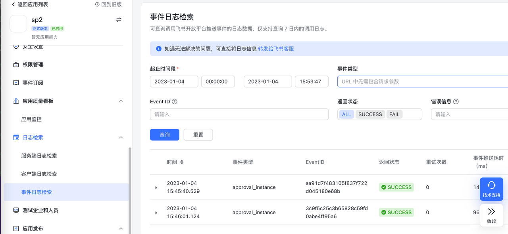

## Go mod builds use proxy, but get "Too many connections" error when pulling packages. How to resolve?
This is caused by too many connections to the proxy server. You can ask operations staff for assistance or optimize proxy server configuration by using transparent proxy to reduce connection count.

## Frontend builds locally work fine, but online builds fail with package.json errors, unable to pull dependencies. How to resolve?
Follow this troubleshooting process step by step:
1. Check if package.json has private dependencies, and if so, confirm you have read permissions
2. Verify build scripts are the same as local
3. Check if versions used in build match local build versions to rule out version issues

## Workflow task build time is too long or stuck. How to resolve?
Scenarios and corresponding solutions:
1. Code repository uses submodule but code can't be pulled, git submodule update hangs: Recommend using Proxy in system settings, see: [Proxy Configuration](/en/Zadig%20v4.0/settings/system-settings/#proxy-configuration)
2. Frequently unable to pull GitHub code: Recommend using Proxy in system settings
3. Code build has external dependencies that can't be pulled: Recommend using Proxy in build scripts or configuring domestic sources as alternatives
4. Workflow task gets stuck after triggering, no output in real-time build logs: Troubleshoot with following steps

```bash
# 1. Query Pods with abnormal status
kubectl get pod -n <namespace>

# 2. View detailed information of abnormal Pods
kubectl describe pod <podName> -n <namespace>
```

## Diagnosing issues with packages unable to upload to object storage in builds
Follow this troubleshooting process step by step:
1. Check if this build selected the wrong branch or pull request
2. Check if upload-related business tool parameters in build script are configured correctly
3. Confirm third-party storage service is continuously available
4. Ask operations staff to help confirm if nodes in current cluster have network resolution issues

## Diagnosing image push failures
You can troubleshoot following this process:
1. Confirm the image registry being used has network connectivity and is functional
2. Confirm if the image registry has set a default maximum image count limit, as image count may have reached the limit

## Workflow - Build Error Diagnosis

### `no cotainer statuses : s-task=pipelineName-548,s-service=serviceName,s-type=buildv2,p-type=workflow`
You can check the specific Job status and logs with the following operations:

```bash
kubectl get pod -n <namespace> |grep <pipelineName>
# After finding the corresponding Pod, you can check the specific Pod logs
kubectl logs -f <pod/podName> -n <namespace>
```
### `no space left on device`
This is caused by insufficient space in the PVC mounted by Zadig system's spock-dind service. You can use our system settings - system configuration - cache cleanup feature to clean this data with one click. See [Cache Cleanup](/en/Zadig%20v4.0/settings/system-settings/#cache-cleaning)

### `Failed parsing or buffering the chunk-encoded client body`
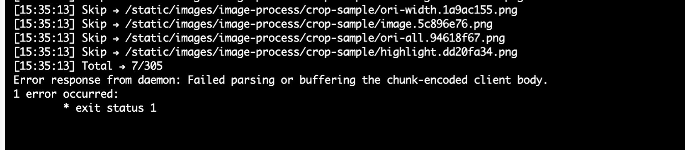

When the above error occurs during build tasks, you need to confirm if a proxy was used before docker build. If a proxy is set, docker build will go through the proxy causing failure. Solution: Add the following command before docker build

```bash
unset http_proxy https_proxy
```
### `500:Internal Error:-148643:action not allow status code:403 ...`
When the above error occurs during build tasks, you need to confirm if the integrated default object storage has enabled `upload`, `download`, `delete files`, and `list files` permissions.

### `Error response from daemon: Get https://*****: x509: certificate signed by unknown authority`

When the above error occurs during build tasks, this is because a self-signed certificate is used when logging into a private image registry. This certificate is not issued by a trusted certificate authority (CA), so the Docker daemon doesn't trust the certificate and reports an x509 self-signed certificate error. You can refer to [Image Registry Configuration](/en/Zadig%20v4.0/settings/image-registry/#add-image-registry) to disable SSL verification.

### `COPY failed: stat /var/lib/docker/tmp/docker-builder124714399/workspace/demo/exec.sh: no such file or directory`

When the above error occurs while executing a COPY command in Dockerfile, please check the relationship between Docker build context and the copied file path. The build will only succeed when the copied file can be found using a relative path in the build context directory. Example:

**Dockerfile content:**
``` Dockerfile
From ubuntu:18.04
WORKDIR /root/zadig
COPY ./demo/exec.sh /root/zadig/exec.sh
COPY /absolute/path/to/zadig/demo/exec.sh /root/zadig/exec.sh
```

**Docker build command:**
``` bash
cd /absolute/path/to/zadig
docker build -t demo:latest -f Dockerfile . # Build context is current directory (i.e. /absolute/path/to/zadig)
```

**Conclusion:**

1. `COPY ./demo/exec.sh /root/zadig/exec.sh` will succeed.
2. `COPY /absolute/path/to/zadig/demo/exec.sh /root/zadig/exec.sh` will fail.

> For more information, see [Docker build | Extended description](https://docs.docker.com/engine/reference/commandline/build/)

## Webhook Trigger Configuration Failure

### `POST http://gitlab....com/api/v4/projects/owner+repo/hooks: 422 {error: Invalid url given}`

When using GitLab 14.0+ to configure Webhook triggers in workflows and getting the following error:
```
400 : Failed to create or update workflow 1 error occurred: * POST http://gitlab....com/api/v4/projects/owner+repo/hooks: 422 {error: Invalid url given}
```
This is a GitLab configuration issue. Use the following configuration to resolve. See: [allow_local_requests_from_hooks_and_services](https://gitlab.com/gitlab-org/gitlab/-/issues/25867)
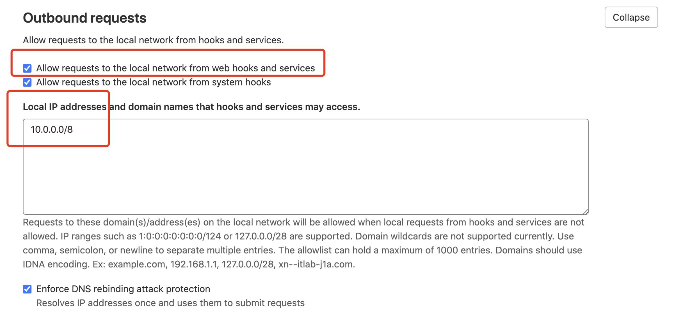

### `Hook executed successfully but returned HTTP 404 Invalid path: /api/gitlabhook`

When manually adding Webhook in GitLab, the following error occurs:

```
Hook executed successfully but returned HTTP 404 Invalid path: /api/gitlabhook
```

After [configuring triggers in workflows](/en/Zadig%20v4.0/project/workflow-trigger/#git-trigger), there's no need to manually add Webhook settings in GitLab system.

## When syncing service configuration from code repository to create K8s YAML services, service configuration in Zadig platform doesn't sync after changes in code repository. How to troubleshoot?
- Check service configuration to ensure the code source, owner, repository, branch, and file path for configuration changes in the code repository match those in Zadig platform.

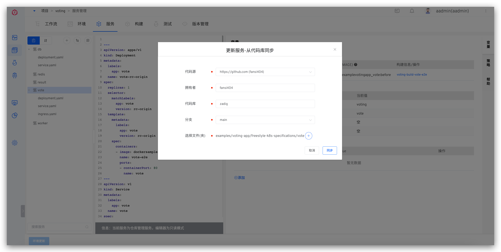

- Ensure content after service configuration changes in code repository is valid YAML content.

- Use the following command to view aslan service logs, locate the `SyncServiceTemplate` keyword, and analyze its contextual information.

```bash
kubectl -n <Zadig Namespace> | grep aslan # Get aslan Pod name
kubectl -n <Zadig Namespace> logs <aslan Pod name> -c aslan
```

## Workflow Webhook trigger configured but not working, what troubleshooting approaches are available?

> When configuring Webhook triggers in workflows without obvious errors, but triggers don't work when code changes occur. Here are several common troubleshooting approaches.

### Check Webhook Configuration in Zadig Platform

Edit the specific workflow, switch to the `Triggers` tab to view Webhook configuration details, and ensure code changes and Webhook events meet trigger conditions. For parameter descriptions in configuration, see [Webhook Configuration](/en/Zadig%20v4.0/project/workflow-trigger/#git-trigger).

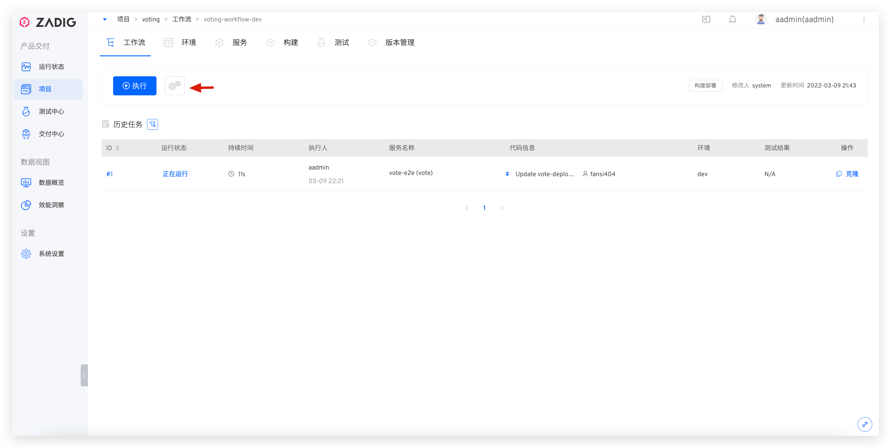
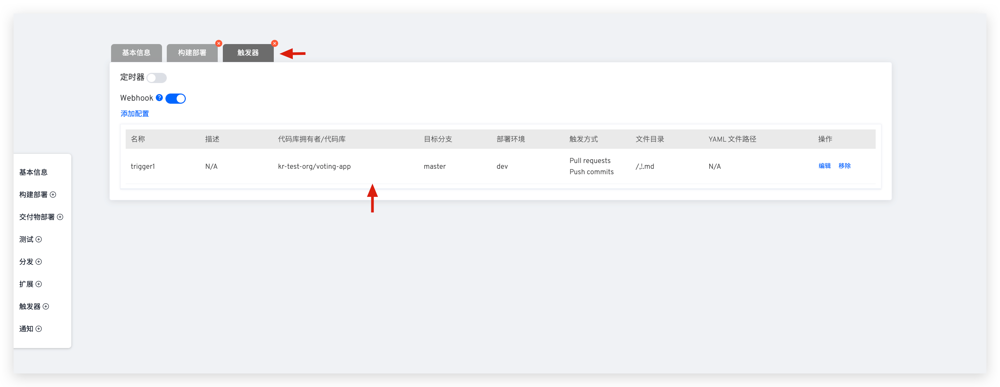

### Check Webhook Configuration in GitHub Repository

- Visit the specific GitHub repository - `Settings` - `Webhooks` to view current project's Webhook configuration list.

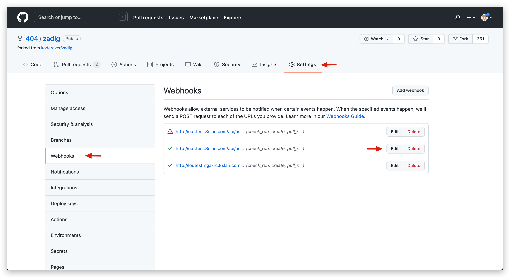

- In `Settings`, view specific Webhook configuration, and check recent Webhook Events and status in `Recent Deliveries`.

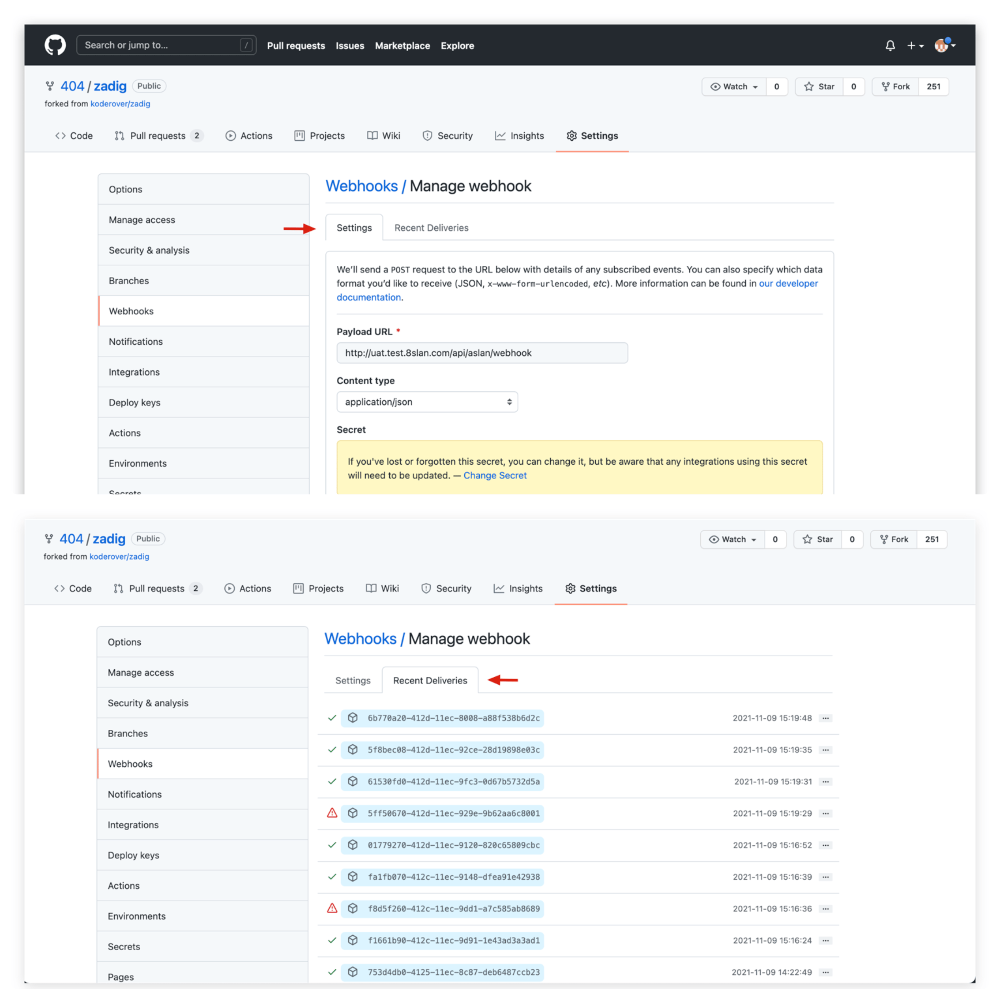

### Check Webhook Configuration in GitLab Repository

- Visit the specific GitLab repository - `Settings` - `Webhooks` to view current project's Webhook configuration list.

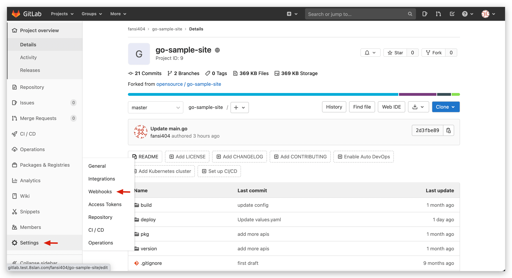

- `Test` operation can test Webhook settings, click `Edit` to view recent Webhook Events and status.
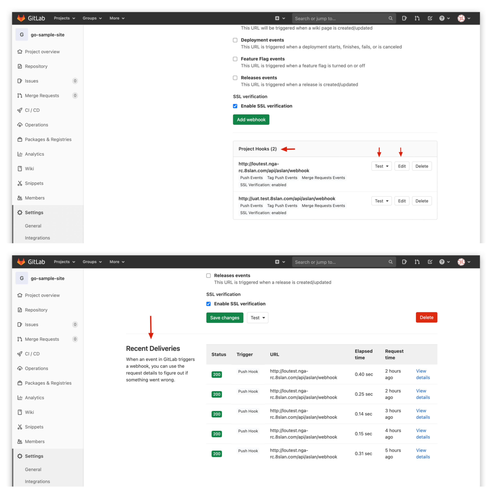

### View aslan Service Logs

- Submit new code change requests while using the following command to view real-time logs of aslan service, locate the `webhook` keyword, and analyze its contextual information.

```bash
kubectl -n <Zadig Namespace> | grep aslan # Get aslan Pod name
kubectl -n <Zadig Namespace> logs -f <aslan Pod name> -c aslan
```

## After integrating GitLab repository, using it reports 401 Unauthorized, need to re-authorize GitLab code source in system settings before normal use

GitLab 14.3 and above introduced the `Expire access tokens` feature, where Application access tokens have a default validity of 2 hours. Visit GitLab system's User Settings - Applications and uncheck `Expire access tokens`.

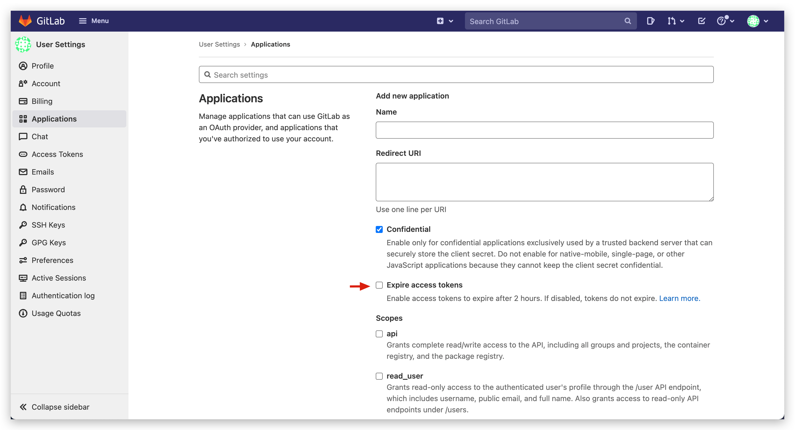

## After workflow task completes and deploys services, service image version is not updated. How to resolve?
Edit the workflow to check its configuration and see if the `Image Version Rollback` switch is enabled.
> For more information, see [Workflow Image Version Rollback](/en/Zadig%20v4.0/workflow/image/rollback/)

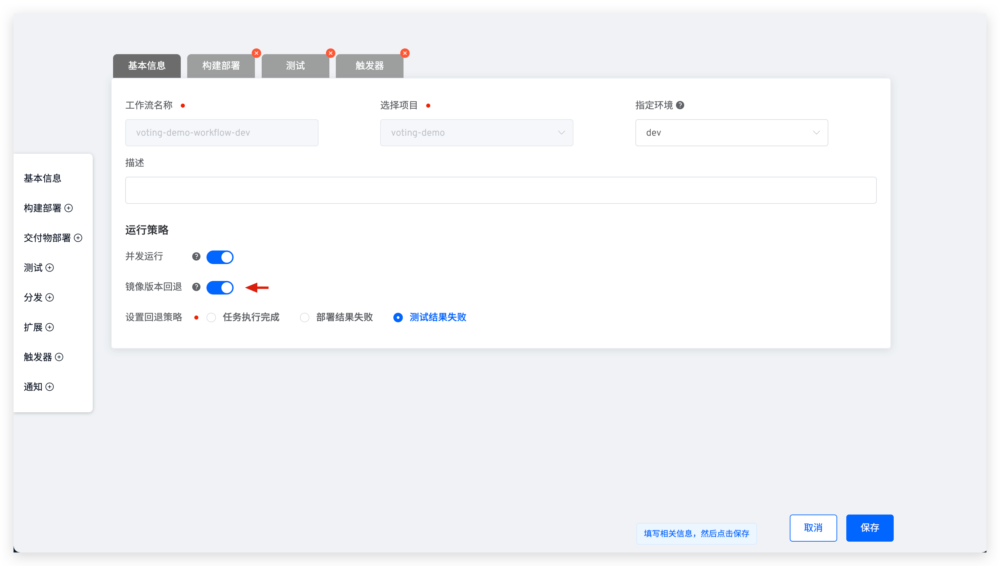

## Helm project workflow deployment encounters `cannot re-use a name that is still in use` or `another operation (install/upgrade/rollback) is in progress` error. How to resolve?
Helm release may be in an incorrect state due to some abnormal conditions. Use `helm list -n <Namespace> -a -f <ReleaseName>` and `helm history <ReleaseName> -n <Namespace>` commands to confirm release status and version records, and resolve according to the following situations:
* If release has a deployed version, manually rollback the release to the most recent deployed version. See: [Helm Rollback](https://helm.sh/docs/helm/helm_rollback/).
* If release is currently in superseded state and has no deployed version, manually execute helm upgrade command to upgrade release to new version. See: [Helm Upgrade](https://helm.sh/docs/helm/helm_upgrade/#helm-upgrade).
* If release is in `pending-install/pending-upgrade/pending-rollback` state for a long time and has no deployed version, manually delete the secret corresponding to the current release version from the cluster namespace. Secret name: `sh.helm.release.v1.<ReleaseName>.v<ReleaseRevision>`.
